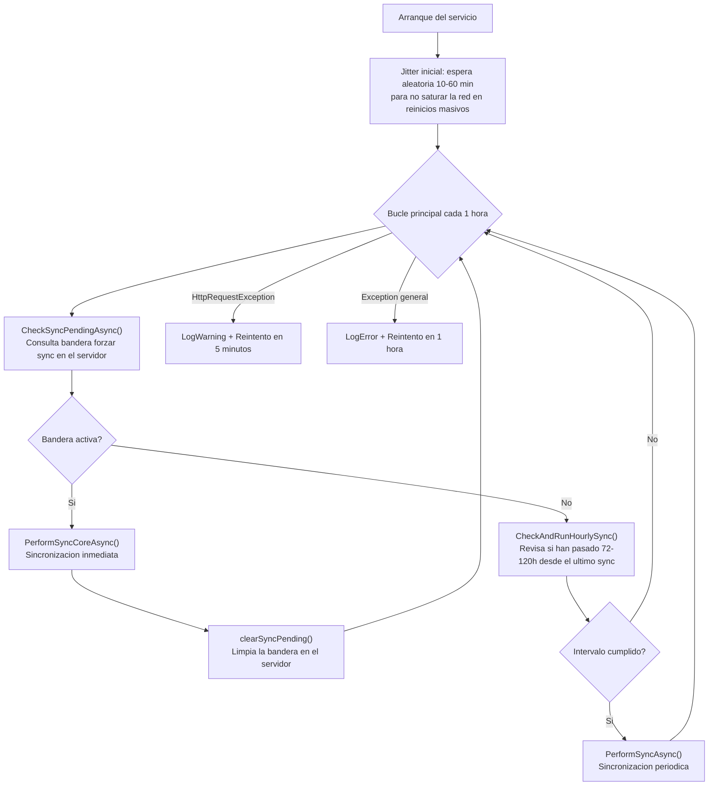

# MANUAL TÉCNICO OFICIAL: AGENTE DE ESCRITORIO SGHI (SISTEMA DE GESTIÓN DE HARDWARE INSTITUCIONAL)
**Ecosistema:** Sistema Integral de Trazabilidad y Gestión de Activos Institucionales  
**Tecnologías Base:** .NET 10, ASP.NET Core (Windows Service), Electron, React, Vite, TailwindCSS, WMI, GraphQL  
**Versión del Documento:** 1.0.0-PROD  
**Fecha de Revisión Arquitectónica:** Julio 2026  

---

## 1. DESCRIPCIÓN GENERAL

El **Agente SGHI** es el componente de escritorio del Ecosistema de Gestión de Activos Institucionales de la Delegación Nayarit – IMSS. Se distribuye como un instalador unificado (`SGHI_Setup.exe`) que despliega dos componentes independientes pero complementarios en cada PC institucional:

1. **Servicio de Fondo (`SGHI SERVICIO.exe`):** Un proceso .NET 10 registrado como **Servicio de Windows** que opera de forma autónoma, sin requerir sesión de usuario activa. Su responsabilidad exclusiva es la recolección automatizada de inventario de hardware, software y cuentas mediante WMI y el Registro de Windows, y su sincronización periódica con el servidor central vía GraphQL.

2. **Frontend de Bandeja (`SGHI.exe`):** Una aplicación de escritorio construida con **Electron + React** que provee una interfaz visual para que el técnico de TI gestione la ficha del activo asignado a esa PC: editar campos, vincular el equipo a un bien inventariado, forzar sincronizaciones manuales y consultar el estado del servicio en tiempo real.

Esta arquitectura de dos capas garantiza que el inventario se actualice **incluso cuando ningún usuario técnico ha iniciado sesión**, mientras que el frontend permanece disponible en la bandeja del sistema para operaciones manuales.

---

## 2. ARQUITECTURA Y ESTRUCTURA COMPLETA DE ARCHIVOS

A continuación se presenta el árbol de directorios y archivos exacto y completo del repositorio, sin omisiones, abreviaciones ni truncamientos (excluyendo `node_modules`, `bin`, `obj`, `dist` y `release` por ser artefactos generados).

```text
Sistema-Gestion-Activos-Institucionales-Win/
├── .gitignore
├── deploy-ad.ps1                            # Script de despliegue masivo vía Active Directory / WMI
├── GestorActivosHardware.slnx              # Solución Visual Studio
├── README.md
├── test_guna.cs                             # Script temporal de prueba
│
├── GestorActivosHardware/                   # Servicio .NET (backend de la PC)
│   ├── GestorActivosHardware.csproj         # Configuración del proyecto: net10.0-windows, SelfContained, PublishSingleFile
│   ├── Program.cs                           # Entry point: configura el Windows Service, API REST local en :6060
│   └── Services/
│       ├── AutoSyncWorker.cs                # BackgroundService: ciclo de polling y sincronización periódica
│       ├── HardwareSyncService.cs           # Orquestador: login, upsert specs TI, sync programas/monitores con hash diff
│       └── WmiService.cs                   # Recolección de hardware: WMI, Registro Windows, PowerShell, AD
│
└── frontend/                                # Aplicación Electron + React (interfaz de técnico)
    ├── .env                                 # Variables de entorno: URL GraphQL, credenciales autosync
    ├── .gitignore
    ├── eslint.config.js
    ├── find_btn.cjs                         # Utilitario de desarrollo
    ├── generate-wix-files.ps1               # Script auxiliar de empaquetado WiX (alternativa NSIS)
    ├── index.html                           # Entry point HTML de Vite
    ├── package-lock.json
    ├── package.json                         # electron-builder config, versión 2.x, firma digital
    ├── README.md
    ├── test_datos_nuevos.cjs                # Script de pruebas de datos
    ├── vite.config.js                       # Configuración Vite + plugins de ofuscación
    │
    ├── electron/
    │   ├── app.wxs                          # Descriptor WiX (alternativa a NSIS para MSI)
    │   ├── files.wxs                        # Lista de archivos para WiX
    │   ├── installer.nsh                    # Hooks NSIS: gestión del servicio (stop/create/start/delete)
    │   └── main.js                          # Proceso principal Electron: BrowserWindow, tray, IPC, auto-updater
    │
    ├── public/
    │   ├── favicon.svg
    │   ├── icons.svg
    │   ├── imssFavicon.png
    │   ├── IMSS_LogoSímbolo.png
    │   ├── IMSS_LogoSímbolo_Blanco.png
    │   └── IMSS_logo_blanco.png
    │
    └── src/
        ├── App.css
        ├── App.jsx                          # Router principal: rutas /login y /dashboard
        ├── index.css                        # Estilos globales TailwindCSS
        ├── main.jsx                         # Entry point React
        ├── Dashboard.jsx                    # Vista principal: ficha técnica del activo, hardware WMI, formulario
        ├── Login.jsx                        # Pantalla de autenticación del técnico
        │
        ├── assets/
        │   ├── hero.png
        │   ├── react.svg
        │   └── vite.svg
        │
        ├── components/
        │   ├── MaskedInputs.jsx             # Inputs con máscara: IpInput, MacInput
        │   ├── Modals.jsx                   # ModalUbicacion, ModalModeloMarca
        │   └── SearchableSelect.jsx         # Selector con búsqueda en tiempo real
        │
        └── services/
            ├── graphqlClient.js             # Comunicación HTTP GraphQL con el servidor central
            └── wmiClient.js                # Consulta REST al servicio local .NET en localhost:6060
```

---

## 3. SERVICIO DE FONDO: `GestorActivosHardware`

### 3.1 Configuración del Host (`Program.cs`)

El entry point configura el proceso como **Windows Service** registrado bajo el nombre exacto `"SGHI"` mediante `builder.Host.UseWindowsService(options => { options.ServiceName = "SGHI"; })`. Esto determina el nombre que el SCM (Service Control Manager) de Windows utilizará para todos los comandos `sc`, así como el nombre visible en `services.msc`.

**Configuración de red local:**
- Puerto fijo: `http://localhost:6060` configurado con `builder.WebHost.UseUrls(...)`.
- HttpClient nombrado `"sghi"` registrado como Singleton con `Timeout = TimeSpan.FromSeconds(30)`.
- CORS `AllowAll` con `AllowAnyOrigin().AllowAnyMethod().AllowAnyHeader()` — seguro porque el servicio solo escucha en `localhost`.

**DI (Inyección de Dependencias):**
- `HardwareSyncService` registrado como **Singleton** (`AddSingleton`): garantiza que exista exactamente una instancia compartida entre el worker y los endpoints.
- `AutoSyncWorker` registrado como **Hosted Service** (`AddHostedService`): el runtime de ASP.NET Core lo inicia automáticamente al arrancar el servicio y lo cancela con el `CancellationToken` al detener.

**Endpoints REST:**

| Endpoint | Método | Implementación | Comportamiento |
|---|---|---|---|
| `/api/hw-info` | GET | `WmiService.GetHardwareInfo()` → `Results.Json(info, PropertyNamingPolicy = null)` | Retorna JSON con los nombres de propiedad tal como están en C# (snake_case preservado), sin transformación camelCase |
| `/api/force-sync` | POST | `syncService.PerformSyncAsync()` (awaited) | Bloquea hasta completar la sincronización; retorna `{ message: "Sincronización forzada completada." }` |
| `/api/config` | POST | Lee body completo → valida JSON → `File.WriteAllText(configPath, body)` | Valida que el body no esté vacío y sea JSON parseable antes de escribir; devuelve `400 BadRequest` si falla la validación |

### 3.2 Ciclo de Vida Automático (`AutoSyncWorker.cs`)

El worker hereda de `BackgroundService` y sobreescribe `ExecuteAsync(CancellationToken stoppingToken)`. Utiliza el `stoppingToken` en todos los `Task.Delay(...)` para que el servicio responda de forma inmediata a comandos `sc stop` sin necesidad de esperar el delay completo.

**Arranque y jitter inicial:**
```csharp
var jitter = new Random().Next(600000, 3600000); // 10–60 minutos en ms
await Task.Delay(jitter, stoppingToken);
```
Al registrarse el servicio con `sc failure ... restart/60000`, si el servicio falla y se reinicia múltiples veces, el jitter garantiza que los reinicios también queden distribuidos, no concentrados.

**Bucle principal:**



**Manejo de Errores Diferenciado:**
- `HttpRequestException`: registrado en el log como `Warning` (red no disponible, no es un bug). Reintento en 5 minutos para no desperdiciar ciclos esperando 1 hora por una red que puede volver en minutos.
- `Exception` general: registrado como `Error` (posible bug o estado inesperado). Reintento en 1 hora para no entrar en bucle agresivo.

**Mensaje de arranque:** Al iniciar, el worker registra `"[AutoSync] Background Worker iniciado. v1.0.7"` — la versión está hardcodeada en el mensaje de log para facilitar la identificación de la versión desplegada en los logs del sistema.

### 3.3 Lógica de Sincronización (`HardwareSyncService.cs`)

Este servicio implementa el protocolo completo de sincronización con el servidor central. Es el componente más crítico del agente y contiene varias optimizaciones de rendimiento:

**Carga de Configuración (`LoadEnv`):**

El servicio busca el archivo `.env` en dos ubicaciones, en orden de prioridad:
1. `../../../frontend/.env` relativo al directorio base del `.exe` — esto funciona en desarrollo donde el servicio se ejecuta desde `bin/Release/net10.0-windows/win-x64/`
2. `.env` junto al propio ejecutable — esto aplica en producción donde el `.exe` está en `C:\IMSS\SGHI\`

La carga usa `DotNetEnv.Env.Load(path)`, que sobreescribe las variables de entorno del proceso actual, haciendo que `Environment.GetEnvironmentVariable(...)` devuelva los valores del archivo.

**Variables de entorno leídas:**

| Variable | Propiedad en código | Valor por defecto |
|---|---|---|
| `VITE_AUTOSYNC_USER` | `User` (computed property) | `"AUTO_USER"` |
| `VITE_AUTOSYNC_PASS` | `Pass` (computed property) | `"AUTO_PASS"` |
| `VITE_GQL_URL` | `GqlUrl` (computed property) | `"http://11.1.19.4:4000/graphql"` |

Las tres son computed properties (`=>`) en lugar de campos, lo que garantiza que siempre lean el valor actual de `Environment` después de que `LoadEnv` haya ejecutado.

**Cliente HTTP (`QueryGraphQLAsync`):**

Todas las peticiones se realizan con el cliente nombrado `"sghi"` (timeout 30s). El método construye manualmente la petición HTTP `POST` con:
- Content-Type: `application/json`
- Header `x-origen: win` fijo en todas las peticiones
- Header `Authorization: Bearer {token}` si se provee token
- Body: `JsonSerializer.Serialize(new { query })` con la cadena GraphQL

La respuesta se parsea como `JsonDocument` y se retorna el elemento `data`. Si la respuesta HTTP no es 2xx, lanza excepción con `EnsureSuccessStatusCode()`.

**Flujo completo de `PerformSyncCoreAsync`:**

1. **Recolección WMI:** Invoca `WmiService.GetHardwareInfo()` para obtener el snapshot completo de hardware. Si ya se tienen datos de un ciclo de `CheckSyncPending` previo, se pasan como `existingWmiData` para reutilizarlos y evitar escanear el hardware dos veces en el mismo ciclo.

2. **Autenticación única:** Realiza:
   ```graphql
   mutation { login(matricula: "USER", password: "PASS", equipoInfo: "SERIAL-BIOS") { token } }
   ```
   El número de serie BIOS se pasa como `equipoInfo` para que el servidor lo vincule al evento de login del bien. Retorna un JWT que se reutiliza en todas las mutaciones posteriores del ciclo, evitando múltiples sesiones.

3. **Resolución de `id_bien`** (jerarquía):
   - **Nivel 1 — `config.json` local:** Si existe en `AppDomain.CurrentDomain.BaseDirectory`, extrae `id_bien` del JSON. Sin consulta de red.
   - **Nivel 2 — Búsqueda por número de serie:** `query { bienes(filter: { search: "SERIAL" }) { edges { node { id_bien } } } }`. Si el arreglo de edges está vacío, la función retorna silenciosamente (el equipo no está en el inventario).

4. **Upsert de Especificaciones TI:**
   ```graphql
   mutation { upsertEspecificacionTI(
     id_bien: "..."
     cpu_info: "..."     ram_gb: "..."     almacenamiento_gb: "..."
     mac_address: "MAC1/MAC2/MAC3"
     dir_ip: "IP1/IP2/IP3"
     modelo_so: "..."    windows_serial: "..."
     nombre_host: "..."  version_office: "..."
     last_scan: "yyyy-MM-dd HH:mm:ss"
   ) { id_bien } }
   ```
   `mac_address` e `dir_ip` se construyen tomando los primeros 3 adaptadores de red de `wmiData.adaptadores_red` con `Take(3)`, filtrando los vacíos y uniéndolos con `/`.

5. **Sincronización Diferencial de Programas:**
   - Serializa la lista como JSON de objetos con campos `programa`, `version`, `fecha_instalacion`.
   - Calcula `MD5.HashData(Encoding.UTF8.GetBytes(json))` y convierte a hex con `Convert.ToHexString().ToLowerInvariant()`.
   - Compara con `lastProgramsHash` de `autosync.json`. Si son iguales: log `"[AutoSync] Programas sin cambios, omitiendo sync."` y no hace petición. Si difieren: ejecuta `syncProgramasPC` y actualiza el hash en memoria.

6. **Sincronización Diferencial de Monitores:** Idéntica lógica de hash MD5 para `syncMonitoresPC`. Los campos enviados son `marca`, `modelo`, `num_serie`.

7. **Persistencia de Estado:** Una única escritura a `autosync.json` al final exitoso del ciclo:
   ```json
   {
     "lastSync": <UnixTimeMilliseconds>,
     "nextSyncInterval": <randomHours * 3600000>,
     "lastProgramsHash": "...",
     "lastMonitorsHash": "..."
   }
   ```
   El intervalo aleatorio `nextSyncInterval` se genera con `new Random().Next(72, 121)` horas, distribuyendo las sincronizaciones periódicas entre 3 y 5 días aproximadamente.

**Método `CheckSyncPendingAsync`:** Si la bandera `checkSyncPending` está activa en el servidor, ejecuta `PerformSyncCoreAsync` pasando el token y los datos WMI ya obtenidos (para no re-loginear ni re-escanear), y luego ejecuta `clearSyncPending` para limpiar la bandera. Retorna `true` si hubo sync forzado, `false` si no.

**Método `CheckAndRunHourlySync`:** Compara `DateTimeOffset.UtcNow.ToUnixTimeMilliseconds() - lastSync >= nextSyncInterval`. Si es tiempo, dispara `PerformSyncAsync()` con `Task.Run(...)` para no bloquear el bucle del worker.

### 3.4 Recolección de Hardware (`WmiService.cs`)

El servicio `WmiService` es la capa de abstracción del hardware local. Recopila la información a través de múltiples fuentes para maximizar la cobertura y resiliencia. A continuación se detalla cada campo, su fuente exacta y las particularidades de la implementación:

| Campo | Fuente | Detalle de implementación |
|---|---|---|
| `nom_pc` | `Environment.MachineName` | Nombre de host de la PC, sin consulta WMI |
| `usuario_pc` | `WindowsIdentity.GetCurrent().Name` | Identidad completa `DOMINIO\Usuario` del proceso que ejecuta el servicio; fallback a `Environment.UserName` |
| `tipo_usuario_pc` | `WindowsPrincipal.IsInRole(...)` | Determina si el proceso corre como `Administrador`, `Avanzado` (PowerUser) o `Estándar` |
| `num_serie` | `Win32_BIOS.SerialNumber` | Número de serie grabado en firmware BIOS/UEFI; usado como identificador primario de la PC |
| `cpu_info` | `Win32_Processor` | Lee `Name` + `MaxClockSpeed` (MHz). Si `MaxClockSpeed` es parseable a double, calcula `Math.Round(mhz / 1000.0, 2)` GHz y lo añade como `@ X.XX GHz`. Omite el sufijo si el nombre ya contiene `@` |
| `ram_gb` | `Win32_PhysicalMemory.Capacity` | Suma `Capacity` de todos los módulos físicos (todos los bancos de RAM); convierte bytes → GB enteros con `/ (1024L * 1024 * 1024)` |
| `almacenamiento_gb` | Asociación WMI 3-hop: `C: → Partición → Disco` | `ASSOCIATORS OF {Win32_LogicalDisk.DeviceID='C:'} WHERE AssocClass=Win32_LogicalDiskToPartition` → `ASSOCIATORS OF {partition.__RELPATH} WHERE AssocClass=Win32_DiskDriveToDiskPartition`. Obtiene `Size` del disco físico real. Fallback si la asociación falla: `Win32_DiskDrive WHERE Index=0`. Si sigue sin datos: `"256"` como default |
| `modelo_so` | `Win32_OperatingSystem` | `Caption.Replace("Microsoft ", "").Trim()` + `" (" + OSArchitecture + ")"`. Ej: `Windows 11 Pro (64-bit)` |
| `windows_serial` | `Win32_OperatingSystem.SerialNumber` | Número de serie del SO instalado (distinto al número de serie de BIOS) |
| `dir_ip` | `Win32_NetworkAdapterConfiguration WHERE IPEnabled=True` | Filtra solo IPs que pasen `IPAddress.TryParse` + `AddressFamily == InterNetwork` (IPv4 pura). Cada adaptador válido se agrega a `adaptadores_red`. `dir_ip` guarda la primera IP encontrada como campo principal |
| `mac_address` | `Win32_NetworkAdapterConfiguration.MACAddress` | Primera MAC disponible en `dir_ip` primario; en `HardwareSyncService` se concatenan hasta 3 MACs con `/` |
| `version_office` | `HKLM\SOFTWARE\...\Uninstall` (x64 y WOW6432Node x86) | Itera todas las subkeys buscando `DisplayName` que contenga "Microsoft Office" o "Microsoft 365". Excluye: `language pack`, `proof`, `click-to-run component`, `onenote`, `visio`, `project`, `runtime`, `web components`, `compatibility`, `teams`, `add-in`, `plugin`, `viewer`, `engine`, `mui`, `updater`, `companion`, `copilot`. Extrae año/edición via regex `(365\|20[0-9]{2})`. Si ninguna clave pasa el filtro: `"No instalado"` |
| `fecha_act_antivirus` | `HKLM\SOFTWARE\Microsoft\Windows Defender\Signature Updates\SignaturesLastUpdated` | Lee 8 bytes del valor binario (`byte[]`) como `Int64` via `BitConverter.ToInt64(binaryData, 0)`. Solo procesa si `fileTime > 0`. Convierte con `DateTime.FromFileTime(fileTime).ToString("yyyy-MM-dd HH:mm:ss")`. **Fallback:** WMI `MSFT_MpComputerStatus.AntivirusSignatureLastUpdated` en namespace `root\Microsoft\Windows\Defender` — convierte via `ManagementDateTimeConverter.ToDateTime().ToLocalTime()` |
| `correos_usuario` | PowerShell `ADSystemInfo` COM + ADSI | Spawn de `powershell.exe -NoProfile -Command "$s = New-Object -ComObject ADSystemInfo; ..."`. Lee el campo `mail` del objeto ADSI del usuario actual. Solo acepta correos que terminen en `@imss.gob.mx` (verificado con `StringComparison.OrdinalIgnoreCase`). **Fallback:** itera subkeys de `HKCU\Software\Microsoft\IdentityCRL\UserExtendedProperties`; cualquier subkey que termine en `@imss.gob.mx` se toma como correo |
| `tipo_equipo` | `Win32_SystemEnclosure.ChassisTypes` | Array `ushort[]`. Tipos 8 (Portable), 9 (Laptop), 10 (Notebook), 14 (Sub Notebook), 31 (Convertible) → `"Laptop"`. Cualquier otro valor → `"Desktop"` |
| `monitores` | `WmiMonitorID` + `WmiMonitorConnectionParams` (namespace `root\WMI`) | Primero construye `HashSet<string> monitoresInternos` con los `InstanceName` de monitores cuyo `VideoOutputTechnology == 2147483648` (constante de pantalla interna integrada). En laptops, omite estos monitores del inventario. Para los monitores externos: lee `ManufacturerName`, `UserFriendlyName` y `SerialNumberID` como `ushort[]`, convierte a `char` filtrando `c > 0 && c < 256`. Traduce códigos PNP a nombres comerciales: `HPN/HWP→HP, DEL→Dell, BNQ→BenQ, SAM→Samsung, LGD→LG, ACR→Acer, ASU→Asus, LEN→Lenovo, APP→Apple`. Limpia el prefijo de la marca del modelo si el modelo comienza con el nombre de la marca |
| `cuentasList` | `Win32_UserProfile WHERE Special=False` + `DirectoryServices` + LDAP | Solo incluye perfiles con `LocalPath` que comience con `C:\Users\` (case-insensitive). Traduce SID a `NTAccount` para obtener `DOMINIO\Nombre`. Tipo de cuenta: consulta grupos `Administradores`/`Administrators` y `Usuarios Avanzados`/`Power Users` via `DirectoryEntry WinNT://MAQUINA/GRUPO` usando `group.Invoke("Members")`. Correo institucional via `DirectorySearcher(samaccountname=nombre)` con `ClientTimeout = ServerTimeLimit = 1s` (para no bloquear si AD no responde); fallback a `HKEY_USERS\{SID}\Software\Microsoft\IdentityCRL\UserExtendedProperties` |
| `programas` | Registro Windows (3 rutas) + PowerShell `Get-AppxPackage` | **Registro x64:** `HKLM\SOFTWARE\Microsoft\Windows\CurrentVersion\Uninstall`. **Registro x86:** `HKLM\SOFTWARE\WOW6432Node\Microsoft\Windows\CurrentVersion\Uninstall`. **Usuario actual:** `HKCU\Software\Microsoft\Windows\CurrentVersion\Uninstall`. **Apps modernas:** PowerShell `Get-AppxPackage -AllUsers \| Select-Object Name, Version, Publisher \| ConvertTo-Json -Compress`. Deduplicación case-insensitive con `HashSet<string>` compartido entre todas las fuentes |

**Filtrado de Ruido en Programas (aplicado a las 3 rutas de registro):**

Se excluyen automáticamente:
- Nombres que contengan `KB` y `Update` simultáneamente (actualizaciones de seguridad)
- Nombres que contengan: `microsoft .net`, `microsoft visual c++`, `redistributable`, ` sdk ` (con espacios), terminen en ` sdk`, `runtime`, `language pack`, `paquete de idioma`, `paquete de compatibilidad`, `paquete de controladores`
- Nombres que comiencen con: `windows driver package`, `windows driver kit`, `windows app certification kit`
- Nombres que contengan: `developer tools`, `update for `, `security update`

**Filtrado de Ruido en AppX/UWP (aplicado a Get-AppxPackage):**

Se excluyen paquetes cuyo `Name` comience con: `MicrosoftWindows.`, `Microsoft.UI.`, `Microsoft.VCLibs`, `Microsoft.NET`.

Se humanizan nombres: `Microsoft.WindowsNotepad` → `Bloc de notas`, `Microsoft.Paint` → `Paint`, `Microsoft.BingWeather` → `El Tiempo`, `Microsoft.WindowsCalculator` → `Calculadora`. Para el resto del namespace `Microsoft.*` se elimina el prefijo `"Microsoft."`.

**Priorización del Usuario Activo en `cuentasList`:** Al final de toda la recolección de cuentas, se ejecuta `Win32_ComputerSystem.UserName` para identificar el usuario con sesión activa. Si ese usuario existe en `cuentasList` en un índice distinto de 0, se mueve a la posición 0 con `RemoveAt(idx)` + `Insert(0, item)`, garantizando que el frontend lo muestre como usuario principal de la PC.

---

## 4. FRONTEND ELECTRON: `SGHI.exe`

### 4.1 Proceso Principal (`main.js`)

El proceso principal de Electron implementa toda la lógica de ciclo de vida de la aplicación, gestión de actualizaciones y comunicación IPC con el renderer.

**Optimizaciones de rendimiento (declaradas al inicio):**
```js
app.disableHardwareAcceleration();
app.commandLine.appendSwitch('disable-features', 'HardwareMediaKeyHandling,MediaSessionService,CalculateNativeWinOcclusion');
app.commandLine.appendSwitch('js-flags', '--max-old-space-size=128');
app.commandLine.appendSwitch('disable-site-isolation-trials');
```
Desactiva aceleración de GPU (innecesaria para esta app de gestión), limita el heap de V8 a 128 MB y elimina features de Chrome no utilizadas para reducir la huella de RAM. Al cerrar la ventana se reduce la prioridad del proceso con `os.setPriority(process.pid, PRIORITY_LOW)`.

**Instancia única (Single Instance Lock):**
```js
const gotTheLock = app.requestSingleInstanceLock();
if (!gotTheLock) { app.quit(); }
```
Si el usuario lanza un segundo ejecutable, el sistema envía el evento `second-instance` a la instancia ya corriendo, que entonces muestra/enfoca la ventana existente. Si el segundo intento incluye `--hidden` (autoarranque), no abre la ventana.

**Gestión de la ventana principal (`BrowserWindow`):**
- Dimensiones: 1400×900, mínimo 1200×800.
- `titleBarStyle: 'hidden'` + `titleBarOverlay` con color IMSS `#006241` y symbolo blanco, altura 44px (barra de título nativa personalizada).
- `webPreferences`: `nodeIntegration: true`, `contextIsolation: false`, `webSecurity: false` — necesario para que el renderer acceda directamente a módulos Node.js como `window.require('electron')`.
- En **desarrollo**: carga `http://localhost:5200` (servidor Vite). En **producción**: carga `dist/index.html` local.
- Al cerrar la ventana (`close` event): si no se está saliendo (`!isQuitting`), previene el cierre, ejecuta `localStorage.clear()` via JavaScript en el renderer y destruye la ventana (la app continúa en el tray). 

**Ícono de bandeja del sistema (Tray):**
- Ícono: `IMSS_logo_blanco.png` redimensionado a 16×16 px.
- Tooltip: `"Gestor Activos - IMSS v{version}"`.
- Menú contextual: `"Mostrar aplicación"` → `showOrCreateWindow()` | Separador | `"Salir"` → `app.quit()`.
- Click izquierdo en el ícono del tray también abre la ventana.

**Configuración de autoarranque:**
```js
app.setLoginItemSettings({ openAtLogin: true, openAsHidden: true, args: ['--hidden'] });
```
Registra la aplicación en el autoarranque de Windows para el usuario actual. El flag `--hidden` hace que al arrancar con el sistema, la ventana no se muestre (solo el tray queda activo). El hook NSIS complementa esto a nivel global (HKLM) para todos los usuarios.

**Lógica de apertura de ventana post-update:**
Al arrancar, si existe el archivo `.update-restart` en `userData`, significa que el reinicio fue disparado por una actualización y el usuario había confirmado la descarga. En ese caso se abre la ventana automáticamente. Si no existe el archivo y no se pasa `--hidden`, también se abre (arranque manual).

### 4.2 Sistema de Actualizaciones Automáticas (`main.js` — `setupAutoUpdater`)

La gestión de actualizaciones implementa una lógica sofisticada para evitar saturar la red y proveer al usuario control sobre cuándo instalar:

**Estados del autoupdater:**

| Variable | Propósito |
|---|---|
| `userRequestedUpdate` | `true` solo si el usuario hizo click en "Descargar e Instalar" |
| `initialUpdateCheckDone` | `true` cuando el primer `checkForUpdates()` terminó (evita race conditions) |
| `pendingShowWindow` | `true` si el usuario intentó abrir la ventana mientras el check inicial estaba en curso |

**Flujo de actualización:**

1. Al arrancar (`app.isPackaged`): `autoUpdater.checkForUpdates()` de forma inmediata.
2. Ciclo de revisión: `setInterval` cada **3 horas** (`10800000 ms`) para revisar el archivo `.yml` del servidor (ligero, <1KB).
3. Si hay actualización disponible:
   - **Ventana visible:** Envía `update-available` al renderer vía IPC. El usuario decide si descargar.
   - **App en tray (ventana oculta):** Descarga automáticamente con **jitter de 30 min a 6 horas** (`1800000` a `21600000 ms`) para distribuir las descargas en el parque de equipos.
4. El download no inicia automáticamente (`autoDownload = false`) salvo en el caso de tray.
5. Al completar la descarga: `autoUpdater.quitAndInstall(true, true)` — cierra e instala sin segundo diálogo de confirmación.

**Integración con `Login.jsx` (renderer):**

El componente `Login` escucha canales IPC vía `ipcRenderer`:
- `update-available` → muestra "¡Actualización requerida! Descargando..." y **deshabilita el botón de login** (`disabled={updateAvailable}`).
- `update-downloaded` → muestra "Actualización lista. Instala para continuar." y bloquea el login.
- `update-not-available` → muestra mensaje temporal "Ya cuentas con la versión más reciente." (desaparece en 4s).
- `update-error` → mensaje temporal "Error al buscar actualizaciones." (4s).

**Rate limiting en botón "Buscar actualización":** Máximo 3 clicks en 60 segundos. Si se exceden: bloqueo de 5 minutos (`blockedUntil.current = now + 5 * 60000`).

### 4.3 Pantalla de Login (`Login.jsx`)

La pantalla de login corre en el renderer Electron con fondo verde IMSS `#006241`. Características técnicas:

- **Detección de entorno:** `isElectron = typeof window !== 'undefined' && !!window.process?.versions?.electron`. Solo muestra el botón "Buscar actualización" si está en Electron real.
- **Consulta WMI pre-login:** Antes de enviar las credenciales al servidor, intenta obtener el número de serie BIOS via `fetch('http://localhost:6060/api/hw-info')` con **timeout de 3 segundos** (`AbortController`). Si el servicio no está corriendo o la red local falla, continúa sin `equipoInfo` (login funciona igual).
- **Barra de título personalizada:** Un `div` con `style={{ WebkitAppRegion: 'drag' }}` simula la barra de título arrastrable de la ventana, mostrando el logo IMSS y el texto "SGHI".
- **Credenciales:** Campo `matricula` (texto) y `password` (con toggle de visibilidad via ojo `Eye`/`EyeOff` de Lucide). El token JWT recibido se guarda en `localStorage.setItem('jwtToken', token)`.
- **Versión visible:** Se renderiza `v{pkg.version}` leyendo el campo `version` de `package.json` directamente via `import pkg from '../package.json'`.

### 4.4 Vista Principal (`Dashboard.jsx`)

El `Dashboard` es el corazón de la interfaz del técnico. Al cargar, ejecuta:

1. **Consulta del hardware en tiempo real** via `fetchHardwareInfo()` → `GET http://localhost:6060/api/hw-info`.
2. **Consulta de catálogos del servidor central** via `getCatalogs()` → query GraphQL que obtiene en un viaje: `catModelos`, `marcas`, `tiposDispositivo`, `catUnidades`, `catSegmentos`.
3. **Búsqueda del bien vinculado** al número de serie detectado para pre-poblar el formulario.

La vista usa el `initialFormState` como estado React con todos los campos del bien. Secciones funcionales:

- **Cabecera de Estado:** Versión de la app desde `package.json`, estado del servicio de fondo.
- **Formulario de Activo:** `num_serie`, `num_inv`, `estatus_operativo`, modelo/marca, unidad, ubicación, resguardatario, segmento, fecha de adquisición.
- **Panel de Especificaciones TI:** CPU, RAM, almacenamiento, `dir_ip` (multivalor separado por `/`), MAC, hostname, Windows serial, SO, Office, antivirus, `puerto_red`, `switch_red`.
- **Sección de Monitores:** Lista `monitores[]` detectados por WMI; permite vincularlos al bien via `procesarMonitoresEquipo`.
- **Sección de Programas:** Lista `programas[]` con nombre, versión y fecha de instalación.
- **Sección de Cuentas:** Lista `cuentasList[]` con `cuenta_windows`, `correo`, `tipo_user`. Cada cuenta tiene un checkbox `_selected` para controlar cuáles se sincronizan con el servidor.
- **Sección de Notas (`NotasBienSection`):** Carga las notas del bien via `getNotasBien(idBien)`, permite añadir nuevas via `createNotaBien(idBien, texto)`. Retorna `id_nota`, `contenido_nota`, `fecha_creacion` y el autor (`nombre_completo`, `matricula`).

### 4.5 Comunicación con el Servicio Local (`wmiClient.js`)

Módulo de 27 líneas que abstrae las dos llamadas al servicio .NET local:

| Función | Endpoint | Descripción |
|---|---|---|
| `fetchHardwareInfo()` | `GET /api/hw-info` | Obtiene el JSON completo de hardware WMI |
| `forceSyncHardware()` | `POST /api/force-sync` | Dispara sincronización manual; espera la respuesta bloqueando |

Ambas funciones propagan el error si la respuesta no es OK o si la red local falla (servicio detenido).

### 4.6 Comunicación con el Backend Central (`graphqlClient.js`)

Módulo de 468 líneas que centraliza toda la comunicación GraphQL. La función base `queryGraphQL(query, variables)` agrega automáticamente:
- Header `x-origen: win` en todas las peticiones.
- Header `Authorization: Bearer {token}` tomado primero de `window.AUTO_SYNC_TOKEN` y luego de `localStorage.getItem('jwtToken')`.
- En caso de error de autenticación (`UNAUTHENTICATED`, `auth`, `token` en el mensaje): limpia `localStorage`, redirige a `#/login` y recarga la página.

**Funciones exportadas:**

| Función | Mutación/Query | Descripción |
|---|---|---|
| `login(matricula, password)` | `mutation login(...)` | Login del técnico; guarda JWT en `localStorage` |
| `logout()` | — | Elimina `jwtToken` de `localStorage` |
| `getCatalogs()` | `query { catModelos, marcas, tiposDispositivo, catUnidades, catSegmentos }` | Catálogos para poblar selectores del formulario |
| `searchUsuarios(term)` | `query usuarios(search, pagination: {first: 20})` | Búsqueda de resguardatarios (mínimo 2 caracteres) |
| `getUbicacionesPorUnidad(id_unidad)` | `query ubicacionesPorUnidad(...)` | Ubicaciones filtradas por unidad |
| `createUbicacion(id_unidad, nombre)` | `mutation createUbicacion(...)` | Creación rápida de ubicación desde el formulario |
| `createMarca(nombre)` | `mutation createMarca(...)` | Creación rápida de marca |
| `createModelo(...)` | `mutation createCatModelo(...)` | Creación rápida de modelo |
| `saveAsset(isNew, assetData)` | `createBien` / `updateBien` + `upsertEspecificacionTI` + `syncProgramasPC` + cuentas CRUD | Guardado completo del bien con todas sus relaciones. Retorna `finalIdBien` |
| `saveDirectSpecsAndPrograms(id_bien, assetData)` | `upsertEspecificacionTI` + `syncCuentasPC` + `syncMonitoresPC` + `syncProgramasPC` | Actualización directa de especificaciones TI y datos relacionados sin tocar el bien principal |
| `updateUsuarioResguardo(id_bien, id_usuario)` | `mutation updateUsuarioResguardo(...)` | Cambio de resguardatario únicamente |
| `solicitarActualizacionBien(idBien, datosNuevosJSON)` | `mutation solicitarActualizacionBien(...)` | Genera solicitud de cambio; retorna `id`, `estado`, `fecha_solicitud` |
| `procesarMonitoresEquipo(idBienPc, monitores, forzar)` | `mutation procesarMonitoresEquipo(...)` | Vincula monitores WMI al bien; retorna `{ ok, conflictos[] }` donde conflictos indica monitores ya asignados a otro bien |
| `getNotasBien(idBien)` | `query notasBien(id_bien)` | Lista de notas del bien con autor |
| `createNotaBien(idBien, contenidoNota)` | `mutation createNotaBien(...)` | Crea nota técnica asociada al bien |
| `getUserRole()` | — (decodifica JWT local) | Lee `id_rol` del payload del JWT sin consulta al servidor |
| `checkIpUsage(ip, excludeIdBien)` | `query bienes(filter: { dir_ip })` | Verifica si una IP ya está en uso. Retorna `{ inUse: boolean, conflictos: [{ id_bien }] }` — el arreglo `conflictos` contiene los bienes que tienen esa IP asignada (excluyendo el bien actual) |
| `liberarIpEquipo(idBien, ipToRemove)` | `query bien(...)` + `mutation upsertEspecificacionTI(...)` | Elimina una IP específica del campo `dir_ip` de otro bien (usado al reasignar una IP duplicada al bien actual); carga la spec TI del otro bien, filtra la IP y guarda con el mismo upsert |
| `deleteCuentaPC(id_cuenta)` | `mutation deleteCuentaPC(...)` | Elimina cuenta individual de la PC |

**Detalle de `saveAsset`:** Implementa la lógica completa de gestión de cuentas: elimina primero las cuentas que fueron desmarcadas (`!_selected && id_cuenta` existente), luego crea o actualiza las seleccionadas según si tienen `id_cuenta` y `!_new`. Los campos de programas usan una transformación de JSON para eliminar las comillas de los nombres de las claves: `.replace(/\"([a-zA-Z0-9_]+)\":/g, '$1:')` convirtiendo `{"programa":"..."}` a GraphQL Input Object `{programa:"..."}`.

### 4.7 Componentes UI

| Componente | Descripción |
|---|---|
| `SearchableSelect` | Selector con búsqueda en tiempo real; llama al servidor en cada keystroke (debounced). Usado para catálogos extensos: usuarios (resguardatarios), modelos, ubicaciones |
| `ModalUbicacion` | Modal de creación rápida de ubicaciones físicas desde el formulario principal, sin navegar fuera |
| `ModalModeloMarca` | Modal de creación rápida de modelos y marcas; permite crear la marca primero y luego el modelo en el mismo flujo |
| `IpInput` | Input con máscara de validación para direcciones IPv4; previene entradas inválidas |
| `MacInput` | Input con máscara de validación para direcciones MAC (formato `XX:XX:XX:XX:XX:XX`) |

---

## 5. SISTEMA DE INSTALACIÓN Y DESPLIEGUE

### 5.1 Construcción del Instalador (`npm run dist`)

El script `dist` en `package.json` ejecuta la cadena completa de construcción:

```
npm run build (Vite → dist/)
  ↓
electron-builder --win nsis
  ↓
Firma digital con CertificadoSGHI.pfx
  ↓
Genera: release/SGHI_Setup.exe + release/SGHI_Setup.exe.blockmap
```

El instalador incluye como `extraResources` el binario del servicio .NET compilado desde `GestorActivosHardware/bin/Release/net10.0-windows/win-x64/publish/`, copiándolo a `resources/backend/` dentro del paquete Electron. En tiempo de instalación, el hook NSIS copia ese directorio a `C:\IMSS\SGHI\`.

### 5.2 Hooks NSIS (`installer.nsh`)

El instalador utiliza hooks personalizados de NSIS para gestionar el ciclo de vida del servicio de Windows durante la instalación, actualización y desinstalación:

**`customInit` (Pre-instalación — antes de extraer archivos):**
```nsis
ExecWait 'sc stop "SGHI"'   ; Detiene el servicio antes de sobrescribir el exe
Sleep 2000                   ; Espera 2s para que el proceso libere el archivo en disco
```
Este hook es crítico en actualizaciones: si el servicio está corriendo y se intenta sobrescribir `SGHI SERVICIO.exe`, Windows lanzará "Access Denied". El sleep da tiempo al SCM para completar la señal de parada.

**`customInstall` (Post-instalación — después de extraer archivos):**
```nsis
CreateDirectory "C:\IMSS\SGHI"
; Copia el exe del servicio y sus DLLs a la ruta definitiva
ExecWait 'cmd.exe /c xcopy /Y /S /E "$INSTDIR\resources\backend\*" "C:\IMSS\SGHI\"'
; Registra el servicio (silencioso si ya existe — sc create falla con error 1073)
ExecWait 'sc create "SGHI" binPath= "\"C:\IMSS\SGHI\SGHI SERVICIO.exe\"" start= auto displayname= "SGHI - Servicio de Sincronizacion"'
; Política de recuperación automática ante fallos
ExecWait 'sc failure "SGHI" reset= 86400 actions= restart/60000/restart/120000/restart/240000'
ExecWait 'sc start "SGHI"'
; Autoarranque global para todos los usuarios del equipo (HKLM)
WriteRegStr HKLM "Software\Microsoft\Windows\CurrentVersion\Run" "SGHI_Frontend" '"$INSTDIR\SGHI.exe" --hidden'
```

**`customUnInstall` (Desinstalación):**
```nsis
DeleteRegValue HKLM "Software\Microsoft\Windows\CurrentVersion\Run" "SGHI_Frontend"
ExecWait 'sc stop "SGHI"'
Sleep 2000
ExecWait 'sc delete "SGHI"'
; RMDir /r "C:\IMSS\SGHI"   ← comentado: opcional borrar la carpeta al desinstalar
```

**Nota sobre idioma del SO:** Los comandos `icacls` usan el SID builtin `BA` (Built-in Administrators) en lugar del nombre localizado `"Administrators"/"Administradores"`, garantizando compatibilidad con PCs configuradas en inglés o español.

### 5.3 Actualizaciones Automáticas (`electron-updater`)

El sistema de actualizaciones opera bajo el esquema genérico de `electron-updater` con servidor de archivos estático:

- **Servidor:** `http://11.1.19.4/updates/` (servidor interno IMSS).
- **Archivos requeridos en el servidor:** `latest.yml` (descriptor de la última versión, ~500 bytes) + `SGHI_Setup.exe` (instalador completo) + `SGHI_Setup.exe.blockmap` (mapa de bloques para descarga diferencial).
- **Revisión inicial:** `checkForUpdates()` inmediato al arrancar (solo en `app.isPackaged`, no en desarrollo).
- **Revisión periódica:** Cada 3 horas via `setInterval`.
- **Descarga:** Si la ventana está visible → el usuario decide (`update-available` IPC). Si está en tray → jitter de 30min a 6h, luego descarga automática.
- **Instalación:** `autoUpdater.quitAndInstall(true, true)` — cierra sin confirmación adicional e instala el nuevo `.exe`. Los hooks NSIS `customInit` + `customInstall` ejecutan el ciclo completo de actualización del servicio.
- **Flag de reinicio post-update:** Escribe `.update-restart` en `userData` si fue el usuario quien pidió la actualización, para que al reiniciar se abra la ventana automáticamente.

### 5.4 Despliegue Masivo (`deploy-ad.ps1`)

Para el despliegue inicial en el parque de equipos vía Active Directory, el script acepta un archivo de texto con hostnames (`pcs.txt`) y ejecuta el instalador remotamente mediante **WinRM** o **WMI**, con reporte de resultados exitosos/fallidos por hostname.

---

## 6. INTEGRACIÓN CON EL SERVIDOR CENTRAL

### 6.1 Identificación de Origen

Todas las peticiones HTTP del agente SGHI (tanto del servicio .NET como del frontend Electron) incluyen el header:

```
x-origen: win
```

El servidor central (`BitacoraSubscriber.ts`) intercepta este header para aplicar políticas especiales de bitácora:
- Las actualizaciones automáticas del servicio se registran con el mensaje unificado `"AUTOSYNC ACTUALIZÓ UN EQUIPO"` en lugar de voluminosos JSONs de cambio.
- Los eventos de login del usuario autosync (`ti_autosync`) se **suprimen completamente** de la bitácora para evitar ruido operativo masivo.

### 6.2 Credenciales y Variables de Entorno

El servicio .NET carga su configuración desde el archivo `.env` ubicado en la carpeta del frontend Electron (dentro del instalador), siguiendo esta jerarquía de búsqueda:

1. `../../../frontend/.env` (relativo a la ruta base del exe — para entorno de desarrollo)
2. `.env` junto al propio ejecutable (para entorno de producción)

Variables requeridas:

| Variable | Descripción |
|---|---|
| `VITE_GQL_URL` | URL del endpoint GraphQL del servidor central |
| `VITE_AUTOSYNC_USER` | Matrícula del usuario de sincronización automática |
| `VITE_AUTOSYNC_PASS` | Contraseña del usuario de sincronización automática |

El frontend React lee `VITE_GQL_URL` directamente via `import.meta.env.VITE_GQL_URL` (inyectado por Vite en tiempo de build). El valor por defecto hardcodeado en el código es `http://11.1.19.4:4000/graphql`.

### 6.3 Detección de Bien Vinculado

El agente resuelve el `id_bien` correspondiente a la PC donde está instalado mediante una jerarquía de dos niveles:

1. **Archivo local `config.json`:** Si el técnico ya vinculó el equipo desde el frontend (via `POST /api/config`), el `id_bien` se persiste en `AppDomain.CurrentDomain.BaseDirectory\config.json`. En sincronizaciones futuras se usa este valor directamente, evitando una consulta de red adicional.
2. **Búsqueda por número de serie:** Si no existe `config.json`, consulta al servidor filtrando bienes por el número de serie BIOS de la PC. Si el arreglo `edges` está vacío, la sincronización se cancela silenciosamente (el equipo no está registrado en el inventario — un técnico debe vincularlo primero desde el frontend).

### 6.4 Verificación y Reasignación de IP en Uso (`checkIpUsage` + `liberarIpEquipo`)

Antes de guardar una IP asignada manualmente por el técnico, el frontend consulta `query bienes(filter: { dir_ip })` para verificar si esa IP ya está asignada a otro bien. Si está en uso, en lugar de solo mostrar un error bloqueante, el sistema presenta un diálogo de confirmación: *"Esta IP ya está registrada en otro activo. ¿Deseas asignarla a este equipo y dejar al otro sin IP?"*

- Si el técnico confirma: se invoca `liberarIpEquipo(idBien, ip)` por cada bien en conflicto. Esta función carga las especificaciones TI del bien conflictivo, elimina la IP del campo `dir_ip` (soportando el formato de múltiples IPs separadas por `/`) y ejecuta `upsertEspecificacionTI` con el valor actualizado. Tras liberar, el guardado del bien actual continúa normalmente.
- Si el técnico cancela: la operación se detiene, se muestra una alerta ("Operación cancelada. No se guardaron los cambios.") y el formulario queda editable para corregir la IP.

---

## 7. SEGURIDAD

- **Firma digital del instalador:** Todos los binarios empacados (`SGHI.exe`, `SGHI SERVICIO.exe`, `elevate.exe`) y el instalador mismo (`SGHI_Setup.exe`) son firmados con el certificado institucional `CertificadoSGHI.pfx` mediante `signtool.exe` durante el proceso de build, garantizando la autenticidad y la integridad del software frente a Windows SmartScreen.
- **Permisos de carpeta de instalación:** La carpeta `C:\IMSS\SGHI\` puede ser configurada opcionalmente con `icacls` para que únicamente SYSTEM y el grupo de Administradores (SID `BA`) tengan permisos de escritura, previniendo que usuarios estándar sobrescriban el binario del servicio durante la ventana de actualización.
- **Escucha solo local:** El servicio .NET escucha exclusivamente en `http://localhost:6060`; nunca expone puertos en interfaces de red externas.
- **Credenciales en variables de entorno:** Las credenciales del usuario autosync se leen de `.env` y nunca se compilan dentro del código fuente.
- **Session clearing al cerrar ventana:** Al cerrar el `BrowserWindow`, el proceso principal ejecuta `localStorage.clear()` en el renderer antes de destruir la ventana, eliminando el JWT de sesión para evitar que otra sesión de usuario lo reutilice.
- **Rate limiting en autoupdater UI:** El botón "Buscar actualización" en la pantalla de login implementa rate limiting client-side (máx 3 clics en 60s, bloqueo de 5 min si se excede) para evitar abuso del endpoint del servidor de actualizaciones.

---

## 8. VERSIONING

| Componente | Versión actual | Campo |
|---|---|---|
| Servicio .NET (`GestorActivosHardware`) | 1.0.7 | `<Version>` en `.csproj` |
| Frontend Electron (`SGHI.exe`) | 2.0.7 | `version` en `package.json` |
| Nombre de ensamblado del servicio | `SGHI SERVICIO` | `<AssemblyName>` en `.csproj` |
| Nombre del servicio Windows | `SGHI` | `options.ServiceName` en `Program.cs` |

---

## 9. ARCHIVOS DE ESTADO LOCAL

El servicio mantiene dos archivos de estado en su directorio base (`C:\IMSS\SGHI\`):

### `autosync.json`
Persiste el estado entre reinicios del servicio:
```json
{
  "lastSync": 1751234567890,
  "nextSyncInterval": 345600000,
  "lastProgramsHash": "a3f8c2d1...",
  "lastMonitorsHash": "b7d1e9f4..."
}
```

| Campo | Tipo | Descripción |
|---|---|---|
| `lastSync` | `long` (Unix ms) | Timestamp de la última sincronización exitosa. Leído con `data.TryGetProperty("lastSync", out var ls)` |
| `nextSyncInterval` | `long` (ms) | Intervalo aleatorio para el próximo sync (72–120h). Default si no existe: `72L * 3600L * 1000L` (72h) |
| `lastProgramsHash` | `string` | Hash MD5 hex lowercase del último payload de programas enviado al servidor |
| `lastMonitorsHash` | `string` | Hash MD5 hex lowercase del último payload de monitores enviado al servidor |

### `config.json`
Vincula la PC con su bien en el inventario central:
```json
{
  "id_bien": "BN-2024-00142"
}
```

Este archivo es escrito por el endpoint `POST /api/config` cuando el técnico vincula el equipo desde el frontend Electron. Es leído por `HardwareSyncService` en cada ciclo de sincronización para evitar la consulta por número de serie. El endpoint valida que el body no esté vacío y sea JSON válido antes de escribir.
