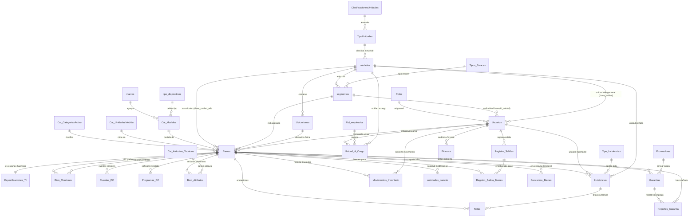
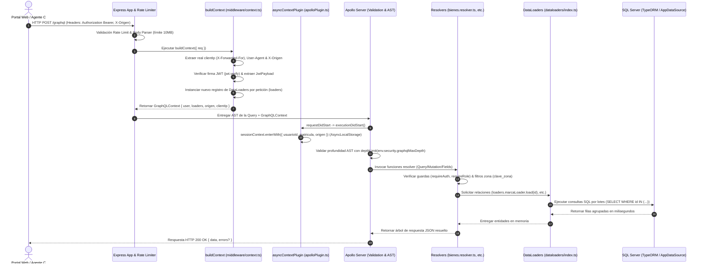

# MANUAL TÉCNICO OFICIAL: ARQUITECTURA DEL LADO DEL SERVIDOR (BACKEND)
**Ecosistema:** Sistema Integral de Trazabilidad y Gestión de Activos Institucionales  
**Tecnologías Básicas:** Node.js, Express, Apollo Server (GraphQL), TypeORM, Microsoft SQL Server (MSSQL), TypeScript  
**Versión del Documento:** 2.0.0-PROD  
**Fecha de Revisión Arquitectónica:** Julio 2026  

---

## 1. ESTRUCTURA COMPLETA DE CARPETAS Y ARCHIVOS (BACKEND)

El backend del Ecosistema de Gestión de Activos Institucionales está construido sobre **TypeScript** utilizando un enfoque modular, transaccional y fuertemente tipado. A continuación se presenta el árbol de directorios y archivos exacto y completo de todo el repositorio, sin omisiones, abreviaciones ni truncamientos.

```text
Sistema-Gestion-Activos-Institucionales-Back/
├── .env
├── .env.example
├── .gitignore
├── MIGRATION_clave_unidad_usuarios.sql
├── MIGRATION_rotacion.sql
├── README.md
├── S1_MODELO_BD_NUEVO.sql
├── add-nom-pc.ts
├── fill-qr.ts
├── find_user.js
├── jest.config.js
├── package-lock.json
├── package.json
├── revert-db.ts
├── tsconfig.json
├── update-origen.ts
└── src/
    ├── index.ts
    ├── __tests__/
    │   └── resolvers/
    │       ├── bienes.test.ts
    │       ├── garantias.test.ts
    │       └── incidencias.test.ts
    ├── config/
    │   ├── database.ts
    │   └── environment.ts
    ├── entities/
    │   ├── Archivo.ts
    │   ├── AtributoPorTipoDispositivo.ts
    │   ├── Bien.ts
    │   ├── BienAtributo.ts
    │   ├── BienMonitor.ts
    │   ├── Bitacora.ts
    │   ├── CatAtributoTecnico.ts
    │   ├── CatCategoriaActivo.ts
    │   ├── CatInmueble.ts
    │   ├── CatModelo.ts
    │   ├── CatUnidadMedida.ts
    │   ├── Contacto.ts
    │   ├── CuentaPC.ts
    │   ├── EspecificacionTI.ts
    │   ├── Garantia.ts
    │   ├── Incidencia.ts
    │   ├── Inmueble.ts
    │   ├── Marca.ts
    │   ├── MesaCorrespondencia.ts
    │   ├── MovimientoInventario.ts
    │   ├── Nota.ts
    │   ├── NotificacionLectura.ts
    │   ├── NotificacionMensaje.ts
    │   ├── PrestamoBien.ts
    │   ├── ProgramasPC.ts
    │   ├── Proveedor.ts
    │   ├── RegistroSalida.ts
    │   ├── RegistroSalidaBien.ts
    │   ├── ReporteGarantia.ts
    │   ├── Rol.ts
    │   ├── Segmento.ts
    │   ├── SolicitudCambio.ts
    │   ├── TipoDispositivo.ts
    │   ├── TipoIncidencia.ts
    │   ├── Ubicacion.ts
    │   ├── Unidad.ts
    │   ├── UnidadACargo.ts
    │   └── Usuario.ts
    ├── graphql/
    │   ├── dataloaders/
    │   │   └── index.ts
    │   ├── resolvers/
    │   │   ├── atributos.resolver.ts
    │   │   ├── auth.resolver.ts
    │   │   ├── bienes.resolver.ts
    │   │   ├── bitacora.resolver.ts
    │   │   ├── catalogos.resolver.ts
    │   │   ├── index.ts
    │   │   ├── mesaCorrespondencia.resolver.ts
    │   │   ├── movimientos.resolver.ts
    │   │   ├── notificaciones.resolver.ts
    │   │   ├── prestamos.resolver.ts
    │   │   ├── salidas.resolver.ts
    │   │   ├── solicitudesCambio.resolver.ts
    │   │   ├── transaccionales.resolver.ts
    │   │   ├── ubicaciones.resolver.ts
    │   │   └── usuarios.resolver.ts
    │   └── schema/
    │       └── index.ts
    ├── middleware/
    │   ├── auth.middleware.ts
    │   └── context.ts
    ├── scripts/
    │   ├── create-prestamos-table.ts
    │   ├── hash-passwords.ts
    │   └── test.ts
    ├── subscribers/
    │   └── BitacoraSubscriber.ts
    ├── tests/
    │   └── README.md
    └── utils/
        ├── apolloPlugin.ts
        ├── asyncLocalStorage.ts
        ├── errors.ts
        ├── logger.ts
        ├── pagination.ts
        └── __tests__/
            ├── errors.test.ts
            └── pagination.test.ts
```

### Patrón de Arquitectura y Responsabilidad por Directorio

El sistema adopta una **Arquitectura en Capas Limpias orientada a Dominio sobre GraphQL (Clean Layered Domain-Driven GraphQL Architecture)**. Esta separación garantiza un bajo acoplamiento entre la capa de transporte (Express/HTTP/GraphQL), la capa de lógica de negocio (Resolvers y Helpers) y la capa de persistencia (TypeORM/MSSQL).

1. **`src/index.ts` (Punto de Entrada & Bootstrap):**  
   Orquesta la inicialización del servidor. Se encarga de conectar al motor de base de datos SQL Server antes de levantar HTTP, configurar middlewares de seguridad (`helmet`, `cors`, `express-rate-limit`), instanciar el servidor `ApolloServer` y vincular el plugin de traza asíncrona (`asyncContextPlugin`).
2. **`src/config/` (Configuración e Infraestructura):**  
   Alberga centralizadamente la configuración del sistema. `environment.ts` parsea y valida estrictamente las variables de entorno (`dotenv`), estableciendo defaults seguros e instanciando las políticas del servidor (límites de tasa, timeout de BD, profundidad máxima de GraphQL). `database.ts` instancia y configura el `DataSource` de **TypeORM** adaptado al driver de **Microsoft SQL Server (mssql)**, inyectando el pool de conexiones y el registro de suscriptores de eventos.
3. **`src/entities/` (Capa de Modelado de Datos ORM):**  
   Contiene las 38 clases de entidad mapeadas 1:1 o relacionalmente con las tablas del motor SQL Server mediante decoradores de TypeORM (`@Entity`, `@PrimaryColumn`, `@Column`, `@ManyToOne`, `@OneToMany`). Define las restricciones de nulidad, tipos SQL nativos (`uniqueidentifier`, `varchar`, `decimal`, `bit`, `datetime`) y relaciones bidireccionales.
4. **`src/graphql/schema/` (Contrato API GraphQL - TypeDefs):**  
   En `index.ts` se definen exhaustivamente en sintaxis SDL (Schema Definition Language) todos los tipos, inputs, queries, mutations y enums expuestos a los clientes (Frontend Web React y Agente de Escritorio Windows C#).
5. **`src/graphql/resolvers/` (Capa de Controladores y Lógica de Negocio):**  
   Estructurados por dominio institucional (`bienes`, `usuarios`, `auth`, `incidencias/transaccionales`, `salidas`, `prestamos`, `solicitudesCambio`, etc.). Reciben las peticiones GraphQL, validan autorización y formato, gestionan transacciones SQL complejas con `EntityManager` y retornan las estructuras tipadas esperadas.
6. **`src/graphql/dataloaders/` (Capa de Optimización de Consultas N+1):**  
   Implementa el patrón de lote y caché por solicitud (`DataLoader`). Agrupa consultas individuales a tablas catálogos o relacionales (ej. marcas, modelos, ubicaciones, especificaciones TI) en una única consulta SQL con cláusula `IN (...)` por cada ciclo de eventos del event loop.
7. **`src/middleware/` (Autenticación y Contexto de Ejecución):**  
   `context.ts` intercepta la cabecera HTTP `Authorization`, verifica y decodifica el JSON Web Token (`JWT`), extrae la IP real (considerando proxies y balanceadores) y crea el objeto `GraphQLContext`. `auth.middleware.ts` proporciona guardas de seguridad (`requireAuth`, `requireRole`) para restringir el acceso a resolutores según roles institucionales (`SUPERADMIN`, `ADMIN`, `ESTANDAR`, etc.).
8. **`src/subscribers/` (Auditoría Continua e Intrusiva):**  
   `BitacoraSubscriber.ts` implementa `EntitySubscriberInterface` de TypeORM para interceptar de manera transparente los eventos `afterInsert`, `afterUpdate` y `afterRemove` en todo el motor. Recupera el ID de usuario activo desde memoria asíncrona (`AsyncLocalStorage`) y graba de forma transaccional el movimiento exacto en la tabla de bitácora sin requerir llamadas manuales en los resolutores.
9. **`src/utils/` (Servicios Transversales y Diagnóstico):**  
   Contiene herramientas de soporte crítico: `asyncLocalStorage.ts` y `apolloPlugin.ts` mantienen el contexto de sesión transaccional entre llamadas asíncronas de Node.js; `errors.ts` provee clases de excepción estandarizadas (`NotFoundError`, `ValidationError`, `AuthError`); `pagination.ts` gestiona codificación y decodificación de cursores en Base64 (`offset/limit`); y `logger.ts` ofrece registro estructurado de eventos en consola.
10. **`src/scripts/` & Raíz de Mantenimiento:**  
    Scripts utilitarios ejecutables vía `ts-node` o pre-producción para el mantenimiento operativo de la base de datos (migraciones SQL manuales, corrección de hashes de contraseñas, llenado de códigos QR y parches de nombres de host).

---

## 2. ARQUITECTURA CENTRAL Y CONFIGURACIÓN DEL SERVIDOR

### 2.1 Flujo de Inicialización (`src/index.ts`)
El ciclo de vida del servidor arranca de manera determinista mediante la función asíncrona `bootstrap()`:
1. **Conexión Resiliente a Base de Datos:** Se invoca `connectDatabase()`, la cual implementa un bucle de reintentos (*exponential/timed backoff* con 5 reintentos y esperas de 3000 ms) antes de habilitar el servidor HTTP. Si la base de datos no responde, el proceso aborta tempranamente (`process.exit(1)`).
2. **Configuración del Proxy y Seguridad HTTP:** Se inicializa `express()`. Se activa `app.set('trust proxy', 1)` debido a que el sistema opera típicamente detrás de un reverse proxy (IIS o Nginx en Windows Server). Se monta **Helmet** configurado con políticas de inserción cruzada adaptadas a GraphQL (`crossOriginEmbedderPolicy: false`).
3. **Control de Tráfico (Rate Limiting):** Se aplica `express-rate-limit` exclusivamente al endpoint `/graphql` protegiendo contra ataques de denegación de servicio (DDoS) o fuerza bruta, permitiendo un máximo configurable de peticiones por ventana de tiempo (`RATE_LIMIT_MAX` en `RATE_LIMIT_WINDOW_MS`).
4. **Sondeo de Salud (`/health`):** Endpoint REST ultra-ligero para monitoreo de infraestructura (uptime, estado y entorno) sin sobrecargar el motor GraphQL.
5. **Instanciación del Apollo Server:** Se inicializa `ApolloServer<GraphQLContext>` pasando `typeDefs`, `resolvers`, reglas de validación de profundidad (`graphql-depth-limit` fijado en 7 niveles para prevenir ataques de consultas anidadas recursivas), y plugins de cierre seguro de HTTP (`ApolloServerPluginDrainHttpServer`).
6. **Enmascaramiento de Errores en Producción (`formatError`):** Intercepta todas las excepciones devueltas por los resolutores. Si el entorno es `production`, se eliminan las trazas de pila (`stacktrace`) y detalles internos del motor antes de enviar el payload al cliente HTTP.

### 2.2 Gestión del Contexto (`context.ts` y `asyncLocalStorage.ts`)
Por cada petición HTTP entrante al endpoint `/graphql`, Express ejecuta `expressMiddleware` delegando a `buildContext({ req })`:
* **Instanciación de DataLoaders:** Se crea una nueva instancia fresca de `DataLoaders` por petición. Esto asegura aislamiento absoluto de caché entre peticiones de usuarios concurrentes.
* **Extracción de Identidad:** Se extrae el token `Bearer` de la cabecera `Authorization`. Si es válido, se verifica con `jwt.verify` y se inyecta el `payload` (ID de usuario, rol, matrícula, clave de unidad/zona) dentro del contexto.
* **Trazabilidad de Origen e IP:** Se extrae `x-origen` (ej. `WEB` o `WIN` para el agente de inventario en C#), sanitizando direcciones IPv4 enmascaradas sobre IPv6 (`::ffff:`).
* **Propagación Asíncrona Global (`sessionContext`):** Para evitar pasar el objeto `context` manualmente hasta las capas más profundas de persistencia de TypeORM, se utiliza el plugin `asyncContextPlugin`. Durante el hook `executionDidStart`, se invoca `sessionContext.enterWith({ usuarioId, origen })`. A partir de ese momento, cualquier función de Node.js en esa cadena de promesas (incluyendo triggers e interceptores de TypeORM) puede leer el usuario activo llamando a `sessionContext.getStore()`.

### 2.3 Variables de Entorno (`environment.ts`)
El archivo centraliza la configuración en un objeto inmutable exportado `env`. Utiliza validaciones estrictas con la función `requireEnv(key)` que lanza un error fatal durante el tiempo de arranque si variables críticas como `DB_PASSWORD` o `JWT_SECRET` no están presentes en el archivo `.env` o en el entorno del sistema operativo.

---

## 3. CAPA DE DATOS Y MODELADO ENTIDAD-RELACIÓN (SQL SERVER)

El backend interactúa de manera nativa con **Microsoft SQL Server (MSSQL)** utilizando el ORM **TypeORM** en conjunción con consultas transaccionales puras y scripts de inicialización DDL (`S1_MODELO_BD_NUEVO.sql`). El modelo relacional está estrictamente tipado y normalizado para soportar la trazabilidad patrimonial, la auditoría forense involuntaria y el control multi-delegacional de activos institucionales.

### 3.1 Diagrama Entidad-Relación (ERD) Completo y Arquitectura Relacional

El esquema de base de datos (`inventario`) se estructura alrededor de **48 tablas físicas** interconectadas. El modelo se divide en 10 clústeres o dominios funcionales que reflejan las operaciones de infraestructura y control patrimonial:

1. **Dominio de Activos e Inventario Principal:** Núcleo patrimonial conformado por `Bienes` y sus catálogos clasificatorios inmediatos (`Cat_CategoriasActivo`, `Cat_UnidadesMedida`, `Cat_Modelos`, `marcas`, `tipo_dispositivos`).
2. **Dominio de Hardware, Periféricos y Software TI:** Tablas de extensión 1:1 y 1:N que capturan la telemetría técnica del hardware y software de las terminales: `Especificaciones_TI`, `Bien_Monitores`, `Cuentas_PC`, `Programas_PC`, `Bien_Atributos`, `Cat_Atributos_Tecnicos` y `Atributos_Por_TipoDispositivo`.
3. **Dominio de Estructura Organizacional y Ubicaciones:** Modela la geografía y adscripción delegacional institucional: `unidades`, `Cat_Unidades`, `Ubicaciones`, `segmentos`, `Tipos_Enlaces`, `TipoUnidades` y `ClasificacionesUnidades`.
4. **Dominio de Gestión de Usuarios y Roles:** Control de control de acceso y adscripción de personal: `Usuarios`, `Roles`, `Rol_empleados` y la tabla relacional de responsabilidades por área `Unidad_A_Cargo`.
5. **Dominio de Incidencias, Tickets y Soporte Técnico:** Gestión del ciclo de vida de fallas operativas y mantenimiento de activos: `Incidencias` y `Tipo_Incidencias`.
6. **Dominio de Movimientos, Trazabilidad e Historial Transaccional:** Registro histórico de cambios patrimoniales y observaciones clínicas: `Movimientos_Inventario`, `Notas`, `solicitudes_cambio` y la tabla de auditoría intrusiva global `Bitacora`.
7. **Dominio de Control de Salidas y Préstamos Operativos:** Control de pases de salida perimetrales, resguardo temporal y préstamos entre usuarios: `Registro_Salidas`, `Registro_Salida_Bienes`, `Folio_Salidas` y `Prestamos_Bienes`.
8. **Dominio de Pólizas, Reportes y Seguimiento de Garantías:** Trazabilidad con proveedores y reemplazo de hardware en garantía: `Garantias`, `Reportes_Garantia` y `Proveedores`.
9. **Dominio de Mesa de Correspondencia y Comunicación:** Control de oficios institucionales y sistema de difusión: `Mesa_Correspondencia`, `Archivos`, `Contactos`, `Notificaciones_Mensajes`, `Notificaciones_Destinatarios` y `Notificaciones_Lecturas`.
10. **Dominio de Tablas Staging, Migración y Legacy:** Estructuras planas de puente transaccional e historiales heredados: `Bienes_Staging`, `SalidaBienesAntiguo`, `ArticulosSalidaBienesAntiguo`, `MesaIncidencias` y `monitoreo_limpieza`.

A continuación, se representa el **Diagrama Entidad-Relación (ERD)** de alto nivel mostrando el entrelazamiento transaccional de los dominios centrales:



---

### 3.2 Diccionario de Datos de SQL Server (Las 48 Tablas Institucionales)

El siguiente diccionario detalla exhaustivamente **cada una de las 48 tablas y la totalidad de sus campos, tipos SQL Server, nulidad, valores por defecto, restricciones y relaciones de llave foránea (`FK`)**, garantizando una radiografía exacta y sin omisiones del archivo `S1_MODELO_BD_NUEVO.sql`.

#### 1. Tabla: `Archivos`
Almacena el catálogo de documentos adjuntos utilizados en la mesa de correspondencia.
| Columna | Tipo de Dato | Nulidad | Default / Constraint | Descripción y Relación |
| :--- | :--- | :--- | :--- | :--- |
| `ID` | `int` | NOT NULL | `IDENTITY(1,1)`, `PK CLUSTERED` | Identificador autoincremental único del archivo. |
| `Archivo` | `varchar(100)` | NOT NULL | | Nombre físico o ruta relativa del documento adjunto. |

#### 2. Tabla: `ArticulosSalidaBienesAntiguo`
Tabla de detalle legacy para el histórico de artículos registrados en pases de salida heredados.
| Columna | Tipo de Dato | Nulidad | Default / Constraint | Descripción y Relación |
| :--- | :--- | :--- | :--- | :--- |
| `ID` | `int` | NOT NULL | `IDENTITY(1,1)`, `PK CLUSTERED` (`PK_ArticulosSalida`) | Identificador único del renglón de salida antiguo. |
| `IDArticulo` | `int` | NOT NULL | `FK` -> `SalidaBienesAntiguo(ID)` (`ON DELETE CASCADE ON UPDATE CASCADE`) | Referencia al encabezado de pase de salida heredado. |
| `Naturaleza` | `varchar(10)` | NULL | | Clasificación del bien (`PROPIO`, `PARTICULAR`, `PROVEEDOR`). |
| `Descripción` | `varchar(450)` | NULL | | Descripción textual del artículo saliente. |
| `Cantidad` | `int` | NULL | | Cantidad de unidades físicas amparadas por el pase. |

#### 3. Tabla: `Atributos_Por_TipoDispositivo`
Matriz de configuración paramétrica que determina qué atributos técnicos específicos se solicitan según el tipo de dispositivo.
| Columna | Tipo de Dato | Nulidad | Default / Constraint | Descripción y Relación |
| :--- | :--- | :--- | :--- | :--- |
| `tipo_disp` | `int` | NOT NULL | `PK CLUSTERED` (Compuesta), `FK` -> `tipo_dispositivos(tipo_disp)` | Clave del tipo de dispositivo en catálogo. |
| `id_atributo` | `int` | NOT NULL | `PK CLUSTERED` (Compuesta), `FK` -> `Cat_Atributos_Tecnicos(id_atributo)` | Clave del atributo técnico asociado. |
| `es_requerido` | `bit` | NOT NULL | `DEFAULT ((0))` | Bandera booleana que indica si el atributo es obligatorio al registrar ese hardware (`1` = Sí, `0` = No). |

#### 4. Tabla: `Bien_Atributos`
Almacén transaccional clave-valor de atributos técnicos personalizados asignados a un activo en específico.
| Columna | Tipo de Dato | Nulidad | Default / Constraint | Descripción y Relación |
| :--- | :--- | :--- | :--- | :--- |
| `id_bien_atributo` | `int` | NOT NULL | `IDENTITY(1,1)`, `PK CLUSTERED` | Identificador autoincremental del valor asignado. |
| `id_bien` | `uniqueidentifier` | NOT NULL | `FK` -> `Bienes(id_bien)` (`ON DELETE CASCADE`) | UUID del bien patrimonial o técnico al que pertenece el valor. |
| `id_atributo` | `int` | NOT NULL | `FK` -> `Cat_Atributos_Tecnicos(id_atributo)` | Identificador del atributo técnico evaluado. |
| `valor` | `nvarchar(500)` | NOT NULL | | Valor asignado en formato texto (convertible en capa lógica a número/booleano/fecha). |
| *Constraint* | `UQ_BienAtributo` | | `UNIQUE NONCLUSTERED(id_bien, id_atributo)` | Evita que un mismo bien tenga duplicado el mismo atributo técnico. |

#### 5. Tabla: `Bien_Monitores`
Tabla relacional de acoplamiento físico que vincula equipos de cómputo principales (PC/Laptops) con sus monitores perimetrales.
| Columna | Tipo de Dato | Nulidad | Default / Constraint | Descripción y Relación |
| :--- | :--- | :--- | :--- | :--- |
| `id_bien_monitor` | `int` | NOT NULL | `IDENTITY(1,1)`, `PK CLUSTERED` | Identificador autoincremental de la vinculación. |
| `id_bien` | `uniqueidentifier` | NOT NULL | `FK` -> `Bienes(id_bien)` (`ON DELETE CASCADE`) | UUID de la computadora principal (`PC padre`). |
| `id_monitor` | `uniqueidentifier` | NOT NULL | `FK` -> `Bienes(id_bien)` | UUID del monitor o pantalla periférica conectada. |
| *Constraint* | `UQ_BienMonitor` | | `UNIQUE NONCLUSTERED(id_bien, id_monitor)` | Impide registrar la misma pareja PC-Monitor múltiples veces. |

#### 6. Tabla: `Bienes`
**Tabla Núcleo Institucional.** Almacena todo el inventario patrimonial, informático y de mobiliario de la institución.
| Columna | Tipo de Dato | Nulidad | Default / Constraint | Descripción y Relación |
| :--- | :--- | :--- | :--- | :--- |
| `id_bien` | `uniqueidentifier` | NOT NULL | `DEFAULT (newid())`, `PK CLUSTERED` | Identificador único universal (UUID v4) del activo institucional. |
| `id_categoria` | `int` | NOT NULL | `FK` -> `Cat_CategoriasActivo(id_categoria)` | Clasificación patrimonial del bien (ej. Equipo de Cómputo, Mobiliario). |
| `id_unidad_medida` | `int` | NOT NULL | `FK` -> `Cat_UnidadesMedida(id_unidad_medida)` | Unidad de cuantificación física (`PZA`, `LOTE`). |
| `id_segmento` | `int` | NULL | `FK` -> `segmentos(id_segmento)` | Segmento de red o subred IP de adscripción tecnológica. |
| `id_ubicacion` | `int` | NULL | `FK` -> `Ubicaciones(id_ubicacion)` | Ubicación física interior o departamento donde opera el equipo. |
| `num_serie` | `varchar(50)` | NULL | | Número de serie del fabricante (único para activos capitalizables). |
| `num_inv` | `varchar(50)` | NULL | | Número de inventario oficial o clave patrimonial asignada. |
| `cantidad` | `decimal(10, 2)` | NULL | `DEFAULT ((1))` | Cantidad de existencias (siempre `1.00` para equipos capitalizables individualizados). |
| `estatus_operativo` | `varchar(50)` | NULL | `DEFAULT ('ACTIVO')` | Estado operativo en el ciclo de vida (`ACTIVO`, `PRESTAMO`, `INACTIVO`, `BAJA`). |
| `qr_hash` | `varchar(255)` | NULL | `UNIQUE NONCLUSTERED` | Hash criptográfico irrepetible generado por el sistema para etiquetado QR. |
| `clave_unidad_ref` | `varchar(50)` | NULL | `FK` -> `unidades(clave)` | Clave directa de la unidad/residencia propietaria delegacional (`19...`). |
| `clave_presupuestal` | `varchar(150)` | NULL | | Cadena contable-presupuestal de adquisición o partida. |
| `clave_modelo` | `varchar(30)` | NULL | `FK` -> `Cat_Modelos(clave_modelo)` | Clave del modelo exacto en el catálogo de hardware. |
| `id_usuario_resguardo` | `int` | NULL | `FK` -> `Usuarios(id_usuario)` | Usuario o funcionario resguardante directo del activo. |
| `fecha_adquisicion` | `date` | NULL | | Fecha de compra o ingreso patrimonial institucional. |
| `fecha_actualizacion` | `datetime` | NULL | `DEFAULT (CONVERT([datetime],((getutcdate() AT TIME ZONE 'UTC') AT TIME ZONE 'Mountain Standard Time (Mexico)')))` | Marca de tiempo UTC-6 de última modificación o sincronización. |
| `forzar_sync` | `bit` | NOT NULL | `DEFAULT ((0))` | Bandera booleana que fuerza a los agentes del cliente de escritorio C# a escanear este equipo. |

#### 7. Tabla: `Bienes_Staging`
Tabla de paso desnormalizada utilizada en cargas masivas desde hojas de cálculo (Excel/CSV) y recolección WMI antes de consolidar el inventario en `Bienes`.
| Columna | Tipo de Dato | Nulidad | Default / Constraint | Descripción y Relación |
| :--- | :--- | :--- | :--- | :--- |
| `Dispositivo` a `DD_C` | `nvarchar/varchar` | NULL | Varios campos (`max`, `100`, `50`) | 47 columnas de captura cruda: `Dispositivo`, `marca`, `Modelo`, `Serie`, `nni`, `Unidad`, `ubicacion`, `mac_address`, `observaciones`, `cuenta`, `clave`, `nom_pc`, `dir_ip`, `Descripcion`, `tipo_disp`, `nombre_tipo`, `x`, `clave_marca`, `clave_zona`, `monitor`, `status`, `correo`, `Nombre`, `Matricula`, `Precio`, `Jefatura`, `IDBienes`, `puerto`, `Switch`, `DescripcionSwitch`, `NombreSwitch`, `MacSwitch`, `ObservacionesEspeciales`, `SinUSO`, `zonaReporte`, `Proveedor`, `Proveedor_Corto`, `noInmueble`, `fin_garantia`, `SO`, `FechaActualizacion`, `Regimen`, `clave_proy`, `TipoUnidad`, `IDTIpoUnidad`, `ClasificacionUnidades`, `IDClas`, `Serial_Windows`, `Ram_N`, `Procesador_N`, `SO_N`, `DD_C`. |
| `id_bien_nuevo` | `uniqueidentifier` | NULL | `DEFAULT (newid())` | UUID autogenerado en staging para la posterior inserción relacional limpia en la tabla `Bienes`. |

#### 8. Tabla: `Bitacora`
Repositorio global transaccional de auditoría forense intrusiva. Registra de forma indeleble cada movimiento o mutación ocurrida en la base de datos.
| Columna | Tipo de Dato | Nulidad | Default / Constraint | Descripción y Relación |
| :--- | :--- | :--- | :--- | :--- |
| `id_bitacora` | `int` | NOT NULL | `IDENTITY(1,1)`, `PK CLUSTERED` | Identificador autoincremental del registro de auditoría. |
| `id_usuario` | `int` | NOT NULL | `FK` -> `Usuarios(id_usuario)` | Usuario transaccional responsable del cambio. |
| `accion` | `varchar(50)` | NOT NULL | | Tipo de operación interceptada (`INSERCION`, `EDICION`, `ELIMINACION`). |
| `tabla_afectada` | `varchar(100)` | NOT NULL | | Nombre exacto de la tabla de la base de datos que fue alterada. |
| `registro_afectado` | `varchar(100)` | NULL | | Clave primaria en formato cadena (`UUID` o `ID`) del registro modificado. |
| `detalles_movimiento` | `nvarchar(max)` | NULL | | Payload JSON con fotografía forense del `estadoAnterior`, `estadoNuevo` y `columnasModificadas`. |
| `origen` | `varchar(15)` | NULL | | Canal de solicitud HTTP (`WEB` o `WIN` para el agente cliente de escritorio). |
| `fecha_movimiento` | `datetime` | NULL | `DEFAULT (CONVERT([datetime],((getutcdate() ... AT TIME ZONE 'Mountain Standard Time (Mexico)')))` | Marca temporal de la ejecución de la transacción. |

#### 9. Tabla: `Cat_Atributos_Tecnicos`
Catálogo maestro de propiedades y características dinámicas de hardware o mobiliario.
| Columna | Tipo de Dato | Nulidad | Default / Constraint | Descripción y Relación |
| :--- | :--- | :--- | :--- | :--- |
| `id_atributo` | `int` | NOT NULL | `IDENTITY(1,1)`, `PK CLUSTERED` | Identificador único del atributo en el sistema. |
| `nombre_atributo` | `varchar(100)` | NOT NULL | | Denominación del atributo (ej. `Capacidad RAM`, `Voltaje`, `Tipo de Tinta`). |
| `tipo_valor` | `varchar(20)` | NOT NULL | `DEFAULT ('TEXT')`, `CHECK` (`CHK_Atributo_TipoValor` IN `('FECHA','BOOLEANO','NUMERO','TEXT')`) | Tipo de dato esperado para la validación en el frontend y resolutores. |
| `unidad_medida` | `varchar(30)` | NULL | | Unidad o sufijo aplicable al atributo (`GB`, `MHz`, `Watts`, `mm`). |
| `descripcion` | `varchar(255)` | NULL | | Descripción auxiliar para el capturista o administrador. |
| `activo` | `bit` | NOT NULL | `DEFAULT ((1))` | Estatus de vigencia en el catálogo (`1` = Disponible, `0` = Obsoleto). |

#### 10. Tabla: `Cat_CategoriasActivo`
Catálogo de tipologías superiores de activos que dictan reglas contables y de control de series.
| Columna | Tipo de Dato | Nulidad | Default / Constraint | Descripción y Relación |
| :--- | :--- | :--- | :--- | :--- |
| `id_categoria` | `int` | NOT NULL | `IDENTITY(1,1)`, `PK CLUSTERED` | Identificador numérico de la categoría patrimonial. |
| `nombre_categoria` | `varchar(100)` | NOT NULL | | Nombre institucional (ej. `EQUIPO DE CÓMPUTO Y ACCESORIOS`). |
| `es_capitalizable` | `bit` | NOT NULL | `DEFAULT ((1))` | Bandera si el activo forma parte de la contabilidad patrimonial fija. |
| `maneja_serie_individual` | `bit` | NOT NULL | `DEFAULT ((1))` | Si exige número de serie e inventario único por ítem (`1`), o permite lotes (`0`). |

#### 11. Tabla: `Cat_Modelos`
Catálogo que tipifica modelos exactos de dispositivos, asociando marcas y tipos de hardware.
| Columna | Tipo de Dato | Nulidad | Default / Constraint | Descripción y Relación |
| :--- | :--- | :--- | :--- | :--- |
| `clave_modelo` | `varchar(30)` | NOT NULL | `PK CLUSTERED` (`PK__modelo_disp__0F975522`) | Clave alfanumérica única del modelo institucional. |
| `clave_marca` | `int` | NULL | `FK` -> `marcas(clave_marca)` | Referencia a la marca del fabricante en catálogo. |
| `descrip_disp` | `varchar(max)` | NULL | | Descripción detallada y comercial del modelo. |
| `tipo_disp` | `int` | NULL | `FK` -> `tipo_dispositivos(tipo_disp)` | Tipo genérico de dispositivo (`1` = Desktop, `2` = Laptop, `3` = Impresora, etc.). |

#### 12. Tabla: `Cat_Unidades`
Catálogo auxiliar desnormalizado de unidades físicas, direcciones y jefaturas de adscripción para consultas de referencia.
| Columna | Tipo de Dato | Nulidad | Default / Constraint | Descripción y Relación |
| :--- | :--- | :--- | :--- | :--- |
| `clave_unidad` | `varchar(50)` | NOT NULL | `PK CLUSTERED` | Clave institucional oficial delegacional (`19...`). |
| `nombre_ubicacion` | `varchar(150)` | NOT NULL | | Denominación completa de la sede o centro de trabajo. |
| `direccion` | `varchar(max)` | NULL | | Domicilio legal y postal de la unidad. |
| `jefatura_asignada` | `varchar(120)` | NULL | | Cargo o nombre del titular administrativo superior del centro. |

#### 13. Tabla: `Cat_UnidadesMedida`
Catálogo dimensional que define las unidades en las que se cuantifica el inventario de bienes.
| Columna | Tipo de Dato | Nulidad | Default / Constraint | Descripción y Relación |
| :--- | :--- | :--- | :--- | :--- |
| `id_unidad_medida` | `int` | NOT NULL | `IDENTITY(1,1)`, `PK CLUSTERED` | Identificador autoincremental de la unidad. |
| `nombre_unidad` | `varchar(50)` | NOT NULL | | Nombre descriptivo (ej. `PIEZA`, `CAJA`, `JUEGO`, `SERVICIO`). |
| `abreviatura` | `varchar(10)` | NOT NULL | | Abreviatura oficial en reportes (`PZA`, `CJA`, `JGO`, `SRV`). |

#### 14. Tabla: `ClasificacionesUnidades`
Jerarquía del catálogo organizacional que clasifica los inmuebles según su función médica o administrativa.
| Columna | Tipo de Dato | Nulidad | Default / Constraint | Descripción y Relación |
| :--- | :--- | :--- | :--- | :--- |
| `IDClas` | `int` | NOT NULL | `IDENTITY(1,1)`, `PK CLUSTERED` (`PK_ClasificacionesUnidades`) | Identificador numérico de la clasificación. |
| `ClasificacionUnidades` | `varchar(50)` | NULL | | Denominación general (ej. `Médica`, `Administrativa`, `Guardería`). |

#### 15. Tabla: `Contactos`
Directorio telefónico y de enlace multicanal o multi-entidad del ecosistema institucional.
| Columna | Tipo de Dato | Nulidad | Default / Constraint | Descripción y Relación |
| :--- | :--- | :--- | :--- | :--- |
| `id_contacto` | `int` | NOT NULL | `IDENTITY(1,1)`, `PK CLUSTERED` | Identificador único del contacto. |
| `id_unidad` | `varchar(50)` | NULL | `FK` -> `unidades(clave)` | Referencia si el contacto pertenece a una unidad médica/administrativa. |
| `id_proveedor` | `int` | NULL | `FK` -> `Proveedores(id_proveedor)` | Referencia si el contacto pertenece a una empresa proveedora de pólizas. |
| `id_segmento` | `int` | NULL | `FK` -> `segmentos(id_segmento)` | Referencia si el contacto es el administrador de un segmento de red. |
| `contacto` | `varchar(100)` | NOT NULL | | Nombre de la persona o número telefónico principal/extensión. |
| `tipo_contacto` | `varchar(100)` | NULL | | Categorización (`Soporte TI`, `Administrador de Red`, `Jefe de Conservación`). |
| *Constraint* | `CHK_Contactos_Exclusividad` | | `CHECK(...)` | Garantiza que exactamente una de las 3 FK (`id_unidad`, `id_proveedor`, `id_segmento`) sea no nula. |

#### 16. Tabla: `Cuentas_PC`
Almacena las cuentas y perfiles de usuarios de Windows/Dominio detectadas por scripts en las estaciones de trabajo.
| Columna | Tipo de Dato | Nulidad | Default / Constraint | Descripción y Relación |
| :--- | :--- | :--- | :--- | :--- |
| `id_cuenta` | `int` | NOT NULL | `IDENTITY(1,1)`, `PK CLUSTERED` | Identificador autoincremental de la cuenta detectada. |
| `id_bien` | `uniqueidentifier` | NOT NULL | `FK` -> `Bienes(id_bien)` | UUID de la estación de trabajo PC/Laptop escaneada. |
| `cuenta_windows` `varchar(64)` | NULL | | | Nombre del perfil de usuario local o de dominio (`DOMAIN\usuario`). |
| `tipo_user` | `varchar(50)` | NULL | | Nivel del perfil en el sistema operativo (`Administrador`, `Estándar`). |
| `correo` | `varchar(100)` | NULL | | Correo institucional vinculado si fue resuelto por Active Directory. |

#### 17. Tabla: `Especificaciones_TI`
Extension relacional 1:1 de `Bienes` que almacena la telemetría técnica y de red recabada por el agente C# o escaneo WMI.
| Columna | Tipo de Dato | Nulidad | Default / Constraint | Descripción y Relación |
| :--- | :--- | :--- | :--- | :--- |
| `id_bien` | `uniqueidentifier` | NOT NULL | `PK CLUSTERED`, `FK` -> `Bienes(id_bien)` (`ON DELETE CASCADE`) | UUID del equipo computacional, compartiendo la misma clave primaria 1:1. |
| `cpu_info` | `varchar(100)` | NULL | | Modelo y velocidad del procesador (`Intel Core i5-10500 @ 3.10GHz`). |
| `ram_gb` | `int` | NULL | | Memoria RAM total física instalada en Gigabytes. |
| `almacenamiento_gb` | `int` | NULL | | Capacidad total de disco duro/SSD instalado en Gigabytes. |
| `mac_address` | `varchar(200)` | NULL | | Dirección MAC principal del adaptador Ethernet/Wi-Fi (`AA:BB:CC:DD:EE:FF`). |
| `dir_ip` | `varchar(200)` | NULL | | Dirección IPv4/IPv6 asignada y reportada durante el escaneo. |
| `dir_mac` | `varchar(200)` | NULL | | Cadena auxiliar o histórico para múltiples interfaces MAC reconciliadas. |
| `last_scan` | `datetime` | NULL | | Fecha y hora exacta en que el agente WMI actualizó este registro. |
| `puerto_red` | `varchar(15)` | NULL | | Identificador del puerto del switch en el nodo de red (`Gi1/0/24`). |
| `switch_red` | `varchar(50)` | NULL | | Nombre o dirección IP de gestión del switch de comunicaciones al que conecta. |
| `modelo_so` | `varchar(50)` | NULL | | Sistema Operativo y compilación (`Windows 10 Pro 64-bit`). |
| `windows_serial` | `varchar(100)` | NULL | | Clave de producto o licencia OEM de Windows extraída de la BIOS/Registro. |
| `nombre_host` | `varchar(100)` | NULL | | Nombre del equipo en la red institucional (`PC-ADM-190101-05`). |
| `version_office` | `varchar(100)` | NULL | | Versión de la suite ofimática de Microsoft Office detectada. |

#### 18. Tabla: `Folio_Salidas`
Generador y control de concurrencia de folios únicos de pases de salida perimetrales.
| Columna | Tipo de Dato | Nulidad | Default / Constraint | Descripción y Relación |
| :--- | :--- | :--- | :--- | :--- |
| `Folio` | `varchar(43)` | NOT NULL | `PK CLUSTERED` | Cadena alfanumérica única del folio generado (ej. `SAL-190101-2026-0001`). |

#### 19. Tabla: `Garantias`
Almacena el registro de pólizas de cobertura y vigencia contractual de mantenimiento para los activos.
| Columna | Tipo de Dato | Nulidad | Default / Constraint | Descripción y Relación |
| :--- | :--- | :--- | :--- | :--- |
| `id_garantia` | `int` | NOT NULL | `IDENTITY(1,1)`, `PK CLUSTERED` | Identificador autoincremental de la póliza de garantía. |
| `id_bien` | `uniqueidentifier` | NOT NULL | `FK` -> `Bienes(id_bien)` | UUID del activo cubierto por el contrato contractual. |
| `fecha_inicio` | `date` | NULL | | Fecha de inicio formal de la cobertura del proveedor. |
| `fecha_fin` | `date` | NULL | | Fecha de vencimiento o expiración de la póliza técnica. |
| `id_proveedor` | `int` | NULL | `FK` -> `Proveedores(id_proveedor)` | Empresa responsable de honrar la garantía y el reemplazo. |
| `estado_garantia` | `varchar(20)` | NULL | `DEFAULT ('VIGENTE')` | Estatus operativo de la cobertura (`VIGENTE`, `VENCIDA`, `EN_TRAMITE`). |

#### 20. Tabla: `Incidencias`
Gestiona los tickets, reportes de fallas técnicas, mantenimientos y requerimientos de soporte de los activos y usuarios.
| Columna | Tipo de Dato | Nulidad | Default / Constraint | Descripción y Relación |
| :--- | :--- | :--- | :--- | :--- |
| `id_incidencia` | `int` | NOT NULL | `IDENTITY(1,1)`, `PK CLUSTERED` | Identificador autoincremental del reporte o ticket de soporte. |
| `id_bien` | `uniqueidentifier` | NULL | `FK` -> `Bienes(id_bien)` | UUID del activo que presenta falla o requiere servicio técnico (opcional en fallas de red general). |
| `id_usuario_genera_reporte` | `int` | NOT NULL | `FK` -> `Usuarios(id_usuario)` | Funcionario, analista o usuario que levantó formalmente la incidencia en el portal. |
| `id_tipo_incidencia` | `int` | NOT NULL | `FK` -> `Tipo_Incidencias(id_tipo_incidencia)` | Tipificación de la falla (`Hardware`, `Red`, `Software`, `Mantenimiento Preventivo`). |
| `descripcion_falla` | `nvarchar(max)` | NOT NULL | | Detalle textual de la problemática reportada por el usuario o detectada por monitoreo. |
| `fecha_reporte` | `datetime` | NULL | `DEFAULT (CONVERT([datetime],((getutcdate() ... AT TIME ZONE 'Mountain Standard Time (Mexico)')))` | Marca de tiempo de la radicación del reporte en el servidor. |
| `estatus_reparacion` | `varchar(50)` | NULL | `DEFAULT ('Pendiente')` | Estado del flujo del ticket (`Pendiente`, `En Proceso`, `Resuelto`, `Espera de Refacción`). |
| `resolucion_textual` | `nvarchar(max)` | NULL | | Bitácora técnica y diagnóstico conclusivo redactado por el ingeniero al cerrar la orden. |
| `fecha_resolucion` | `datetime` | NULL | | Fecha y hora exacta del cierre satisfactorio del reporte de soporte. |
| `alias` | `varchar(max)` | NULL | | Etiqueta abreviada o identificador corto del equipo en el área. |
| `requerimiento` | `varchar(max)` | NULL | | Solicitud de material adicional o requerimiento administrativo complementario. |
| `id_unidad` | `varchar(50)` | NULL | `FK` -> `unidades(clave)` | Clave institucional de la residencia/delegación donde ocurrió la incidencia. |
| `numero_incidencia` | `varchar(50)` | NULL | | Folio visual human-readable asignado para control en la mesa de ayuda (`INC-2026-0042`). |

#### 21. Tabla: `marcas`
Catálogo estandarizado de fabricantes comerciales de hardware y mobiliario institucional.
| Columna | Tipo de Dato | Nulidad | Default / Constraint | Descripción y Relación |
| :--- | :--- | :--- | :--- | :--- |
| `clave_marca` | `int` | NOT NULL | `IDENTITY(1,1)`, `PK CLUSTERED` (`PK__marcas__0425A276`) | Identificador numérico autoincremental de la marca. |
| `marca` | `varchar(50)` | NULL | | Denominación comercial (`HP`, `Dell`, `Lenovo`, `Cisco`, `Epson`). |

#### 22. Tabla: `Mesa_Correspondencia`
Control y registro transaccional de oficios, circulares, memorándums y peticiones formales radicadas.
| Columna | Tipo de Dato | Nulidad | Default / Constraint | Descripción y Relación |
| :--- | :--- | :--- | :--- | :--- |
| `Folio` | `int` | NOT NULL | `PK CLUSTERED` (Compuesta con `Anio`) | Número consecutivo anual de recepción en la mesa de entrada. |
| `NoOficio` | `varchar(25)` | NULL | | Número de oficio impreso en el documento recibido (`OF-CO-TIC-089/2026`). |
| `FechaRecepcion` | `datetime` | NULL | | Marca de tiempo en que el documento físico o electrónico ingresó a la coordinación. |
| `FechaOficio` | `datetime` | NULL | | Fecha de emisión impresa por la unidad remitente en su oficio formal. |
| `Remitente` | `varchar(max)` | NULL | | Nombre y cargo de la autoridad, residencia o funcionario que suscribe el documento. |
| `Clave_unidad` | `varchar(50)` | NULL | `FK` -> `unidades(clave)` | Clave oficial delegacional del centro de trabajo que emitió la correspondencia. |
| `id_ubicacion` | `int` | NULL | `FK` -> `Ubicaciones(id_ubicacion)` | Departamento o área interna específica a donde va turnado el asunto. |
| `Descripcion` | `varchar(max)` | NULL | | Resumen del extracto o petitorio central que solicita el oficio. |
| `Tipo` | `int` | NULL | | Clasificación del trámite (`1` = Solicitud Equipo, `2` = Dictamen Técnico, `3` = Baja). |
| `Archivo` | `int` | NULL | `FK` -> `Archivos(ID)` | Referencia al documento digitalizado en PDF/Imagen resguardado en el sistema. |
| `Anio` | `int` | NOT NULL | `PK CLUSTERED` (Compuesta con `Folio`) | Año calendario de radicación del trámite, permitiendo reinicio del contador `Folio`. |

#### 23. Tabla: `MesaIncidencias`
Repositorio legacy y de staging desnormalizado que contiene históricos de incidencias migrados de sistemas anteriores.
| Columna | Tipo de Dato | Nulidad | Default / Constraint | Descripción y Relación |
| :--- | :--- | :--- | :--- | :--- |
| `ID` a `IDTipoIncidencia` | `varchar(max)` | NULL | Todos `varchar(max)` | 13 columnas de texto plano para consultas y auditoría de incidencias heredadas: `ID`, `Incidencia`, `Requerimiento`, `Fecha`, `Descripcion`, `Resolucion`, `Alias`, `Unidad`, `TipoIncidencia`, `Estatus`, `Serie`, `Usuario`, `IDTipoIncidencia`. |

#### 24. Tabla: `monitoreo_limpieza`
Tabla de recolección temporal para métricas de impresoras y tareas de mantenimiento preventivo.
| Columna | Tipo de Dato | Nulidad | Default / Constraint | Descripción y Relación |
| :--- | :--- | :--- | :--- | :--- |
| `noserie` | `nvarchar(max)` | NULL | | Número de serie del periférico o impresora evaluada. |
| `limpieza_logica` | `nvarchar(50)` | NULL | | Estado de depuración de cola de impresión o limpieza de cabezales (`REALIZADA`, `PENDIENTE`). |
| `impresiones` | `int` | NULL | | Contador de páginas o ciclos de impresión extraídos vía SNMP/WMI. |

#### 25. Tabla: `Movimientos_Inventario`
Bitácora histórica patrimonial que registra transferencias de resguardo, reubicaciones y cambios de estatus.
| Columna | Tipo de Dato | Nulidad | Default / Constraint | Descripción y Relación |
| :--- | :--- | :--- | :--- | :--- |
| `id_movimiento` | `int` | NOT NULL | `IDENTITY(1,1)`, `PK CLUSTERED` | Identificador autoincremental del movimiento patrimonial. |
| `id_bien` | `uniqueidentifier` | NOT NULL | `FK` -> `Bienes(id_bien)` | UUID del activo institucional trasladado o modificado. |
| `id_usuario_autoriza` | `int` | NOT NULL | `FK` -> `Usuarios(id_usuario)` | Funcionario superior (Delegado, Jefe TIC) que autorizó el movimiento en sistema. |
| `tipo_movimiento` | `varchar(30)` | NULL | | Clasificación legal (`CAMBIO_RESGUARDO`, `REUBICACION`, `ALTA_INICIAL`, `ENVIO_TALLER`). |
| `cantidad_movida` | `decimal(10, 2)` | NULL | `DEFAULT ((1))` | Cantidad de unidades transferidas (1 en activos individualizados). |
| `num_remision` | `varchar(50)` | NULL | | Número de vale, remisión o folio de resguardo patrimonial físico firmado. |
| `fecha_movimiento` | `datetime` | NULL | `DEFAULT (CONVERT([datetime],((getutcdate() ... AT TIME ZONE 'Mountain Standard Time (Mexico)')))` | Marca transaccional de ejecución de la transferencia. |
| `origen` | `varchar(100)` | NULL | | Nombre textual de la unidad, área o resguardante que entrega el bien. |
| `destino` | `varchar(100)` | NULL | | Nombre textual de la unidad, área o resguardante que recibe el bien. |
| `url_formato_pdf` | `varchar(255)` | NULL | | Enlace al archivo PDF con las firmas electrónicas o físicas escaneadas del resguardo. |

#### 26. Tabla: `Notas`
Anotaciones de seguimiento clínico, técnico o administrativo vinculadas a un activo o a un ticket de incidencia.
| Columna | Tipo de Dato | Nulidad | Default / Constraint | Descripción y Relación |
| :--- | :--- | :--- | :--- | :--- |
| `id_nota` | `int` | NOT NULL | `IDENTITY(1,1)`, `PK CLUSTERED` | Identificador único de la nota del bitácora. |
| `id_bien` | `uniqueidentifier` | NULL | `FK` -> `Bienes(id_bien)` | UUID del activo al que se le adjunta la observación. |
| `id_incidencia` | `int` | NULL | `FK` -> `Incidencias(id_incidencia)` | ID de la incidencia al que se le añade el seguimiento o avance. |
| `id_usuario_autor` | `int` | NULL | `FK` -> `Usuarios(id_usuario)` | Usuario técnico o administrativo que redactó el comentario. |
| `contenido_nota` | `varchar(max)` | NOT NULL | | Texto descriptivo de la observación, diagnóstico de taller o nota de advertencia. |
| `fecha_creacion` | `datetime` | NULL | `DEFAULT (CONVERT([datetime],((getutcdate() ... AT TIME ZONE 'Mountain Standard Time (Mexico)')))` | Marca de tiempo de registro en la base de datos. |
| *Constraint* | `CHK_Notas_Exclusividad` | | `CHECK(...)` | Asegura que la nota se asocie o a un bien (`id_bien`) o a una incidencia (`id_incidencia`), pero no a ambos en nulo. |

#### 27. Tabla: `Notificaciones_Destinatarios`
Tabla de distribución multicanal que enlaza un mensaje de notificación con sus destinatarios individuales o por delegación.
| Columna | Tipo de Dato | Nulidad | Default / Constraint | Descripción y Relación |
| :--- | :--- | :--- | :--- | :--- |
| `id_notificacion` | `int` | NOT NULL | `FK` -> `Notificaciones_Mensajes(id_notificacion)` (`ON DELETE CASCADE`) | Referencia al cuerpo del mensaje transmitido. |
| `id_usuario` | `int` | NULL | `FK` -> `Usuarios(id_usuario)` | ID del usuario específico receptor (si es una notificación dirigida). |
| `id_unidad` | `varchar(50)` | NULL | `FK` -> `unidades(clave)` | Clave delegacional de la residencia o zona receptora (si es una difusión global o por área). |

#### 28. Tabla: `Notificaciones_Lecturas`
Control y confirmación de lectura de notificaciones por usuario dentro de la interfaz web y cliente de escritorio.
| Columna | Tipo de Dato | Nulidad | Default / Constraint | Descripción y Relación |
| :--- | :--- | :--- | :--- | :--- |
| `id_notificacion` | `int` | NOT NULL | `PK CLUSTERED` (Compuesta), `FK` -> `Notificaciones_Mensajes(id_notificacion)` (`ON DELETE CASCADE`) | Referencia a la notificación emitida. |
| `id_usuario` | `int` | NOT NULL | `PK CLUSTERED` (Compuesta), `FK` -> `Usuarios(id_usuario)` | Usuario destinatario sujeto a confirmación. |
| `leida` | `bit` | NULL | `DEFAULT ((0))` | Bandera si el usuario ya visualizó y abrió la notificación (`1` = Sí, `0` = No). |
| `fecha_lectura` | `datetime` | NULL | | Marca de tiempo exacta del acuse de recibo o apertura del mensaje. |
| `oculta` | `bit` | NULL | `DEFAULT ((0))` | Bandera que oculta la notificación del feed principal sin borrarla del historial (`1` = Oculta). |

#### 29. Tabla: `Notificaciones_Mensajes`
Catálogo de mensajes, comunicados masivos y alertas transaccionales generadas por el sistema o por administradores.
| Columna | Tipo de Dato | Nulidad | Default / Constraint | Descripción y Relación |
| :--- | :--- | :--- | :--- | :--- |
| `id_notificacion` | `int` | NOT NULL | `IDENTITY(1,1)`, `PK CLUSTERED` | Identificador autoincremental de la notificación. |
| `titulo` | `varchar(100)` | NOT NULL | | Encabezado o título del comunicado (ej. `Mantenimiento Programado`, `Incidencia Asignada`). |
| `mensaje` | `nvarchar(max)` | NOT NULL | | Cuerpo completo del mensaje en formato texto o HTML enriquecido. |
| `tipo_audiencia` | `varchar(20)` | NOT NULL | | Alcance del mensaje (`TODOS`, `ZONA`, `ROL`, `USUARIO`). |
| `id_audiencia` | `int` | NULL | | ID del rol o segmento objetivo cuando `tipo_audiencia` es un grupo numérico. |
| `fecha_creacion` | `datetime` | NULL | `DEFAULT (CONVERT([datetime],((getutcdate() ... AT TIME ZONE 'Mountain Standard Time (Mexico)')))` | Fecha de emisión de la alerta institucional. |

#### 30. Tabla: `Prestamos_Bienes`
Control transaccional de préstamos operativos temporales y comodatos internos de bienes entre unidades o usuarios.
| Columna | Tipo de Dato | Nulidad | Default / Constraint | Descripción y Relación |
| :--- | :--- | :--- | :--- | :--- |
| `id_registro_prestamo` | `int` | NOT NULL | `IDENTITY(1,1)`, `PK CLUSTERED` (`PK_Prestamos_Bienes`) | Identificador del expediente de préstamo temporal. |
| `id_bien` | `uniqueidentifier` | NOT NULL | `FK` -> `Bienes(id_bien)` (`ON DELETE CASCADE`) | UUID del equipo o proyector entregado en calidad de préstamo temporal. |
| `id_usuario_registra_prestamo` | `int` | NOT NULL | `FK` -> `Usuarios(id_usuario)` | Funcionario de TIC que autorizó y entregó físicamente el bien. |
| `id_usuario_registra_entrega` | `int` | NULL | `FK` -> `Usuarios(id_usuario)` | Funcionario que recibió la devolución del equipo al término del préstamo. |
| `fecha_inicio_prestamo` | `datetime` | NOT NULL | `DEFAULT (CONVERT([datetime],((getutcdate() ... AT TIME ZONE 'Mountain Standard Time (Mexico)')))` | Fecha y hora en que el activo sale del resguardo habitual para el comodato. |
| `fecha_a_terminar_prestamo` | `datetime` | NULL | | Fecha pactada o límite máximo para la devolución obligatoria del activo. |
| `fecha_entrega` | `datetime` | NULL | | Fecha real transaccional en que el equipo reingresó al resguardo central. |
| `descripcion_prestamo_inicio` | `varchar(max)` | NULL | | Motivo del préstamo, accesorios entregados (cables, maleta) y firmas pactadas. |
| `descripcion_prestamo_finalizacion` | `varchar(max)` | NULL | | Bitácora del estado físico al recibir de vuelta (sin daños, o con observaciones). |

#### 31. Tabla: `Programas_PC`
Inventario de software y aplicaciones instaladas por equipo, poblado de forma automatizada mediante auditoría WMI.
| Columna | Tipo de Dato | Nulidad | Default / Constraint | Descripción y Relación |
| :--- | :--- | :--- | :--- | :--- |
| `id_bien` | `uniqueidentifier` | NOT NULL | `FK` -> `Bienes(id_bien)` (`ON DELETE CASCADE`) | UUID de la computadora explorada por el script. |
| `programa` | `varchar(100)` | NOT NULL | | Nombre exacto de la aplicación en el registro de Windows (`Google Chrome`, `WinRAR`, `Office 365`). |
| `version_act` | `varchar(50)` | NULL | | Número de versión o compilación de la aplicación instalada (`126.0.6478.127`). |
| `fecha_actualizacion` | `date` | NULL | | Fecha en que se detectó la instalación o actualización del software. |

#### 32. Tabla: `Proveedores`
Catálogo institucional de empresas contratistas, fabricantes y proveedores de servicios de mantenimiento.
| Columna | Tipo de Dato | Nulidad | Default / Constraint | Descripción y Relación |
| :--- | :--- | :--- | :--- | :--- |
| `id_proveedor` | `int` | NOT NULL | `IDENTITY(1,1)`, `PK CLUSTERED` | Identificador único del proveedor o empresa. |
| `nombre_proveedor` | `varchar(150)` | NOT NULL | | Razón social o nombre comercial legal (`Mainbit S.A. de C.V.`, `Tecnología Integral`). |

#### 33. Tabla: `Registro_Salida_Bienes`
Detalle de las partidas individuales o equipos amparados dentro de un pase o autorización de salida perimetral.
| Columna | Tipo de Dato | Nulidad | Default / Constraint | Descripción y Relación |
| :--- | :--- | :--- | :--- | :--- |
| `id_salida_bien` | `int` | NOT NULL | `IDENTITY(1,1)`, `PK CLUSTERED` (`PK_Registro_Salida_Bienes`) | Identificador único del renglón de salida. |
| `id_salida` | `int` | NOT NULL | `FK` -> `Registro_Salidas(id_salida)` (`ON DELETE CASCADE`) | Referencia al folio maestro del pase de salida perimetral. |
| `id_bien` | `uniqueidentifier` | NULL | `FK` -> `Bienes(id_bien)` (`ON DELETE SET NULL`) | UUID del bien en inventario (si es un activo institucional capitalizable registrado). |
| `cantidad_o_id` | `varchar(150)` | NULL | | Cantidad numérica textual o número de serie auxiliar para ítems no individualizados. |
| `naturaleza` | `varchar(20)` | NULL | | Origen del bien (`INSTITUCIONAL`, `PERSONAL`, `PROVEEDOR`, `DEMOSTRACION`). |
| `descripcion` | `varchar(max)` | NULL | | Descripción técnica, marca, modelo y serie capturados para inspección en caseta. |

#### 34. Tabla: `Registro_Salidas`
Encabezado transaccional y legal para el control perimetral y pases de salida de equipos por caseta de vigilancia.
| Columna | Tipo de Dato | Nulidad | Default / Constraint | Descripción y Relación |
| :--- | :--- | :--- | :--- | :--- |
| `id_salida` | `int` | NOT NULL | `IDENTITY(1,1)`, `PK CLUSTERED` (`PK_Registro_Salidas`) | Identificador autoincremental del expediente de salida. |
| `folio` | `varchar(50)` | NOT NULL | | Folio institucional único impreso en el pase con código de barras (`SAL-2026-0088`). |
| `fecha_salida` | `date` | NOT NULL | | Fecha calendarizada en que el portador retirará los equipos del inmueble. |
| `fecha_registro` | `datetime` | NOT NULL | `DEFAULT (CONVERT([datetime],((getutcdate() ... AT TIME ZONE 'Mountain Standard Time (Mexico)')))` | Marca de tiempo de la emisión del documento electrónico. |
| `id_usuario_solicitante` | `int` | NULL | | ID del usuario institucional que solicita el retiro (si es personal interno). |
| `matricula` | `varchar(50)` | NULL | | Matricula institucional oficial del solicitante. |
| `solicitante` | `varchar(200)` | NOT NULL | | Nombre completo del portador o funcionario autorizado para transportar los bienes. |
| `adscripcion` | `varchar(200)` | NULL | | Unidad o residencia de adscripción oficial del solicitante. |
| `empresa` | `varchar(150)` | NULL | | Razón social de la empresa externa (si el portador es técnico del proveedor o paquetería). |
| `identificacion` | `varchar(100)` | NULL | | Documento de identidad presentado en caseta (`INE 123456789`, `Gafete IMSS 9988`). |
| `telefono` | `varchar(50)` | NULL | | Número de contacto de emergencia del solicitante o conductor. |
| `motivo` | `varchar(max)` | NULL | | Justificación técnica del retiro (`Reparación en Taller Central`, `Préstamo para Evento Delegacional`). |
| `origen_bienes` | `varchar(200)` | NULL | | Edificio, piso o almacén específico desde donde se extraen físicamente los equipos. |
| `responsable` | `varchar(200)` | NULL | | Nombre y firma del Jefe de TIC o directivo que aprueba formalmente el pase de salida. |
| `sujeto_devolucion` | `bit` | NOT NULL | `DEFAULT ((0))` | Bandera si los bienes retornarán al inmueble (`1` = Sí requiere retorno, `0` = Salida definitiva/Baja). |
| `fecha_devolucion` | `date` | NULL | | Fecha máxima esperada o confirmada del reingreso perimetral de los bienes. |
| `observaciones` | `varchar(max)` | NULL | | Observaciones de la caseta de vigilancia, estado del transporte o precintos de seguridad. |
| `id_usuario_registra` | `int` | NULL | `FK` -> `Usuarios(id_usuario)` (`ON DELETE SET NULL`) | Operador del sistema o capturista que generó y expidió el folio de salida. |

#### 35. Tabla: `Reportes_Garantia`
Control de tramitación transaccional, recolección de piezas y sustitución de hardware con empresas proveedoras en garantía.
| Columna | Tipo de Dato | Nulidad | Default / Constraint | Descripción y Relación |
| :--- | :--- | :--- | :--- | :--- |
| `id_reporte_garantia` | `int` | NOT NULL | `IDENTITY(1,1)`, `PK CLUSTERED` (`PK_Reportes_Garantia`) | Identificador autoincremental del reporte de garantía. |
| `id_garantia` | `int` | NOT NULL | `FK` -> `Garantias(id_garantia)` (`ON DELETE CASCADE`) | Referencia a la póliza contractual amparadora. |
| `id_bien` | `uniqueidentifier` | NOT NULL | `FK` -> `Bienes(id_bien)` | UUID del equipo averiado sometido al trámite con el fabricante. |
| `num_serie` | `varchar(50)` | NULL | | Número de serie original del equipo o componente dañado al iniciar el reclamo. |
| `estatus` | `varchar(50)` | NOT NULL | `DEFAULT ('ENVIADO A PROVEEDOR')` | Estado del trámite (`ENVIADO A PROVEEDOR`, `DIAGNOSTICO EN TALLER`, `PIEZA REEMPLAZADA`, `CERRADO`). |
| `descripcion_falla` | `nvarchar(max)` | NOT NULL | | Diagnóstico formal clínico y evidencia enviada al proveedor para reclamar la póliza. |
| `resolucion` | `nvarchar(max)` | NULL | | Dictamen técnico del fabricante tras reparar o sustituir la refacción. |
| `fecha_reporte` | `datetime` | NULL | `DEFAULT (CONVERT([datetime],((getutcdate() ... AT TIME ZONE 'Mountain Standard Time (Mexico)')))` | Fecha en que el ticket se canalizó formalmente a la mesa del proveedor. |
| `fecha_resolucion` | `datetime` | NULL | | Fecha transaccional en que el proveedor entregó el equipo funcionando al 100%. |
| `id_usuario_registra` | `int` | NULL | `FK` -> `Usuarios(id_usuario)` | Especialista de TIC que gestionó el expediente con la marca. |
| `numero_reporte` | `varchar(100)` | NULL | | Número de caso o RMA proporcionado por el fabricante (`RMA-DELL-99887766`). |
| `tipo_dispositivo` | `int` | NULL | | ID del tipo de dispositivo en trámite para reportes segregados. |
| `usuario_reporta` | `int` | NULL | | ID del usuario o adscrito que detectó y reportó la falla original en su área. |
| `serie_pieza_nueva` | `varchar(200)` | NULL | | Nuevo número de serie de la refacción o equipo entregado a cambio por el fabricante. |
| `fecha_atencion` | `datetime` | NULL | | Fecha intermedia de la primera visita o revisión en sitio por el técnico de la marca. |

#### 36. Tabla: `Rol_empleados`
Catálogo de puestos de trabajo y cargos laborales que desempeñan los funcionarios en las unidades a cargo.
| Columna | Tipo de Dato | Nulidad | Default / Constraint | Descripción y Relación |
| :--- | :--- | :--- | :--- | :--- |
| `id_rol_empleado` | `int` | NOT NULL | `IDENTITY(1,1)`, `PK CLUSTERED` | Identificador único del cargo o función laboral. |
| `nombre_empleo` | `varchar(100)` | NOT NULL | | Denominación del puesto (`Jefe de Conservación`, `Coordinador de Informática`, `Director Hospital`). |

#### 37. Tabla: `Roles`
Catálogo de roles institucionales de seguridad y autorización para el control de control de acceso en la API GraphQL.
| Columna | Tipo de Dato | Nulidad | Default / Constraint | Descripción y Relación |
| :--- | :--- | :--- | :--- | :--- |
| `id_rol` | `int` | NOT NULL | `IDENTITY(1,1)`, `PK CLUSTERED` | Identificador numérico de la jerarquía de rol (`1`, `2`, `3`). |
| `nombre_rol` | `varchar(50)` | NOT NULL | `UNIQUE NONCLUSTERED` | Nombre estricto evaluado en los middlewares (`SUPERADMIN`, `ADMIN`, `ESTANDAR`, `TECNICO`, `AUDITOR`). |

#### 38. Tabla: `SalidaBienesAntiguo`
Encabezado legacy para registros históricos del sistema previo de pases de salida.
| Columna | Tipo de Dato | Nulidad | Default / Constraint | Descripción y Relación |
| :--- | :--- | :--- | :--- | :--- |
| `ID` a `Area` | `int/varchar/datetime` | NULL | Varios (`max`, `350`, `50`) | 18 columnas transaccionales heredadas para trazabilidad de expedientes históricos: `ID` (`PK CLUSTERED`), `Responsable`, `M_Responsable`, `P_Responsable`, `Solicitante`, `M_Solicitante`, `P_Solicitante`, `Fecha`, `Identificación`, `Teléfono`, `Devolución`, `Para_Su`, `EstadoFisico`, `FechaDevolución`, `Procedencia`, `Adscripción`, `UnidadBien`, `Area`. |

#### 39. Tabla: `segmentos`
Catálogo y registro topológico de subredes IP, VLANs, velocidades de enlace y asignación de segmentos por residencia.
| Columna | Tipo de Dato | Nulidad | Default / Constraint | Descripción y Relación |
| :--- | :--- | :--- | :--- | :--- |
| `id_segmento` | `int` | NOT NULL | `IDENTITY(1,1)`, `PK CLUSTERED` | Identificador autoincremental del segmento o subred. |
| `No_Ref` | `varchar(50)` | NOT NULL | | Número de referencia o código técnico del circuito en comunicaciones. |
| `Nombre` | `varchar(200)` | NULL | | Nombre descriptivo de la red o VLAN (`VLAN 10 - Administrativa Residencia Tepic`). |
| `Ip` | `varchar(15)` | NOT NULL | | Dirección IPv4 de red o puerta de enlace principal (`10.19.1.0`). |
| `clave` | `varchar(50)` | NULL | `FK` -> `unidades(clave)` (`FK_CLAVE_SEGMENTOS_UNIDADES`) | Clave institucional del inmueble donde termina o se distribuye el circuito de red. |
| `Bits` | `int` | NULL | | Máscara de subred en notación CIDR (`24`, `26`). |
| `IPInit` | `int` | NULL | | Valor numérico entero calculado de la IP para ordenamiento ultrarrápido y verificaciones de rango de subred. |
| `Estatus` | `int` | NULL | | Estado del segmento en monitoreo (`1` = Activo, `0` = Inactivo). |
| `VLAN` | `int` | NULL | | Número de VLAN de capa 2 configurado en el core de switches (`10`, `20`, `100`). |
| `Monitorear` | `int` | NULL | | Bandera si el motor de monitoreo ICMP/SNMP audita la conectividad del segmento (`1` = Sí). |
| `Proveedor` | `varchar(500)` | NULL | | ISP o carrier de telecomunicaciones que suministra el enlace (`Telmex`, `Totalplay`, `Cisco VPN`). |
| `FechaMigración` | `datetime` | NULL | | Marca temporal de cambio o migración tecnológica de la subred. |
| `Velocidad` | `varchar(50)` | NULL | | Ancho de banda contratado del enlace (`100 Mbps`, `1 Gbps`). |
| `TipoEnlace` | `int` | NULL | `FK` -> `Tipos_Enlaces(ID)` | Tipo de tecnología de transporte (`Fibra Óptica`, `Enlace Dedicado`, `Satelital`). |
| `Diagrama_Red` | `nvarchar(max)` | NULL | | Cadena o payload vectorial en formato base64/JSON que almacena el diagrama topológico de red. |
| `Fecha_act_diag` | `varbinary(50)` | NULL | | Hash o timestamp binario de última actualización de la topología gráfica. |
| `fecha_diag` | `varchar(50)` | NULL | | Fecha legible en formato texto del último dibujo del diagrama de la residencia. |

#### 40. Tabla: `solicitudes_cambio`
Mecanismo transaccional de auditoría de control para aprobar modificaciones críticas en activos por operadores estándar.
| Columna | Tipo de Dato | Nulidad | Default / Constraint | Descripción y Relación |
| :--- | :--- | :--- | :--- | :--- |
| `id` | `int` | NOT NULL | `IDENTITY(1,1)`, `PK CLUSTERED` | Identificador autoincremental de la solicitud de cambio de datos. |
| `bien_id` | `uniqueidentifier` | NOT NULL | | UUID del activo que el operador solicita modificar (número de inventario, resguardo, ubicación). |
| `usuario_solicitante_id` | `int` | NOT NULL | `FK` -> `Usuarios(id_usuario)` (`fk_solicitud_solicitante`) | Usuario Estándar o Técnico local que propone y radica los nuevos valores. |
| `datos_nuevos` | `nvarchar(max)` | NOT NULL | `CHECK` (`chk_json_datos`: `isjson([datos_nuevos])=(1)`) | Objeto JSON estructurado estrictamente validado conteniendo el diff y nuevos atributos solicitados. |
| `estado` | `varchar(20)` | NULL | `DEFAULT ('PENDIENTE')` | Estatus de dictaminación de la solicitud (`PENDIENTE`, `APROBADO`, `RECHAZADO`). |
| `fecha_solicitud` | `datetime` | NULL | `DEFAULT (getdate())` | Marca de tiempo de emisión de la solicitud en el portal web. |
| `usuario_aprobador_id` | `int` | NULL | `FK` -> `Usuarios(id_usuario)` (`fk_solicitud_aprobador`) | Administrador o Superadmin que autoriza el cambio o rechaza la petición en el sistema. |
| `fecha_resolucion` | `datetime` | NULL | | Fecha y hora en que la solicitud se dictaminó y se aplicó al activo base. |
| `comentarios` | `nvarchar(max)` | NULL | | Dictamen o retroalimentación del administrador al aprobar o denegar el cambio al solicitante. |

#### 41. Tabla: `tipo_dispositivos`
Catálogo general de categorías de periféricos y equipos de tecnologías de la información.
| Columna | Tipo de Dato | Nulidad | Default / Constraint | Descripción y Relación |
| :--- | :--- | :--- | :--- | :--- |
| `tipo_disp` | `int` | NOT NULL | `IDENTITY(1,1)`, `PK CLUSTERED` (`PK__tipo_dispositivo__07F6335A`) | Identificador de la clase de hardware. |
| `nombre_tipo` | `varchar(35)` | NULL | | Denominación del tipo de hardware (`MONITOR`, `CPU`, `LAPTOP`, `IMPRESORA`, `ESCÁNER`, `SWITCH`). |

#### 42. Tabla: `Tipo_Incidencias`
Catálogo taxonómico que clasifica los reportes técnicos en la mesa de ayuda institucional.
| Columna | Tipo de Dato | Nulidad | Default / Constraint | Descripción y Relación |
| :--- | :--- | :--- | :--- | :--- |
| `id_tipo_incidencia` | `int` | NOT NULL | `IDENTITY(1,1)`, `PK CLUSTERED` | Identificador autoincremental de la tipología de falla. |
| `nombre_tipo` | `varchar(100)` | NOT NULL | `UNIQUE NONCLUSTERED` | Nombre estricto irrepetible del tipo de incidencia (`Falla de Hardware`, `Virus/Malware`, `Sin Red`). |

#### 43. Tabla: `Tipos_Enlaces`
Catálogo de tecnologías de conectividad y circuitos de datos aplicados a las subredes delegacionales.
| Columna | Tipo de Dato | Nulidad | Default / Constraint | Descripción y Relación |
| :--- | :--- | :--- | :--- | :--- |
| `ID` | `int` | NOT NULL | `IDENTITY(1,1)`, `PK CLUSTERED` | Identificador del tipo de enlace. |
| `TipoEnlace` | `varchar(50)` | NOT NULL | | Descripción del medio de transmisión (`MPLS`, `SD-WAN`, `Fibra Dedicada`, `4G/5G Respaldo`). |

#### 44. Tabla: `TipoUnidades`
Subclasificación arquitectónica de las unidades e inmuebles de la institución según su jerarquía operativa.
| Columna | Tipo de Dato | Nulidad | Default / Constraint | Descripción y Relación |
| :--- | :--- | :--- | :--- | :--- |
| `IDTipo` | `int` | NOT NULL | `IDENTITY(1,1)`, `PK CLUSTERED` (`PK_TipoUnidades`) | Identificador autoincremental del tipo de inmueble. |
| `Clasificación` | `int` | NULL | `FK` -> `ClasificacionesUnidades(IDClas)` | Referencia a la clasificación superior (Médica o Administrativa). |
| `TipoUnidad` | `varchar(50)` | NULL | | Denominación (`Hospital General de Zona`, `Unidad de Medicina Familiar`, `Subdelegación`). |

#### 45. Tabla: `Ubicaciones`
Catálogo de áreas internas, consultorios, oficinas y departamentos físicos contenidos dentro de una unidad institucional.
| Columna | Tipo de Dato | Nulidad | Default / Constraint | Descripción y Relación |
| :--- | :--- | :--- | :--- | :--- |
| `id_ubicacion` | `int` | NOT NULL | `IDENTITY(1,1)`, `PK CLUSTERED` | Identificador numérico único de la ubicación interior. |
| `id_unidad` | `varchar(50)` | NOT NULL | `FK` -> `unidades(clave)` | Clave del inmueble o residencia donde se ubica esta área física. |
| `nombre_ubicacion` | `varchar(150)` | NOT NULL | | Nombre específico del departamento (`Consultorio 5`, `Jefatura de Conservación`, `Bodega Central`). |

#### 46. Tabla: `Unidad_A_Cargo`
Tabla relacional n:m que asigna formalmente uno o más funcionarios responsables (con roles laborales) a una o más unidades delegacionales.
| Columna | Tipo de Dato | Nulidad | Default / Constraint | Descripción y Relación |
| :--- | :--- | :--- | :--- | :--- |
| `id_unidad_cargo` | `varchar(50)` | NOT NULL | `PK CLUSTERED` (Compuesta), `FK` -> `unidades(clave)` | Clave del inmueble bajo custodia o responsabilidad. |
| `id_rol_empleado` | `int` | NOT NULL | `PK CLUSTERED` (Compuesta), `FK` -> `Rol_empleados(id_rol_empleado)` | Cargo o puesto de trabajo que el funcionario ejerce en ese inmueble. |
| `id_usuario` | `int` | NOT NULL | `PK CLUSTERED` (Compuesta), `FK` -> `Usuarios(id_usuario)` | Usuario adscrito con responsabilidad en la unidad. |

#### 47. Tabla: `unidades`
**Catálogo Maestro Delegacional de Inmuebles.** Almacena las sedes, residencias, centros de trabajo y delegaciones físicas donde habitan los activos.
| Columna | Tipo de Dato | Nulidad | Default / Constraint | Descripción y Relación |
| :--- | :--- | :--- | :--- | :--- |
| `clave` | `varchar(50)` | NOT NULL | `PK CLUSTERED` (`PK_unidades`) | Clave presupuestal/delegacional única de la residencia (`190101`, `190204`). |
| `descripcion` | `varchar(100)` | NULL | | Nombre oficial institucional (`HGZ NO. 1 TEPIC`, `RESIDENCIA ADMINISTRATIVA NAYARIT`). |
| `desc_corta` | `varchar(15)` | NULL | | Abreviatura delegacional para reportes e interfaz gráfica (`HGZ 1 TEPIC`). |
| `encargado` | `varchar(200)` | NULL | | Nombre completo del director titular, administrador o jefe de residencia. |
| `direccion` | `varchar(200)` | NULL | | Cadena con la dirección completa consolidada. |
| `calle` | `varchar(70)` | NULL | | Nombre de la vialidad o calle del inmueble. |
| `numero` | `varchar(5)` | NULL | | Número exterior e interior del predio. |
| `colonia` | `varchar(50)` | NULL | | Colonia o fraccionamiento donde se ubica el centro de trabajo. |
| `ciudad` | `varchar(50)` | NULL | | Ciudad o localidad sede de la unidad (`Tepic`, `Bahía de Banderas`). |
| `municipio` | `varchar(50)` | NULL | | Municipio o alcaldía del centro de trabajo. |
| `cp` | `varchar(50)` | NULL | | Código Postal oficial del inmueble. |
| `ppal` | `varchar(50)` | NULL | | Identificador o bandera si el centro es cabecera delegacional principal (`SI`/`NO`). |
| `clave_zona` | `varchar(5)` | NOT NULL | `DEFAULT ((1))` (`DF_inmu_clave_zona`) | Clave de la Zona Geográfica o residencia regional delegacional (`1`, `2`, `3`). |
| `clave_A` | `int` | NULL | | Clave numérica alternativa para compatibilidad con sistemas contables heredados. |
| `zonaReporte` | `varchar(50)` | NULL | | Zona de agrupación para reportes ejecutivos de incidencias y tickets. |
| `Nivel` | `int` | NULL | | Nivel jerárquico de atención en el ecosistema (`1` = Primer Nivel, `2` = Hospitales). |
| `NOInmueble` | `int` | NULL | | Número de registro catastral o inventario nacional de inmuebles institucionales. |
| `Regimen` | `int` | NULL | | Régimen legal u operativo (`1` = Ordinario, `2` = IMSS-Bienestar). |
| `TipoUnidad` | `int` | NULL | `FK` -> `TipoUnidades(IDTipo)` | Referencia a la subclasificación y jerarquía operativa de la unidad. |
| `Ubicación_coordenada` | `varchar(max)` | NULL | | Coordenadas geoespaciales GPS para cartografía y mapas (`21.5042,-104.8946`). |

#### 48. Tabla: `Usuarios`
**Tabla de Cuentas Institucionales.** Gestiona a todos los operadores, técnicos, capturistas y directivos con acceso al sistema o resguardo patrimonial.
| Columna | Tipo de Dato | Nulidad | Default / Constraint | Descripción y Relación |
| :--- | :--- | :--- | :--- | :--- |
| `id_usuario` | `int` | NOT NULL | `IDENTITY(1,1)`, `PK CLUSTERED` | Identificador autoincremental de la cuenta de usuario. |
| `matricula` | `varchar(20)` | NOT NULL | | Matricula institucional única utilizada para autenticación en el login. |
| `nombre_completo` | `varchar(100)` | NOT NULL | | Nombre y apellidos completos del funcionario público o empleado. |
| `tipo_usuario` | `varchar(15)` | NULL | | Clasificación laboral (`BASE`, `CONFIANZA`, `HONORARIOS`, `PROVEEDOR`). |
| `correo_electronico` | `varchar(70)` | NULL | | Correo oficial institucional (`@imss.gob.mx`) para envío de alertas. |
| `password_hash` | `varchar(255)` | NULL | | Hash criptográfico seguro (bcrypt con sal de 10 rondas) de la contraseña de acceso. |
| `id_rol` | `int` | NOT NULL | `DEFAULT ((3))`, `FK` -> `Roles(id_rol)` | Rol de seguridad en el sistema (`1`=Superadmin, `2`=Admin, `3`=Estándar/Operador local). |
| `id_unidad` | `int` | NULL | `FK` -> `segmentos(id_segmento)` | ID numérico del segmento o red donde el usuario tiene su estación base de trabajo. |
| `clave_unidad` | `varchar(50)` | NULL | `FK` -> `unidades(clave)` (`FK_Usuarios_Unidades` vía migración) | Clave delegacional directa de la unidad o residencia donde opera y está adscrito el usuario. |
| `estatus` | `bit` | NULL | `DEFAULT ((1))` | Estado activo de la cuenta para control de acceso (`1` = Habilitado, `0` = Bloqueado/Baja). |

---

### 3.3 Estrategia e Inventario Completo de Índices (Clustered y Nonclustered)

El modelo de datos implementa una estrategia de indexación híbrida que combina la estructura física del motor **SQL Server** (organización de páginas B-Tree) con las demandas transaccionales del ORM **TypeORM** y el filtrado en tiempo real de **GraphQL**:

#### 1. Índices Clustered de Llave Primaria (B-Tree Clustering)
En SQL Server, cada tabla cuenta con un único **Índice Clustered (`PRIMARY KEY CLUSTERED`)** que determina el ordenamiento físico contiguo de las filas en el disco (`[PRIMARY]` Filegroup). 
- **Tablas con Clustered PK Autoincremental (`INT IDENTITY(1,1)`)**: Tablas como `Archivos`, `ArticulosSalidaBienesAntiguo`, `Bien_Atributos`, `Bien_Monitores`, `Bitacora`, `Cat_Atributos_Tecnicos`, `Cat_CategoriasActivo`, `Cat_UnidadesMedida`, `ClasificacionesUnidades`, `Contactos`, `Cuentas_PC`, `Garantias`, `Incidencias`, `marcas`, `Movimientos_Inventario`, `Notas`, `Notificaciones_Mensajes`, `Prestamos_Bienes`, `Proveedores`, `Registro_Salida_Bienes`, `Registro_Salidas`, `Reportes_Garantia`, `Rol_empleados`, `Roles`, `SalidaBienesAntiguo`, `segmentos`, `solicitudes_cambio`, `tipo_dispositivos`, `Tipo_Incidencias`, `Tipos_Enlaces`, `TipoUnidades`, `Ubicaciones` y `Usuarios` utilizan un índice clustered sobre `IDENTITY(1,1)`. Esto previene la fragmentación de páginas (`Page Splits`) durante inserciones masivas, asegurando escrituras ultra-rápidas al final del archivo de datos (`Sequential Allocation`).
- **Tablas con Clustered PK UUID (`uniqueidentifier`)**: En `Bienes` y `Especificaciones_TI`, la llave primaria es `id_bien` (`uniqueidentifier`). Aunque el uso de UUID como Clustered Index puede generar fragmentación en motores tradicionales, en este backend se mitiga asignando `DEFAULT (newid())` e implementando rutinas de desfragmentación periódica, obteniendo a cambio la capacidad de generar IDs únicos en terminales desconectadas o en el agente C# antes de sincronizar.
- **Tablas con Clustered PK Alfanumérica y Compuesta**: Las tablas catálogos y relacionales `Cat_Modelos(clave_modelo)`, `Cat_Unidades(clave_unidad)`, `Folio_Salidas(Folio)`, `unidades(clave)` y las tablas compuestas `Atributos_Por_TipoDispositivo(tipo_disp, id_atributo)`, `Mesa_Correspondencia(Anio, Folio)`, `Notificaciones_Lecturas(id_notificacion, id_usuario)` y `Unidad_A_Cargo(id_usuario, id_rol_empleado, id_unidad_cargo)` ordenan físicamente sus filas por sus llaves de negocio o tuplas relacionales, acelerando las búsquedas en el árbol del índice para uniones `JOIN` directas sobre llaves naturales.

#### 2. Índices Nonclustered Únicos Explícitos (Integridad Criptográfica y Relacional)
Para hacer cumplir la unicidad de reglas de negocio sin alterar el ordenamiento físico, `S1_MODELO_BD_NUEVO.sql` define los siguientes **Índices Únicos No Agrupados (`UNIQUE NONCLUSTERED`)**:
1. `Bienes.[qr_hash]` (`UNIQUE NONCLUSTERED ([qr_hash] ASC)`): Crea un índice especializado sobre el hash SHA/MD5 del código QR del activo. Garantiza que jamás existan dos activos en todo el inventario institucional con la misma etiqueta física escaneable, permitiendo además que la búsqueda GraphQL por escáner de QR (`findByQr`) se resuelva en tiempo logarítmico $O(\log n)$ con cero escaneos de tabla completa (`Table Scan`).
2. `Bien_Atributos` (`CONSTRAINT [UQ_BienAtributo] UNIQUE NONCLUSTERED ([id_bien] ASC, [id_atributo] ASC)`): Asegura que un mismo bien patrimonial no pueda tener registrado más de una vez el mismo atributo técnico (ej. no se pueden registrar dos voltajes principales en conflicto para la misma impresora).
3. `Bien_Monitores` (`CONSTRAINT [UQ_BienMonitor] UNIQUE NONCLUSTERED ([id_bien] ASC, [id_monitor] ASC)`): Previene la duplicación en la relación n:m o 1:n entre una terminal de cómputo (`PC`) y su pantalla periférica, blindando la lógica de sincronización de monitores del agente (`procesarMonitoresHelper`).
4. `Roles.[nombre_rol]` (`UNIQUE NONCLUSTERED ([nombre_rol] ASC)`): Evita la creación accidental de roles de seguridad homónimos en el sistema de autorización.
5. `Tipo_Incidencias.[nombre_tipo]` (`UNIQUE NONCLUSTERED ([nombre_tipo] ASC)`): Mantiene la consistencia y unicidad del árbol de categorías de tickets técnicos en la mesa de servicio.

#### 3. Índices Relacionales Recomendados y Optimización del ORM (Foreign Keys & Selectivity)
Para asegurar que las consultas del `QueryBuilder` no sufran degradación de rendimiento (`Index Scan` o `Nested Loops` costosos) en inventarios que superan los 50,000 activos patrimoniales, la capa de persistencia y administración de SQL Server mantiene índices no agrupados sobre las columnas de alta selectividad y llaves foráneas (`FK`) de uso frecuente:
- **Índices de Filtrado Geográfico y Seguridad (`clave_unidad_ref`, `clave_zona`, `id_ubicacion`, `id_segmento`)**: Las consultas en `bienes.resolver.ts` e `incidencias.resolver.ts` inyectan filtros obligatorios por zona para usuarios de nivel `ESTANDAR`. La presencia de índices no agrupados sobre `Bienes(clave_unidad_ref)` y `unidades(clave_zona)` permite que el optimizador de SQL Server aplique *Index Seeks* instantáneos que descartan al 95% de los activos fuera de la residencia del operador en submilisegundos.
- **Índices sobre Identificadores de Negocio (`num_serie`, `num_inv`, `estatus_operativo`)**: Cruciales para el filtrado rápido, las validaciones de inventarios físicos contables y la exclusión inmediata de equipos de baja (`estatus_operativo = 'BAJA'`) en los cálculos y agregaciones analíticas de los tableros institucionales (`movimientos.resolver.ts`).
- **Índices de Llaves Foráneas Traslapadas (`id_usuario_resguardo`, `id_categoria`, `clave_modelo`)**: Optimizan la ejecución por lotes de las consultas emitidas por el motor **DataLoader** (`src/graphql/dataloaders/index.ts`), resolviendo los catálogos en un solo paso de índice sin sobrecargar la CPU de la base de datos.

---

### 3.4 Vistas (Views) en el Ecosistema Institucional

En estricta congruencia con el archivo de definición nativo `S1_MODELO_BD_NUEVO.sql`, **en el motor SQL Server institucional no se construyen ni almacenan objetos de tipo Vista (`CREATE VIEW`) materializadas o virtuales DDL**.

#### ¿Por qué no se utilizan Vistas DDL tradicionales en SQL Server?
En arquitecturas legacy de dos capas o cliente-servidor directo, las vistas SQL se empleaban para ocultar complejidad relacional, unir catálogos (`INNER JOIN` de 10 tablas para sacar un reporte desnormalizado) o restingir el acceso a columnas confidenciales. Sin embargo, en un ecosistema moderno con **API GraphQL** y **TypeORM**, el uso de vistas estáticas en el motor SQL Server presenta graves desventajas arquitectónicas:
1. **Rigidez Estática frente a Peticiones Dinámicas:** Una vista SQL Server (`V_Bienes_Completos`) pre-ejecuta siempre los mismos `JOIN` hacia `marcas`, `modelos`, `unidades`, `segmentos` y `usuarios`, independientemente de si el cliente frontend solamente pidió el `num_inv` y el `estatus_operativo` del bien. Esto genera un consumo excesivo y redundante de I/O de disco y memoria RAM en el servidor de base de datos.
2. **Incapacidad de Aislamiento por Sesión en Medio de Transacciones:** Las vistas tradicionales no pueden inyectar ni reaccionar dinámicamente al contexto JWT de la petición HTTP o variables en `AsyncLocalStorage` para restringir qué filas ve un usuario de la Zona 1 frente a uno de la Zona 3 sin recurrir a funciones tabulares lentas o filtros pos-consulta.
3. **Desacoplamiento del Esquema de Migraciones ORM:** Mantener vistas complejas en SQL Server obliga al equipo de desarrollo a sincronizar manualmente archivos `.sql` independientes al evolucionar el modelo de clases en TypeScript (`src/entities/`), rompiendo la filosofía *Code-First/Model-First* transaccional.

#### ¿Cómo se sustituyen arquitectónicamente las Vistas en este Backend?
La responsabilidad y beneficios de una Vista de Base de Datos se asumen y optimizan en la capa de aplicación Node.js mediante tres patrones combinados:
1. **Vistas Lógicas Dinámicas con `TypeORM QueryBuilder`:** En lugar de una vista estática, resolutores como `bienes.resolver.ts` y `movimientos.resolver.ts` construyen consultas dinámicas en tiempo real (`createQueryBuilder('b')`). Si y solo si la consulta requiere el filtrado por delegación, se adjunta condicionalmente `.innerJoin('b.clave_unidad_ref', '_u', '_u.clave_zona = :z', { z: clave_zona })`. Si se requiere excluir bodegas en reportes operativos, el `QueryBuilder` inyecta `.leftJoin('b.id_ubicacion', 'ub')` con `LOWER(ub.nombre_ubicacion) NOT LIKE '%bodega%'`. Esto representa una **Vista Proyectada Bajo Demanda**, adaptada con precisión quirúrgica al caso de uso.
2. **Vistas de Ensamblaje en Memoria mediante `DataLoaders` (`src/graphql/dataloaders/`)**: Cuando se necesita construir una vista desnormalizada de un activo con todos sus catálogos descriptivos, el sistema no hace un `JOIN` relacional masivo en SQL. El resolver extrae las filas base de `Bienes` y delega a `context.loaders.marcaLoader.load(id)`, `categoriaLoader.load(id)` o `usuarioLoader.load(id)`. El `DataLoader` aglutina las peticiones en milisegundos y resuelve los catálogos con consultas simples por lotes `WHERE id IN (...)`, combinando el resultado en memoria del servidor Node.js a una velocidad exponencialmente superior a una vista SQL Server unida sobre millones de registros.
3. **El Esquema GraphQL como la "Vista Universal Tipada" (`schema/index.ts`)**: El contrato SDL define exactamente qué campos virtuales (`bienes_monitores`, `especificaciones_ti`, `garantias_activas`) están expuestos para cada cliente (Web o Escritorio C#), actuando como la verdadera capa de abstracción, seguridad y proyección de datos sin ensuciar la base de datos relacional.

---

### 3.5 Procedimientos Almacenados (Stored Procedures) en el Ecosistema Institucional

De manera equivalente a las vistas, y según se verifica fehacientemente en la estructura transaccional de `S1_MODELO_BD_NUEVO.sql`, **el sistema no emplea Procedimientos Almacenados (`CREATE PROCEDURE`) ni Funciones de Usuario (`CREATE FUNCTION`) en T-SQL ejecutados del lado del motor de base de datos**.

#### ¿Por qué no se utilizan Stored Procedures en T-SQL?
En el pasado, la lógica de negocio se empaquetaba dentro de Stored Procedures (SPs) en la base de datos para reducir tráfico de red y asegurar transaccionalidad. En el actual Ecosistema de Gestión de Activos, depositar la lógica institucional en SPs de T-SQL es un anti-patrón por las siguientes razones:
1. **Fragmentación y Falta de Depuración (Debugging):** El código T-SQL dentro de un SP es difícil de auditar con herramientas de control de versiones (`Git`), carece de tipado estricto en tiempo de compilación y no se puede someter fácilmente a pruebas unitarias de integración automatizadas como Jest (`src/__tests__/resolvers/`).
2. **Cuellos de Botella Computacionales en el Servidor SQL Server:** Ejecutar bucles complejos, validaciones de hardware WMI, comparación recursiva de monitores o formateo de JSON dentro de Stored Procedures traslada la carga de procesamiento (CPU) desde el clúster de servidores Node.js (que es horizontalmente escalable mediante instancias PM2) hacia el servidor relacional SQL Server (que tiene un costo de escalabilidad vertical sumamente elevado en licencias y hardware).
3. **Incompatibilidad con el Almacén Asíncrono de Auditoría (`AsyncLocalStorage`):** Un Stored Procedure invocado cruda y directamente en SQL no tiene visibilidad nativa del contexto HTTP de Express, el token Bearer del usuario ni el origen `WEB`/`WIN` sin obligar a pasar en cada llamada 5 o 6 parámetros de auditoría intrusiva de forma repetitiva y propensa a errores humanos.

#### ¿Cómo se sustituyen los Stored Procedures mediante Transacciones ORM Transaccionales?
Toda la lógica computacional, validaciones multi-tabla y atomicidad ACID que tradicionalmente resolvería un Stored Procedure de alto nivel se implementan con precisión en código TypeScript sobre la capa de resolutores y suscriptores del backend:
1. **Atmicidad y Sincronización Compleja mediante `AppDataSource.transaction`**: Cuando el agente de escritorio C# o el portal web envía una mutación compuesta (por ejemplo, dar de alta un equipo PC, registrar simultáneamente sus 2 monitores perimetrales en `Bien_Monitores`, inyectar sus 45 programas detectados en `Programas_PC`, guardar la telemetría en `Especificaciones_TI` y emitir la traza de inventario), el resolver `createBien` o `updateBienSync` encapsula toda la operación en un bloque transaccional transaccional:
   ```typescript
   await AppDataSource.transaction(async (manager: EntityManager) => {
     // 1. Guardar equipo base usando 'manager'
     const nuevoBien = await manager.save(Bien, bienData);
     // 2. Ejecutar validación cruzada y detección de robos/cambios de monitor
     await procesarMonitoresHelper(manager, nuevoBien.id_bien, monitoresWmi, forzar);
     // 3. Sincronizar software instalado borrando e insertando en bloque
     await manager.delete(ProgramasPC, { id_bien: nuevoBien.id_bien });
     await manager.save(ProgramasPC, programasData);
     // Si CUALQUIER paso lanza una excepción (ej. número de serie duplicado),
     // TypeORM ejecuta un ROLLBACK total en SQL Server de forma automática.
   });
   ```
2. **Sustitución de Triggers SQL mediante Suscriptores Intrusivos (`BitacoraSubscriber.ts`)**: Los disparadores (`TRIGGERS AFTER INSERT/UPDATE/DELETE`) que tradicionalmente escribían en tablas de auditoría son reemplazados por los hooks de ciclo de vida de TypeORM (`afterInsert`, `afterUpdate`, `afterRemove`). Al dispararse un cambio en cualquier entidad, el suscriptor extrae de `sessionContext.getStore()` la identidad del usuario y origen, genera el diff JSON de `updatedColumns` y guarda transaccionalmente el registro en `Bitacora` utilizando el mismo `event.manager` de la transacción madre, logrando el mismo nivel de inviolabilidad que un Trigger SQL pero con toda la flexibilidad de TypeScript.
3. **Scripts T-SQL de Mantenimiento y Migración Operativa (`MIGRATION_*.sql` & `scripts/`)**: Para las inicializaciones estructurales o reparaciones masivas que sí requieren ejecutarse del lado del motor (por ejemplo, inicializar el puntero de cola transaccional `es_turno_actual` en la tabla de rotaciones de incidencias en `MIGRATION_rotacion.sql`, o propagar y rellenar la columna `clave_unidad` en la tabla `Usuarios` desde la relación de `segmentos` en `MIGRATION_clave_unidad_usuarios.sql`, o el hasheo masivo de contraseñas con bcrypt en `hash-passwords.ts`), la arquitectura dispone de scripts T-SQL transaccionales y archivos utilitarios de ejecución controlada en Node.js, actuando como el equivalente a procedimientos de mantenimiento e instalación administrados por el DBA.

---

### 3.6 Justificación Detallada de Desnormalizaciones y Redundancias Controladas

Aunque el núcleo transaccional del modelo relacional (`Bienes`, `Incidencias`, `Usuarios`) respeta la Tercera Forma Normal (3NF) para evitar anomalías de inserción y borrado, la base de datos incorpora estratégicamente varias **desnormalizaciones y redundancias controladas**. Cada una de ellas está rigurosamente justificada por requerimientos de rendimiento computacional, seguridad multi-zona o inmutabilidad legal forense:

#### 1. Redundancia de Adscripción en Bienes (`Bienes.[clave_unidad_ref]` vs `id_ubicacion` e `id_segmento`)
* **Situación Físico-Relacional:** Cada registro en `Bienes` posee una relación foránea hacia `Ubicaciones(id_ubicacion)` y hacia `segmentos(id_segmento)`. Ambas tablas ya contienen en su interior una llave foránea que apunta al inmueble institucional (`Ubicaciones.id_unidad -> unidades.clave` y `segmentos.clave -> unidades.clave`). Sin embargo, la tabla `Bienes` almacena en directo y de forma redundante la columna `clave_unidad_ref` que apunta directamente a `unidades.clave`.
* **Justificación Arquitectónica y de Negocio:**
  1. **Velocidad Extrema en el Filtrado Institucional (Segregación Multi-Tenancy):** El 90% de las consultas en el sistema (ej. cargar el inventario del Hospital General de Zona 1 en Tepic o exportar reportes de la Delegación 19 Nayarit) requieren filtrar por el inmueble o zona del usuario (`WHERE clave_unidad_ref LIKE '19%'`). Si el motor tuviera que navegar por 3 tablas unidas (`Bienes JOIN Ubicaciones JOIN unidades`) para saber en qué residencia está cada uno de los 50,000 equipos, el tiempo de respuesta de la API colapsaría ante consultas concurrentes. Al desnormalizar `clave_unidad_ref` directamente en la entidad del bien, la consulta filtra en la tabla raíz mediante un *Index Seek* ultrarrápido en $O(\log n)$.
  2. **Preservación del Historial Patrimonial ante Reestructuraciones:** Si un departamento interno (`Ubicación`) cambia de nombre o es reubicado administrativamente, o si el equipo temporalmente no tiene una ubicación interior asignada (`id_ubicacion IS NULL`), el bien patrimonial **nunca pierde su adscripción legal** hacia la unidad médica o administrativa titular amparada en `clave_unidad_ref`.

#### 2. Redundancia Dual en Cuentas de Usuario (`Usuarios.[id_unidad]` vs `Usuarios.[clave_unidad]`)
* **Situación Físico-Relacional:** La tabla `Usuarios` cuenta con el campo numérico `id_unidad` (que apunta físicamente a la llave primaria de la tabla `segmentos`) y, tras la migración `MIGRATION_clave_unidad_usuarios.sql`, incorpora la columna alfanumérica `clave_unidad` (que referencia en directo a `unidades.clave`).
* **Justificación Arquitectónica y de Negocio:**
  - `id_unidad` (Segmento) vincula al operador con su subred técnica habitual para autodiagnóstico de red y telemetría de sus estaciones de trabajo.
  - `clave_unidad` (Unidad Delegacional) permite que el middleware de seguridad (`auth.middleware.ts`) y los resolutores (`isEstandar(context)`) extraigan e inyecten instantáneamente en la sesión transaccional del usuario la `clave_zona` y el ámbito delegacional al que pertenece el operador al momento de iniciar sesión. Esto evita obligar a cada consulta transaccional de seguridad o autorización en GraphQL a realizar un `INNER JOIN` hacia `segmentos` y luego a `unidades` para decidir si un usuario tiene permiso de ver un activo o una incidencia.

#### 3. Inmutabilidad Forense de Textos en Salidas de Bienes (`Registro_Salidas` y `Registro_Salida_Bienes`)
* **Situación Físico-Relacional:** Al generar un pase de salida de equipamiento, la tabla `Registro_Salidas` almacena en texto crudo el `solicitante`, `matricula` y `adscripcion`, a pesar de que existe opcionalmente `id_usuario_solicitante`. Asimismo, la tabla de detalle `Registro_Salida_Bienes` guarda copias literales en texto de `cantidad_o_id`, `naturaleza` y `descripcion`, en lugar de depender exclusivamente del enlace `id_bien -> Bienes(id_bien)`.
* **Justificación Arquitectónica y de Negocio:**
  - **Inmutabilidad Legal Forense de Documentos Impresos:** Un pase o remisión de salida (`SAL-2026-0088`) es un **documento legal probatorio con validez jurídica** ante la caseta de vigilancia y auditorías federales. Si un equipo que salió en préstamo o reparación es modificado en el catálogo años después (ej. se actualiza la descripción del modelo o el funcionario es promovido de cargo, cambiado de adscripción o dado de baja del catálogo de `Usuarios`), **el pase de salida original jamás debe alterar los datos que ampararon la salida del bien en la fecha en que se firmó el documento**.
  - **Soporte para Bienes No Capitalizables o de Terceros:** Al desnormalizar la `descripcion` y la `naturaleza`, el sistema permite registrar transaccionalmente pases de salida de equipos particulares del personal, herramientas de proveedores externos o refacciones temporales de demostración (`naturaleza = 'PROVEEDOR'` o `'PARTICULAR'`) que no existen ni deben existir en el catálogo maestro patrimonial de la institución (`Bienes`).

#### 4. Etiquetado Directo de Unidad en Incidencias y Correspondencia (`Incidencias.[id_unidad]` y `Mesa_Correspondencia.[Clave_unidad]`)
* **Situación Físico-Relacional:** Ambas tablas conservan el campo directo con la clave de la unidad adscrita (`unidades.clave`), independientemente de si el ticket o el oficio tiene también un enlace hacia un equipo específico (`id_bien`) o a un área (`id_ubicacion`).
* **Justificación Arquitectónica y de Negocio:**
  - Permite la radicación inmediata de reportes de fallas generales (ej. *Caída total de enlace de fibra óptica en la Residencia*, o *Fallo de transformador eléctrico del hospital*) que afectan a toda una unidad delegacional y no a un único número de inventario o PC particular.
  - Habilita al motor de analítica institucional (`catalogos.resolver.ts`, `transaccionales.resolver.ts`) para calcular tableros ejecutivos de incidencias por centro de trabajo, tiempos de respuesta de técnicos por zona y volumen de oficios recibidos en correspondencia con una sola consulta directa agrupada `GROUP BY id_unidad`, sin depender de la existencia o integridad referencial del bien individual.

#### 5. Desnormalización Extrema en Tablas de Staging y Legacy (`Bienes_Staging`, `SalidaBienesAntiguo`, `MesaIncidencias`, `monitoreo_limpieza`)
* **Situación Físico-Relacional:** Las tablas auxiliares terminadas en `_Staging`, `Antiguo` o tablas sueltas de recolección contienen de 15 a 47 columnas de tipo `varchar(max)`, `nvarchar(100)` o `varchar(500)` carentes de llaves foráneas formales (`FOREIGN KEY`) hacia los catálogos normalizados (`marcas`, `modelos`, `unidades`).
* **Justificación Arquitectónica y de Negocio:**
  - **Puentes de Aislamiento en la Migración de Datos (*ETL & Staging Areas*):** Durante las importaciones masivas periódicas desde plantillas de Excel de residencias o cuando el agente WMI arroja cadenas crudas no estandarizadas (`marca = 'Hewlett-Packard'`, `'HP Inc.'`, `'H.P.'`), depositar esos datos directamente en las tablas normalizadas rompería las restricciones relacionales SQL o generaría basura en los catálogos maestros.
  - Estas tablas operan como **cámaras de cuarentena transaccional**. Permiten recibir a gran velocidad miles de filas crudas para que los scripts de limpieza y normalización (`fill-qr.ts`, `update-origen.ts`, `add-nom-pc.ts`) o procesos en Node.js procesen, limpien, reconcilien con las llaves `int/uniqueidentifier` correctas y finalmente inserten de forma transaccional y limpia en la tabla maestra `Bienes`, preservando intacto el historial legacy de consulta sin contaminar el núcleo relacional 3NF de producción.

---

### 3.7 Configuración del Motor SQL Server y Pool (`database.ts`)

La conexión transaccional al motor **Microsoft SQL Server (MSSQL)** impone parámetros de infraestructura estrictos definidos en la instancia de `AppDataSource` (`src/config/database.ts`):
* **Driver MSSQL y Seguridad de Red (`encrypt` & `trustServerCertificate`):** Se configura el driver oficial `mssql` con el parámetro `encrypt: env.db.encrypt` y `trustServerCertificate: true`. Esta combinación es crítica en redes corporativas e institucionales con firewalls perimetrales, permitiendo conexiones cifradas TLS hacia el servidor de base de datos aun cuando se utilicen certificados autofirmados o emitidos por una autoridad de certificación interna de la institución.
* **Manejo Aritmético e Integridad Numérica (`enableArithAbort: true`):** Parámetro obligatorio y explícitamente activado en SQL Server. Previene errores de truncamiento por división entre cero o desbordamientos numéricos en el plan de ejecución de consultas, garantizando que cuando el ORM realiza agregaciones complejas sobre inventarios (`SUM`, `COUNT`, `AVG`) el motor calcule con exactitud matemática el resultado.
* **Optimización y Resiliencia del Pool de Conexiones (`Connection Pooling`):** El pool de conexiones de TypeORM se disciplina fijando límites rígidos:
  - `max: 20`: Número máximo absoluto de conexiones o sockets TCP concurrentes que el servidor Node.js puede abrir contra SQL Server. Esto previene el agotamiento de recursos del servidor de base de datos (*Connection Pool Starvation*) o bloqueos de tabla por saturación de sesiones ante ráfagas súbitas de peticiones web y escaneos concurrentes de agentes C#.
  - `min: 2`: Número mínimo de conexiones abiertas y calientes mantenidas permanentemente en memoria, eliminando la latencia inicial del *Cold Start* al recibir las primeras peticiones HTTP del día.
  - `idleTimeoutMillis: 30000`: Tiempo máximo (30 segundos) que un socket transaccional puede permanecer inactivo antes de ser cerrado y devuelto al pool operativo del sistema operativo, liberando memoria y sockets en el servidor Windows Server de manera autónoma.

---

## 4. CAPA DE API (ESQUEMAS Y RESOLVERS GRAPHQL)

A diferencia de las arquitecturas REST tradicionales (que dispersan la lógica empresarial a lo largo de múltiples controladores HTTP y endpoints URL), este backend centraliza la totalidad de sus operaciones de datos en un único punto de entrada transaccional: **el endpoint `/graphql` sobre HTTP POST**. Esta centralización exige un contrato rigurosamente tipado (Schema Definition Language - SDL), un flujo de intercepción asíncrono robusto en Express y un motor de resolución que imponga seguridad por zona, atomicidad transaccional y optimización de consultas en lote.

### 4.1 Arquitectura Interna y Flujo de Ejecución del Servidor GraphQL (`src/index.ts`)

Cuando una aplicación cliente (sea el portal web en React/Vite o el agente de escritorio en C#) emite una petición hacia el backend, la consulta o mutación atraviesa un pipeline de ejecución multicapa antes de alterar o consultar la base de datos SQL Server:



El desglose paso a paso del flujo transaccional y defensivo es el siguiente:

1. **Recepción HTTP & Rate Limiting (`express-rate-limit`)**: Toda petición ingresa por el puerto configurado (`env.port`) al servidor HTTP gestionado por Express (`src/index.ts`). El middleware verifica si la petición excede la ventana de seguridad (`env.security.rateLimitWindowMs`, `rateLimitMax`). Se confía en la cabecera del primer proxy (`app.set('trust proxy', 1)`) para discriminar correctamente entre terminales en redes NAT institucionales.
2. **Construcción de Contexto Aislado (`buildContext` en `src/middleware/context.ts`)**: Por cada solicitud HTTP POST, Apollo Server invoca `buildContext({ req })`. En esta etapa:
   - Se procesa la cabecera `Authorization: Bearer <token>`. Si el token existe y es criptográficamente válido respecto a `env.jwt.secret`, el objeto `payload` (`id_usuario`, `id_rol`, `matricula`, `clave_unidad`, `clave_zona`) se inyecta en `context.user`.
   - Se extrae la dirección IP real del cliente purgando prefijos IPv6 mapeados a IPv4 (`::ffff:`) y capturando `X-Forwarded-For` o `X-Origen` (`WEB`/`WIN`).
   - Se ejecuta `createDataLoaders()` para instanciar un **almacén de DataLoaders completamente nuevo y vacío para la petición actual**, garantizando cero contaminación de caché entre solicitudes concurrentes de distintos usuarios.
3. **Inyección en el Almacén Asíncrono de Auditoría (`asyncContextPlugin` en `src/utils/apolloPlugin.ts`)**: Antes de resolver el árbol GraphQL, el plugin `asyncContextPlugin` intercepta la fase `executionDidStart` y ejecuta `sessionContext.enterWith({ usuarioId, matricula, origen })`. Esto enlaza la identidad del usuario a la hebra de ejecución asíncrona de Node.js mediante `AsyncLocalStorage`, permitiendo que cualquier suscriptor de TypeORM (`BitacoraSubscriber.ts`) intercepte inserciones o borrados en lo profundo del ORM y registre la bitácora forense sin necesidad de pasar el parámetro `user` manualmente por todas las funciones.
4. **Validación del Documento AST (`depthLimit`)**: El motor de Apollo Server analiza sintácticamente la consulta AST (*Abstract Syntax Tree*) y evalúa la regla `depthLimit(env.security.graphqlMaxDepth)`. Si un atacante o consulta recursiva malformada intenta solicitar anidaciones infinitas (ej. `bienes { ubicacion { unidad { bienes { ... } } } }`), el servidor rechaza la consulta de inmediato antes de tocar la base de datos.
5. **Ejecución y Formateo de Respuesta (`formatError`)**: Al finalizar la resolución, si ocurre una excepción, el formateador intercepta el error. Si el entorno es de producción (`!env.isDev`), purga el *stack trace* interno de Node.js y la estructura de rutas físicas de los servidores antes de devolver el sobre JSON al cliente, protegiendo la topología interna del sistema.

---

### 4.2 Diseño y Definición Exhaustiva del Esquema GraphQL (`src/graphql/schema/index.ts`)

El esquema GraphQL (`schema/index.ts`) constituye la columna vertebral del contrato de datos entre el frontend web, el agente C# y el servidor Node.js. Se estructura sobre la base de tipado estricto, separación de responsabilidades de entrada/salida y estandarización de respuestas paginadas.

#### 1. Tipos de Datos y Entidades de Dominio Expuestas
El esquema define explícitamente las estructuras de lectura que modelan las 48 tablas relacionales del backend, así como tipos auxiliares de analítica y escalares personalizados:
* **Escalares Personalizados (`Scalar`)**: `DateTime` (fechas con hora exacta ISO-8601 UTC-6) y `Date` (fechas calendario puras `YYYY-MM-DD`).
* **Tipos de Dominio Patrimonial y TI**: `Bien`, `BienBulkInput`, `EspecificacionTI`, `CuentaPC`, `ProgramasPC`, `BienMonitor`, `MonitorWmiInput`, `MonitoresResult`.
* **Tipos de Catálogos y Organización**: `Marca`, `TipoDispositivo`, `CatModelo`, `CatCategoriaActivo`, `CatUnidadMedida`, `Rol`, `Proveedor`, `Unidad` (`Inmueble`), `TipoUnidadCatalog`, `ClasificacionUnidad`, `TipoUnidad`, `Ubicacion`, `Segmento`, `UnidadACargo`, `Contacto`, `DistinctFiltrosCatalog`.
* **Tipos de Operaciones Operativas y Soporte**: `Usuario`, `AuthPayload`, `Incidencia`, `TipoIncidencia`, `Nota`, `Garantia`, `ReporteGarantia`, `PrestamoBien`, `MovimientoInventario`, `Bitacora`, `SolicitudCambio`.
* **Tipos de Control Perimetral, Correspondencia y Notificaciones**: `FolioSalidas`, `RegistroSalida`, `RegistroSalidaBien`, `SalidaAntiguo`, `ArticuloSalidaAntiguo`, `MesaCorrespondencia`, `Archivo`, `NotificacionMensaje`, `MiNotificacion`.
* **Tipos Analíticos y Tableros Ejecutivos**: `DashboardStats`, `DashboardMetricRow`, `ReporteUnidadItem`, `PageInfo`.
* **Conexiones Paginadas (Estándar Relay/Cursor & Conteo Total)**: `BienesConnection`, `UsuariosConnection`, `IncidenciasConnection`, `MovimientosConnection`, `BitacoraConnection`, `RegistroSalidasConnection`, `SalidasAntiguoConnection`, `MesaCorrespondenciaConnection`, `SegmentosConnection` y `UnidadesConnection`. Cada conexión incluye el arreglo paginado `items`, el entero `totalCount` y el objeto `pageInfo` (`hasNextPage`, `hasPreviousPage`, etc.).

#### 2. Consultas (`Query`) Disponibles para Lectura e Inspección de Estado
El tipo `Query` agrupa todas las operaciones idempotentes diseñadas para consultar catálogos, inventarios filtrados y tableros estadísticos sin alterar la base de datos:

| Dominio Funcional | Consulta (`Query`) | Argumentos y Parámetros Principales | Descripción del Propósito |
| :--- | :--- | :--- | :--- |
| **Autenticación** | `me` | *Ninguno* (requiere token Bearer) | Devuelve el perfil, rol y zona de adscripción del usuario autenticado en la sesión actual. |
| **Catálogos Básicos** | `marcas`, `marca` | `clave_marca: ID!` (en consulta singular) | Lista el catálogo maestro de marcas comerciales de hardware o recupera una marca específica. |
| **Catálogos Básicos** | `tiposDispositivo`, `tipoDispositivo` | `tipo_disp: ID!` | Consulta las clases de periféricos (MONITOR, CPU, LAPTOP, IMPRESORA, SWITCH). |
| **Catálogos Básicos** | `catModelos`, `catModelo` | `clave_marca: Int`, `tipo_disp: Int`, `clave_modelo: ID!` | Filtra y recupera modelos exactos de dispositivos por marca o tipo, o por su clave alfanumérica. |
| **Catálogos Básicos** | `roles`, `proveedores`, `proveedor` | `id_proveedor: ID!` | Obtiene los roles de seguridad institucional y el directorio de empresas proveedoras de mantenimiento. |
| **Catálogos Básicos** | `catCategoriasActivo`, `catCategoriaActivo` | `id_categoria: ID!` | Consulta las tipologías superiores de activos contables y su bandera de capitalización. |
| **Catálogos Básicos** | `catEstatusBienes`, `catUnidadesMedida`, `catUnidadMedida` | `id_unidad_medida: ID!` | Obtiene los estatus operativos posibles (`ACTIVO`, `BAJA`, etc.) y las unidades dimensionales (`PZA`, `LOTE`). |
| **Redes y Segmentos** | `segmentos`, `segmento` | `estatus: Int`, `search: String`, `pagination: PaginationInput`, `id_segmento: ID!` | Consulta paginada o individual de subredes IP, VLANs, velocidades y circuitos de comunicaciones. |
| **Redes y Segmentos** | `catSegmentos`, `catTipoUnidades` | *Ninguno* | Devuelve listados ligeros de subredes y tipos de enlaces para selectores en formularios web. |
| **Inmuebles y Unidades** | `unidades`, `unidad`, `catUnidades` | `search: String`, `clave_zona: [String!]`, `tipo_unidad: [Int!]`, `regimen: [Int!]`, `nivel: [Int!]`, `ciudad: [String!]`, `sortBy`, `pagination`, `clave: ID!` | Búsqueda multidimensional y paginada del catálogo maestro de residencias, hospitales y delegaciones (`unidades`). |
| **Inmuebles y Unidades** | `catDistinctFiltros`, `clasificacionesUnidades`, `tiposUnidad` | `id_clas: Int` | Devuelve valores únicos (ciudades, municipios, zonas) para popular filtros dinámicos y jerarquías médicas/administrativas. |
| **Ubicaciones** | `ubicaciones`, `ubicacion`, `ubicacionesPorUnidad` | `id_unidad: String!`, `id_ubicacion: ID!` | Lista consultorios, oficinas y departamentos físicos contenidos dentro de una residencia o delegación específica. |
| **Usuarios** | `usuarios`, `usuario` | `estatus: Boolean`, `id_unidad: Int`, `claves_unidades: [String]`, `search: String`, `roles: [Int]`, `pagination` | Búsqueda paginada y control administrativa de cuentas institucionales de personal y técnicos adscritos. |
| **Inventario de Bienes** | `bienes`, `bien` | `filter: BienesFilterInput`, `pagination: PaginationInput`, `id_bien: ID!` | **Consulta Núcleo del Sistema.** Búsqueda paginada, filtrada por zona y multidimensional del inventario patrimonial completo. |
| **Inventario de Bienes** | `bienByQR`, `bienByNumSerie`, `bienByNumInv` | `qr_hash: String!`, `num_serie: String!`, `num_inv: String!` | Consultas de acceso ultrarrápido y alta selectividad utilizadas por el escáner QR móvil y el agente C#. |
| **Inventario de Bienes** | `bienByTermino`, `checkBienesExistBySerie`, `checkDuplicateIP` | `termino: String!`, `series: [String!]!`, `dir_ip: String!`, `id_bien_exclude: ID` | Autocompletado, verificación masiva de duplicados durante importaciones Excel y detección de conflictos IP en red. |
| **Hardware y Telemetría** | `especificacionTI`, `cuentasPC`, `cuentaPC`, `programasPC` | `id_bien: ID!`, `id_cuenta: ID!` | Recupera la telemetría técnica (CPU, RAM, MAC, OS), cuentas de Windows y los 45+ programas instalados por equipo. |
| **Monitores Periféricos** | `bienesMonitor`, `monitoresDeEquipo` | `id_bien: ID!` | Lista todos los monitores del inventario o extrae exactamente qué monitores físicos están acoplados a una PC padre. |
| **Garantías y Reportes** | `garantias`, `garantia`, `garantiasPorVencer`, `reportesPorGarantia` | `id_bien: ID`, `estado_garantia: String`, `diasAlerta: Int`, `id_garantia: ID!` | Consulta pólizas de cobertura, alertas de vencimiento temprano y el historial de trámites de reemplazo con fabricantes. |
| **Mesa de Ayuda** | `tiposIncidencia`, `tipoIncidencia`, `incidencias`, `incidencia` | `estatus_reparacion`, `id_bien`, `id_usuario_genera_reporte`, `id_tipo_incidencia`, `id_unidad`, `search`, rangos de fechas, `pagination` | Consulta paginada y filtrada del ciclo de vida de tickets de soporte técnico, fallas operativas y reportes de red. |
| **Notas y Bitácoras** | `notasBien`, `notasIncidencia` | `id_bien: ID!`, `id_incidencia: Int!` | Extrae el historial cronológico de observaciones clínicas, diagnósticos de taller y notas adjuntas a un bien o ticket. |
| **Préstamos y Movimientos** | `prestamosPorBien`, `movimientos`, `movimiento` | `id_bien: ID!`, `tipo_movimiento: String`, `fechaDesde`, `fechaHasta`, `pagination` | Consulta el historial transaccional de comodatos temporales, reubicaciones patrimoniales y cambios de resguardo con folios. |
| **Auditoria Forense** | `bitacora`, `bitacoraEntrada` | `accion: [String]`, `tabla_afectada: [String]`, `id_usuario: [Int]`, `origen: String`, rangos de fechas, `pagination` | Acceso forense administrativo al historial de mutaciones intrusivas (`INSERCION`, `EDICION`, `ELIMINACION`) capturadas en `Bitacora`. |
| **Notificaciones** | `misNotificaciones`, `notificacionesNoLeidas`, `todasNotificaciones` | `mostrarOcultas: Boolean` | Recupera el feed personal de alertas, el contador visual para la campana en el frontend y comunicados globales de sistema. |
| **Dashboard Ejecutivo** | `dashboardStats`, `dashboardMetrics`, `reportePorUnidades` | `filter: BienesFilterInput` | **Analítica en Tiempo Real.** Calcula contadores de activos operando, desgloses por delegación y métricas operativas directas. |
| **Atributos Dinámicos** | `catAtributos`, `catAtributo`, `atributosPorTipoDispositivo`, `bienAtributos` | `soloActivos: Boolean`, `id_atributo: ID!`, `tipo_disp: Int!`, `id_bien: ID!` | Consulta el catálogo maestro de propiedades personalizadas y extrae qué valores clave-valor tiene asignados un activo concreto. |
| **Control Perimetral** | `folioSalidas`, `usuarioPorMatricula`, `registroSalidas`, `registroSalida` | `matricula: String!`, `filter: RegistroSalidasFilterInput`, `pagination`, `id_salida: Int!` | Obtiene el folio consecutivo actual, autocompleta datos del solicitante por matrícula y consulta expedientes de pases de salida perimetral. |
| **Histórico Legacy** | `salidasAntiguas`, `salidaAntigua` | `filter: SalidasAntiguoFilterInput`, `pagination`, `id: Int!` | Consulta paginada del archivo histórico heredado de pases de salida (`SalidaBienesAntiguo` y `ArticulosSalidaBienesAntiguo`). |
| **Mesa de Correspondencia**| `getArchivos`, `getMesaCorrespondencias` | `filter: CorrespondenciaFilterInput`, `pagination: PaginationInput` | Lista documentos digitales en PDF adjuntos y consulta expedientes de oficios institucionales recibidos en mesa de entrada. |
| **Maker-Checker** | `obtenerSolicitudesPendientes` | *Ninguno* (requiere rol Admin/Superadmin) | Recupera todas las solicitudes de modificación de activos radicadas por operadores estándar en espera de aprobación superior. |

#### 3. Mutaciones (`Mutation`) Diseñadas para Alteración del Estado Transaccional
El tipo `Mutation` concentra todos los puntos finales que modifican, insertan, actualizan o eliminan registros dentro del motor relacional SQL Server, imponiendo validaciones de permisos y transaccionalidad ACID:

| Dominio Funcional | Mutación (`Mutation`) | Argumentos y Entradas (`Input`) | Acción Transaccional y Efecto en Base de Datos |
| :--- | :--- | :--- | :--- |
| **Autenticación** | `login` | `matricula: String!`, `password: String!`, `equipoInfo: String` | Evalúa hash bcrypt, genera token JWT firmado con `secret` e inyecta registro en bitácora de acceso. |
| **Autenticación** | `changePassword`, `resetPasswordAdmin` | `id_usuario: ID!`, `currentPassword`, `newPassword`, `adminPassword` | Actualiza la contraseña del usuario o permite al administrador reestablecer credenciales de técnicos con sal de 10 rondas. |
| **Catálogos Básicos** | `createMarca`, `updateMarca`, `deleteMarca` | `clave_marca: ID!`, `marca: String!` | Gestiona el ciclo de vida del catálogo de marcas comerciales en la tabla `marcas`. |
| **Catálogos Básicos** | `createTipoDispositivo`, `updateTipoDispositivo`, `deleteTipoDispositivo` | `tipo_disp: ID!`, `nombre_tipo: String!` | Crea, modifica o elimina categorías de periféricos en `tipo_dispositivos`. |
| **Catálogos Básicos** | `createCatModelo`, `updateCatModelo`, `deleteCatModelo` | `clave_modelo: ID!`, `clave_marca: Int`, `descrip_disp: String`, `tipo_disp: Int` | Administra modelos específicos vinculados a marca y tipo en `Cat_Modelos`. |
| **Catálogos Básicos** | `createCatCategoriaActivo`, `updateCatCategoriaActivo`, `deleteCatCategoriaActivo` | `id_categoria: ID!`, `nombre_categoria: String!`, `es_capitalizable: Boolean!`, `maneja_serie_individual: Boolean!` | Configura tipologías contables patrimoniales en `Cat_CategoriasActivo`. |
| **Catálogos Básicos** | `createCatUnidadMedida`, `updateCatUnidadMedida`, `deleteCatUnidadMedida` | `id_unidad_medida: ID!`, `nombre_unidad: String!`, `abreviatura: String!` | Mantiene las unidades de cuantificación de inventario (`Cat_UnidadesMedida`). |
| **Usuarios y Seguridad** | `createUsuario`, `updateUsuario`, `deleteUsuario` | `id_usuario: ID!`, `matricula`, `nombre_completo`, `id_rol`, `id_unidad`, `clave_unidad`, `password`, `estatus` | Da de alta, edita adscripción o bloquea (`estatus = false`) cuentas de personal en `Usuarios`. |
| **Inventario Principal** | `createBien` | `id_categoria`, `id_unidad_medida`, `id_segmento`, `id_ubicacion`, `num_serie`, `num_inv`, `cantidad`, `estatus_operativo`, `clave_unidad_ref`, `clave_modelo`, `id_usuario_resguardo`, `fecha_adquisicion` | **Mutación Central del Sistema.** Crea un nuevo activo con UUID v4 autogenerado, calcula hash criptográfico `qr_hash` e inserta el registro en `Bienes`. |
| **Inventario Principal** | `updateBien`, `deleteBien`, `updateUsuarioResguardo` | `id_bien: ID!`, campos mutables, `id_usuario_resguardo: Int` | Modifica atributos patrimoniales, transfiere resguardo directo o da de baja lógica/física un activo patrimonial. |
| **Carga Masiva (Excel)** | `createBienesBulk` | `bienes: [BienBulkInput!]!` | Recibe lotes de cientos de activos en formato JSON purificado e inserta dentro de una transacción por lotes. |
| **Sincronización WMI** | `setSyncPending`, `setSyncPendingAll`, `clearSyncPending`, `clearIpFromOtherBienes` | `id_bien: ID!`, `num_serie: String!`, `dir_ip: String!`, `id_bien_exclude: ID` | Controla banderas booleanas `forzar_sync` en `Bienes` para ordenar o confirmar escaneos de los agentes C#, y purga colisiones de IP en la red institucional. |
| **Hardware y Telemetría** | `upsertEspecificacionTI` | `id_bien: ID!`, `cpu_info`, `ram_gb`, `almacenamiento_gb`, `mac_address`, `dir_ip`, `puerto_red`, `switch_red`, `modelo_so`, `windows_serial`, `nombre_host`, `version_office` | Crea u sobrescribe transaccionalmente (upsert 1:1) la ficha técnica de hardware en la tabla `Especificaciones_TI`. |
| **Cuentas y Programas** | `createCuentaPC`, `updateCuentaPC`, `deleteCuentaPC`, `syncCuentasPC`, `syncProgramasPC` | `id_bien: ID!`, `data: CuentaPCInput!`, `cuentas: [CuentaPCInput!]!`, `programas: [ProgramaInput!]!` | Sincroniza por lotes atómicos (borrado e inserción masiva en transacción) las cuentas de dominio y el catálogo de software instalado por PC. |
| **Monitores y Periféricos** | `asignarMonitor`, `syncMonitoresPC`, `desasignarMonitor`, `procesarMonitoresEquipo` | `id_bien: ID!`, `id_monitor: ID!`, `id_bien_monitor: ID!`, `monitores: [MonitorWmiInput!]!`, `forzar: Boolean` | Vincula físicamente o reconcilia terminales con pantallas periféricas en `Bien_Monitores`, replicando en cascada la ubicación del padre al monitor. |
| **Préstamos Operativos** | `crearPrestamoBien`, `actualizarPrestamoBien`, `finalizarPrestamoBien` | `id_bien: ID!`, `id_registro_prestamo: Int!`, `fecha_inicio_prestamo`, `fecha_a_terminar_prestamo`, `estatus_operativo_nuevo: String!`, `descripcion_prestamo_finalizacion` | Inicia o cierra el comodato temporal de un equipo en `Prestamos_Bienes`, actualizando en paralelo el `estatus_operativo` de la tabla `Bienes`. |
| **Movimientos e Historial**| `createMovimiento`, `updateMovimiento`, `deleteMovimiento` | `id_bien: ID!`, `tipo_movimiento: String!`, `cantidad_movida`, `num_remision`, `origen`, `destino`, `url_formato_pdf` | Genera o edita expedientes formales de transferencias patrimoniales o reubicaciones físicas en `Movimientos_Inventario`. |
| **Inmuebles y Unidades** | `createUnidad`, `updateUnidad`, `deleteUnidad` | `clave: ID!`, `descripcion`, `desc_corta`, `encargado`, `direccion`, `calle`, `colonia`, `ciudad`, `municipio`, `clave_zona`, `nivel`, `regimen`, `tipo_unidad`, `unidadesACargo`, `contactos`, `segmentos` | Crea o modifica transaccionalmente residencias, hospitales y sus jefaturas delegacionales vinculadas en `unidades` y `Unidad_A_Cargo`. |
| **Ubicaciones Interiores**| `createUbicacion`, `updateUbicacion`, `deleteUbicacion` | `id_unidad: String!`, `id_ubicacion: ID!`, `nombre_ubicacion: String!` | Gestiona departamentos y áreas internas en la tabla `Ubicaciones`. |
| **Segmentos y Redes** | `createSegmento`, `updateSegmento`, `deleteSegmento` | `id_segmento: Int!`, `no_ref: String!`, `ip: String!`, `clave`, `bits`, `ip_init`, `vlan`, `monitorear`, `velocidad`, `tipo_enlace` | Administra circuitos y subredes IP asignadas a inmuebles en la tabla `segmentos`. |
| **Proveedores y Pólizas** | `createProveedor`, `updateProveedor`, `deleteProveedor` | `id_proveedor: ID!`, `nombre_proveedor: String!`, `contactos: [ContactoInput!]` | Administra empresas de servicio y sus ejecutivos telefónicos en `Proveedores` y `Contactos`. |
| **Garantías y Reportes** | `createGarantia`, `updateGarantia`, `deleteGarantia`, `createReporteGarantia`, `updateReporteGarantia`, `deleteReporteGarantia` | `id_garantia: ID!`, `id_bien: ID!`, `fecha_inicio`, `fecha_fin`, `id_proveedor`, `descripcion_falla: String!`, `estatus`, `numero_reporte`, `serie_pieza_nueva` | Gestiona contratos de cobertura en `Garantias` y tramita reportes RMA o sustitución de piezas averiadas con marcas en `Reportes_Garantia`. |
| **Mesa de Ayuda** | `createTipoIncidencia`, `updateTipoIncidencia`, `deleteTipoIncidencia` | `id_tipo_incidencia: ID!`, `nombre_tipo: String!` | Clasifica tipologías de fallas técnicas (`Tipo_Incidencias`). |
| **Mesa de Ayuda** | `createIncidencia`, `updateIncidencia`, `pasarAEnProceso`, `agregarNotaSeguimiento`, `resolverIncidencia`, `updateIncidenciaEstatus`, `deleteIncidencia` | `id_incidencia: ID!`, `id_bien`, `id_tipo_incidencia: Int!`, `descripcion_falla: String!`, `id_unidad`, `alias`, `contenido_nota: String!`, `estatus_cierre: String!`, `resolucion_textual: String!` | Radica tickets, avanza el ciclo de vida, añade bitácoras de avance y cierra reportes técnicos con diagnósticos en `Incidencias` y `Notas`. |
| **Notas de Bienes** | `createNotaBien`, `deleteNota` | `id_bien: ID!`, `id_nota: ID!`, `contenido_nota: String!` | Adjunta anotaciones clínicas o administrativas directas a un activo (`Notas`). |
| **Atributos Dinámicos** | `createAtributo`, `updateAtributo`, `deleteAtributo`, `setAtributoTipoDispositivo`, `removeAtributoTipoDispositivo`, `setBienAtributo`, `deleteBienAtributo`, `upsertBienAtributos` | `id_atributo: ID!`, `nombre_atributo: String!`, `tipo_valor`, `tipo_disp: Int!`, `es_requerido`, `id_bien: ID!`, `valor: String!`, `atributos: [AtributoInput!]!` | Crea propiedades dinámicas (`Cat_Atributos_Tecnicos`), las asigna como obligatorias por dispositivo y asigna valores clave-valor a equipos (`Bien_Atributos`). |
| **Maker-Checker** | `solicitarActualizacionBien`, `aprobarCambio`, `rechazarCambio` | `idBien: ID!`, `datosNuevos: String!`, `solicitudId: Int!`, `camposAprobados: [String!]`, `motivo: String` | Radica propuestas de cambio de datos por usuarios Estándar y ejecuta la aprobación transaccional aplicando el diff en `Bienes`. |
| **Control Perimetral** | `confirmarFolio`, `setFolioManual`, `registrarSalida`, `actualizarSalida` | `folio: String!`, `input: RegistroSalidaInput!`, `id_salida: Int!` | Genera de forma atómica el folio impreso en `Folio_Salidas` y guarda el expediente completo de pase con sus partidas en `Registro_Salidas` y `Registro_Salida_Bienes`. |
| **Correspondencia** | `crearMesaCorrespondencia`, `editarMesaCorrespondencia`, `eliminarMesaCorrespondencia` | `Folio: Int!`, `Anio: Int`, `input: MesaCorrespondenciaInput!` | Radica oficios oficiales entrantes, vinculando documentos PDF adjuntos en `Mesa_Correspondencia`. |
| **Notificaciones** | `createNotificacion`, `marcarLeida`, `marcarTodasLeidas`, `ocultarNotificacion`, `deleteNotificacion` | `id_notificacion: Int!`, `titulo: String!`, `mensaje: String!`, `tipo_audiencia: String!`, `id_audiencia: Int` | Emite comunicados o alertas masivas por rol/zona en `Notificaciones_Mensajes` y actualiza acuses de recibo en `Notificaciones_Lecturas`. |

---

### 4.3 Mapeo de Relaciones de Base de Datos y Lógica Transaccional en Resolvers (`src/graphql/resolvers/`)

Los resolutores (cuyos archivos se ubican bajo `src/graphql/resolvers/`) representan la capa intermedia donde el contrato GraphQL se transforma en consultas u operaciones relacionales de SQL Server mediante el ORM TypeORM.

#### 1. Mapeo en Cadena de Relaciones (`Resolver Chain`)
En GraphQL, cuando un cliente solicita un objeto padre y sus relaciones anidadas (ej. un `Bien` y en el mismo fragmento su `marca`, `ubicacion`, `usuario_resguardo`, `especificaciones_ti` y `monitores`), el resolutor principal (`Query.bienes`) solo extrae de SQL Server las filas crudas de la tabla `Bienes` con sus llaves foráneas puras (`id_categoria`, `clave_modelo`, `id_ubicacion`). Para poblar los campos de objeto complejos, el motor invoca los **resolutores de campo (`Field Resolvers`)** definidos dentro del mismo módulo de resolución (`bienes.resolver.ts`):
```typescript
export const bienesResolver = {
  Query: {
    bienes: async (_, { filter, pagination }, context) => {
      // 1. Extraer filas raíz de la tabla Bienes con QueryBuilder
    }
  },
  Bien: {
    // 2. Mapeo relacional de campos anidados delegando al sistema de DataLoaders
    categoria: (parent, _, { loaders }) => loaders.categoriaLoader.load(parent.id_categoria),
    unidad_medida: (parent, _, { loaders }) => loaders.unidadMedidaLoader.load(parent.id_unidad_medida),
    ubicacion: async (parent) => parent.id_ubicacion ? AppDataSource.getRepository(Ubicacion).findOneBy({ id_ubicacion: parent.id_ubicacion }) : null,
    marca: (parent, _, { loaders }) => parent.clave_modelo ? loaders.catModeloLoader.load(parent.clave_modelo).then(mod => mod ? loaders.marcaLoader.load(mod.clave_marca) : null) : null,
    usuario_resguardo: (parent, _, { loaders }) => parent.id_usuario_resguardo ? loaders.usuarioLoader.load(parent.id_usuario_resguardo) : null,
    especificaciones_ti: (parent, _, { loaders }) => loaders.especificacionTILoader.load(parent.id_bien),
    monitores: (parent, _, { loaders }) => loaders.monitoresByBienLoader.load(parent.id_bien),
    notas: (parent, _, { loaders }) => loaders.notasByBienLoader.load(parent.id_bien),
    garantias: (parent, _, { loaders }) => loaders.garantiasByBienLoader.load(parent.id_bien),
  }
};
```
Esta separación arquitectónica asegura que si el frontend solo pidió `id_bien` y `num_serie`, los resolutores de relación **jamás se ejecutan**, economizando al 100% el tráfico hacia el motor de base de datos.

#### 2. Verificación de Guardas y Filtrado Geográfico Multi-Tenancy (`requireAuth` & `clave_zona`)
Antes de construir consultas o mutaciones, cada resolutor aplica un patrón de defensa en profundidad:
1. **Guarda de Autenticación y Roles (`requireAuth`, `requireRole`)**: Se invoca `requireAuth(context)` para abortar con HTTP 401 si el JWT no existe. En operaciones críticas (`deleteBien`, `createNotificacion`, `resetPasswordAdmin`), se exige pertenencia estricta mediante `requireRole(context, [ROLES.SUPERADMIN, ROLES.ADMIN])`.
2. **Inyección Dinámica de Aislamiento por Delegación (`clave_zona`)**: Si el usuario autenticado posee el rol operativo local (`ESTANDAR`), el resolutor no confía en los parámetros de filtro del cliente. En su lugar, intercepta la construcción del `QueryBuilder` e inyecta un `INNER JOIN` estructural obligatorio contra la tabla del inmueble (`unidades`), forzando que el activo o incidencia pertenezca exclusivamente a la zona geográfica del operador:
   ```typescript
   if (isEstandar(context) && context.user?.clave_zona) {
     query.innerJoin('b.clave_unidad_ref', '_ugz', '_ugz.clave_zona = :userZona', {
       userZona: context.user.clave_zona
     });
   }
   ```
   Esta técnica impide físicamente que un capturista de la Delegación 1 en Tepic consulte o altere por inyección de IDs los activos pertenecientes al Hospital General de Bahía de Banderas.

#### 3. Mutaciones Atómicas Transaccionales (`AppDataSource.transaction`)
Las operaciones que involucran inserciones o modificaciones sobre múltiples tablas (como el alta de un equipo en `createBien` que simultáneamente registra sus monitores periféricos en `Bien_Monitores`, purga y regenera software en `Programas_PC` o actualiza `estatus_operativo` durante un préstamo) no se ejecutan como consultas sueltas. Se encapsulan en bloques ACID mediante el manejador de transacciones nativo (`AppDataSource.transaction`):
```typescript
return await AppDataSource.transaction(async (manager: EntityManager) => {
  // 1. Persistir el bien padre utilizando la sesión transaccional 'manager'
  const nuevoBien = await manager.save(Bien, bienData);
  
  // 2. Procesar validación cruzada y enganche periférico con WMI
  if (input.monitoresWmi?.length) {
    await procesarMonitoresHelper(manager, nuevoBien.id_bien, input.monitoresWmi, input.forzar_sync);
  }
  
  // 3. Sincronizar catálogo de software eliminando e insertando en bloque
  if (input.programas?.length) {
    await manager.delete(ProgramasPC, { id_bien: nuevoBien.id_bien });
    await manager.save(ProgramasPC, programasEntities);
  }
  
  return nuevoBien;
  // Si en el paso 2 o 3 ocurre un error (ej. número de serie duplicado),
  // SQL Server ejecuta automáticamente un ROLLBACK total de toda la operación.
});
```

#### 4. Calidad de Datos Institucional y Agregación Analítica (`movimientos.resolver.ts` & `catalogos.resolver.ts`)
Para la generación de indicadores de tableros ejecutivos (`dashboardStats`, `dashboardMetrics`), los resolutores imponen filtros institucionales estrictos directamente sobre el plan de ejecución SQL para depurar el inventario patrimonial de capturas legacy incompletas:
* **Adscripción Delegacional Oficial (`clave_unidad_ref LIKE '19%'`)**: Se impone un `INNER JOIN` contra `unidades` exigiendo que el activo pertenezca a inmuebles oficiales de la Delegación 19 Nayarit.
* **Exclusión de Bodegas y Depósitos (`Ubicaciones`)**: Mediante `LEFT JOIN` con `Ubicaciones`, se descartan de los indicadores operativos los equipos almacenados en bodegas de resguardo temporal (`LOWER(ub.nombre_ubicacion) NOT LIKE '%bodega%' OR ub.nombre_ubicacion IS NULL`).
* **Purificación de Número de Inventario (`num_inv` numérico)**: Se ejecuta el filtro `num_inv LIKE '%[0-9]%' AND num_inv NOT LIKE '%[^0-9]%'`, garantizando que solo se contabilicen activos patrimoniales capitalizados con numeración pura sin prefijos de prueba.
* **Consolidación Operativa de Estatus**: Para los contadores globales (`bienesActivos`), se aglutinan los estatus regulares `'ACTIVO'` y `'PRESTAMO'` (`PRÉSTAMO`) mediante `UPPER(b.estatus_operativo) IN ('ACTIVO', 'PRESTAMO', 'PRÉSTAMO')`. En contraparte, el desglose analítico por unidad (`dashboardMetrics`) incorpora en paralelo las columnas de estatus `'INACTIVO'`, manteniendo total coherencia entre el total general y las tablas sumarias.

---

### 4.4 Optimización y Mitigación del Problema de Rendimiento $N+1$ (`src/graphql/dataloaders/index.ts`)

Uno de los mayores cuellos de botella y vulnerabilidades de rendimiento en arquitecturas GraphQL es el **Problema de Rendimiento $N+1$ ($N+1$ Query Problem)**.

#### 1. ¿Qué es el Problema $N+1$ en GraphQL?
Si el frontend solicita un listado paginado de 100 computadoras (`bienes`) e incluye en el cuerpo del query los campos relacionales `marca`, `usuario_resguardo`, `categoria` y `especificaciones_ti`, un motor de resolución relacional ingenuo ejecutaría las siguientes consultas contra el motor SQL Server:
1. `SELECT * FROM Bienes LIMIT 100;` *(1 consulta principal)*
2. Por cada uno de los 100 bienes devueltos, el resolutor de campo ejecutaría de forma independiente:
   - `SELECT * FROM Marcas WHERE clave_marca = ?;` *(100 consultas)*
   - `SELECT * FROM Usuarios WHERE id_usuario = ?;` *(100 consultas)*
   - `SELECT * FROM Cat_CategoriasActivo WHERE id_categoria = ?;` *(100 consultas)*
   - `SELECT * FROM Especificaciones_TI WHERE id_bien = ?;` *(100 consultas)*

El resultado sería el disparo súbito de **401 consultas SQL individuales sobre la red por una única petición HTTP del cliente**, saturando el pool de conexiones (`max: 20`), elevando el uso de CPU en SQL Server y disparando la latencia de respuesta de 20 milisegundos a varios segundos.

#### 2. Mecánica de Mitigación por Lotes (`DataLoader`)
Para erradicar el problema $N+1$, la arquitectura implementa la librería oficial **DataLoader** en `src/graphql/dataloaders/index.ts`. La optimización opera en tres frentes:
1. **Aislamiento por Petición (`buildContext`)**: En `buildContext`, se invoca la función `createDataLoaders()` para adjuntar una nueva instancia de todos los cargadores a `GraphQLContext.loaders`. Esto asegura que el caché en memoria dure exactamente los milisegundos que toma resolver la petición HTTP, previniendo fugas de memoria o que un usuario vea datos en caché obsoletos de otra sesión anterior.
2. **Colector por Lotes (`Batching & process.nextTick`)**: Cuando los resolutores de campo invocan `loaders.marcaLoader.load(1)`, `loaders.marcaLoader.load(5)` y `loaders.marcaLoader.load(12)` cien veces durante el recorrido del árbol, DataLoader **no ejecuta la consulta inmediatamente**. Agrupa todas las llamadas ocurridas durante el ciclo de microtareas (`nextTick`) del event loop de Node.js, desduplica las llaves solicitadas utilizando un `Set` interno y dispara una única consulta masiva hacia TypeORM:
   ```sql
   -- Las 100 peticiones individuales se colapsan en 1 sola consulta agrupada:
   SELECT * FROM Marcas WHERE clave_marca IN (1, 5, 12, 18, ...);
   ```
   Con esto, las 401 consultas originales se reducen drásticamente a **exactamente 5 consultas SQL por toda la petición** (1 para bienes + 4 para los catálogos en lote).
3. **Mapeo Dimensional de Retorno (`toMap` & `keys.map`)**: Debido a que una consulta `WHERE id IN (...)` en SQL Server no garantiza devolver las filas en el mismo orden en que se enviaron las llaves en el arreglo de entrada, cada DataLoader utiliza una función auxiliar `toMap<K, V>` para construir una tabla hash en memoria `Map<K, V>`. Finalmente, el cargador mapea el arreglo original de `keys` contra la tabla hash (`keys.map(k => map.get(k))`), garantizando la alineación $1:1$ y asignando `undefined` o `[]` si alguna llave de catálogo fue eliminada o es nula.

#### 3. Inventario y Clasificación de los 19 DataLoaders del Ecosistema (`createDataLoaders`)
La base de código implementa exactamente **19 cargadores de datos especializados**, clasificados según la cardinalidad relacional y el tipo de agrupamiento:

##### A. Cargadores de Relación Mucho a Uno (M:1) y Uno a Uno (1:1) por Llave Primaria
Estos cargadores reciben arreglos de identificadores primarios (`number` o `string UUID`) y devuelven la entidad única correspondiente (`T | undefined`), con un límite de seguridad de `maxBatchSize: 1000` para no desbordar el tamaño del búfer de la cláusula `IN (...)`:
1. **`marcaLoader` (`DataLoader<number, Marca | undefined>`)**: Agrupa consultas hacia `marcas` por `clave_marca`.
2. **`tipoDispositivoLoader` (`DataLoader<number, TipoDispositivo | undefined>`)**: Agrupa consultas hacia `tipo_dispositivos` por `tipo_disp`.
3. **`catModeloLoader` (`DataLoader<string, CatModelo | undefined>`)**: Agrupa consultas hacia `Cat_Modelos` por su clave alfanumérica `clave_modelo`.
4. **`usuarioLoader` (`DataLoader<number, Usuario | undefined>`)**: Agrupa consultas hacia `Usuarios` por `id_usuario`. Crucial para resolver en lote a los resguardantes (`id_usuario_resguardo`) de miles de activos en inventario.
5. **`unidadLoader` (`DataLoader<string, Inmueble | undefined>`)**: Agrupa consultas hacia el catálogo delegacional físico `unidades` por su llave primaria `clave` (`varchar(50)`). Usado intensivamente para resolver `Bien.unidad` y `Incidencia.unidad`.
6. **`segmentoLoader` (`DataLoader<number, Segmento | undefined>`)**: Agrupa consultas hacia `segmentos` por `id_segmento` (subredes IP de adscripción).
7. **`especificacionTILoader` (`DataLoader<string, EspecificacionTI | undefined>`)**: Agrupa consultas hacia la extensión 1:1 `Especificaciones_TI` por `id_bien` (UUID convertido a minúsculas `toLowerCase()` para garantizar coincidencia hash sin importar mayúsculas en el GUID del cliente C#).
8. **`categoriaLoader` (`DataLoader<number, CatCategoriaActivo | undefined>`)**: Agrupa consultas hacia `Cat_CategoriasActivo` por `id_categoria`.
9. **`proveedorLoader` (`DataLoader<number, Proveedor | undefined>`)**: Agrupa consultas hacia `Proveedores` por `id_proveedor`.
10. **`unidadMedidaLoader` (`DataLoader<number, CatUnidadMedida | undefined>`)**: Agrupa consultas hacia `Cat_UnidadesMedida` por `id_unidad_medida`.
11. **`rolLoader` (`DataLoader<number, Rol | undefined>`)**: Agrupa consultas hacia `Roles` por `id_rol`.
12. **`bienLoader` (`DataLoader<string, Bien | undefined>`)**: Agrupa consultas inversas hacia la entidad núcleo `Bienes` por `id_bien` (UUID). Utilizado para resolver el activo asociado dentro de consultas de reportes, notas, salidas y garantías sin recargar la tabla principal.
13. **`tipoIncidenciaLoader` (`DataLoader<number, TipoIncidencia | undefined>`)**: Agrupa consultas hacia `Tipo_Incidencias` por `id_tipo_incidencia`.

##### B. Cargadores de Relación Uno a Muchos (1:N) con Agrupación por Llave Padre (`Map<K, V[]>`)
Cuando una propiedad en el resolver representa una colección de entidades subordinadas (ej. un `Bien` tiene muchas `Garantias` o `BienMonitores`), una consulta con `WHERE id_bien IN (...)` devolverá múltiples filas de la tabla secundaria que comparten el mismo identificador foráneo padre. Para resolver esto, los cargadores 1:N no devuelven un objeto singular; construyen un `Map<string, T[]>` o `Map<number, T[]>` iterando el set de resultados y apilando las filas en arreglos por cada llave de padre (`arr.push(item)`), devolviendo finalmente un arreglo vacío `[]` si el activo no tiene registros hijos:
14. **`garantiasByBienLoader` (`DataLoader<string, Garantia[]>`)**: Extrae en un solo paso todas las pólizas de la tabla `Garantias` cuyo `id_bien` esté en la lista solicitada, agrupándolas en sub-arreglos por UUID de bien.
15. **`notasByIncidenciaLoader` (`DataLoader<number, Nota[]>`)**: Extrae en bloque de `Notas` todas las anotaciones vinculadas a los tickets evaluados (`WHERE id_incidencia IN (...)`), ordenadas cronológicamente `fecha_creacion: 'ASC'`.
16. **`notasByBienLoader` (`DataLoader<string, Nota[]>`)**: Extrae y agrupa por `id_bien` el historial de observaciones directas de los activos, ordenadas por `fecha_creacion: 'DESC'`.
17. **`monitoresByBienLoader` (`DataLoader<string, BienMonitor[]>`)**: Extrae en un solo lote de `Bien_Monitores` todas las tuplas relacionales que unen a las computadoras consultadas con sus pantallas o proyectores periféricos.
18. **`cuentasPCByBienLoader` (`DataLoader<string, CuentaPC[]>`)**: Extrae en un solo lote y agrupa por `id_bien` todas las cuentas de usuario locales y perfiles de dominio detectados en las estaciones de trabajo (`Cuentas_PC`).
19. **`reportesByGarantiaLoader` (`DataLoader<number, ReporteGarantia[]>`)**: Extrae en un solo paso de `Reportes_Garantia` los historiales de reclamación RMA y sustitución con fabricantes (`WHERE id_garantia IN (...)`), agrupados por el ID de la póliza contractual (`id_garantia`).

La combinación de este inventario exhaustivo de 19 DataLoaders asegura que, independientemente de la complejidad de anidación o el volumen de registros solicitados por el portal web o el agente de escritorio, **la latencia computacional de consulta relacional del servidor GraphQL se mantenga acotada en una complejidad constante por lote $O(1)$ respecto a la base de datos SQL Server**.

---

## 5. LÓGICA DE NEGOCIO, UTILIDADES Y MANEJO DE ERRORES

### 5.1 Sistema Transversal de Auditoría Automática (`BitacoraSubscriber.ts`)
A diferencia de sistemas tradicionales donde el programador debe insertar manualmente un registro en la tabla de log en cada endpoint, esta arquitectura utiliza un **Suscriptor Transaccional de TypeORM**:
* Al ocurrir un `afterInsert`, `afterUpdate` o `afterRemove` en cualquier tabla del sistema (excepto tablas de ruido interno como notificaciones o auditoría misma), el suscriptor se dispara.
* Interroga a `sessionContext.getStore()` para extraer el `usuarioId` y el `origen` (`WEB` o `WIN`) que provocó la petición en Express.
* Genera una fotografía JSON de los datos cambiados (`estadoAnterior`, `estadoNuevo`, `columnasModificadas`).
* **Ejecución Transaccional Aclopada:** Llama a `event.manager.save(Bitacora, bitacora)`. Al utilizar el `manager` del propio evento, la inserción en la tabla `Bitacora` viaja dentro de la misma transacción SQL que la modificación de inventario. Si la auditoría falla, toda la transacción se revierte; no es posible alterar un dato institucional sin dejar huella indeleble.

### 5.2 Estructura y Sanear Errores (`errors.ts` & `logger.ts`)
El backend prohíbe el envío de stacktraces en crudo al cliente en entornos productivos.
* Se definen clases herederas de `Error`: `AppError`, `NotFoundError`, `ValidationError`, `AuthError`, `ForbiddenError`. Cada una lleva consigo un código HTTP o GraphQL extension exacto (ej. `NOT_FOUND`, `UNAUTHENTICATED`).
* Cuando un resolver lanza `throw new NotFoundError('Bien')`, el formateador global en `src/index.ts` intercepta la respuesta, registra los detalles técnicos confidenciales en los archivos o consola del servidor usando `logger.ts`, y responde al cliente frontend con una estructura JSON limpia y segura sin exponer esquemas ni rutas de archivos internos del servidor.

---

## 6. SCRIPTS, MIGRACIONES Y ENTORNO DE PRODUCCIÓN

### 6.1 Scripts Auxiliares (`src/scripts/`)
* **`hash-passwords.ts`:** Script de mantenimiento administrativo utilizado en implementaciones iniciales o rotaciones de seguridad. Recorre la tabla de usuarios en SQL Server, identifica contraseñas en texto plano o legacy y las somete a hash criptográfico seguro con `bcrypt` (10 rondas de sal).
* **`create-prestamos-table.ts` & Scripts SQL:** Automatizan la creación idempotente de nuevas estructuras de tablas relacionales (`Prestamos_Bienes`) y sus restricciones de llaves foráneas (`CONSTRAINT FK_...`) sin depender de la sincronización insegura (`synchronize: true`) de TypeORM en producción.

### 6.2 Preparación para Producción en Windows Server
El sistema está diseñado para operar permanentemente 24/7 sobre infraestructura de servidores institucionales Windows Server:
* **Compilación a JavaScript Limpio:** Mediante el comando `npm run build` (`tsc`), todo el código TypeScript de `src/` se transpila a código JavaScript optimizado CommonJS en la carpeta `/dist`.
* **Gestor de Procesos PM2 / IIS Node:** En producción, la aplicación se ejecuta desde `dist/index.js` gestionada por **PM2** en clúster o como servicio de Windows (*Windows Service* vía `node-windows`). Esto asegura reinicio automático en caso de fallo del sistema operativo, recolección de logs rotativos en `/logs` y aprovechamiento multi-núcleo de la CPU del servidor.

---

## 7. FRAGMENTOS DE CÓDIGO ESENCIALES (DEEP DIVE SNIPPETS)

A continuación se presentan 4 bloques de código reales, críticos y representativos del núcleo del backend, detallados línea por línea.

### Snippet 1: Inyección de Identidad Transaccional por Petición (`src/utils/apolloPlugin.ts`)
Este bloque muestra cómo el backend logra vincular de forma invisible al usuario autenticado con los hooks transaccionales de bajo nivel del ORM sin pasar parámetros por toda la aplicación.

```typescript
import { ApolloServerPlugin } from '@apollo/server';
import { GraphQLContext } from '../middleware/context';
import { sessionContext } from './asyncLocalStorage';

// Plugin de Apollo Server que intercepta el ciclo de vida de cada petición GraphQL
export const asyncContextPlugin: ApolloServerPlugin<GraphQLContext> = {
  async requestDidStart() {
    return {
      // Hook disparado exactamente antes de comenzar la ejecución del resolver GraphQL solicitado
      async executionDidStart({ contextValue }) {
        // Línea 10: Extraemos el ID del usuario decodificado previamente del JWT por el middleware de Express
        const usuarioId = contextValue.user?.id_usuario;
        // Línea 11: Extraemos el origen del cliente (ej. 'WEB' o cliente de escritorio 'WIN')
        const origen = contextValue.origen;
        
        // Línea 14: CRÍTICO. Entramos al almacén asíncrono (AsyncLocalStorage).
        // Aísla este contexto en el hilo de Node.js durante toda la vida útil de la promesa del resolver.
        // Permite que BitacoraSubscriber lea el autor del cambio sin recibir 'context' como argumento.
        sessionContext.enterWith({ usuarioId, origen });
      },
    };
  },
};
```

### Snippet 2: Auditoría Automática Inviolable dentro de la Misma Transacción (`src/subscribers/BitacoraSubscriber.ts`)
Muestra el motor de auditoría que garantiza la trazabilidad 100% confiable de cualquier modificación en la base de datos institucional.

```typescript
  // Hook disparado por TypeORM justo después de actualizar un registro en cualquier tabla
  async afterUpdate(event: UpdateEvent<any>) {
    // Línea 39: Prevención de bucle infinito. Si el cambio ocurrió en la tabla Bitacora, ignorar.
    if (event.metadata.targetName === 'Bitacora' || !event.entity) return;

    // Línea 41: Extraemos el usuario actual del contexto asíncrono global (inyectado por Snippet 1)
    const store = sessionContext.getStore();
    const usuarioId = store?.usuarioId || event.queryRunner?.data?.usuarioId;
    if (!usuarioId) return; // Si fue una tarea automatica interna sin sesión de usuario, no se audita.

    // Línea 47: Extrae la clave primaria real de la entidad afectada sin importar cómo se llame la columna PK
    const entityId = this.obtenerIdEntidad(event);

    // Línea 49: Estructuramos el payload forense con la fotografía del Antes, el Después y las columnas alteradas
    const detalles = JSON.stringify({
      estadoAnterior: event.databaseEntity,
      estadoNuevo: event.entity,
      columnasModificadas: event.updatedColumns.map((col) => col.propertyName),
    });

    // Línea 55: Persistencia del registro de auditoría en la base de datos
    await this.guardarEnBitacora(
      event,
      usuarioId,
      'EDICION',
      event.metadata.tableName,
      entityId,
      detalles
    );
  }

  private async guardarEnBitacora(...) {
    const bitacora = new Bitacora();
    bitacora.id_usuario = usuarioId;
    bitacora.accion = accion;
    bitacora.tabla_afectada = tablaAfectada;
    bitacora.registro_afectado = registroAfectado || 'N/A';
    bitacora.detalles_movimiento = detalles;
    bitacora.origen = store?.origen || 'WEB';

    // Línea 159: PILAR CRÍTICO DE ARQUITECTURA.
    // Usamos 'event.manager.save' en vez de un repositorio externo independiente.
    // Esto obliga a que la escritura del registro de Bitácora se acople a la transacción SQL activa.
    // Si la tabla de auditoría falla, la modificación del activo se cancela por Rollback automático.
    await event.manager.save(Bitacora, bitacora);
  }
```

### Snippet 3: Resolución Transaccional Compleja y Detección de Conflictos de Hardware (`src/graphql/resolvers/bienes.resolver.ts`)
Muestra la lógica algorítmica de sincronización y validación de inventario cuando un escáner o agente reporta componentes de hardware (monitores WMI) vinculados a una terminal PC.

```typescript
/**
 * Helper compartido: procesa la lista de monitores WMI detectados en una terminal PC.
 * Realiza verificaciones cruzadas en SQL para evitar monitores duplicados o robados entre terminales.
 */
export async function procesarMonitoresHelper(
  manager: EntityManager, // Recibe el EntityManager de la transacción activa principal
  id_bien_pc: string,
  monitoresWmi: MonitorWmiInput[],
  forzar: boolean
): Promise<{ ok: boolean; conflictos: MonitorConflicto[] }> {
  const bienRepo = manager.getRepository(Bien);
  const bmRepo = manager.getRepository(BienMonitor);

  // Línea 74: Verificamos la existencia del equipo de cómputo principal
  const pc = await bienRepo.findOne({ where: { id_bien: id_bien_pc } });
  if (!pc) throw new NotFoundError('PC (bien)');

  const conflictos: MonitorConflicto[] = [];

  // Línea 80: Iteramos sobre los periféricos reportados por el agente físico
  for (const mon of monitoresWmi) {
    if (!mon.num_serie) continue;
    // Buscamos si el monitor ya existe en el inventario general por su número de serie
    const bienMon = await bienRepo.findOne({ where: { num_serie: mon.num_serie } });
    if (!bienMon) continue;

    // Verificamos si ese monitor ya está en la tabla relacional Bien_Monitores
    const relExistente = await bmRepo.findOne({ where: { id_monitor: bienMon.id_bien } });
    // Línea 86: Si el monitor está conectado en base de datos a un ID de PC distinto al actual -> ALERTA DE CONFLICTO
    if (relExistente && relExistente.id_bien !== id_bien_pc) {
      const equipoAnterior = await bienRepo.findOne({ where: { id_bien: relExistente.id_bien } });
      conflictos.push({
        num_serie: mon.num_serie,
        num_inv_equipo_anterior: equipoAnterior?.num_inv ?? undefined,
        num_serie_equipo_anterior: equipoAnterior?.num_serie ?? relExistente.id_bien,
      });
    }
  }

  // Línea 98: Si se detectaron colisiones físicas de inventario y el operador no activó la bandera 'forzar'
  // se aborta el flujo transaccional retornando los conflictos al frontend para decisión humana.
  if (conflictos.length > 0 && !forzar) {
    return { ok: false, conflictos };
  }
  
  // Continuación: Si no hay conflictos o se fuerza, se actualizan las relaciones dentro de la transacción...
```

### Snippet 4: Seguridad Geográfica y Aislamiento de Zona por Nivel de Acceso (`src/graphql/resolvers/transaccionales.resolver.ts`)
Demuestra cómo el backend impone restricciones de visibilidad de datos al vuelo basándose en el contexto del usuario en consultas de incidencias y garantías.

```typescript
    // Consulta GraphQL para listado de garantías activas
    garantias: async (_: unknown, { id_bien, estado_garantia }: any, context: GraphQLContext) => {
      // Línea 19: Guarda obligatoria de autenticación JWT
      requireAuth(context);
      
      // Línea 20: Construcción dinámica de consulta sobre la tabla Garantias usando TypeORM QueryBuilder
      const qb = AppDataSource.getRepository(Garantia).createQueryBuilder('g');
      if (id_bien) qb.andWhere('g.id_bien = :id_bien', { id_bien });
      if (estado_garantia) qb.andWhere('g.estado_garantia = :e', { e: estado_garantia });
      
      // Línea 24: PILAR DE SEGURIDAD GEOGRÁFICA (Multi-Tenancy por Zona Institucional).
      // Evaluamos si el usuario tiene rol 'ESTANDAR' (operador local de residencia/unidad).
      if (isEstandar(context) && context.user?.clave_zona) {
        // Forzamos un INNER JOIN contra la tabla Bienes y la tabla unidades.
        // Restringimos la consulta SQL para que solo retorne garantías cuyo bien pertenezca a la clave_zona del usuario.
        qb.innerJoin('Bienes', '_bgz', '_bgz.id_bien = g.id_bien')
          .innerJoin('unidades', '_ugz', `_ugz.clave = _bgz.clave_unidad_ref AND _ugz.clave_zona = :_gz`, { _gz: context.user.clave_zona });
      } else if (isEstandar(context)) {
        // Línea 27: Si el usuario estándar por alguna anomalía no tiene clave_zona asignada en su JWT,
        // inyectamos una condición falsa inquebrantable ('1 = 0') retornando 0 registros por seguridad por defecto.
        qb.andWhere('1 = 0');
      }
      
      return qb.orderBy('g.fecha_fin', 'ASC').getMany();
    },
```

---