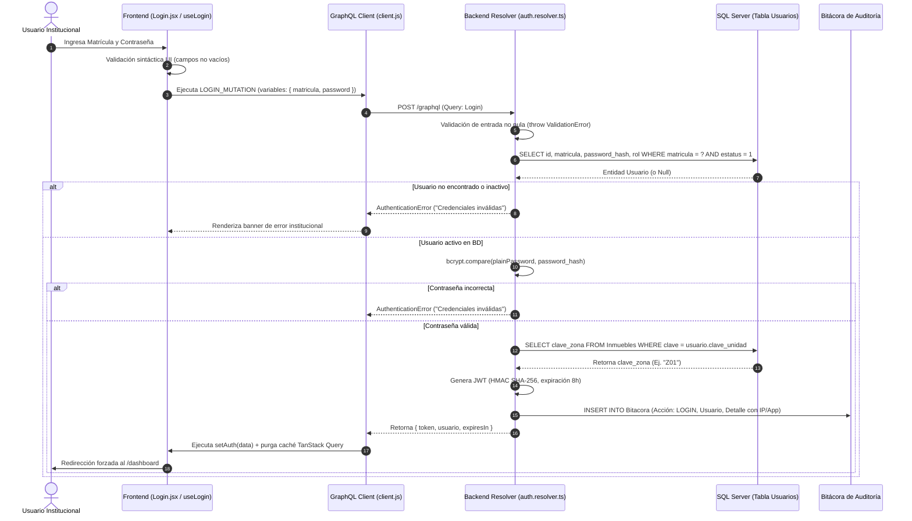
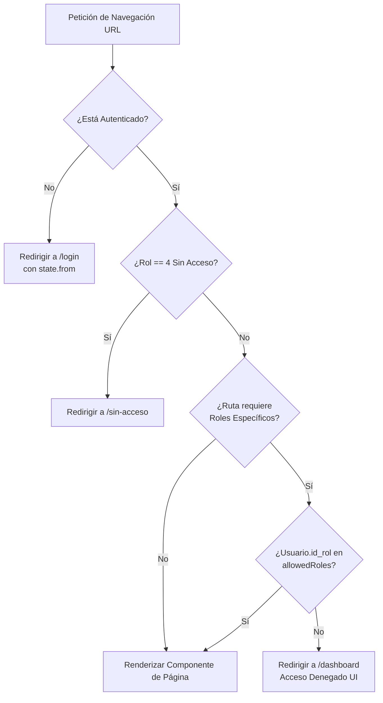

# MANUAL TÉCNICO DE ARQUITECTURA, SEGURIDAD Y AUTENTICACIÓN (SIIT v3.1.9)
**Sistema Integral de Infraestructura Tecnológica — Delegación Nayarit (IMSS)**  
*Capítulo Central: Ingeniería de Seguridad de Software, Control de Acceso y Estructura Arquitectónica Full-Stack*

---

## 1. Introducción y Resumen Arquitectónico

El **Sistema Integral de Infraestructura Tecnológica (SIIT)** del Instituto Mexicano del Seguro Social (IMSS), Delegación Nayarit, opera bajo una arquitectura **Full-Stack Desacoplada** basada en una interfaz reactiva del lado del cliente (**React + Vite**) y un servidor API de alto rendimiento (**Node.js + TypeScript + Apollo Server GraphQL + TypeORM**) respaldado por una base de datos relacional (**Microsoft SQL Server**).

El diseño de seguridad del sistema se fundamenta en un modelo de **Confianza Cero en el Cliente (Zero-Trust Client)**, donde la interfaz gráfica actúa únicamente como una capa de presentación reactiva y el backend asume la autoridad absoluta sobre la validación de identidad, sesión, autorización y filtrado contextual de datos institucionales.

---

## 2. Estructura de Carpetas y Archivos (Frontend)

El proyecto frontend (`Sistema-Gestion-Activos-Institucionales-Front`) sigue una arquitectura modular orientada al dominio del negocio institucional, separando estrictamente el estado global de autenticación, las peticiones de red (GraphQL), la lógica de negocio modularizada en *hooks* y los componentes de presentación.

### 2.1 Árbol de Directorios del Proyecto Frontend

```text
Sistema-Gestion-Activos-Institucionales-Front/
├── dist/                             # Empaquetado de producción
├── images/                           # Recursos gráficos institucionales de alta resolución
│   ├── IMSS_Logosímbolo_Blanco.png   # Logosímbolo IMSS variante clara
│   ├── IMSS_Logosímbolo.png          # Logosímbolo oficial IMSS
│   └── imssFavicon.png               # Icono institucional del navegador
├── public/                           # Directorio público de activos estáticos
│   ├── descargas/
│   │   └── Sistema-Gestor-Hardware-IMSS.rar # Herramienta de escritorio complementaria para Windows
│   ├── Formatos/
│   │   └── FormatoRellenableSalidaBienes.pdf # Plantilla oficial en PDF para pases de salida
│   ├── IMSS_logo_blanco.png          # Logo institucional en color blanco
│   ├── imssFavicon.png               # Favicon institucional
│   └── vite.svg                      # Logo de Vite
├── src/
│   ├── api/                          # Capa de integración con GraphQL
│   │   ├── client.js                 # Cliente GraphQL y middleware HTTP con inyección de JWT
│   │   ├── auth.queries.js           # Mutaciones de Login/Cambio de contraseña y Query Me
│   │   ├── aprobaciones.queries.js   # Consultas y mutaciones para flujo de dictamen y autorización
│   │   ├── atributos.queries.js      # Consultas y mutaciones de especificaciones técnicas de hardware
│   │   ├── bitacora.queries.js       # Consultas forenses para rastreo de auditoría transaccional
│   │   ├── correspondencia.queries.js # Consultas y registro de oficios en mesa de correspondencia
│   │   ├── escaner.queries.js        # Consultas por lectura de etiquetas patrimoniales y código QR
│   │   ├── garantias.queries.js      # Consultas y control de vigencias de pólizas y contratos TI
│   │   ├── incidencias.queries.js    # Consultas y mutaciones para levantamiento y gestión de reportes
│   │   ├── inventario.queries.js     # Consultas y mutaciones maestras para control del inventario
│   │   ├── notificaciones.queries.js # Consultas para el panel de alertas institucionales en vivo
│   │   ├── prestamos.queries.js      # Consultas y mutaciones para registro de resguardos temporales
│   │   ├── salidas.queries.js        # Consultas y mutaciones para pases de salida y traslados físicos
│   │   ├── unidades.queries.js       # Consultas de clínicas, hospitales y filtrado por zona
│   │   └── usuarios.queries.js       # Consultas y mutaciones para administración de cuentas y roles
│   ├── assets/                       # Gráficos, tipografías e iconos locales
│   │   └── react.svg                 # Logo estático de React
│   ├── components/                   # Componentes UI reutilizables y Guards de navegación
│   │   ├── AnimatedCounter.jsx       # Contador visual animado para tarjetas de métricas
│   │   ├── AtributosCatalogModal.jsx # Gestión de catálogos de atributos técnicos de hardware
│   │   ├── BienAtributosPanel.jsx    # Panel de visualización y edición de atributos por bien
│   │   ├── CargaMasivaPanel.jsx      # Panel principal para importación masiva de inventario
│   │   ├── CargaMasivaRowModal.jsx   # Modal de inspección y corrección de fila en carga masiva
│   │   ├── ConfirmModal.jsx          # Diálogo modal genérico de confirmación de acciones
│   │   ├── CrearPrestamoModal.jsx    # Modal de registro transaccional para préstamo de equipos
│   │   ├── DetalleBienVisualModal.jsx # Vista detallada y visual de la ficha técnica de un bien
│   │   ├── DetalleIncidenciaModal.jsx # Consulta de historial y diagnóstico de incidencia técnica
│   │   ├── DetalleIncidenciaWrapperModal.jsx # Contenedor modal para detalles de incidencias
│   │   ├── DetalleSegmentoModal.jsx  # Inspección de segmento de red IP e infraestructura
│   │   ├── DetalleUnidadModal.jsx    # Consulta general de clínica, hospital o unidad médica
│   │   ├── EditBienModal.jsx         # Modal integral para alta, edición y resguardo patrimonial
│   │   ├── EditarIncidenciaModal.jsx # Edición transaccional de tickets de soporte técnico
│   │   ├── ExportExcelModal.jsx      # Generación personalizada y filtrada de reportes Excel
│   │   ├── FinalizarPrestamoModal.jsx # Devolución transaccional y recepción de préstamos
│   │   ├── FormCorrespondenciaModal.jsx # Registro y gestión oficial de mesa de correspondencia
│   │   ├── HistorialSalidas.jsx      # Bitácora visual de pases de salida y traslados físicos
│   │   ├── IncidenciaModal.jsx       # Modal de levantamiento de nuevas incidencias y fallas
│   │   ├── MermaidDiagram.jsx        # Renderizador de diagramas arquitectónicos y flujos
│   │   ├── MultiSearchableSelect.jsx # Componente UI de selección múltiple con buscador y filtrado
│   │   ├── MultiSelect.jsx           # Selector de opciones múltiples estilizado
│   │   ├── NotasModal.jsx            # Gestión de notas aclaratorias y bitácoras por equipo
│   │   ├── PrintLabelsTab.jsx        # Módulo de impresión en lote de etiquetas patrimoniales
│   │   ├── PrintStickerSheet.jsx     # Plantilla de generación de planillas de stickers QR
│   │   ├── ProtectedRoute.jsx        # Guard de seguridad que salvaguarda rutas privadas
│   │   ├── ProveedorModal.jsx        # Catálogo transaccional y registro de proveedores TI
│   │   ├── ReportePanel.jsx          # Panel analítico y generación de reportes ejecutivos
│   │   ├── ReportesSeccion.jsx       # Sección visual organizadora de informes por módulo
│   │   ├── ResolucionModal.jsx       # Cierre y dictamen técnico de resolución de incidencias
│   │   ├── RevisionCambiosModal.jsx  # Flujo de aprobación para solicitudes de cambio patrimonial
│   │   ├── SalidasForm.jsx           # Formulario oficial de generación de pases de salida
│   │   ├── SearchableSelect.jsx      # Selector desplegable autocompletado y filtrable por texto
│   │   ├── Sidebar.jsx               # Navegación lateral adaptada por rol (RBAC) y Logout
│   │   ├── Toast.jsx                 # Sistema flotante de notificaciones y alertas en vivo
│   │   ├── Topbar.jsx                # Barra superior con perfil institucional y notificaciones
│   │   ├── UnidadModal.jsx           # Alta y edición administrativa de unidades hospitalarias
│   │   └── UserSearchDropdown.jsx    # Buscador autocompletado de usuarios por matrícula/nombre
│   ├── context/                      # Contextos de la aplicación (UI State)
│   │   └── AppContext.jsx            # Estado de interfaz (colapso de barra, página activa)
│   ├── data/                         # Diccionarios, catálogos estáticos y configuraciones UI
│   │   └── mockData.js               # Datos de prueba y estructuras catálogo en interfaz
│   ├── hooks/                        # Lógica de negocio encapsulada (Custom Hooks)
│   │   ├── useAtributos.js           # Consulta y mutación de atributos técnicos de hardware
│   │   ├── useBienMutations.js       # Mutaciones combinadas para alta y actualización de bienes
│   │   ├── useBienes.js              # Consulta paginada y filtrado de inventario con auto-logout
│   │   ├── useCatalogosBienes.js     # Extracción de catálogos auxiliares (marcas, modelos)
│   │   ├── useCurrentUser.js         # Verificación reactiva de sesión y sincronización con servidor
│   │   ├── useEscaner.js             # Lógica de decodificación y rastreo por código QR
│   │   ├── useIncidencias.js         # Gestión transaccional de tickets e incidencias técnicas
│   │   ├── useLogin.js               # Hook de mutación para el proceso de autenticación en backend
│   │   ├── useUnidades.js            # Consulta de unidades médicas y control de zona territorial
│   │   └── useVersionCheck.js        # Sondeo en segundo plano de versión y auto-refresco cliente
│   ├── lib/                          # Librerías de utilidades base
│   │   └── utils.js                  # Formateadores, parseadores y ayudantes generales
│   ├── pages/                        # Vistas principales del sistema (Enrutamiento React Router)
│   │   ├── Aprobaciones.jsx          # Panel de dictamen y autorización de movimientos patrimoniales
│   │   ├── Auditoria.jsx             # Bitácora forense de rastreo transaccional y seguridad
│   │   ├── Configuracion.jsx         # Ajustes generales del sistema y parámetros técnicos
│   │   ├── Correspondencia.jsx       # Gestión de oficios y seguimiento en mesa de correspondencia
│   │   ├── Dashboard.jsx             # Panel de control analítico e indicadores ejecutivos de activos
│   │   ├── Documentacion.jsx         # Módulo visual de manuales, guías y fichas informativas
│   │   ├── EscanerQR.jsx             # Vista móvil y de escritorio para lectura rápida por cámara QR
│   │   ├── FichaTecnica.jsx          # Vista de presentación imprimible de expediente del bien
│   │   ├── Garantias.jsx             # Control y seguimiento de vencimientos de pólizas y garantías
│   │   ├── GestionUsuarios.jsx       # Administración institucional de cuentas, roles y permisos
│   │   ├── Incidencias.jsx           # Mesa de soporte técnico, reportes de fallas y seguimiento
│   │   ├── Inventario.jsx            # Explorador patrimonial maestro de hardware del instituto
│   │   ├── Login.jsx                 # Pantalla pública de autenticación institucional IMSS
│   │   ├── Movimientos.jsx           # Trazabilidad de traspasos y reasignaciones internas
│   │   ├── SinAcceso.jsx             # Pantalla de interrupción para cuentas sin privilegios o bloqueadas
│   │   └── Unidades.jsx              # Directorio y administración de clínicas y hospitales por zona
│   ├── store/                        # Estado global de la aplicación (Zustand Stores)
│   │   ├── auth.store.js             # Almacén de sesión persistente (JWT, Usuario, Roles)
│   │   └── theme.store.js            # Almacén de tema visual (Claro/Oscuro/Institucional)
│   ├── utils/                        # Herramientas especializadas de exportación
│   │   └── pdfSalidas.js             # Generador de formatos oficiales de salida en PDF
│   ├── App.jsx                       # Enrutador principal, Guards de Rol y Layout general
│   ├── App.css                       # Estilos globales complementarios
│   ├── index.css                     # Sistema de diseño, variables CSS y base visual
│   └── main.jsx                      # Punto de entrada y enlace del QueryClient con Zustand
├── .env                              # Variables de entorno locales (VITE_GQL_URL, etc.)
├── ecosystem.config.cjs              # Configuración de despliegue y procesos con PM2
├── eslint.config.js                  # Reglas de linting y estandarización de código
├── index.html                        # Plantilla HTML raíz del cliente web
├── index.js                          # Script de arranque auxiliar o servidor estático
├── package.json                      # Dependencias del proyecto y scripts de construcción
└── vite.config.js                    # Configuración del empaquetador Vite
```

### 2.2 Propósito Arquitectónico de los Directorios Clave y Seguridad

| Directorio | Propósito Principal | Aporte a la Seguridad y Escalabilidad |
| :--- | :--- | :--- |
| **`src/api/`** | Centraliza todas las definiciones de *Queries* y *Mutations* de GraphQL en archivos dedicados por módulo, junto con el cliente HTTP (`client.js`). | Evita la dispersión de peticiones de red. En `client.js` se concentra el *middleware* HTTP que intercepta todas las peticiones para inyectar de forma segura el token JWT en las cabeceras (`Authorization: Bearer <token>`), previniendo fugas u olvidos en endpoints individuales. |
| **`src/store/`** | Contiene los almacenes de estado de **Zustand**. El archivo `auth.store.js` administra la identidad del usuario conectado y su token de acceso. | Implementa persistencia controlada en `localStorage` con sanitización de atributos (`partialize`). Además, expone un enlace directo a la caché de TanStack Query para purgar absolutamente todos los datos en memoria ante un cambio de cuenta o cierre de sesión. |
| **`src/components/`** | Agrupa componentes visuales modulares, modales transaccionales y los *Guards* de navegación estructural (`ProtectedRoute.jsx`, `Sidebar.jsx`). | Encapsula la lógica de autorización visual en la navegación. El componente `Sidebar` evalúa de forma reactiva el rol del usuario (`NAV_BY_ROL`) para renderizar únicamente los menús a los que tiene derecho institucionalmente. |
| **`src/hooks/`** | Almacena *Custom Hooks* que conectan la capa UI con la capa de datos (`useQuery` / `useMutation` de TanStack React Query). | Separa la lógica de control transaccional del DOM. En cada *hook* de datos (`useBienes`, `useIncidencias`, `useUnidades`), se interceptan errores a nivel de red para detectar interceptaciones de seguridad (`UNAUTHENTICATED`), disparando limpiezas automáticas de sesión. |
| **`src/pages/`** | Contiene los componentes de vista superior asociados directamente a rutas específicas de **React Router**. | Permite aplicar esquemas de carga perezosa (*Code Splitting*) y aislamiento funcional por módulo institucional (Aprobaciones, Inventario, Auditoría). |
| **`public/` & `images/`** | Almacenan activos estáticos institucionales (`IMSS_Logosímbolo.png`), plantillas rellenables PDF y ejecutables complementarios (`Sistema-Gestor-Hardware-IMSS.rar`). | Su aislamiento fuera de la lógica fuente (`src/`) asegura que la capa estática sea servida de forma directa por Vite o el servidor sin pasar por transcompilación ni exponer secretos de entorno en los empaquetados visuales. |

---

## 3. Arquitectura Temprana y Flujo de Autenticación Completo (Login Flow)

El proceso de autenticación en el SIIT garantiza que ninguna credencial fluya en texto plano sin protección de capa de transporte y que las contraseñas jamás sean expuestas en memoria de base de datos o logs de aplicación.



### 3.1 Análisis del Frontend en Login

1. **Captura y Gestión de Eventos (`Login.jsx`)**:  
   La interfaz captura la matrícula institucional y la contraseña manteniendo el estado local con `useState`. Al disparar el evento `onSubmit`, se previene la recarga del navegador y se valida sintácticamente que las cadenas no estén vacías.
2. **Despacho Transaccional (`useLogin.js`)**:  
   Se invoca el *Custom Hook* `useLogin`, el cual delega la petición a `@tanstack/react-query`. La mutación envía al servidor el fragmento GraphQL `LOGIN_MUTATION`.
3. **Manejo de Errores Contextuales**:  
   Si el servidor rechaza la autenticación, el frontend extrae el código de excepción GraphQL (`error.response.errors[0].extensions.code`) y lo mapea a un diccionario de usuario (`ERROR_MESSAGES`), mostrando una alerta visual sin revelar al atacante si falló el usuario o la contraseña en particular.

### 3.2 Análisis Profundo del Backend (Deep Dive)

En el backend, el punto de entrada es el resolver `login` dentro de `src/graphql/resolvers/auth.resolver.ts`:

1. **Validación de Parámetros de Entrada**:
   Se verifica inmediatamente la presencia de `matricula` y `password`. Si faltan, se lanza una excepción de tipo `ValidationError` (HTTP 400).
2. **Consulta Segura con TypeORM y Exclusión de Hashes**:
   En la entidad `Usuario.ts`, el atributo de la contraseña está protegido a nivel ORM:
   ```typescript
   @Column({ name: 'password_hash', type: 'varchar', length: 255, select: false, nullable: true })
   password_hash?: string;
   ```
   La propiedad `select: false` garantiza que **ninguna consulta general o listado de usuarios en el sistema extraiga accidentalmente los hashes de las contraseñas**.  
   Para realizar el inicio de sesión, el resolver construye un `QueryBuilder` solicitando explícitamente la columna mediante `.addSelect('u.password_hash')`, filtrando estrictamente por cuentas activas (`estatus = 1`).
3. **Verificación Kriptográfica Cifrada**:
   Se invoca el método de instancia `usuario.validatePassword(password)`, que ejecuta internamente:
   ```typescript
   bcrypt.compare(plainPassword, this.password_hash)
   ```
   El algoritmo **bcrypt** computa el hash salado con un factor de costo computacional de 12 (`rounds = 12`), mitigando ataques de fuerza bruta y de tablas de arcoíris (*Rainbow Tables*). Para evitar la enumeración de usuarios, ante cualquier fallo se retorna un genérico `AuthenticationError('Credenciales inválidas')`.
4. **Enriquecimiento Arquitectónico de Multi-Zona Institucional**:
   Antes de emitir el token, el resolver consulta la tabla relacional `Inmuebles` para obtener la `clave_zona` asociada a la clínica u hospital (`clave_unidad`) del usuario. Este atributo es inyectado directamente en el *payload* del JWT para respaldar el filtrado de datos por zona en toda la sesión.
5. **Registro de Auditoría Transaccional**:
   Salvo para procesos automatizados de sincronización técnica (`AUTOSYNC_USER`), el resolver registra una traza inmutable en la tabla `Bitacora` mediante la función `registrarBitacora`, documentando el ID de usuario, acción (`LOGIN`), módulo (`Usuarios`) y metadatos con la dirección IP real (`context.clientIp`) o el identificador de la aplicación de escritorio (`equipoInfo`).

---

## 4. Arquitectura y Ciclo de Vida del Cierre de Sesión (Logout Flow)

El cierre de sesión es una operación crítica que garantiza el desmantelamiento inmediato de los privilegios del usuario en el navegador web y la prevención de fugas de datos en entornos clínicos de uso compartido.

### 4.1 Flujo en el Frontend

El disparador principal reside en el componente de navegación lateral (`Sidebar.jsx`):

```javascript
const handleLogout = () => {
  clearAuth();
  setSidebarOpen(false);
  navigate('/login', { replace: true });
};
```

Cuando se ejecuta `clearAuth()` desde el *store* de Zustand (`auth.store.js`), ocurren dos procesos simultáneos:
1. **Purga de Caché Transaccional de TanStack Query**:  
   Se ejecuta la instrucción `_queryClient?.clear()`. Esto elimina al instante todas las consultas almacenadas en la memoria RAM del navegador (inventarios precargados, listados de personal, incidencias médicas). Sin este paso, si otro médico o técnico ingresa en la misma computadora, podría visualizar fracciones de la caché de la sesión anterior en un parpadeo previo a la recarga de red.
2. **Limpieza del Almacenamiento Persistente**:  
   Se resetean a `null` las propiedades `token`, `usuario` y `expiresIn` dentro del store, y Zustand sobrescribe automáticamente la clave `'imss-auth'` en el `localStorage` del navegador con un estado vacío (`isAuthenticated: false`).
3. **Desalojo de la Pila de Navegación**:  
   Se invoca `navigate('/login', { replace: true })`, sustituyendo la entrada actual en el historial del navegador para impedir que el usuario pueda presionar el botón "Atrás" e intentar ver vistas del panel institucional.

### 4.2 Análisis Profundo del Backend en Arquitectura Stateless

El SIIT implementa una arquitectura **Sin Estado (Stateless)** basada en el estándar JSON Web Token (JWT). Bajo este paradigma arquitectónico:

- **Inexistencia de Sesiones del Servidor**: El servidor Node.js no conserva una tabla de sesiones activas en memoria ni en base de datos. Toda la información de autorización y vigencia viaja auto-contenida y firmada criptográficamente dentro del token que el cliente adjunta en cada petición.
- **Comportamiento ante Logout**: Dado que el backend no almacena un estado de sesión individual, la desvinculación se ejecuta **completamente del lado del cliente** al purgar el token del `localStorage`. Una vez que el token es removido del navegador, el usuario es matemáticamente incapaz de emitir una petición autenticada válida, ya que el *middleware* del servidor exigirá un token Bearer firmado.
- **Caducidad Intrínseca y Endurecimiento Institucional**: Si un atacante lograra interceptar un token antes del cierre de sesión, este expirará de manera natural al cumplirse el tiempo `expiresIn` (8 horas). Para escenarios institucionales que requieran una revocación instantánea del lado del servidor (ej. compromiso de cuenta detectado en tiempo real), la arquitectura del SIIT está preparada para incorporar una capa de **Listas de Revocación (Blocklists en Redis)** o migrar a un modelo de **Rotación con Refresh Tokens cortos (15 min)**, donde el resolver de logout marque el *Refresh Token* como revocado en SQL Server/Redis.

---

## 5. Implementación y Ciclo de Vida del JWT

### 5.1 Generación y Estructura en el Backend

El JWT se genera en el momento exacto del login exitoso utilizando la librería `jsonwebtoken` y los parámetros definidos de forma segura en las variables de entorno (`src/config/environment.ts`):

- **Algoritmo de Firma**: HMAC con SHA-256 (`HS256`). Garantiza la integridad y autenticidad del token mediante una clave secreta (`JWT_SECRET`) conocida únicamente por el servidor Node.js.
- **Tiempo de Expiración**: Configurado por defecto a **8 horas (`8h`)**, coincidiendo con la duración de un turno laboral estándar en el instituto.

#### Estructura del Payload (Decodificado)

El *payload* del token (`JwtPayload`) está diseñado para minimizar consultas a la base de datos durante operaciones posteriores, incrustando los metadatos de autorización esenciales:

```json
{
  "id_usuario": 142,
  "id_rol": 2,
  "matricula": "98765432",
  "id_unidad": 15,
  "clave_unidad": "HGZ1",
  "clave_zona": "Z02",
  "iat": 1719850000,
  "exp": 1719878800
}
```

| Atributo | Tipo de Dato | Descripción e Impacto de Seguridad |
| :--- | :--- | :--- |
| `id_usuario` | Integer | Identificador primario único en base de datos. Utilizado para auditorías e inserción de autorías de movimiento. |
| `id_rol` | Integer | Rol jerárquico (`1=Maestro`, `2=Admin`, `3=Estándar`). Evaluado por los *Guards* del backend y el *middleware* RBAC. |
| `matricula` | String | Clave institucional IMSS del trabajador. |
| `clave_unidad` | String | Identificador físico del hospital o clínica del trabajador (Ej. HGZ No. 1). |
| `clave_zona` | String | **Atributo Crítico de Seguridad Multi-Tenant**. Define la zona geográfica/administrativa para filtrar automáticamente las consultas del usuario en el ORM. |
| `iat` / `exp` | Timestamp | Marcas de tiempo de emisión y expiración POSIX en segundos. |

### 5.2 Transmisión e Inyección en el Cliente HTTP

En el lado del cliente, el transporte seguro del JWT se gestiona en `src/api/client.js` mediante el middleware de `graphql-request`. Cada vez que la aplicación dispara un *Query* o *Mutation*:

1. El middleware extrae el token en vivo directamente desde el estado de Zustand:  
   `const token = useAuthStore.getState().token;`
2. Construye y normaliza el objeto de cabeceras HTTP, adjuntando la clave de autorización estándar:  
   `headers.set('Authorization', 'Bearer ' + token);`
3. Se inyectan cabeceras de blindaje y origen institucional:
   - `x-origen: web`: Identifica la fuente transaccional ante la bitácora del servidor.
   - `apollo-require-preflight: true`: Protege contra ataques de falsificación de peticiones en sitios cruzados (**CSRF**) en servidores GraphQL web modernos.

---

## 6. Protección de Rutas en el Cliente (Frontend)

El enrutador principal (`src/App.jsx`) implementa un modelo de seguridad por capas utilizando componentes envolventes (*Guards*) que evalúan la sesión en cada cambio de URL.



### 6.1 Análisis Técnico de los Componentes Guardias

1. **Guardia Base (`ProtectedRoute`)**:  
   Verifica que `isAuthenticated` sea `true` y que el objeto `usuario` esté disponible en el *store*. Si falta cualquiera de estas condiciones, interrumpe el renderizado e invoca un `<Navigate to="/login" replace />`, pasando en el estado (`state.from`) la URL original para permitir una redirección post-login en flujos profundos. Adicionalmente, detecta si la cuenta está en estado suspendido o sin acceso (`ROL_SIN_ACCESO = 4`), enviándola a una pantalla estática de bloqueo.
2. **Guardia Jerárquico (`RoleRoute`)**:  
   Recibe un arreglo de roles permitidos (`allowedRoles`, ej. `[1, 2]`). Tras verificar la sesión activa, evalúa si `allowedRoles.includes(usuario.id_rol)`. Si un técnico estándar intenta escribir en la barra de URL `/configuracion` o `/auditoria`, el guardia aborta la navegación y lo expulsa de manera elegante hacia `/dashboard`.

### 6.2 Reacción Reactiva ante Tokens Expirados o Manipulados

Para prevenir que un usuario permanezca en la interfaz gráfica si su token expiró en el servidor o fue alterado, el sistema ejecuta un mecanismo de **Inspección de Respuesta Continua**:

1. En la inicialización principal (`App.jsx`), corre el *Custom Hook* `useCurrentUser()`. Este hook consulta periódicamente el endpoint GraphQL `me`.
2. Si el servidor rechaza el token devolviendo un error con código `UNAUTHENTICATED` o estatus HTTP `401`, el *hook* intercepta el error y ejecuta `clearAuth()`:
   ```javascript
   useEffect(() => {
     if (query.error) {
       const code = query.error?.response?.errors?.[0]?.extensions?.code;
       if (code === 'UNAUTHENTICATED' || query.error?.response?.status === 401) {
         clearAuth();
       }
     }
   }, [query.error, clearAuth]);
   ```
3. Esta misma lógica defensiva está replicada en todos los hooks operacionales de la aplicación (`useBienes`, `useIncidencias`, `useUnidades`, `useEscaner`). Tan pronto como cualquier consulta de fondo recibe un `UNAUTHENTICATED`, se dispara el reseteo del *store*. Zustand notifica a los componentes reactivos, `isAuthenticated` cambia a `false`, y los *Guards* de React Router desmontan instantáneamente el DOM privado, expulsando al usuario a la pantalla de Login.

---

## 7. Middlewares y Seguridad de Resolvers (Backend - Deep Dive)

En el servidor Apollo Server, la seguridad no se confía a resolvers aislados; se ejecuta una interceptación sistemática en dos fases: **Construcción del Contexto HTTP** y **Guardias de Ejecución GraphQL**.

### 7.1 Construcción del Contexto y Decodificación JWT (`context.ts`)

Por cada petición HTTP de entrada al servidor GraphQL, Express invoca la función `buildContext`:

1. **Extracción y Sanitización de Red**:  
   Se analiza la cabecera `X-Forwarded-For` o la conexión del socket web (`req.socket.remoteAddress`) para determinar la dirección IP real del cliente, limpiando mapeos IPv6 o direcciones locales (`::ffff:` o `::1`).
2. **Extracción del Token Bearer**:  
   Se inspecciona `req.headers.authorization`. Si no existe o no inicia con la cadena literal `'Bearer '`, el contexto se inicializa únicamente con los *DataLoaders* y metadatos de red, dejando la propiedad `user` como `undefined`.
3. **Verificación Criptográfica Asincrónica**:  
   Si el token está presente, se ejecuta de manera sincrónica `jwt.verify(token, env.jwt.secret)`. Si el algoritmo criptográfico confirma la firma y el tiempo `exp` aún no es superado, el *payload* decodificado se asigna a `context.user`.
4. **Manejo Resiliente de Excepciones de Token**:  
   Si `jwt.verify` arroja una excepción (como `TokenExpiredError` o `JsonWebTokenError`), el middleware atrapa el error de forma silenciosa y lo registra en consola (`[Context] Token de sesión expirado`), retornando el contexto sin autenticar. **El middleware no rompe la petición de red a este nivel**, permitiendo que *queries* públicas (como `login`) sigan funcionando con normalidad.

### 7.2 Interceptación y Blindaje en los Resolvers (`auth.middleware.ts`)

Cada resolver privado del sistema ejecuta en su primera línea de código un guardia de aserción tipada:

```typescript
export function requireAuth(
  context: GraphQLContext
): asserts context is GraphQLContext & { user: NonNullable<GraphQLContext['user']> } {
  if (!context.user) {
    throw new AuthenticationError('No autenticado. Inicia sesión para continuar.');
  }
}
```

La directiva `asserts context is ...` en TypeScript le garantiza al compilador y al desarrollador que, tras cruzar esta línea, `context.user` existe en memoria al 100%. Si un usuario anónimo intenta invocar una consulta privada, se dispara un `AuthenticationError` que interrumpe la ejecución del resolver antes de tocar cualquier motor de base de datos.

Para resolvers administrativos, se invoca `requireRole(context, [ROLES.MAESTRO, ROLES.ADMIN])`, validando que `context.user.id_rol` se encuentre dentro de la matriz de autorización permitida.

### 7.3 Formateo Normalizado de Errores (`utils/errors.ts`)

El servidor estandariza la estructura de las respuestas de error heredando de la clase core `GraphQLError`. Cada excepción inyecta metadatos exactos en la propiedad `extensions`:

```json
{
  "errors": [
    {
      "message": "No autenticado. Inicia sesión para continuar.",
      "extensions": {
        "code": "UNAUTHENTICATED",
        "http": { "status": 401 }
      }
    }
  ]
}
```

Esto permite al cliente GraphQL o a un API Gateway interpretar inequívocamente el estado HTTP (`401 Unauthenticated`, `403 Forbidden`, `400 Bad User Input`, `404 Not Found`, `409 Conflict`), facilitando la observabilidad y el monitoreo automatizado de intrusiones.

---

## 8. Control de Acceso Basado en Roles (RBAC) y Aislamiento Multi-Zona

El SIIT tipifica la jerarquía institucional en 4 roles primarios que rigen tanto la experiencia visual como las consultas al motor SQL Server:

```text
ROLES = {
  MAESTRO: 1,      # Maestro TI delegacional (Acceso absoluto y auditoría profunda)
  ADMIN: 2,        # Administrador patrimonial o jefe de zona (Acceso inter-zona o regional)
  USUARIO: 3,      # Personal técnico o capturista estándar (Estrictamente acotado a su Zona)
  SIN_ACCESO: 4    # Cuentas suspendidas o pendientes de asignación institucional
}
```

### 8.1 Aislamiento en Interfaz Gráfica (UI)

El frontend adapta de forma proactiva las capacidades visibles:
- La navegación lateral (`Sidebar.jsx`) consulta el diccionario dinámico `NAV_BY_ROL[usuario.id_rol]`. Un usuario de rol `3` (Estándar) no recibe en el DOM los enlaces para gestionar usuarios o auditar bitácoras.
- Los botones de acción crítica (como edición avanzada de fichas técnicas o autorizaciones de baja patrimonial) verifican la condición `idRol === 1 || idRol === 2` antes de renderizar la interfaz de interacción.

### 8.2 Aislamiento de Datos por Query en el Backend (Data-Scoping Deep Dive)

La capa más profunda y robusta de seguridad informática del SIIT se ejecuta en la construcción de consultas SQL transaccionales. Aunque un usuario malicioso lograra eludir la interfaz de React e inyectar peticiones GraphQL directas intentando consultar el patrimonio de otra clínica médica, el backend neutraliza la intrusión mediante **Filtros Dinámicos de Zona** incrustados en TypeORM.

En `src/middleware/auth.middleware.ts`, se define el motor de inyecciones SQL relacionales:

```typescript
export function applyZonaFilter<T extends ObjectLiteral>(
  qb: SelectQueryBuilder<T>,
  alias: string,
  context: GraphQLContext
): void {
  if (!isEstandar(context)) return; // Roles 1 y 2 tienen visibilidad total

  const clave_zona = context.user?.clave_zona;

  if (!clave_zona) {
    // Si el usuario no tiene zona asignada en su ficha de personal, se le restringe
    // a ver únicamente inventarios genéricos por defecto ('U003', 'T003')
    qb.andWhere(`${alias}.num_serie IN ('U003', 'T003')`);
    return;
  }

  // Se inyecta un LEFT JOIN dinámico hacia la tabla de unidades médicas
  qb.leftJoin(
    'unidades',
    '_zona_uni',
    `_zona_uni.clave = ${alias}.clave_unidad_ref`
  );
  
  // Se fuerza a nivel de SQL que la clave_zona coincida con la del JWT del usuario
  qb.andWhere(`(_zona_uni.clave_zona = :_zona OR ${alias}.num_serie IN ('U003', 'T003'))`, { _zona: clave_zona });
}
```

#### ¿Cómo opera este mecanismo en la práctica?
Cada vez que un resolver (por ejemplo, `bienes.resolver.ts`) se prepara para listar activos, invoca `applyZonaFilter(qb, 'b', context)`.
- Si el usuario es **Maestro (1)** o **Administrador (2)**, la función retorna inmediatamente, permitiendo que la consulta SELECT abarque la totalidad de las unidades operativas del instituto.
- Si el usuario es **Estándar (3)**, el ORM altera la consulta SQL agregando de manera silenciosa pero obligatoria una cláusula `WHERE (_zona_uni.clave_zona = @0)`. Por tanto, es **arquitectónicamente imposible** que un operador estándar extraiga registros que no pertenezcan a su ámbito jurisdiccional.

---

## 9. Fragmentos de Código Críticos (Snippets Explicativos)

### 9.1 Backend: Validación Kriptográfica y Emisión de JWT (`auth.resolver.ts`)

```typescript
// [SNIPPET CRÍTICO]: Mutación de Login en src/graphql/resolvers/auth.resolver.ts
login: async (_: unknown, { matricula, password, equipoInfo }: { matricula: string; password: string; equipoInfo?: string }, context: GraphQLContext) => {
  // 1. Validación preventiva contra inyección de nulos o cadenas vacías
  if (!matricula || !password) {
    throw new ValidationError('Matrícula y contraseña son requeridos');
  }

  const repo = AppDataSource.getRepository(Usuario);
  
  // 2. Consulta con .addSelect explícito debido a que el atributo en la entidad
  //    tiene configurada la protección de aislamiento (select: false)
  const usuario = await repo
    .createQueryBuilder('u')
    .addSelect('u.password_hash')
    .leftJoinAndSelect('u.rol', 'rol')
    .where('u.matricula = :matricula', { matricula })
    .andWhere('u.estatus = 1') // Exclusión inmediata de cuentas dadas de baja
    .getOne();

  if (!usuario) {
    throw new AuthenticationError('Credenciales inválidas');
  }

  // 3. Comparación de hash segura en tiempo constante (bcrypt)
  const valid = await usuario.validatePassword(password);
  if (!valid) {
    throw new AuthenticationError('Credenciales inválidas');
  }

  // 4. Extracción relacional del atributo de compartimentación geográfica (clave_zona)
  let clave_zona: string | undefined;
  if (usuario.clave_unidad) {
    const inmueble = await AppDataSource.getRepository(Inmueble).findOne({
      where: { clave: usuario.clave_unidad },
      select: ['clave', 'clave_zona'],
    });
    clave_zona = inmueble?.clave_zona ?? undefined;
  }

  // 5. Construcción del payload inmutable de autorización
  const payload = {
    id_usuario: usuario.id_usuario,
    id_rol: usuario.id_rol,
    matricula: usuario.matricula,
    id_unidad: usuario.id_unidad,
    clave_unidad: usuario.clave_unidad,
    clave_zona,
  };

  // 6. Firma digital HMAC SHA-256 con expiración acotada por entorno
  const token = jwt.sign(payload, env.jwt.secret, { expiresIn: env.jwt.expiresIn } as jwt.SignOptions);

  // 7. Registro en Bitácora Forense de Seguridad
  const autoSyncUser = process.env.AUTOSYNC_USER || 'ti_autosync';
  if (usuario.matricula !== autoSyncUser) {
    await registrarBitacora(
      usuario.id_usuario,
      'LOGIN',
      'Usuarios',
      String(usuario.id_usuario),
      { info: `Sesión iniciada correctamente por ${usuario.nombre_completo || usuario.matricula}` }
    );
  }

  return { token, usuario, expiresIn: env.jwt.expiresIn };
}
```

### 9.2 Backend: Entidad de Usuario con Blindaje ORM (`Usuario.ts`)

```typescript
// [SNIPPET CRÍTICO]: Modelo y Hooks de Contraseña en src/entities/Usuario.ts
@Entity('Usuarios')
export class Usuario {
  @PrimaryGeneratedColumn({ name: 'id_usuario' })
  id_usuario!: number;

  @Column({ name: 'matricula', type: 'varchar', length: 20 })
  matricula!: string;

  // BLINDAJE ORM: El flag select: false impide que TypeORM incluya el hash
  // en consultas SELECT * o búsquedas generales, evadiendo fugas de memoria.
  @Column({ name: 'password_hash', type: 'varchar', length: 255, select: false, nullable: true })
  password_hash?: string;

  @Column({ name: 'id_rol', type: 'int', default: 3 })
  id_rol!: number;

  @Column({ name: 'estatus', type: 'bit', default: 1 })
  estatus!: boolean;

  // Cifrado unidireccional con factor de trabajo computacional 12
  async hashPassword(plainPassword: string): Promise<void> {
    this.password_hash = await bcrypt.hash(plainPassword, 12);
  }

  // Verificación constante mitigando ataques de temporización (Timing Attacks)
  async validatePassword(plainPassword: string): Promise<boolean> {
    if (!this.password_hash) return false;
    return bcrypt.compare(plainPassword, this.password_hash);
  }
}
```

### 9.3 Backend: Middleware de Aserción y Autorización (`auth.middleware.ts`)

```typescript
// [SNIPPET CRÍTICO]: Aserción de Tipo y Validación RBAC en src/middleware/auth.middleware.ts

/**
 * Aserción de TypeScript que valida la autenticación.
 * Al usar "asserts context is...", si no se lanza excepción, el compilador
 * infiere que context.user es No Nulo en el resto del ámbito de ejecución.
 */
export function requireAuth(
  context: GraphQLContext
): asserts context is GraphQLContext & { user: NonNullable<GraphQLContext['user']> } {
  if (!context.user) {
    throw new AuthenticationError('No autenticado. Inicia sesión para continuar.');
  }
}

/**
 * Guardia de Control de Acceso Basado en Roles (RBAC).
 */
export function requireRole(context: GraphQLContext, allowedRoles: number[]): void {
  requireAuth(context); // Valida primero la existencia e integridad de la sesión
  if (!allowedRoles.includes(context.user.id_rol)) {
    throw new ForbiddenError('No tienes permisos para realizar esta acción.');
  }
}
```

### 9.4 Frontend: Interceptor HTTP e Inyección Cabecera Bearer (`client.js`)

```javascript
// [SNIPPET CRÍTICO]: Cliente GraphQL y Middleware de Cabeceras en src/api/client.js
import { GraphQLClient } from 'graphql-request';
import { useAuthStore } from '../store/auth.store';

const GQL_URL = import.meta.env.VITE_GQL_URL ?? 'http://localhost:4000/graphql';

export const gqlClient = new GraphQLClient(GQL_URL, {
  requestMiddleware: async (request) => {
    // 1. Lectura sincrónica del token actual en el Store de Zustand
    const token = useAuthStore.getState().token;

    const headers = new Headers(request.headers);
    // 2. Cabeceras de blindaje contra CSRF y trazabilidad institucional
    headers.set('apollo-require-preflight', 'true');
    headers.set('x-origen', 'web');

    // 3. Inyección estandarizada del esquema Bearer
    if (token) {
      headers.set('Authorization', `Bearer ${token}`);
    }

    const plainHeaders = {};
    headers.forEach((value, key) => {
      plainHeaders[key] = value;
    });

    return {
      ...request,
      headers: plainHeaders,
    };
  },
});
```

### 9.5 Frontend: Store Persistente y Purga Dual de Caché (`auth.store.js`)

```javascript
// [SNIPPET CRÍTICO]: Gestión de Estado Global y Limpieza Inter-Sesión en src/store/auth.store.js
import { create } from 'zustand';
import { persist, createJSONStorage } from 'zustand/middleware';

// Referencia al QueryClient inyectada desde main.jsx para prevenir import circular
let _queryClient = null;
export const setQueryClientRef = (qc) => { _queryClient = qc; };

export const useAuthStore = create(
  persist(
    (set) => ({
      token: null,
      usuario: null,
      expiresIn: null,
      isAuthenticated: false,

      setAuth: ({ token, usuario, expiresIn }) => {
        // SEGURIDAD CRÍTICA: Se purga cualquier caché de TanStack Query
        // proveniente de una sesión previa antes de hidratar la nueva cuenta.
        _queryClient?.clear();
        set({ token, usuario, expiresIn, isAuthenticated: true });
      },

      clearAuth: () => {
        // SEGURIDAD CRÍTICA EN LOGOUT: Elimina por completo los datos de inventario
        // en RAM para evitar fugas visuales ante operadores concurrentes.
        _queryClient?.clear();
        set({ token: null, usuario: null, expiresIn: null, isAuthenticated: false });
      },
    }),
    {
      name: 'imss-auth',
      storage: createJSONStorage(() => localStorage),
      partialize: (state) => ({
        token: state.token,
        usuario: state.usuario,
        expiresIn: state.expiresIn,
        isAuthenticated: state.isAuthenticated,
      }),
    }
  )
);
```

### 9.6 Frontend: Ciclo de Vida Defensivo y Auto-Logout Reactivo (`useCurrentUser.js`)

```javascript
// [SNIPPET CRÍTICO]: Hook de Supervisión de Sesión en src/hooks/useCurrentUser.js
import { useEffect } from 'react';
import { useQuery } from '@tanstack/react-query';
import { gqlClient } from '../api/client';
import { ME_QUERY } from '../api/auth.queries';
import { useAuthStore } from '../store/auth.store';

export function useCurrentUser() {
  const isAuthenticated = useAuthStore((s) => s.isAuthenticated);
  const clearAuth = useAuthStore((s) => s.clearAuth);

  const query = useQuery({
    queryKey: ['me'],
    queryFn: () => gqlClient.request(ME_QUERY),
    enabled: isAuthenticated,
    staleTime: 5 * 60 * 1000,
    retry: false, // No reintentar peticiones a /me si fallan por seguridad
    select: (data) => data.me,
  });

  // AUTO-LOGOUT REACTIVO: Si el token expira o el backend lo invalida,
  // cualquier respuesta 401 o código UNAUTHENTICATED purga la sesión al instante.
  useEffect(() => {
    if (query.error) {
      const code = query.error?.response?.errors?.[0]?.extensions?.code;
      if (code === 'UNAUTHENTICATED' || query.error?.response?.status === 401) {
        clearAuth();
      }
    }
  }, [query.error, clearAuth]);

  return query;
}
```

---

## 10. Conclusiones de Auditoría y Postura de Seguridad

El ecosistema institucional SIIT v3.1.9 exhibe una postura de ciberseguridad madura y rigurosa, destacando en los siguientes puntos clave:
1. **Confianza Cero en Capa Visual**: El frontend opera exclusivamente como una capa de presentación; cada consulta, mutación o filtro es escrutado exhaustivamente en el backend mediante aserciones estrictas (`requireAuth`, `requireRole`) y filtrado a nivel ORM (`applyZonaFilter`). *Nota: Como excepción deliberada, la consulta del catálogo de usuarios (`usuarios.resolver.ts`) omite el filtro de zona para usuarios estándar, con el fin de permitir búsquedas globales para funcionalidades inter-clínicas.*
2. **Defensa en Profundidad Kriptográfica**: El almacenamiento y comparación de credenciales emplea estándares probados (bcrypt con costo 12 y exclusión selectiva en queries SQL), mientras que la sesión viaja sellada en formato JWT HMAC SHA-256.
3. **Higienización de Memoria en Sesiones**: La integración dual entre Zustand y TanStack Query (`_queryClient?.clear()`) durante el ciclo de vida del *Login/Logout* representa una excelente práctica de ingeniería que mitiga eficazmente la fuga de información sensible entre sesiones en hardware institucional compartido.
