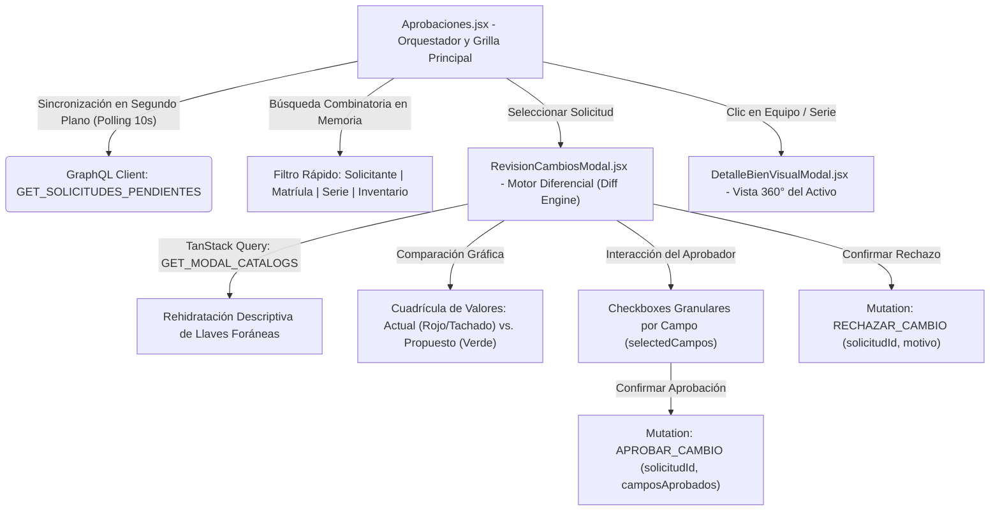
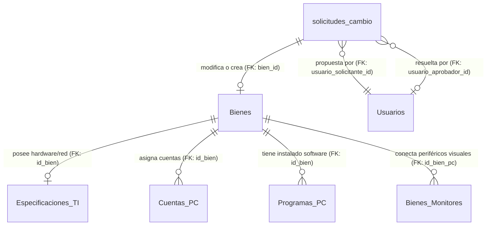
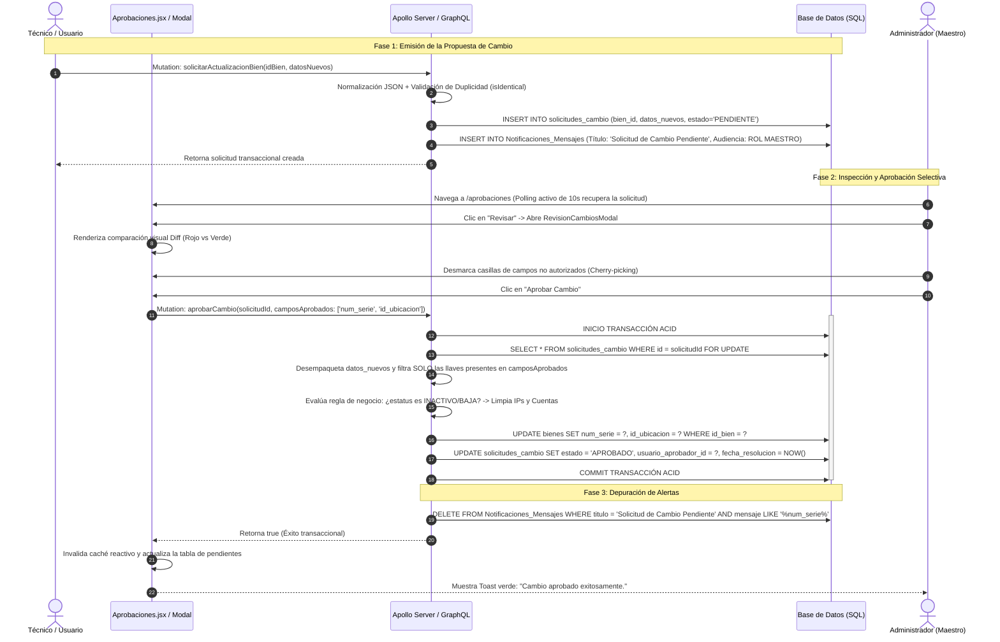

# Manual Técnico Oficial: Módulo de Gestión y Control de Aprobaciones de Cambios (`SolicitudCambio`)

## 1. Descripción General

El módulo de **Control de Aprobaciones de Cambios** representa el núcleo de gobierno de datos, auditoría de configuración y aseguramiento de la calidad operacional dentro del **Ecosistema de Gestión de Activos Institucionales** de la Delegación Nayarit – IMSS. Su objetivo funcional primordial es actuar como una barrera arquitectónica transaccional de dos etapas (Solicitante Operativo vs. Aprobador de Nivel Maestro/Administrador) que intercepta, inspecciona, valida y autoriza o desestima cualquier modificación, actualización o alta de activos tecnológicos antes de impactar y mutar los repositorios canónicos de la institución.

En un entorno hospitalario y administrativo altamente crítico, la integridad del catálogo de hardware, direcciones de red y asignaciones de resguardo no puede estar sujeta a modificaciones directas sin supervisión. Este módulo soluciona dicha problemática aislando las peticiones en un área transaccional de cuarentena (`solicitudes_cambio`), donde se comparan los valores vigentes contra las propuestas entrantes, permitiendo:
1. **Auditoría Diferencial Granular:** Revisión campo por campo entre la configuración actual del activo y la propuesta enviada por el usuario o por agentes automatizados de escaneo (WMI/Sincronizadores).
2. **Aprobación Selectiva (Cherry-Picking):** Capacidad del administrador para aprobar únicamente un subconjunto específico de los campos solicitados, descartando cambios erróneos o no autorizados dentro de un mismo paquete transaccional.
3. **Trazabilidad y Rendición de Cuentas:** Registro inmutable del autor de la solicitud (`usuario_solicitante_id`), el supervisor que resolvió el trámite (`usuario_aprobador_id`), la marca de tiempo exacta (`fecha_resolucion`) y las justificaciones o motivos en caso de rechazo (`comentarios`).

---

## 2. Arquitectura del Frontend

La capa de presentación para el módulo de aprobaciones está construida en **React (v18+)** utilizando **Tailwind CSS** para una estilización limpia y responsiva, apoyándose en **TanStack Query (v5)** para la sincronización reactiva de catálogos e interactuando con el backend mediante un cliente ligero GraphQL (`graphql-request`).



### Componentes Principales

1. **`Aprobaciones.jsx` (Orquestador de Solicitudes y Panel de Control Paginado):**
   Actúa como el controlador principal de la ruta `/aprobaciones`. Es responsable de presentar la lista de peticiones pendientes y orquestar el flujo de revisión:
   - **Sincronización Continua Silenciosa (Background Polling):** Para mantener al equipo de administración al tanto de las peticiones en tiempo real sin saturar la experiencia de usuario ni generar parpadeos visuales, implementa un temporizador `setInterval` de 10 segundos que ejecuta `fetchSolicitudes(false)` (modo silencioso sin activar el loader global).
   - **Motor de Filtrado Client-Side:** Dado que el volumen de solicitudes pendientes concurrentes es gestionable en memoria, implementa un filtro combinatorio multidimensional sobre el estado `solicitudes` que evalúa coincidencias por nombre completo del solicitante, matrícula institucional, número de serie o número de inventario del equipo (`s.bien?.num_inv`).
   - **Clasificador Visual de Tipología Transaccional:** Evalúa la estructura del JSON almacenado en `datos_nuevos` para etiquetar el trámite: si el objeto contiene la bandera `_esCreacion: true`, el registro se clasifica con un distintivo azul de **Creación** (un activo nuevo en proceso de incorporación); en caso contrario, se identifica en color ámbar como una **Actualización** sobre el parque tecnológico existente.

2. **`RevisionCambiosModal.jsx` (Motor de Auditoría Diferencial y Aprobación Selectiva):**
   Componente modal altamente técnico especializado en el análisis de discrepancias de datos. Sus características distintivas incluyen:
   - **Traducción En Caliente de Catálogos (Foreign Key Mappers):** Utiliza un hook de TanStack Query (`CATALOGS_QUERY`) con un `staleTime` de 5 minutos para descargar los catálogos institucionales (`catUnidades`, `catSegmentos`, `ubicaciones`, `catCategoriasActivo`, `usuarios`). La función utilitaria `formatValue()` cruza estos catálogos contra los IDs crudos enviados en la solicitud (ej. convierte `id_segmento: 4` en `"4 - Jefatura de Servicios Administrativos"`), permitiendo al supervisor validar semánticamente el cambio sin recordar códigos numéricos.
   - **Motor Visual de Diferencias (Diff Grid):** Compara el estado consolidado actual del bien (`bienActual` y su especificación `specActual`) frente al objeto transaccional `datosNuevos`. Filtra automáticamente metadatos de control (`_esCreacion`, `id_bien`, `especificacionTI`, `_idBienTemporal`) y renderiza una fila comparativa interactiva únicamente para las propiedades con modificaciones detectadas (`hayCambio`).
   - **Control de Aprobación Granular por Campo (Cherry-Picking):** Mantiene un estado reactivo local (`selectedCampos`) donde cada propiedad modificada cuenta con una casilla de verificación (`checkbox`). El administrador puede hacer clic sobre cualquier fila para excluir campos sospechosos o erróneos. Al pulsar en *"Aprobar Cambio"*, el componente compila y envía exclusivamente las llaves marcadas (`aprobados`), garantizando que el backend aplique de forma quirúrgica solo las modificaciones validadas.

### Manejo de Estado y Hooks

- **Estado Local Operacional (`useState` / `useEffect` / `useCallback`):**
  - El orquestador `Aprobaciones.jsx` administra el ciclo de carga (`loading`), la colección de peticiones (`solicitudes`), el término de búsqueda (`searchTerm`) y los punteros a modales activos (`selectedSolicitud` y `visualModalBienId`).
  - El uso de `useCallback` sobre `fetchSolicitudes` asegura la estabilidad referencial para el efecto de temporización (`setInterval`), previniendo fugas de memoria o peticiones duplicadas al re-renderizar el árbol de componentes.
- **Sincronización Estática de Catálogos (`useQuery` en Modal):**
  - `RevisionCambiosModal` aísla la carga de catálogos bajo la llave `['modalCatalogs']`. Al abrirse el modal, si los datos están en caché por el `staleTime`, la comparación visual es instantánea de 0ms, ofreciendo una experiencia fluida.

### Integración GraphQL

La capa de servicios en el frontend (`src/api/aprobaciones.queries.js`) define las operaciones contractuales consumidas por `gqlClient`:

- **Consultas (`Queries`):**
  - `GET_SOLICITUDES_PENDIENTES`: Solicita la lista de trámites pendientes recuperando un árbol profundo que rehidrata la entidad `bien` con sus sub-modelos: `modelo { descrip_disp }`, `especificacionTI`, `cuentasPC` y `monitores { monitor { modelo { marca } } }`. Además, extrae la información del `solicitante` (`nombre_completo`, `matricula`).
- **Mutaciones (`Mutations`):**
  - `APROBAR_CAMBIO`: Invoca la mutación `aprobarCambio(solicitudId: $solicitudId, camposAprobados: $camposAprobados)`. El envío del arreglo de strings `camposAprobados` es la pieza clave para la autorización selectiva.
  - `RECHAZAR_CAMBIO`: Ejecuta `rechazarCambio(solicitudId: $solicitudId, motivo: $motivo)`, adjuntando la explicación opcional redactada por el supervisor para cerrar el ciclo documental.

---

## 3. Arquitectura del Backend

El backend se ejecuta sobre **Node.js / TypeScript** operando con **TypeORM** sobre **SQL Server / MySQL**, exponiendo su contrato relacional a través de **Apollo Server**.

### Resolvers (`src/graphql/resolvers/solicitudesCambio.resolver.ts`)

Los resolvers concentran reglas de validación transaccional, normalización de datos y descarte automático de notificaciones:

1. **Resolver de Consulta `Query.obtenerSolicitudesPendientes`:**
   - Implementa control perimetral estricto mediante `requireAuth(context)` y `requireRole(context, [ROLES.MAESTRO])`, restringiendo el acceso exclusivamente a las cuentas con privilegios de nivel Maestro u homologados.
   - Consulta el repositorio de `SolicitudCambio` filtrando por `estado = 'PENDIENTE'` y ordenando de manera descendente por `fecha_solicitud` (`ORDER BY fecha_solicitud DESC`).

2. **Resolver de Creación de Solicitud `Mutation.solicitarActualizacionBien`:**
   - **Sanitización para Agentes Automatizados:** Si la petición es despachada por el usuario o demonio de auto-sincronización institucional (`process.env.AUTOSYNC_USER` o `ti_autosync`), el resolver elimina preventivamente modificaciones sobre cuentas de usuario (`cuentasList`, `cuenta_windows`, `correo`, `tipo_user`), preservando la autoridad administrativa de las cuentas asignadas por RH/TI.
   - **Normalización e Detección de Duplicidades (`normalizeForCompare` & `isIdentical`):** Para evitar la saturación de la bandeja de entrada con envíos repetidos del mismo usuario, el resolver ordena alfabéticamente las llaves de los objetos JSON y ordena los arreglos internos por número de serie o cuenta. Si el usuario ya contaba con una solicitud en estado `PENDIENTE` para el mismo bien y el payload es idéntico al almacenado, el sistema lanza un `ConflictError` (*"Ya habías mandado esta solicitud"*). Si los datos difieren, actualiza in-place el registro pendiente sin crear registros redundantes.
   - **Alta de Bienes Transaccionales en Cuarentena (`_esCreacion: true`):** Cuando la solicitud corresponde a la creación de un nuevo activo, verifica que no exista previamente el número de serie o inventario en la tabla canónica de `Bienes`. De ser único, inicia una transacción ACID donde inserta el activo temporalmente con el estatus `PENDIENTE_APROBACION`, creando en cascada sus registros de `EspecificacionTI`, `ProgramasPC`, `CuentaPC` y `Monitores` antes de emitir la alerta al rol Maestro.

3. **Resolver de Resolución `Mutation.aprobarCambio`:**
   Orquesta la mutación canónica dentro de una transacción (`AppDataSource.transaction`):
   - **Segregación Lógica de Campos Mapeados:** Desempaqueta `datos_nuevos` y filtra las llaves según el arreglo `camposAprobados`. Utiliza el diccionario de traducción `WMI_TO_DB_MAP` (ej. traduce `'usuario_pc'` a `'cuenta_windows'`) y clasifica cada campo en su tabla de destino correspondiente:
     - `BIEN_FIELDS`: Mutaciones a la tabla `bienes`.
     - `SPEC_FIELDS`: Mutaciones a la tabla `especificaciones_ti`.
     - `CUENTA_FIELDS`: Mutaciones a la tabla `cuentas_pc`.
   - **Regla de Negocio de Limpieza por Inactivación (Depuración Automatizada):** Si el campo `estatus_operativo` aprobado cambia a un estado de baja o desuso (`INACTIVO`, `BAJA`, `P_BAJA`), el motor blanquea sistemáticamente la dirección IP (`dir_ip = null`), nombre de host, sistema operativo y puertos en `EspecificacionTI`, y fuerza el vaciado en base de datos de los arreglos de cuentas (`cuentasList`) y software (`programas`), liberando recursos lógicos en el inventario delegacional.
   - **Sincronización en Cascada:** Ejecuta los `manager.update` o `manager.save` necesarios sobre las entidades relacionales y llama a la subrutina `procesarMonitoresHelper(manager, idBien, monitores, true)` para afiliar o desvincular periféricos visuales.
   - **Cierre del Ciclo:** Marca la solicitud con estado `APROBADO`, estampa la firma del usuario aprobador (`usuario_aprobador_id`) y ejecuta `resolverNotificacionesSolicitud()`.

### Entidades de Base de Datos

Las operaciones del módulo de aprobaciones operan sobre un modelo relacional normalizado, transaccional y altamente cohesionado (`src/entities/*.ts`), articulando el ciclo de revisión y propagación de cambios hacia el inventario tecnológico institucional:



1. **`SolicitudCambio` (Tabla: `solicitudes_cambio`):**
   Entidad cabecera y cuarentena transaccional que aísla cualquier propuesta de modificación o alta antes de su impacto en el parque informático. Almacena la llave primaria autoincremental (`id` int), la referencia identificadora al equipo (`bien_id` uniqueidentifier nullable, actuando como FK hacia `Bienes.id_bien` o ID temporal en creaciones), la llave foránea del autor operativo de la propuesta (`usuario_solicitante_id` int not null FK a `Usuarios.id_usuario`), la carga útil serializada con el diferencial de campos propuestos (`datos_nuevos` simple-json/nvarchar(max)), el estatus del ciclo de vida transaccional (`estado` varchar(20), con valor por defecto `'PENDIENTE'`), la marca de tiempo de recepción (`fecha_solicitud` datetime default `GETDATE()`), la llave foránea del directivo o administrador superior que autorizó o desestimó la petición (`usuario_aprobador_id` int nullable FK a `Usuarios.id_usuario`), la fecha exacta del dictamen final (`fecha_resolucion` datetime nullable) y las notas o justificación técnica en caso de rechazo (`comentarios` nvarchar(max) nullable).
2. **`Bien` (Tabla: `Bienes`):**
   Entidad canónica central del inventario informático institucional que resguarda la identidad y asignación patrimonial de cada equipo. Almacena la llave primaria universal (`id_bien` uniqueidentifier), el número de serie de fabricante (`num_serie` varchar(100)), el número de inventario oficial (`num_inv` varchar(100)), el estado de operación dentro del ciclo de vida (`estatus_operativo` varchar(50), e.g., `'OPERATIVO'`, `'PENDIENTE_APROBACION'`, `'BAJA'`), la firma criptográfica para validación física (`qr_hash` varchar(255)), así como las llaves foráneas de adscripción paramétrica y física (`clave_modelo`, `id_categoria`, `id_unidad_medida`, `id_segmento`, `id_ubicacion`, `clave_unidad_ref`, `id_usuario_resguardo`). Durante la resolución exitosa de una solicitud, esta tabla recibe las mutaciones validadas en `camposAprobados`.
3. **`Usuario` (Tabla: `Usuarios`):**
   Entidad de seguridad, control de acceso y directorio jerárquico del personal institucional. Almacena la llave primaria (`id_usuario` int autoincremental), el número de matrícula institucional (`matricula` varchar(50)), el nombre completo del servidor público (`nombre_completo` varchar(200)), correo electrónico (`correo` varchar(150)) y nivel de rol en el sistema (`id_rol` int FK a `Cat_Roles`). Ejerce una doble relación hacia las solicitudes: como actor emisor (`usuario_solicitante_id`) que desencadena el flujo transaccional y como actor auditor (`usuario_aprobador_id`) con rol Maestro que convalida y sella legalmente la modificación.
4. **`EspecificacionTI` (Tabla: `Especificaciones_TI`):**
   Entidad relacional 1:1 satélite de `Bienes` orientada a la configuración técnica, telemetría y conectividad de red del hardware. Almacena la referencia primaria y foránea al activo (`id_bien` uniqueidentifier FK a `Bienes.id_bien`), procesador (`cpu_info` varchar(150)), memoria RAM (`ram_gb` int), capacidad de almacenamiento (`almacenamiento_gb` int), direcciones de red física y lógica (`mac_address` varchar(50), `dir_ip` varchar(50), `dir_mac` varchar(50)), infraestructura de conectividad (`puerto_red` varchar(50), `switch_red` varchar(100)), nombre de host de red (`nombre_host` varchar(100)), sistema operativo (`modelo_so` varchar(150)), número de serie de licencia (`windows_serial` varchar(150)) y fecha de último escaneo automatizado (`last_scan` datetime). Si se aprueba un cambio a estatus `'INACTIVO'` o `'BAJA'`, sus campos de red y host son purgados en automático.
5. **`CuentaPC` (Tabla: `Cuentas_PC`):**
   Entidad relacional 1:N que registra perfiles locales o de dominio que inician sesión en el equipo resguardado. Almacena la llave primaria (`id_cuenta` int autoincremental), la llave foránea al activo (`id_bien` uniqueidentifier FK a `Bienes`), el identificador de cuenta o usuario de Windows (`cuenta_windows` varchar(100)), el correo electrónico asociado (`correo` varchar(150)) y el nivel de privilegio en el sistema operativo (`tipo_user` varchar(50), e.g., `'Administrador'`, `'Estándar'`). Su colección es reemplazada de manera transaccional cuando el aprobador autoriza el bloque `cuentasList`.
6. **`ProgramasPC` (Tabla: `Programas_PC`):**
   Entidad relacional 1:N que mantiene el inventario de software y paquetería detectada en cada activo de cómputo. Almacena la llave primaria (`id_programa` int autoincremental), la llave foránea del equipo (`id_bien` uniqueidentifier FK a `Bienes`), el título del software (`nombre_programa` varchar(100)), versión instalada (`version` varchar(50)) y fecha de despliegue (`fecha_instalacion` datetime nullable). Se actualiza en cascada al aprobarse la propiedad transaccional `programas`.

---

## 4. Flujo de Ejecución (Data Flow)

El siguiente diagrama y secuencia lógica describen el recorrido end-to-end desde que el usuario propone un cambio hasta que la interfaz refleja la aprobación selectiva y el sistema limpia las notificaciones:



---

## 5. Fragmentos de Código Clave (Snippets)

### Snippet 1 (Frontend): Motor de Comparación Diferencial y Aprobación Granular (`RevisionCambiosModal.jsx`)

Este fragmento ilustra cómo el modal inspecciona dinámicamente las propiedades del JSON propuesto frente a las del activo actual. Al renderizar cada propiedad modificada (`hayCambio`), proporciona una casilla de verificación reactiva conectada al estado `selectedCampos`, permitiendo al supervisor aprobar subconjuntos de datos de manera granular.

```jsx
// src/components/RevisionCambiosModal.jsx (Líneas 290-330)
return (
  <div
    key={campo}
    onClick={() => !esCreacion && toggleCampo(campo)}
    className={`grid ${esCreacion ? 'grid-cols-[1fr]' : 'grid-cols-[auto_1fr_auto_1fr] cursor-pointer hover:bg-gray-100 dark:hover:bg-gray-600'} gap-3 items-center px-4 py-3 rounded-xl transition-colors ${
      hayCambio && selectedCampos[campo] ? 'bg-amber-50 dark:bg-amber-900/20' : 'bg-gray-50 dark:bg-gray-900'
    } ${!selectedCampos[campo] ? 'opacity-50 grayscale' : ''}`}
  >
    {!esCreacion && (
      <div className="flex items-center justify-center">
        {/* Checkbox transaccional: su estado determina si el campo viaja en camposAprobados */}
        <input 
          type="checkbox" 
          checked={!!selectedCampos[campo]} 
          onChange={() => {}} 
          className="w-4 h-4 text-green-600 dark:text-green-400 rounded border-gray-300 focus:ring-green-500 cursor-pointer"
        />
      </div>
    )}

    {/* Valor actual registrado en la base de datos (tachado si cambió) */}
    <div>
      <p className="text-xs font-medium text-gray-400 mb-0.5">{label}</p>
      <div className={`text-sm ${hayCambio ? 'text-red-500 line-through' : 'text-gray-600 dark:text-gray-400'}`}>
        {renderValueText(valorActual)}
      </div>
    </div>

    <div className="flex items-center justify-center">
      <ArrowRight className={`w-4 h-4 ${hayCambio ? 'text-amber-500' : 'text-gray-300'}`} />
    </div>

    {/* Valor propuesto por el solicitante */}
    <div>
      <p className="text-xs font-medium text-gray-400 mb-0.5">{label}</p>
      <div className={`text-sm font-semibold ${hayCambio ? 'text-green-600 dark:text-green-400' : 'text-gray-600 dark:text-gray-400'}`}>
        {renderValueText(valorNuevo)}
      </div>
    </div>
  </div>
);
```

---

### Snippet 2 (Backend): Filtrado Granular Selectivo y Reglas de Depuración por Baja (`solicitudesCambio.resolver.ts`)

El siguiente bloque del resolver `aprobarCambio` demuestra cómo el backend recibe el arreglo `camposAprobados` e ignora de forma estricta cualquier llave no autorizada por el supervisor. Asimismo, expone la regla de negocio que blanquea metadatos de red y software cuando un equipo pasa a estatus de inactividad o baja.

```typescript
// src/graphql/resolvers/solicitudesCambio.resolver.ts (Líneas 306-351)
for (const [key, value] of Object.entries(datos)) {
  if (key === '_esCreacion' || key === 'cuentasList' || key === 'monitores') continue;

  // REGLA CRÍTICA DE CHERRY-PICKING: Si el front manda camposAprobados, ignorar los no autorizados
  if (camposAprobados && !camposAprobados.includes(key)) continue;

  const dbKey = WMI_TO_DB_MAP[key] || key;
  let finalValue = value;
  if (finalValue === '' && ['id_segmento', 'id_ubicacion', 'id_categoria', 'id_unidad_medida', 'id_usuario_resguardo'].includes(dbKey)) {
    finalValue = null;
  }

  if (CUENTA_FIELDS.includes(dbKey)) {
    cuentaUpdates[dbKey] = finalValue;
  } else if (SPEC_FIELDS.includes(dbKey)) {
    specUpdates[dbKey] = (dbKey === 'last_scan' && finalValue) ? new Date(finalValue as string) : finalValue;
  } else if (BIEN_FIELDS.includes(dbKey)) {
    bienUpdates[dbKey] = finalValue;
  }
}

// REGLA DE NEGOCIO: Depuración automática de conectividad al aprobar bajas o inactividad
if (['INACTIVO', 'BAJA', 'P_BAJA'].includes(bienUpdates.estatus_operativo || '')) {
  specUpdates.dir_ip = null;
  specUpdates.nombre_host = null;
  specUpdates.modelo_so = null;
  specUpdates.version_office = null;
  specUpdates.windows_serial = null;
  specUpdates.last_scan = null;
  specUpdates.puerto_red = null;
  specUpdates.switch_red = null;
  
  datos.cuentasList = [];
  datos.programas = [];
  Object.keys(cuentaUpdates).forEach(k => delete cuentaUpdates[k]);
  
  // Forzar vaciado transaccional en arreglos de cuentas y programas
  if (camposAprobados) {
    if (!camposAprobados.includes('cuentasList')) camposAprobados.push('cuentasList');
    if (!camposAprobados.includes('programas')) camposAprobados.push('programas');
  }
}
```

---

### Snippet 3 (Backend): Normalización Recursiva y Prevención de Solicitudes Duplicadas (`solicitudesCambio.resolver.ts`)

En la mutación `solicitarActualizacionBien`, este algoritmo garantiza la idempotencia operacional. Normaliza recursivamente objetos y arreglos para comparar si la propuesta entrante es idéntica a una solicitud previa pendiente, protegiendo a la base de datos contra peticiones redundantes.

```typescript
// src/graphql/resolvers/solicitudesCambio.resolver.ts (Líneas 143-167)
const normalizeForCompare = (obj: any): any => {
  if (Array.isArray(obj)) {
    const sorted = obj.map(normalizeForCompare);
    // Ordenar arreglos de objetos por identificadores clave (serie, cuenta o programa) para asegurar orden canónico
    if (sorted.length > 0 && typeof sorted[0] === 'object' && sorted[0] !== null) {
      sorted.sort((a: any, b: any) => {
        const ka = a.num_serie || a.cuenta_windows || a.nombre_programa || JSON.stringify(a);
        const kb = b.num_serie || b.cuenta_windows || b.nombre_programa || JSON.stringify(b);
        return String(ka).localeCompare(String(kb));
      });
    }
    return sorted;
  }
  if (obj && typeof obj === 'object') {
    return Object.keys(obj).sort().reduce((acc: any, key) => { 
      acc[key] = normalizeForCompare(obj[key]); 
      return acc; 
    }, {});
  }
  return obj;
};

const isIdentical = (obj1: any, obj2: any) => {
  return JSON.stringify(normalizeForCompare(obj1)) === JSON.stringify(normalizeForCompare(obj2));
};

// Verificación transaccional contra envíos duplicados en cola pendiente
const existeSolicitud = await repo.findOne({ where: { bien_id: idBien, estado: 'PENDIENTE' } });
if (existeSolicitud) {
  if (isIdentical(existeSolicitud.datos_nuevos, parsed)) {
    throw new ConflictError('Ya habías mandado esta solicitud.');
  } else {
    existeSolicitud.datos_nuevos = parsed; // Actualiza in-place la propuesta previa si hubo variantes
    const res = await repo.save(existeSolicitud);
    await notificarCambioPendiente(context.user, parsed, idBien);
    return res;
  }
}
```
