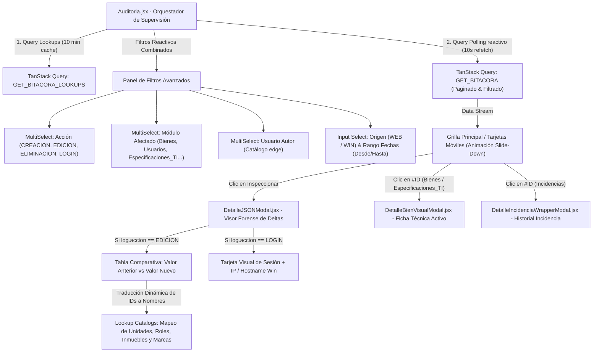
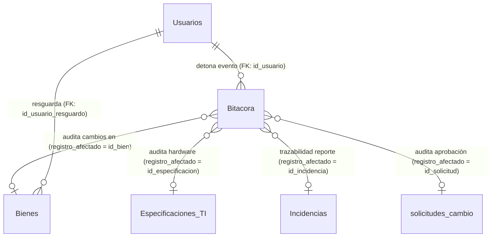
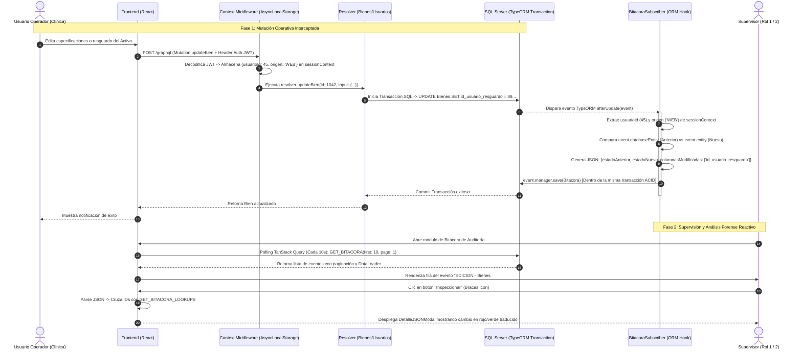

# Manual Técnico Oficial: Módulo de Bitácora de Auditoría Institucional (`Bitacora`)

## 1. Descripción General

El módulo de **Bitácora de Auditoría Institucional** constituye el motor de trazabilidad, ciberseguridad, rendición de cuentas y supervisión transaccional del **Ecosistema de Gestión de Activos Institucionales** de la Delegación Nayarit – IMSS. Su objetivo funcional es registrar, inmutabilizar y auditar en tiempo real cualquier mutación de estado física o lógica que ocurra sobre el patrimonio tecnológico, la infraestructura de red, la gestión de identidades y los catálogos del sistema.

En un ecosistema de alta criticidad paramédica y administrativa, la pérdida, modificación no autorizada o alteración deliberada de las especificaciones de hardware, asignaciones de resguardo o permisos de usuario representa un riesgo operativo severo. Para mitigarlo, la **Bitácora de Auditoría** opera bajo los siguientes pilares arquitectónicos:

1. **Inmutabilidad Operativa (Sólo Lectura):** A diferencia de otros catálogos operacionales, la bitácora es una estructura transaccional de **solo adición y consulta**. Ningún usuario, ni siquiera la autoridad máxima del sistema (`Rol 1 - Maestro`), posee endpoints o mutaciones habilitadas para modificar, depurar o sobrescribir un evento registrado.
2. **Interceptación Global y Transaccional (Agnóstica a la Lógica de Presentación):** El registro de eventos no depende de llamadas explícitas o repetitivas en los controladores REST/GraphQL, sino que se captura a nivel de capa ORM mediante un **Event Subscriber de TypeORM (`BitacoraSubscriber`)**. Toda sentencia SQL `INSERT`, `UPDATE` o `DELETE` ejecutada por las peticiones del backend es interceptada dentro del mismo contexto transaccional ACID (`event.manager.save`).
3. **Segregación Estricta de Acceso (RBAC):** La consulta e inspección forense de la bitácora está restringida criptográficamente en los resolvers de GraphQL. Exclusivamente los perfiles de mando delegacional (**`Maestro - Rol 1`**) autorizados mediante JWT pueden consultar el historial de eventos. Los perfiles operativos o estándar carecen de visibilidad sobre estas trazas.
4. **Trazabilidad Diferencial (Deltas JSON):** En lugar de almacenar cadenas estáticas, el motor captura fotogramas estructurados del cambio. En operaciones de edición (`EDICION`), el sistema serializa en formato JSON tanto el **Estado Anterior** (`estadoAnterior`) como el **Estado Nuevo** (`estadoNuevo`) y calcula explícitamente el arreglo de **Columnas Modificadas** (`columnasModificadas`), permitiendo al Frontend renderizar tablas comparativas exactas atributo por atributo.
5. **Detección Multi-Plataforma y Conmutación Contextual (`WEB` vs `WIN`):** A través del almacenamiento local asíncrono de Node.js (`AsyncLocalStorage`), cada traza asocia automáticamente la identidad de autoría (`id_usuario`), la dirección IP/dispositivo y la plataforma de origen (`WEB` para navegadores institucionales o `WIN` para agentes de inventario automático instalados en computadoras locales).

---

## 2. Arquitectura del Frontend

La capa de presentación del módulo está construida en **React (v18+)** con **Tailwind CSS**, operando bajo el paradigma de componentes funcionales puros. La orquestación del estado remoto, paginación, caché reactivo y políticas de auto-actualización se gestiona mediante **TanStack Query (v5)** comunicándose con el backend mediante **GraphQL Request**.



### Componentes Principales

1. **`Auditoria.jsx` (Vista Principal / Contenedor):**
   - Actúa como el controlador visual de la página. Mantiene un diseño responsivo híbrido: para resoluciones de escritorio (`md:block`) presenta una tabla densa de ancho fijo (`table-fixed`) optimizada para análisis rápido de grandes volúmenes de datos; para dispositivos móviles (`md:hidden`) transforma cada registro en tarjetas interactivas independientes.
   - Cuenta con una cabecera de estado operativo visual ("Modo Supervisión" con ícono ámbar) y un botón de despliegue animado para el panel de filtros avanzados con contador dinámico de eventos en vivo (`totalCount`).

2. **`DetalleJSONModal` (Visor Forense e Inspector de Cambios):**
   - Es el componente especializado encargado de procesar e interpretar la columna cruda `detalles_movimiento`. Utiliza la función auxiliar segura `parseDetalles(jsonStr)` protegida con bloques `try/catch` para prevenir caídas de UI ante cadenas malformadas.
   - **Modo Comparativa de Edición (`isEdicion`):** Si el registro corresponde a una `EDICION`, desglosa el JSON estructurado e itera exclusivamente sobre `columnasModificadas`. Renderiza una tabla comparativa a tres columnas: *Propiedad*, *Valor Anterior* (con sombreado y tipografía en rojo monoespaciado) y *Valor Nuevo* (con sombreado y tipografía en verde monoespaciado).
   - **Traducción Relacional en Tiempo Real (`COLUMN_LABELS` & Mapeo de Catálogos):** Convierte llaves técnicas de base de datos (`id_usuario`, `id_inmueble`, `id_segmento`, `estatus`, etc.) en etiquetas claras. Además, utiliza los diccionarios cargados en caché por `GET_BITACORA_LOOKUPS` para reemplazar en tiempo de ejecución IDs numéricos por descripciones legibles (ej. transformar `id_rol: 1` en `MAESTRO (1)`, o `id_inmueble: 14` en la descripción real de la unidad médica).
   - **Navegación Transversal Inteligente:** Si en la cabecera del modal o en los campos modificados se detecta la referencia a una entidad auditada compatible (`Bienes`, `Especificaciones_TI` o `Incidencias`), genera enlaces dinámicos hipervinculados que disparan sub-modales (`DetalleBienVisualModal` o `DetalleIncidenciaWrapperModal`) sin perder el contexto de la bitácora.

3. **`MultiSelect` (Selector Múltiple de Filtros):**
   - Componente UI reutilizable que permite a los auditores seleccionar simultáneamente múltiples acciones, módulos o usuarios autores para realizar consultas cruzadas complejas sin recargar la interfaz.

### Manejo de Estado y Hooks

- **Estado Local (`useState`):**
  - Controla la paginación local (`currentPage`, `pageInput`), la apertura y paso de payload hacia los modales (`modalLog`, `visualModalBienId`, `visualModalIncidenciaId`) y el estado de visibilidad del panel de búsqueda (`showFilters`).
  - Almacena los arreglos de criterios seleccionados: `filterAccion`, `filterModulo`, `filterUsuario`, `filterOrigen`, `filterFechaDesde` y `filterFechaHasta`. Cada vez que el operador altera cualquier criterio de filtrado, un manejador reinicia automáticamente la paginación a la primera página (`setCurrentPage(1)`).

- **Caché Reactivo y Polling en Vivo (`useQuery`):**
  - **Catálogos Auxiliares (`['bitacora-lookups']`):** Consulta en segundo plano la lista completa de usuarios, categorías, unidades de medida, proveedores, segmentos, modelos e inmuebles mediante `GET_BITACORA_LOOKUPS`. Su tiempo de obsolescencia (`staleTime`) se fija en **10 minutos** (`10 * 60 * 1000`), evitando peticiones redundantes.
  - **Flujo Principal de Bitácora (`['bitacora', ...filters, currentPage]`):** Encapsula todas las variables de filtro en la clave de query. Está configurada con una estrategia de **Polling Automático (`refetchInterval: 10000`)** y `staleTime: 0`. Esto garantiza que la pantalla del supervisor se actualice de forma reactiva cada 10 segundos, reflejando instantáneamente cualquier operación realizada por los usuarios en otras terminales de la institución.

### Integración GraphQL

La vista consume dos contratos principales declarados en `src/api/bitacora.queries.js` y dentro de la misma vista:

1. **`GET_BITACORA` (Query Principal):**
   Envia al backend parámetros opcionales tipados (`accion: [String]`, `tabla_afectada: [String]`, `id_usuario: [Int]`, `origen: String`, `fechaDesde: DateTime`, `fechaHasta: DateTime`) y directivas de paginación (`first: $first`, `page: $page`). Retorna una estructura tipo *Connection* compatible con el estándar Relay (`pageInfo` con `totalCount`, `edges.node`).
2. **`GET_BITACORA_LOOKUPS` (Query de Diccionarios):**
   Petición agrupada que extrae en un solo viaje de red las aristas y nodos de todos los catálogos institucionales necesarios para la humanización visual de datos en el inspector forense.

---

## 3. Arquitectura del Backend

El backend en **Node.js + TypeScript** gestiona la persistencia y consulta del módulo desacoplando la captura de eventos del negocio de presentación, aprovechando los mecanismos de eventos profundos del ORM **TypeORM**.

### Resolvers de GraphQL

Ubicados en `src/graphql/resolvers/bitacora.resolver.ts`, gestionan la exposición segura de la información:

1. **`Query.bitacora` (Consulta Principal y Filtros Dinámicos):**
   - **Barrera de Seguridad Dual:** Invoca inmediatamente `requireAuth(context)` para validar el token JWT y `requireRole(context, [ROLES.ADMIN, ROLES.MAESTRO])` para rechazar cualquier intento de acceso de personal de soporte (`Rol 3`) con error de privilegios insuficientes.
   - **Constructor Dinámico de Query (`QueryBuilder`):** Inicializa un alias `b` sobre el repositorio `Bitacora`. Evalúa programáticamente la existencia de arreglos en los argumentos recibidos e inyecta sentencias condicionales preparadas (`IN (:...a)`, `>= :fd`, `<= :fh`) protegiendo el motor contra inyecciones SQL.
   - **Paginación Híbrida (Cursor / Page-based):** Soporta saltos por número de página (`skip((page - 1) * first)`) o por cursores continuos decodificados en Base64 (`b.id_bitacora < :cursor`). Aplica un límite estricto de seguridad `Math.min(first, 200)` para prevenir desbordamientos de memoria por peticiones masivas indebidas.

2. **Field Resolver `Bitacora.usuario`:**
   - Para evitar el colapso de rendimiento conocido como problema `N+1` (ejecutar una consulta SQL independiente por cada una de las 50 filas devueltas para traer el nombre del usuario), delega la resolución relacional al motor por lotes de **DataLoader**: `context.loaders.usuarioLoader.load(parent.id_usuario)`.

3. **Helper Global Exportable (`registrarBitacora`):**
   - Función utilitaria independiente accesible por cualquier módulo (ej. `auth.resolver.ts` durante el `LOGIN`). Extrae el contexto de ejecución local y persiste el evento en bloque protegido por un `try/catch` silencioso que registra en consola (`[Bitacora] Error al registrar`) sin abortar la transacción principal del usuario si la auditoría llegara a fallar.

### Entidades de Base de Datos

El motor de trazabilidad forense opera sobre un modelo relacional de auditoría centralizada y altamente cohesionada (`src/entities/*.ts`), vinculando cada registro inmutable con la identidad jerárquica del operador y con las entidades patrimoniales u operacionales mutadas:



1. **`Bitacora` (Tabla: `Bitacora`):**
   Entidad central e inmutable de registro forense y supervisión institucional. Almacena la llave primaria autoincremental (`id_bitacora` int PK), el identificador del servidor público que ejecutó la operación (`id_usuario` int FK a `Usuarios.id_usuario`), la categorización canónica del evento transaccional (`accion` varchar(50), e.g., `'CREACION'`, `'EDICION'`, `'ELIMINACION'`, `'LOGIN'`), el nombre exacto de la tabla física o módulo relacional mutado (`tabla_afectada` varchar(100), e.g., `'Bienes'`, `'Usuarios'`, `'Especificaciones_TI'`), la clave primaria en formato alfanumérico del registro particular afectado (`registro_afectado` varchar(100), e.g., el `id_bien` o folio de incidencia), el bloque documental de alta capacidad serializado en JSON con los valores diferenciales del delta (`detalles_movimiento` nvarchar(max)), la marca temporal exacta del servidor al momento del commit transaccional (`fecha_movimiento` datetime con default `GETDATE()`), y el identificador de la plataforma o canal informático de origen (`origen` varchar(50), categorizado en `'WEB'` para navegadores institucionales o `'WIN'` para agentes de inventario automáticos).
2. **`Usuario` (Tabla: `Usuarios`):**
   Entidad rectora de gobernanza de identidades y autoría operacional. Su llave primaria (`id_usuario` int PK) actúa como llave foránea estricta y obligatoria en cada traza de auditoría (`Bitacora.id_usuario`). Almacena los atributos biográficos e institucionales del operador (`nombre_completo`, `matricula`, `correo`, `telefono`), así como su nivel jerárquico (`id_rol` int, donde 1=Maestro y 2=Administrador son los únicos perfiles autorizados para leer la tabla `Bitacora`). En el contrato de GraphQL, la resolución de esta relación por cada fila del log se encuentra optimizada por lotes mediante `DataLoader` (`usuarioLoader`).
3. **Entidades Auditadas Relacionadas (`Bien`, `EspecificacionTI`, `Incidencia`, `SolicitudCambio`):**
   Entidades operacionales y patrimoniales que actúan como sujetos de auditoría del sistema. Cuando cualquier mutación afecta la ficha técnica patrimonial (`Bienes`), los componentes de hardware asignados (`Especificaciones_TI`), el flujo de soporte técnico (`Incidencias`) o el dictamen directivo de movimientos (`solicitudes_cambio`), el suscriptor transaccional vincula el ID del sujeto en `registro_afectado` y la entidad en `tabla_afectada`, permitiendo al visor forense del Frontend generar enlaces hipervinculados que abren dinámicamente los expedientes completos del activo o incidencia para una inspección cruzada.

### Reglas de Negocio y Seguridad Interceptora

El corazón de la lógica reside en el suscriptor de eventos `src/subscribers/BitacoraSubscriber.ts`:

1. **Prevención de Bucles Infinitos de Auditoría:**
   En cada hook (`afterInsert`, `afterUpdate`, `afterRemove`), la primera línea evalúa `if (event.metadata.targetName === 'Bitacora' || !event.entity) return;`. Si el motor intentara auditar la propia inserción en `Bitacora`, se generaría un bucle recursivo infinito que saturaría la base de datos.
2. **Propagación Contextual Asíncrona (`AsyncLocalStorage`):**
   Dado que los suscriptores de TypeORM se ejecutan en una capa inferior sin acceso directo a las cabeceras HTTP o al objeto `req/context` de GraphQL, el sistema utiliza `sessionContext.getStore()`. Este almacén en memoria del hilo asíncrono propaga transparentemente el `usuarioId` y el `origen` (`WEB`/`WIN`) desde el middleware de autenticación hasta el suscriptor.
3. **Persistencia Transaccional Estricta (`event.manager.save`):**
   El suscriptor no utiliza un repositorio nuevo o global; invoca explícitamente `await event.manager.save(Bitacora, bitacora)`. Esto garantiza que la inserción del log participe dentro de la **misma transacción SQL** del evento disparador. Si la mutación del activo falla o hace *Rollback*, el registro de auditoría también se revierte, manteniendo consistencia absoluta.
4. **Filtros Anti-Spam y Mitigación de Ruido Operativo:**
   - **Exclusión de Tablas de Alta Frecuencia:** Omite automáticamente operaciones sobre `Notificaciones_Mensajes` y `Notificaciones_Lectura` para evitar inundar la bitácora con lecturas efímeras.
   - **Supresión de Sincronizaciones Automáticas Windows (`WIN`):** Cuando los agentes de escritorio instalados en miles de PCs institucionales sincronizan masivamente inventarios locales de software e inventarios (`Programas_PC`, `Cuentas_PC`) con origen `'WIN'`, el suscriptor suprime la auditoría para preservar el almacenamiento y la limpieza del log.
   - **Exclusión de Usuarios Auto-Sync en Login:** En `auth.resolver.ts`, si la cuenta que inicia sesión corresponde a la matrícula de sincronización desatendida (`process.env.AUTOSYNC_USER` o `'ti_autosync'`), se omite el evento `'LOGIN'`, auditando únicamente sus mutaciones reales sobre activos.

---

## 4. Flujo de Ejecución (Data Flow)

El siguiente diagrama de secuencia ilustra el recorrido completo transaccional y forense desde que un usuario modifica un activo en el sistema hasta que el supervisor inspecciona el cambio en la pantalla de auditoría:



---

## 5. Fragmentos de Código Clave (Snippets)

### Snippet 1: Interceptación Transaccional y Cálculo de Deltas (`BitacoraSubscriber.ts`)
El siguiente bloque demuestra cómo el backend intercepta cualquier actualización relacional del sistema, calcula las columnas modificadas y persiste el registro en el mismo `EntityManager`:

```typescript
// src/subscribers/BitacoraSubscriber.ts
@EventSubscriber()
export class BitacoraSubscriber implements EntitySubscriberInterface {
  async afterUpdate(event: UpdateEvent<any>) {
    // 1. Evitar bucles recursivos sobre la propia tabla de auditoría
    if (event.metadata.targetName === 'Bitacora' || !event.entity) return;

    // 2. Extracción del contexto de ejecución asíncrono (AsyncLocalStorage)
    const store = sessionContext.getStore();
    const usuarioId = store?.usuarioId || event.queryRunner?.data?.usuarioId;
    if (!usuarioId) return;

    const entityId = this.obtenerIdEntidad(event);

    // 3. Serialización exacta del delta: estado anterior, nuevo y propiedades alteradas
    const detalles = JSON.stringify({
      estadoAnterior: event.databaseEntity,
      estadoNuevo: event.entity,
      columnasModificadas: event.updatedColumns.map((col) => col.propertyName),
    });

    // 4. Persistencia ACID garantizada mediante el manager transaccional del evento
    await this.guardarEnBitacora(
      event,
      usuarioId,
      'EDICION',
      event.metadata.tableName,
      entityId,
      detalles
    );
  }
}
```

### Snippet 2: Consulta Segura y Filtrado Dinámico por Roles (`bitacora.resolver.ts`)
Ilustra la protección por barreras RBAC y la construcción dinámica de filtros en SQL Server mediante TypeORM:

```typescript
// src/graphql/resolvers/bitacora.resolver.ts
bitacora: async (_: unknown, { accion, tabla_afectada, id_usuario, origen, fechaDesde, fechaHasta, pagination }, context: GraphQLContext) => {
  // 1. Barrera estricta de seguridad: Solo perfiles directivos (Admin/Maestro)
  requireAuth(context);
  requireRole(context, [ROLES.ADMIN, ROLES.MAESTRO]);

  const qb = AppDataSource.getRepository(Bitacora).createQueryBuilder('b');

  // 2. Inyección dinámica de predicados condicionales seguros
  if (accion && accion.length > 0)                 qb.andWhere('b.accion IN (:...a)',            { a: accion });
  if (tabla_afectada && tabla_afectada.length > 0) qb.andWhere('b.tabla_afectada IN (:...t)',    { t: tabla_afectada });
  if (id_usuario && id_usuario.length > 0)         qb.andWhere('b.id_usuario IN (:...u)',        { u: id_usuario });
  if (origen)                                      qb.andWhere('b.origen = :o',                  { o: origen });
  if (fechaDesde)                                  qb.andWhere('b.fecha_movimiento >= :fd',      { fd: fechaDesde });
  if (fechaHasta)                                  qb.andWhere('b.fecha_movimiento <= :fh',      { fh: fechaHasta });

  const totalCount = await qb.getCount();
  const first = Math.min(pagination?.first ?? 50, 200); // Límite anti-saturación
  
  if (pagination?.page && pagination.page > 0) {
    qb.skip((pagination.page - 1) * first).take(first);
  }
  
  qb.orderBy('b.fecha_movimiento', 'DESC');
  const items = await qb.getMany();
  // ... Construcción y retorno de Relay Connection
}
```

### Snippet 3: Traducción Visual e Inspección Forense en Frontend (`Auditoria.jsx`)
Fragmento del modal forense que procesa la comparativa de deltas JSON y traduce identificadores técnicos a nombres humanos:

```jsx
// src/pages/Auditoria.jsx (Dentro de DetalleJSONModal)
{parsed.columnasModificadas?.map(col => {
  const vAnterior = parsed.estadoAnterior[col];
  const vNuevo = parsed.estadoNuevo[col];

  // Función de formateo y traducción relacional con diccionarios en caché
  const formatVal = (field, val) => {
    if (val === null || val === undefined) return 'N/A';
    if (typeof val === 'boolean') return val ? 'Sí' : 'No';
    
    // Traducción dinámica de llaves foráneas usando catálogos en memoria
    if (catalogs && (field === 'id_usuario' || field === 'id_usuario_resguardo')) {
      const u = catalogs.usuarios?.edges?.find(e => String(e.node.id_usuario) === String(val))?.node;
      if (u) return <span className="text-indigo-600 dark:text-indigo-400 font-bold">{u.nombre_completo} <span className="text-gray-400 font-normal text-[9px]">({val})</span></span>;
    }
    return String(val);
  };

  return (
    <tr key={col} className="hover:bg-gray-50 dark:hover:bg-gray-800/50 transition-colors">
      <td className="px-4 py-3 font-semibold text-gray-700 dark:text-gray-300">
        <p className="text-[11px] uppercase tracking-tight">{COLUMN_LABELS[col] || col}</p>
      </td>
      {/* Resaltado visual diferencial: Rojo para estado anterior, Verde para estado nuevo */}
      <td className="px-4 py-3 font-mono text-[11px] text-red-700 dark:text-red-400 bg-red-50 dark:bg-red-900/20 break-words">
        {formatVal(col, vAnterior)}
      </td>
      <td className="px-4 py-3 font-mono text-[11px] text-green-700 dark:text-green-400 bg-green-50 dark:bg-green-900/20 break-words">
        {formatVal(col, vNuevo)}
      </td>
    </tr>
  );
})}
```

---

## 6. Consideraciones de Rendimiento y Mantenimiento

1. **Estrategia de Indexado SQL:** Para mantener tiempos de respuesta menores a 150ms al consultar una tabla que crece linealmente en cada operación, se debe asegurar en SQL Server la existencia de índices compuestos sobre `(fecha_movimiento DESC, tabla_afectada)` y `(id_usuario, accion)`.
2. **Políticas de Depuración en Frío (Archiving):** Al ser una tabla inmutable de alta transaccionalidad, se recomienda implementar un *job* programado a nivel de base de datos (`SQL Server Agent`) que migre registros mayores a 365 días hacia una tabla histórica (`Bitacora_Historico`) o archivo particionado en frío, manteniendo la ligereza operacional del módulo activo.
3. **Optimización de Consumo por Polling:** El frontend efectúa peticiones de sondeo en segundo plano cada 10 segundos (`refetchInterval: 10000`). Gracias a la configuración de `refetchOnWindowFocus: true`, si la pestaña pierde el foco en el navegador del administrador, TanStack Query pausa o espacia inteligentemente las consultas, evitando consumos innecesarios en el servidor.
