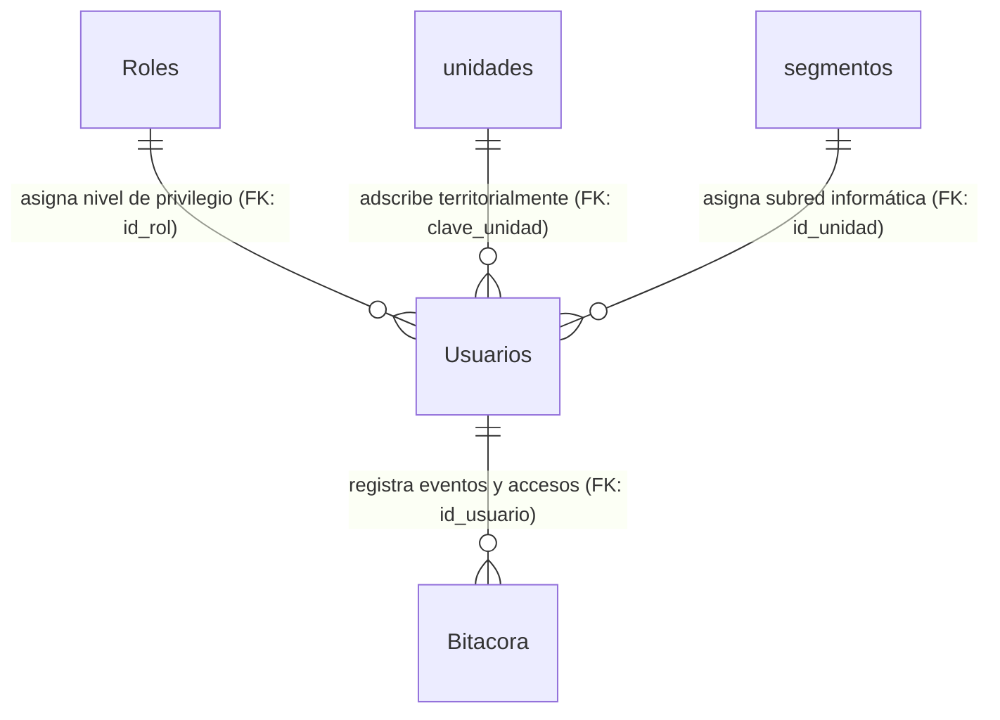
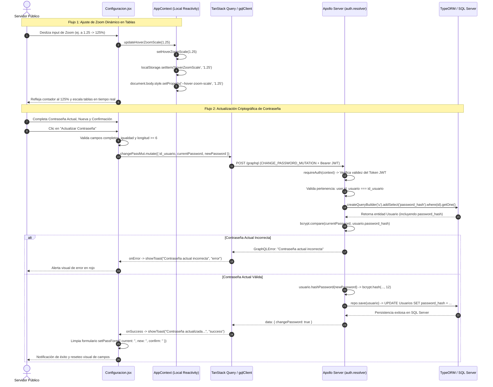

# Manual Técnico Oficial: Módulo de Configuración, Parámetros del Ecosistema y Preferencias del Sistema (`Configuración`)

## 1. Descripción General

El módulo de **Configuración del Sistema y Parámetros del Ecosistema** constituye la interfaz de control centralizado y ajustes personales dentro del **Ecosistema de Gestión de Activos Institucionales** de la Delegación Nayarit – IMSS. Su objetivo funcional es doble: por un lado, centraliza la visualización y gestión de los parámetros operacionales globales del ecosistema institucional (identidad organizacional, políticas de alertas patrimoniales, respaldos automatizados, umbrales de sincronización con agentes de inventario y límites de sesión); por otro lado, proporciona un entorno seguro y altamente especializado para la **gestión de credenciales criptográficas de acceso personal (`ChangePassword`)** y la personalización ergonómica de la interfaz gráfica del usuario mediante **ajustes visuales adaptativos (`Preferencias Visuales`)**.

En una infraestructura hospitalaria y administrativa que opera de manera continua 24/7, este módulo desempeña un rol crítico en la arquitectura de seguridad y usabilidad del sistema al resolver tres aspectos operativos fundamentales:

1. **Autogestión Segura de Identificación y Credenciales:** Permite a cualquier servidor público autenticado (desde personal directivo de la Coordinación de Informática hasta técnicos de soporte en unidades asistenciales) renovar periódicamente y de forma autónoma su contraseña de acceso web (`password_hash`). El proceso elimina la intervención manual de los administradores para mantenimientos rutinarios de credenciales, aplicando rigurosas políticas de verificación de contraseña actual y criptografía asimétrica de factor de trabajo elevado.
2. **Ergonomía Visual y Accesibilidad Dinámica en Tablas de Alta Densidad:** Los módulos operativos del sistema (como Inventario, Incidencias y Garantías) manejan grillas de datos densas con cientos de filas patrimoniales. El módulo de Configuración expone el control sobre el motor de **Zoom Dinámico Interactivo (`hoverZoomScale`)**, una preferencia visual persistente a nivel de navegador que inyecta variables CSS en tiempo real en el árbol DOM institucional (`--hover-zoom-scale`), facilitando la lectura de números de serie, inventarios y descripciones técnicas sin alterar el layout global de la aplicación.
3. **Gobierno y Auditoría de Parámetros Globales del Ecosistema:** Define y visualiza las constantes fundamentales de operación institucional (tales como la delegación adscrita, el nombre de la jefatura superior responsable, umbrales de alerta preventiva para caducidad de garantías —configurado por defecto en 90 días—, periodicidad de sincronización automática con el agente de escritorio de Windows —60 minutos— y tiempos máximos de inactividad de sesión de usuario antes del cierre automático por seguridad —30 minutos—).

---

## 2. Arquitectura del Frontend

La capa de presentación del módulo está construida utilizando **React 19** con diseño funcional en **Tailwind CSS**, integrando gestión de estado global y persistencia local a través del **Contexto de Aplicación (`AppContext`)** y el store de autenticación (**Zustand (`useAuthStore`)**). La comunicación transaccional con el servidor para operaciones mutacionales se orquesta mediante **TanStack Query (v5)** y un cliente tipado **GraphQL Request**.

```mermaid
graph TD
    A["Configuracion.jsx - Vista Principal de Configuración"] -->|Lee Identidad de Sesión| B["useAuthStore (Zustand): usuario actual"]
    A -->|Gestiona Zoom Visual y Notificaciones| C["useApp (AppContext): hoverZoomScale / showToast"]
    
    %% Flujo de Cambio de Contraseña
    A -->|Captura Formulario Pass| D["State: passForm (current, new, confirm)"]
    D -->|Validación Frontend: Longitud >= 6, Coincidencia| E["Mutation: useMutation (TanStack Query)"]
    E -->|Ejecuta Petición GraphQL| F["CHANGE_PASSWORD_MUTATION (auth.queries.js)"]
    F -->|GraphQL Request| G["API Gateway / Apollo Server GraphQL"]
    
    %% Flujo de Preferencias Visuales
    A -->|Ajuste de Slider (Range 1.0 - 1.5)| H["updateHoverZoomScale(val)"]
    H -->|Sincroniza Estado React| I["setHoverZoomScale"]
    H -->|Persiste en Navegador| J["localStorage.setItem('hoverZoomScale', val)"]
    I -->|Efecto Secundario (useEffect)| K["document.body.style.setProperty('--hover-zoom-scale')"]
```

### Componentes Principales

1. **`Configuracion.jsx` (Panel Orquestador de Opciones y Seguridad):**
   Actúa como el componente contenedor principal que renderiza una interfaz distribuida en una cuadrícula responsiva (`grid-cols-1 lg:grid-cols-2`), aislando con precisión las áreas de responsabilidad en dos tarjetas principales encapsuladas dentro de bordes sutiles y sombreados consistentes con el diseño institucional en modo claro y oscuro (`dark:bg-gray-800`):
   - **Tarjeta de Cambio de Contraseña (`Cambiar Mi Contraseña`):** Implementa un formulario controlado altamente reactivo donde cada campo (`currentPassword`, `newPassword`, `confirmPassword`) cuenta con un interruptor local independiente de visibilidad ocular (`showPass.current`, `showPass.new`, `showPass.confirm`) que alterna dinámicamente el atributo HTML `type` entre `'password'` y `'text'`. Esto previene errores de digitación en contraseñas complejas que incluyan caracteres especiales institucionales sin comprometer la seguridad física del terminal en entornos hospitalarios concurrentes.
   - **Tarjeta de Preferencias Visuales Personales (`Preferencias Visuales Personales`):** Expone un control de rango deslizante (`<input type="range">`) acoplado bidireccionalmente con el factor de escala visual de las tablas de datos de todo el ecosistema. Permite graduar el porcentaje de ampliación desde 100% (`1.0`) hasta 150% (`1.5`) en incrementos milimétricos del 5% (`step="0.05"`), mostrando un contador digital computado en caliente (`Math.round(hoverZoomScale * 100)%`).

### Manejo de Estado y Hooks

La página coordina de manera eficiente el estado local, el contexto global de usabilidad y la asincronía de mutaciones web mediante un conjunto de hooks nativos y custom hooks:

- **Hooks de Estado Local (`useState`):**
  - `config`: Administra el diccionario de parámetros organizacionales (institución, coordinación, alertas, temporizadores de sesión y respaldo de datos).
  - `passForm`: Centraliza como objeto inmutable los tres inputs transaccionales del cambio de clave (`current`, `new`, `confirm`).
  - `showPass`: Diccionario de banderas booleanas que rige el estado visual del icono `Eye` / `EyeOff` en los campos de seguridad.
- **Hooks de Gestión Global (`useApp` y `useAuthStore`):**
  - `useAuthStore(s => s.usuario)`: Extrae de manera optimizada el perfil actual autenticado desde el almacén de memoria global, obteniendo su `id_usuario` numérico único necesario para sellar criptográficamente el payload del mutador.
  - `useApp()`: Desestructura `showToast` para retroalimentación instantánea sobre el resultado del cambio de contraseña o guardado de parámetros, así como las primitivas `hoverZoomScale` y `updateHoverZoomScale` encargadas de la reactividad visual en todo el árbol de componentes.
- **Hooks Asíncronos (`useMutation` de TanStack Query):**
  - `changePassMut`: Envuelve la mutación GraphQL `CHANGE_PASSWORD_MUTATION`. Durante el ciclo de vida de la petición (`isPending`), deshabilita preventivamente el botón de envío aplicando una opacidad de carga (`disabled:opacity-60`) y transforma el texto de acción a `"Cambiando..."`. En caso de éxito (`onSuccess`), dispara un brindis informativo de color verde institucional y limpia automáticamente los campos en memoria (`setPassForm`). Ante una excepción del servidor (`onError`), extrae de forma segura el array de errores de GraphQL (`e?.response?.errors?.[0]?.message`) y lo muestra al operador.

### Integración GraphQL

El módulo consume el contrato especificado en `src/api/auth.queries.js`, estableciendo el canal de mutación segura con el motor backend:

- **Mutación Específica (`CHANGE_PASSWORD_MUTATION`):**
  ```graphql
  mutation ChangePassword($id_usuario: ID!, $currentPassword: String!, $newPassword: String!) {
    changePassword(id_usuario: $id_usuario, currentPassword: $currentPassword, newPassword: $newPassword)
  }
  ```
  El cliente envía los identificadores tipados estrictamente como identificadores primitivos (`ID!`) y cadenas seguras (`String!`). Esta mutación devuelve un valor booleano (`true`) en caso de que la validación y actualización en el motor de base de datos SQL concluyan exitosamente.

---

## 3. Arquitectura del Backend

El backend se estructura sobre **Node.js / TypeScript** operando con **Apollo Server** como intérprete de GraphQL y **TypeORM** como motor relacional transaccional conectado a la base de datos central en **SQL Server**.

### Resolvers (`src/graphql/resolvers/auth.resolver.ts`)

La resolución de peticiones de configuración personal y seguridad de cuenta recae en el objeto de resolución `authResolvers.Mutation.changePassword`:

1. **Barrera de Autenticación (`requireAuth`):**
   El resolver intercepta inmediatamente el contexto de ejecución (`GraphQLContext`) verificando que exista un JSON Web Token válido y no expirado en las cabeceras HTTP. Si el usuario no ha iniciado sesión o su token de 8 horas (`env.jwt.expiresIn`) ha caducado, el middleware aborta la ejecución con un error `AuthenticationError (HTTP 401)`.
2. **Validación Autorizada de Identidad (Propiedad del Registro):**
   Para impedir violaciones de privilegios horizontales (donde un usuario intercepte y modifique el `id_usuario` en la petición GraphQL para alterar la contraseña de un compañero), el resolver evalúa estrictamente:
   ```typescript
   if (context.user.id_usuario !== parseInt(id_usuario) && context.user.id_rol !== 1) {
     throw new AuthenticationError('Solo puedes cambiar tu propia contraseña');
   }
   ```
   Esta regla garantiza que únicamente el propio servidor público propietario de la cuenta o un usuario con rol de **Maestro Institucional (`id_rol === 1`)** puedan procesar cambios sobre esa identidad criptográfica.
3. **Recuperación Explícita de Hash Oculto (`QueryBuilder`):**
   Por diseño de seguridad defensiva, la columna `password_hash` en la entidad `Usuario` está configurada con la anotación `@Column({ select: false })`. Para realizar la validación del secreto actual, el resolver construye un `QueryBuilder` explícito que fuerza la selección en memoria de dicha columna:
   ```typescript
   const usuario = await repo
     .createQueryBuilder('u')
     .addSelect('u.password_hash')
     .where('u.id_usuario = :id', { id: id_usuario })
     .getOne();
   ```
4. **Verificación Asíncrona y Re-hashing Transaccional:**
   Una vez recuperada la entidad, el resolver invoca el método del modelo `usuario.validatePassword(currentPassword)`. Si la comparación criptográfica falla, se emite un `ValidationError` con el mensaje *"Contraseña actual incorrecta"*. Si es legítima, se invoca `usuario.hashPassword(newPassword)` y se persiste el nuevo resumen con `repo.save(usuario)`.

### Entidades de Base de Datos

Las operaciones de autenticación, gestión de credenciales y trazabilidad de seguridad operan sobre un modelo relacional normalizado, jerárquico y altamente cohesionado (`src/entities/*.ts`), el cual vincula la identidad criptográfica con el control de acceso institucional:



1. **`Usuario` (Tabla: `Usuarios`):**
   Entidad cabecera o central de identidad y seguridad institucional. Almacena la llave primaria autoincremental (`id_usuario` int), el identificador laboral único institucional (`matricula` varchar(20) unique), el nombre civil completo (`nombre_completo` varchar(100)), el cargo técnico o denominación de puesto (`tipo_usuario` varchar(15) nullable), el correo institucional (`correo_electronico` varchar(70) nullable), el resumen criptográfico de la clave de acceso (`password_hash` varchar(255) nullable configurado con propiedad ORM `select: false` para prevenir exfiltraciones en consultas generales), la llave foránea de jerarquía de control de acceso (`id_rol` int not null default 3 FK a `Roles.id_rol`), el ID numérico del segmento de red (`id_unidad` int nullable FK a `segmentos.id_segmento`), la clave de adscripción física delegacional (`clave_unidad` varchar(50) nullable FK a `unidades.clave`) y el interruptor lógico operacional (`estatus` bit not null default 1). *(Nota técnica: la clase implementa directamente los métodos asíncronos `hashPassword` y `validatePassword` para la gestión criptográfica con factor Bcrypt de 12 rondas).*
2. **`Rol` (Tabla: `Roles`):**
   Entidad paramétrica y catálogo maestro de privilegios institucionales. Almacena la llave primaria (`id_rol` int autoincremental) y el nombre del perfil jerárquico (`nombre_rol` varchar(50) unique, e.g., `'Maestro'`, `'Administrador'`, `'Estándar'`, `'Sin Acceso'`). Su relación 1:N rige las barreras de autorización en middleware y resolvers.
3. **`Bitacora` (Tabla: `Bitacora`):**
   Entidad transaccional de auditoría inmutable donde se registran las transacciones de seguridad del ecosistema (inicios de sesión, cambios de credenciales y modificaciones globales). Almacena la llave primaria (`id_bitacora` int autoincremental), la marca de tiempo exacta del evento (`fecha_hora` datetime not null default getdate()), la llave foránea del autor del evento (`id_usuario` int not null FK a `Usuarios.id_usuario`), el verbo o código de acción (`accion` varchar(100) not null, e.g., `'LOGIN'`, `'CHANGE_PASSWORD'`), el módulo de origen (`modulo` varchar(100) not null), la llave o referencia del registro alterado (`id_registro` varchar(100) nullable) y la estructura de metadatos o contexto de red en formato serializado (`detalles` nvarchar(max) nullable).
4. **`Inmueble` (Tabla: `unidades`):**
   Entidad cabecera de adscripción territorial que tipifica las clínicas y hospitales de la delegación. Almacena la llave primaria alfanumérica (`clave` varchar(50)), el nombre oficial (`descripcion` varchar(100)) y la clave de delimitación geográfica (`clave_zona` varchar(5)), parámetro fundamental que determina si un usuario con rol operativo tiene visibilidad sobre los activos y personal de esa clínica. *(Nota técnica: históricamente conocida como `inmuebles`, la entidad TypeORM mapea de forma directa sobre la tabla consolidada `unidades`).*

### Reglas de Negocio

El módulo impone de manera irrestricta las siguientes reglas de validación pre-persistencia:

1. **Integridad Paramétrica Frontend:** El formulario previene llamadas de red innecesarias si los campos obligatorios están incompletos (`!passForm.current || !passForm.new || !passForm.confirm`).
2. **Simetría de Confirmación:** Se verifica que el secreto nuevo coincida exactamente caracter por caracter (`passForm.new !== passForm.confirm`), lanzando una alerta preventiva inmediata.
3. **Complejidad y Longitud Mínima:** La nueva contraseña está sujeta a una regla estricta de longitud mínima (`passForm.new.length < 6`), garantizando una entropía base antes de ser despachada al servidor.
4. **Autenticidad del Secreto Precedente:** Ninguna cuenta (incluso bajo sesión activa) puede modificar su clave criptográfica sin demostrar conocimiento exacto de la clave en curso mediante la función de comparación hash Bcrypt en el servidor, neutralizando el secuestro de sesiones en terminales desatendidas.
5. **Persistencia Híbrida de Preferencias Visuales:** Las preferencias ergonómicas personales (`hoverZoomScale` y `hoverZoomEnabled`) operan bajo un modelo de **Almacenamiento Local Reactivo (`localStorage`)**. Esto permite que el ajuste de zoom en las tablas del usuario persista inmediatamente de forma ultrarrápida (O(1)) entre recargas del navegador, inyectando variables CSS globales de inmediato sin sobrecargar el servidor con consultas de perfil en cada cambio visual.

---

## 4. Flujo de Ejecución (Data Flow)

El siguiente diagrama secuencial detalla el ciclo de vida completo de una transacción de actualización de contraseña y sincronización ergonómica en el módulo de Configuración:



---

## 5. Fragmentos de Código Clave (Snippets)

### Frontend: Mutación Reactiva y Gestión del Formulario de Seguridad (`src/pages/Configuracion.jsx`)

El siguiente fragmento ilustra cómo el frontend intercepta el evento de envío del formulario, aplica validaciones locales de negocio y dispara el mutador GraphQL integrado con retroalimentación inmediata:

```jsx
// Configuración de mutación con TanStack Query para actualización criptográfica de contraseña
const changePassMut = useMutation({
  mutationFn: (vars) => gqlClient.request(CHANGE_PASSWORD_MUTATION, vars),
  onSuccess: () => {
    showToast('Contraseña actualizada correctamente', 'success');
    setPassForm({ current: '', new: '', confirm: '' }); // Limpieza de campos sensibles en RAM
  },
  onError: (e) => {
    showToast(e?.response?.errors?.[0]?.message ?? 'Error al cambiar contraseña', 'error');
  }
});

// Interceptor del evento Submit con validación multinivel antes del consumo de API
const handlePasswordChange = (e) => {
  e.preventDefault();
  if (!passForm.current || !passForm.new || !passForm.confirm) {
    return showToast('Completa todos los campos', 'warning');
  }
  if (passForm.new !== passForm.confirm) {
    return showToast('Las contraseñas nuevas no coinciden', 'error');
  }
  if (passForm.new.length < 6) {
    return showToast('La nueva contraseña debe tener al menos 6 caracteres', 'error');
  }
  
  // Disparo del mutador inyectando la identidad autenticada desde el store global Zustand
  changePassMut.mutate({
    id_usuario: usuario.id_usuario,
    currentPassword: passForm.current,
    newPassword: passForm.new,
  });
};
```

### Frontend: Motor Reactivo de Zoom Ergonométrico (`src/context/AppContext.jsx`)

Muestra cómo el contexto de la aplicación gestiona de forma transparente la persistencia local y la inyección en el árbol DOM del factor de escala visual para las tablas institucionales:

```jsx
// Estado reactivo inicializado desde el almacenamiento local del navegador (Fallback: 115% zoom)
const [hoverZoomScale, setHoverZoomScale] = useState(() => {
  return localStorage.getItem('hoverZoomScale') || '1.15';
});

// Sincronización continua de variables CSS globales al modificar preferencias visuales
useEffect(() => {
  if (hoverZoomEnabled) {
    document.body.classList.add('zoom-tables-enabled');
    // Inyecta la variable que consumen las directivas de escalado CSS en grillas transaccionales
    document.body.style.setProperty('--hover-zoom-scale', hoverZoomScale);
  } else {
    document.body.classList.remove('zoom-tables-enabled');
    document.body.style.removeProperty('--hover-zoom-scale');
  }
}, [hoverZoomEnabled, hoverZoomScale]);

// Primitiva exportada al contexto para actualización instantánea desde Configuracion.jsx
const updateHoverZoomScale = (val) => {
  setHoverZoomScale(val);
  localStorage.setItem('hoverZoomScale', val);
};
```

### Backend: Resolver Transaccional de Seguridad (`src/graphql/resolvers/auth.resolver.ts`)

Demuestra la rigurosidad en la verificación del token, autorización de acceso, extracción forzada de columnas protegidas del ORM y re-encriptación de alta seguridad:

```typescript
changePassword: async (
  _: unknown,
  { id_usuario, currentPassword, newPassword }: { id_usuario: string; currentPassword: string; newPassword: string },
  context: GraphQLContext
) => {
  // 1. Barrera de Autenticación HTTP vía Token JWT
  requireAuth(context);

  // 2. Control de Acceso: El usuario solo puede cambiar su propia clave (o es Maestro Institucional rol 1)
  if (context.user.id_usuario !== parseInt(id_usuario) && context.user.id_rol !== 1) {
    throw new AuthenticationError('Solo puedes cambiar tu propia contraseña');
  }

  const repo = AppDataSource.getRepository(Usuario);
  
  // 3. Extracción explícita de password_hash (columna protegida con select: false por defecto)
  const usuario = await repo
    .createQueryBuilder('u')
    .addSelect('u.password_hash')
    .where('u.id_usuario = :id', { id: id_usuario })
    .getOne();

  if (!usuario) throw new NotFoundError('Usuario');

  // 4. Verificación criptográfica del secreto actual en el servidor
  const valid = await usuario.validatePassword(currentPassword);
  if (!valid) throw new ValidationError('Contraseña actual incorrecta');

  // 5. Aplicación del algoritmo Bcrypt (costo 12) sobre el nuevo secreto y persistencia en DB
  await usuario.hashPassword(newPassword);
  await repo.save(usuario);

  return true;
},
```
