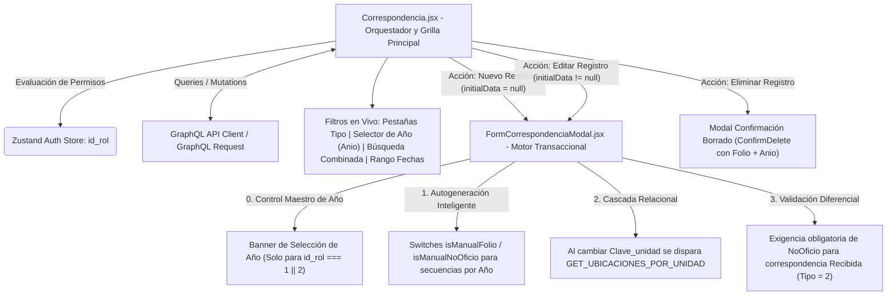
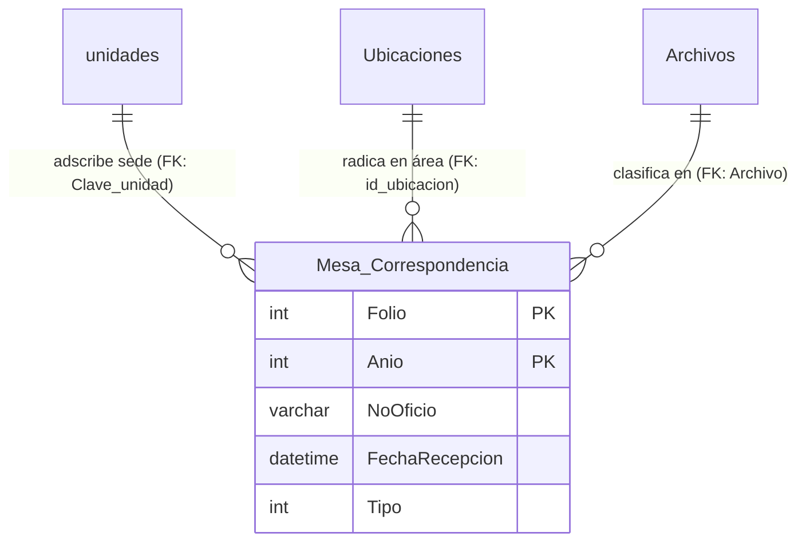
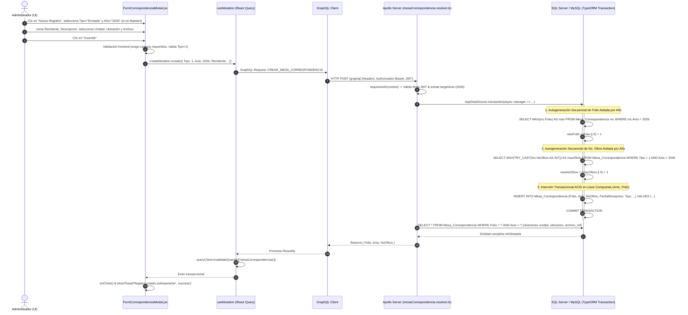

# Manual Técnico Oficial: Módulo de Gestión y Control de Correspondencia Institucional

## 1. Descripción General

El módulo de **Control de Correspondencia** opera como el eje documental y de auditoría administrativa dentro del **Ecosistema de Gestión de Activos Institucionales** de la Delegación Nayarit – IMSS. Su objetivo funcional es centralizar, registrar, categorizar y garantizar la trazabilidad de todo el flujo documental oficial —tanto oficios emitidos institucionales (**Enviadas**) como dictámenes, solicitudes y memorándums entrantes (**Recibidas**)— vinculándolos orgánicamente a la infraestructura física y organizativa de la delegación.

En la arquitectura del sistema, la **Correspondencia (`MesaCorrespondencia`)** no es un registro aislado, sino una entidad interrelacionada que conecta cuatro vertientes institucionales fundamentales:

1. **Adscripción Topológica y Geográfica (`Inmueble` / `Unidad`):** Cada oficio recibido o emitido se adscribe declarativamente a una sede institucional del catálogo de unidades (`unidades.clave`), lo que permite filtrar y segmentar el acervo documental por zonas delegacionales, hospitales o clínicas específicas.
2. **Localización Física Operativa (`Ubicacion`):** Conecta el documento con el departamento, coordinación o área interna puntual dentro de la sede institucional (`ubicaciones.id_ubicacion`), atribuyendo el origen o destino exacto de la gestión documental dentro del inmueble.
3. **Clasificación Archivística (`Archivo`):** Asocia cada trámite a un catálogo normalizado de expedientes y tipologías documentales (`Archivos.ID`), dotando al sistema de una taxonomía estructurada para consultas legales y auditorías técnicas.
4. **Trazabilidad Cronológica e Independencia Anual (`Anio`, `Folio`):** A fin de preservar intacto el acervo documental histórico sin colisiones de identificadores y permitir que cada año natural (ej. 2025, 2026, 2027) reinicie su correlativo de **Folio** y de **Número de Oficio (`NoOficio`)** desde el número 1, el sistema implementa una **Llave Primaria Compuesta `(Anio, Folio)`**. Esto faculta el aislamiento por periodo fiscal y el control administrativo maestro sobre periodos anteriores o futuros.

---

## 2. Arquitectura del Frontend

La capa de presentación de este módulo está construida bajo **React 19** con estilización responsiva en **Tailwind CSS**, orquestando la sincronización de datos y el estado asíncrono en memoria mediante **TanStack Query (v5)**.



### Componentes Principales

1. **`Correspondencia.jsx` (Orquestador de Vista y Contenedor de la Tabla Virtual):**
   Actúa como el controlador principal de la ruta `/correspondencia`. Es responsable de gestionar la barra de herramientas multitabular y la tabla de datos virtualizada. Sus características técnicas distintivas incluyen:
   - **Sistema de Filtrado Híbrido con Debouncing y Selector de Año:** Implementa un `useEffect` con un retraso deliberado (`setTimeout` de 400 ms) sobre el estado de filtros locales (`filters.Tipo`, `filters.Anio`, `filters.NoOficio`, `filters.Folio`, `filters.PalabraClave`, `dateFilterType`, `startDate`, `endDate`). Incorpora un menú desplegable de **Año** (`Anio`) para navegar fluidamente por el historial o segmentar por el ciclo fiscal activo.
   - **Identificación con Llave Compuesta (`Anio-Folio`) y Badges Visuales:** Para evitar duplicidades en el DOM de React dado que dos años diferentes pueden compartir el mismo número de folio (ej. Folio #1 en 2025 y Folio #1 en 2026), cada fila utiliza la llave compuesta `<tr key={`${corr.Anio}-${corr.Folio}`}>`. En la columna de Folio se renderiza de forma prominente el número (#Folio) junto con un badge color verde que indica el año de registro (`Año {corr.Anio}`).
   - **Motor de Resaltado Visual en Tiempo Real (`HighlightText`):** Componente utilitario integrado que evalúa expresiones regulares (`new RegExp`) sobre el texto renderizado en los campos *No. Oficio*, *Remitente* y *Descripción*, envolviendo dinámicamente las coincidencias en etiquetas de resaltado (`<span className="bg-yellow-200 text-yellow-900 font-bold">`).
   - **Control Exponencial de Descripciones (`expandedDesc`):** Dado que las descripciones de los oficios institucionales pueden abarcar múltiples párrafos, la tabla implementa un sistema de colapso optimizado (`line-clamp-3`) gobernado por un mapa transaccional de estados booleanos por folio (`toggleDesc`).
   - **Paginación Virtualizada por Cursores:** Administra el salto de páginas combinando índices convencionales (`currentPage`) con una estructura de cursores Base64 compatible con la especificación GraphQL Relay (`pageInfo`).
   - **Segregación Reactiva de Control de Acceso (`useAuthStore`):** Evalúa el rol en sesión; habilita la creación y edición para directivos e ingenieros (`id_rol === 1 || id_rol === 2`) y restringe la eliminación en cascada únicamente a directores globales (`id_rol === 1`), asegurando enviar tanto el `$Folio` como el `$Anio` (`deleteMutation.mutate({ Folio: recordToDelete.Folio, Anio: recordToDelete.Anio })`) para apuntar de manera inequívoca a la fila exacta.

2. **`FormCorrespondenciaModal.jsx` (Motor Transaccional con Control de Usuario Maestro):**
   Componente modal altamente cohesivo basado en la primitiva de accesibilidad `@radix-ui/react-dialog`. Diseñado para gestionar la persistencia de datos de oficios con las siguientes capacidades clave:
   - **🛡️ Control de Foliaje Maestro para Directivos (`id_rol === 1 || 2`):** Si el operador que abre el modal cuenta con privilegios directivos (Usuario Maestro o Administrador Delegacional), se despliega un panel superior de alta visibilidad (`bg-amber-50 / dark:bg-amber-950`) que le permite seleccionar o alternar manualmente el **Año de Registro (`Anio`)**. Esto faculta registrar oficios rezagados del año previo o adelantar folios para el año próximo, disparando en el servidor el cálculo de autoincremento aislado para el año elegido.
   - **Controladores de Autogeneración vs. Captura Manual (`isManualFolio` / `isManualNoOficio`):** En la creación de nuevos registros (`!initialData`), el formulario presenta casillas de verificación transaccionales que permiten al usuario delegar en el servidor la autogeneración secuencial del `Folio` numérico y del `No. Oficio` (para oficios enviados `Tipo = 1`). Si el usuario desactiva la casilla, el input se bloquea (`disabled`) y muestra el placeholder *"Autogenerado..."*.
   - **Selectores Relacionales en Cascada:** Al seleccionar una sede delegacional en el menú de `Clave_unidad` (cargado mediante `GET_CAT_UNIDADES_QUERY`), el componente resetea automáticamente la ubicación (`id_ubicacion: ''`) y gatilla de forma reactiva el hook `useQuery` de `ubicaciones-corr` hacia la consulta GraphQL `GET_UBICACIONES_POR_UNIDAD`, impidiendo inconsistencias donde un oficio apunte a una ubicación física perteneciente a otro hospital.
   - **Validación Lógica Diferencial:** Antes de despachar la mutación hacia el backend, evalúa reglas de negocio del dominio institucional: si la correspondencia es clasificada como **Recibida** (`Tipo === 2`), impone la captura manual obligatoria del `NoOficio`, dado que la numeración proviene de dependencias externas o de oficinas centrales.

### Manejo de Estado y Hooks

- **Sincronización Asíncrona con TanStack Query:**
  - El hook `useQuery` principal (`['mesaCorrespondencias', activeFilters, currentPage]`) sincroniza en tiempo real la tabla documental. Al cambiar de pestaña de *Tipo*, al seleccionar un *Año* en el desplegable o al modificar el rango de fechas, la invalidación es atómica y no interrumpe el hilo de la interfaz visual.
  - Los catálogos auxiliares de **Archivos** (`['archivos']`) y **Unidades** (`['unidadesSelect']`) se cargan de manera diferida (`enabled: isOpen`), optimizando el uso de memoria en el navegador hasta que el operador invoca la apertura del modal.
- **Flujo Transaccional de Mutaciones:**
  - Las operaciones de alta (`crearMesaCorrespondencia`), edición (`editarMesaCorrespondencia(Folio, Anio, input)`) y borrado (`eliminarMesaCorrespondencia(Folio, Anio)`) están encapsuladas con `useMutation`. En su callback `onSuccess`, invocan `queryClient.invalidateQueries({ queryKey: ['mesaCorrespondencias'] })`, garantizando la rehidratación inmediata de la tabla sin requerir refrescos manuales.

### Integración GraphQL

La comunicación con la API se encuentra declarada en `src/api/correspondencia.queries.js`:

- **Consultas (`Queries`):**
  - `GET_MESA_CORRESPONDENCIAS`: Ejecuta el query paginado `getMesaCorrespondencias(filter: $filter, pagination: $pagination)`. Solicita en el árbol GraphQL la resolución anidada de las entidades y el campo `Anio`: `node { Folio, Anio, NoOficio, ... }`.
  - `GET_ARCHIVOS`: Extrae la colección completa de clasificaciones documentales.
- **Mutaciones (`Mutations`):**
  - `CREAR_MESA_CORRESPONDENCIA`: Envía el payload serializado `MesaCorrespondenciaInput` (incluyendo opcionalmente `Anio`).
  - `EDITAR_MESA_CORRESPONDENCIA`: Recibe la llave compuesta por `$Folio: Int!` y `$Anio: Int` junto con las propiedades a modificar.
  - `ELIMINAR_MESA_CORRESPONDENCIA`: Dispara la purga inequívoca del oficio mediante `$Folio: Int!` y `$Anio: Int`.

---

## 3. Arquitectura del Backend

La lógica de servidor está implementada en **Node.js / TypeScript** bajo el ORM **TypeORM**, operando sobre una base de datos relacional SQL Server / MySQL y exponiendo su API contractual a través de **Apollo Server / GraphQL Request**.

### Resolvers (`src/graphql/resolvers/mesaCorrespondencia.resolver.ts`)

Los resolvers concentran la lógica de seguridad multi-tenant, filtrado avanzado por año y transaccionalidad concurrente con secuencias anuales independientes:

1. **Resolver de Consulta `Query.getMesaCorrespondencias`:**
   - **Aislamiento Perimetral Multi-Tenant por Zona Delegacional:** Antes de construir el SQL, el resolver analiza el token JWT del operador (`context.user`). Si el perfil es operativo estándar (`isEstandar(context)`) y cuenta con una zona asignada (`clave_zona`), inyecta una subconsulta relacional sobre el constructor de TypeORM:
     ```sql
     mc.Clave_unidad IN (SELECT clave FROM unidades WHERE clave_zona = :_mcz)
     ```
     Esto impide de forma categórica la fuga de información sensible entre sedes hospitalarias o directivas de distintas zonas del estado.
   - **Motor de Búsqueda Dinámica Multifactorial y Ordenamiento Anual:** Evalúa de manera acumulativa las condiciones enviadas en `filter`:
     - **Filtrado por Año de Registro (`mc.Anio = :anio`):** Segmenta las consultas al periodo solicitado. Por defecto y al consultar todo, el ordenamiento prioriza `mc.Anio DESC, mc.Folio DESC`, mostrando los trámites más recientes en la cima.
     - Búsqueda textual amplia en `mc.Descripcion` o `mc.Remitente` (`LIKE %keyword%`).
     - Búsqueda exacta de número de oficio (`mc.NoOficio LIKE`) o folio entero (`mc.Folio =`).
     - **Filtrado Temporal Cronológico:** Evalúa `DateFilterType` para discriminar entre la fecha del documento (`mc.FechaOficio`) y la fecha de recepción (`mc.FechaRecepcion`), inyectando condiciones SQL `CAST(col AS DATE) BETWEEN :start AND :end`.
   - **Serialización Relay Connection:** Convierte el offset numérico en cursores Base64 (`Buffer.from(...)`), empaquetando los resultados en objetos `edges` con sus respectivos metadatos `pageInfo`.

2. **Resolver de Creación `Mutation.crearMesaCorrespondencia`:**
   Encapsula toda la lógica de alta dentro de un bloque transaccional ACID (`AppDataSource.transaction(async (txManager) => ...)`):
   - **Resolución de Año de Destino (`targetAnio`):** Determina el año objetivo del documento partiendo de `input.Anio ? parseInt(input.Anio, 10) : new Date().getFullYear()`. Todo autoincremento posterior se restringe milimétricamente a este `targetAnio`.
   - **Autogeneración Concurrente de Folio por Año:** Si el input omite el folio numérico (`!input.Folio`), el resolver consulta el máximo folio existente **dentro de ese año específico (`WHERE mc.Anio = :anio`)** y asigna `max + 1`. Si el usuario provee un folio manual, ejecuta una consulta de unicidad (`findOne({ where: { Folio: newFolio, Anio: targetAnio } })`) para abortar con `GraphQLError` ante posibles colisiones de llave primaria compuesta.
   - **Autoincremento Secuencial de Número de Oficio (`NoOficio`) por Año:** Si la correspondencia es catalogada como **Enviada** (`Tipo = 1`) y el campo `NoOficio` llega vacío, el motor realiza una introspección SQL castendo los caracteres a enteros (`MAX(TRY_CAST(mc.NoOficio AS INT))`) **exclusivamente para los registros de tipo 1 del año activo (`WHERE mc.Tipo = :tipo AND mc.Anio = :anio`)**, obteniendo la numeración oficial consecutiva más alta y asignando el siguiente número.
   - **Estampado Automático de Recepción:** Respeta una fecha de recepción manual (`input.FechaRecepcion`) o asigna incondicionalmente el timestamp actual del servidor (`new Date()`).

3. **Resolver de Edición `Mutation.editarMesaCorrespondencia`:**
   Recibe `$Folio: Int!`, `$Anio: Int` y el `input`. Localiza el registro preciso combinando `{ Folio, Anio }` (con compatibilidad si `Anio` es omitido). Si el usuario modifica el folio o el año, verifica la inexistencia de colisiones `(newFolio, targetAnio)` antes de aplicar `repository.update({ Folio: mesa.Folio, Anio: mesa.Anio }, { ...input, Folio: newFolio, Anio: targetAnio })`. Retorna la entidad rehidratada con todas sus relaciones (`relations: ['unidad', 'ubicacion', 'archivo_ref']`).

4. **Resolver de Eliminación `Mutation.eliminarMesaCorrespondencia`:**
   Ejecuta la remoción transaccional inequívoca mediante `repository.delete({ Folio, Anio })`, asegurando que bajo ninguna circunstancia un comando de borrado de un folio en el año actual afecte a un folio homónimo de años anteriores.

### Entidades y Estructura de Base de Datos (Llave Primaria Compuesta)

Las operaciones del catálogo de correspondencia operan sobre un modelo relacional normalizado y jerárquico (`src/entities/*.ts`). Para permitir el reinicio anual de folios, la entidad `MesaCorrespondencia` define una **Llave Primaria Compuesta (`PrimaryColumn` dual en `Anio` y `Folio`)**:



1. **`MesaCorrespondencia` (Tabla: `Mesa_Correspondencia`):**
   Entidad central que representa el registro del oficio. Almacena la llave primaria compuesta formada por (`Folio` int, `Anio` int), el número oficial impreso (`NoOficio` varchar(25)), las marcas de tiempo (`FechaRecepcion`, `FechaOficio` datetime), el remitente o destinatario (`Remitente` varchar(MAX)), la sede institucional adscrita (`Clave_unidad` varchar(50) FK hacia `unidades.clave`), la ubicación operativa interna (`id_ubicacion` int FK hacia `Ubicaciones.id_ubicacion`), la descripción del trámite (`Descripcion` varchar(MAX)), el clasificador relacional (`Tipo` int, 1=Enviada, 2=Recibida), y la llave foránea archivística (`Archivo` int FK hacia `Archivos.ID`).
2. **`Archivo` (Tabla: `Archivos`):**
   Entidad paramétrica de catálogo que agrupa y categoriza el acervo documental de la delegación (`ID` int, `Archivo` varchar(100)).
3. **Entidades Relacionadas (`Inmueble`, `Ubicacion`):**
   Aportan la adscripción territorial delegacional (`unidades`) y el directorio de áreas médicas o administrativas internas (`Ubicaciones`).

### Reglas de Negocio y Migración de Base de Datos

1. **Reinicio Anual Automático (`Anio`, `Folio`):** Cada año calendario, el contador de folios automáticos y el contador de oficios enviados (`Tipo = 1`) arrancan desde el número 1 sin intervención manual, coexistiendo pacíficamente en la misma tabla de base de datos con los folios históricos de años previos.
2. **Control Maestro Delegacional:** Los usuarios directivos pueden registrar o modificar trámites especificando manualmente el periodo anual para adelantar consecutivos de año fiscal próximo o regularizar registros rezagados.
3. **Exigencia de Folio Externo para Recepciones:** Todo oficio entrante (`Tipo = 2`) debe obligatoriamente registrar el número de oficio original con el que fue emitido por la entidad externa.

#### Script SQL Oficial de Migración a Llave Primaria Compuesta (`Anio, Folio`)
Para convertir bases de datos en producción donde la llave primaria original no tenía un nombre estático sino asignado dinámicamente por SQL Server (`PK__Mesa_Cor__XXXX...`), se ejecutó el siguiente script inteligente de reestructuración DDL:

```sql
-- 1. Población e inicialización del Año sobre registros históricos
UPDATE [dbo].[Mesa_Correspondencia]
SET [Anio] = YEAR(ISNULL([FechaRecepcion], GETDATE()))
WHERE [Anio] IS NULL;

-- 2. Modificación a columna NOT NULL para ser partícipe de PK
ALTER TABLE [dbo].[Mesa_Correspondencia] ALTER COLUMN [Anio] [int] NOT NULL;

-- 3. Eliminación dinámica de la restricción PK original de sistema
DECLARE @ConstraintName nvarchar(200);
SELECT @ConstraintName = name 
FROM sys.key_constraints 
WHERE type = 'PK' AND parent_object_id = OBJECT_ID('dbo.Mesa_Correspondencia');

IF @ConstraintName IS NOT NULL
BEGIN
    DECLARE @SQL nvarchar(500) = 'ALTER TABLE [dbo].[Mesa_Correspondencia] DROP CONSTRAINT [' + @ConstraintName + ']';
    EXEC sp_executesql @SQL;
END;

-- 4. Creación de la nueva llave primaria compuesta (Anio, Folio)
ALTER TABLE [dbo].[Mesa_Correspondencia] 
ADD CONSTRAINT [PK_Mesa_Correspondencia] PRIMARY KEY CLUSTERED ([Anio], [Folio]);
```

---

## 4. Flujo de Ejecución (Data Flow)

El siguiente diagrama secuencial detalla el ciclo transaccional completo cuando un directivo registra un nuevo **Oficio Enviado (`Tipo = 1`)** en un Año específico (`targetAnio`), solicitando autogeneración de numeración en el servidor:



---

## 5. Fragmentos de Código Clave (Snippets)

### Snippet 1 (Frontend): Control de Foliaje Maestro para Directivos (`FormCorrespondenciaModal.jsx`)

Este bloque de interfaz muestra el banner de control de año que se renderiza dinámicamente si el usuario autenticado tiene el rol de Administrador o Usuario Maestro (`id_rol === 1 || 2`). Permite cambiar el año sobre el cual actuarán los autoincrementos transaccionales.

```jsx
// src/components/FormCorrespondenciaModal.jsx
{isMaestroAdmin && (
    <div className="bg-amber-50 dark:bg-amber-950/40 border border-amber-200 dark:border-amber-800/60 rounded-xl p-3.5 flex flex-col sm:flex-row items-start sm:items-center justify-between gap-3 text-sm">
        <div className="flex items-center gap-2 text-amber-900 dark:text-amber-200">
            <span className="text-base">🛡️</span>
            <div>
                <span className="font-semibold block sm:inline">Control de Foliaje Maestro:</span>{' '}
                <span className="text-amber-700 dark:text-amber-300 text-xs sm:text-sm">
                    Seleccione el Año para continuar o reiniciar el consecutivo de folios y oficios.
                </span>
            </div>
        </div>
        <div className="flex items-center gap-2 self-end sm:self-auto shrink-0">
            <label className="text-xs font-bold text-amber-900 dark:text-amber-200 uppercase tracking-wider">Año:</label>
            <select
                name="Anio"
                value={formData.Anio}
                onChange={handleChange}
                className="bg-white dark:bg-gray-900 border border-amber-300 dark:border-amber-700 text-amber-950 dark:text-white font-bold rounded-lg px-3 py-1.5 text-sm focus:ring-2 focus:ring-amber-500 shadow-sm"
            >
                {aniosDisponibles.map(y => (
                    <option key={y} value={y}>{y}</option>
                ))}
            </select>
        </div>
    </div>
)}
```

---

### Snippet 2 (Backend): Mapeo de Entidad con Llave Primaria Compuesta (`MesaCorrespondencia.ts`)

Ilustra la definición dual `@PrimaryColumn` en TypeORM, permitiendo que la tabla almacene el mismo `Folio` en años diferentes sin violar la integridad referencial.

```typescript
// src/entities/MesaCorrespondencia.ts
@Entity('Mesa_Correspondencia')
export class MesaCorrespondencia {
  @PrimaryColumn({ type: 'int' })
  Folio!: number;

  @PrimaryColumn({ type: 'int' })
  Anio!: number;

  @Column({ type: 'varchar', length: 25, nullable: true })
  NoOficio?: string;

  @Column({ type: 'datetime', nullable: true })
  FechaRecepcion?: Date;
  // ...
}
```

---

### Snippet 3 (Backend): Autogeneración Transaccional Aislada por Año (`mesaCorrespondencia.resolver.ts`)

Muestra el cálculo atómico de `newFolio` y `newNoOficio` dentro de `AppDataSource.transaction`, inyectando la restricción `WHERE mc.Anio = :anio` para garantizar que el reinicio anual de folios sea exacto e impermeable entre periodos.

```typescript
// src/graphql/resolvers/mesaCorrespondencia.resolver.ts
return await AppDataSource.transaction(async (transactionalEntityManager) => {
  const targetAnio = input.Anio ? parseInt(input.Anio, 10) : new Date().getFullYear();

  // 1. Cálculo transaccional de Folio aislado al Año objetivo
  let newFolio = input.Folio;
  if (!newFolio) {
    const lastFolio = await transactionalEntityManager
      .createQueryBuilder(MesaCorrespondencia, 'mc')
      .select('MAX(mc.Folio)', 'max')
      .where('mc.Anio = :anio', { anio: targetAnio })
      .getRawOne();
    
    newFolio = (lastFolio?.max || 0) + 1;
  } else {
    const exists = await transactionalEntityManager.findOne(MesaCorrespondencia, { where: { Folio: newFolio, Anio: targetAnio } });
    if (exists) throw new GraphQLError(`El Folio ${newFolio} ya existe para el año ${targetAnio}`);
  }
  
  let newNoOficio = input.NoOficio;

  // 2. Autoincremento de NoOficio para Enviadas (Tipo = 1) aislado al Año
  if (input.Tipo === 1 && (!input.NoOficio || input.NoOficio.trim() === '')) {
      const lastOficio = await transactionalEntityManager
        .createQueryBuilder(MesaCorrespondencia, 'mc')
        .select('MAX(TRY_CAST(mc.NoOficio AS INT))', 'maxOficio')
        .where('mc.Tipo = :tipo AND mc.Anio = :anio', { tipo: 1, anio: targetAnio })
        .andWhere('TRY_CAST(mc.NoOficio AS INT) IS NOT NULL')
        .getRawOne();
      
      const nextOficio = (lastOficio?.maxOficio || 0) + 1;
      newNoOficio = nextOficio.toString();
  }

  const nuevaMesa = transactionalEntityManager.create(MesaCorrespondencia, {
    ...input,
    Anio: targetAnio,
    Folio: newFolio,
    NoOficio: newNoOficio,
    FechaRecepcion: input.FechaRecepcion ? new Date(input.FechaRecepcion) : new Date(),
  });

  await transactionalEntityManager.save(nuevaMesa);
  return await transactionalEntityManager.findOne(MesaCorrespondencia, {
      where: { Folio: newFolio, Anio: targetAnio },
      relations: ['unidad', 'ubicacion', 'archivo_ref']
  });
});
```
