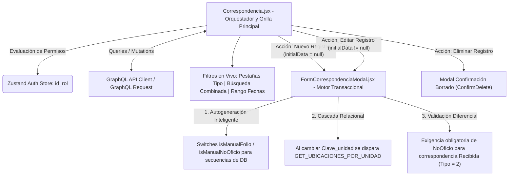
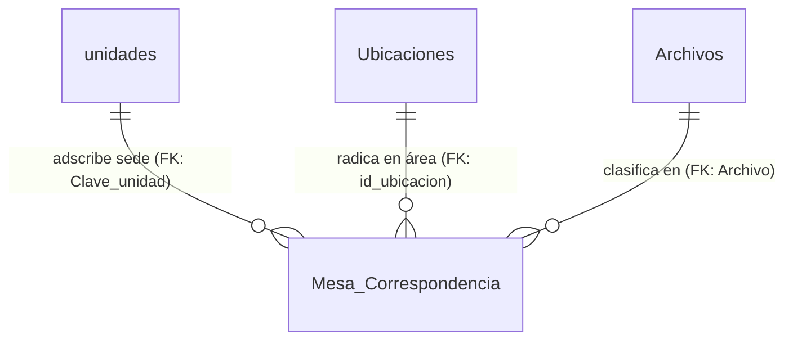
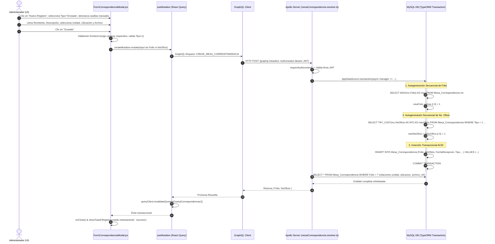

# Manual Técnico Oficial: Módulo de Gestión y Control de Correspondencia Institucional

## 1. Descripción General

El módulo de **Control de Correspondencia** opera como el eje documental y de auditoría administrativa dentro del **Ecosistema de Gestión de Activos Institucionales** de la Delegación Nayarit – IMSS. Su objetivo funcional es centralizar, registrar, categorizar y garantizar la trazabilidad de todo el flujo documental oficial —tanto oficios emitidos institucionales (**Enviadas**) como dictámenes, solicitudes y memorándums entrantes (**Recibidas**)— vinculándolos orgánicamente a la infraestructura física y organizativa de la delegación.

En la arquitectura del sistema, la **Correspondencia (`MesaCorrespondencia`)** no es un registro aislado, sino una entidad interrelacionada que conecta tres vertientes institucionales fundamentales:

1. **Adscripción Topológica y Geográfica (`Inmueble` / `Unidad`):** Cada oficio recibido o emitido se adscribe declarativamente a una sede institucional del catálogo de unidades (`unidades.clave`), lo que permite filtrar y segmentar el acervo documental por zonas delegacionales, hospitales o clínicas específicas.
2. **Localización Física Operativa (`Ubicacion`):** Conecta el documento con el departamento, coordinación o área interna puntual dentro de la sede institucional (`ubicaciones.id_ubicacion`), atribuyendo el origen o destino exacto de la gestión documental dentro del inmueble.
3. **Clasificación Archivística (`Archivo`):** Asocia cada trámite a un catálogo normalizado de expedientes y tipologías documentales (`Archivos.ID`), dotando al sistema de una taxonomía estructurada para consultas legales y auditorías técnicas.

---

## 2. Arquitectura del Frontend

La capa de presentación de este módulo está construida bajo **React (v18+)** con estilización responsiva en **Tailwind CSS**, orquestando la sincronización de datos y el estado asíncrono en memoria mediante **TanStack Query (v5)**.



### Componentes Principales

1. **`Correspondencia.jsx` (Orquestador de Vista y Contenedor de la Tabla Virtual):**
   Actúa como el controlador principal de la ruta `/correspondencia`. Es responsable de gestionar la barra de herramientas multitabular y la tabla de datos virtualizada. Sus características técnicas distintivas incluyen:
   - **Sistema de Filtrado Híbrido con Debouncing:** Implementa un `useEffect` con un retraso deliberado (`setTimeout` de 400 ms) sobre el estado de filtros locales (`filters`, `dateFilterType`, `startDate`, `endDate`), evitando la saturación del servidor al teclear en los campos de búsqueda combinada (`PalabraClave`, `NoOficio`, `Folio`).
   - **Motor de Resaltado Visual en Tiempo Real (`HighlightText`):** Componente utilitario integrado que evalúa expresiones regulares (`new RegExp`) sobre el texto renderizado en los campos *No. Oficio*, *Remitente* y *Descripción*, envolviendo dinámicamente las coincidencias en etiquetas de resaltado (`<span className="bg-yellow-200 text-yellow-900 font-bold">`), mejorando radicalmente la explorabilidad del operador.
   - **Control Exponencial de Descripciones (`expandedDesc`):** Dado que las descripciones de los oficios institucionales pueden abarcar múltiples párrafos, la tabla implementa un sistema de colapso optimizado (`line-clamp-3`) gobernado por un mapa transaccional de estados booleanos por folio (`toggleDesc`).
   - **Paginación Virtualizada por Cursores:** Administra el salto de páginas combinando índices convencionales (`currentPage`) con una estructura de cursores Base64 compatible con la especificación GraphQL Relay (`pageInfo`).
   - **Segregación Reactiva de Control de Acceso (`useAuthStore`):** Evalúa el rol en sesión; habilita la creación y edición para directivos e ingenieros (`id_rol === 1 || id_rol === 2`) y restringe la eliminación en cascada únicamente a directores globales (`id_rol === 1`).

2. **`FormCorrespondenciaModal.jsx` (Motor Transaccional de Alta y Edición Documental):**
   Componente modal altamente cohesivo basado en la primitiva de accesibilidad `@radix-ui/react-dialog`. Diseñado para gestionar la persistencia de datos de oficios con las siguientes capacidades clave:
   - **Controladores de Autogeneración vs. Captura Manual (`isManualFolio` / `isManualNoOficio`):** En la creación de nuevos registros (`!initialData`), el formulario presenta casillas de verificación transaccionales que permiten al usuario delegar en el servidor la autogeneración secuencial del `Folio` numérico y del `No. Oficio` (para oficios enviados `Tipo = 1`). Si el usuario desactiva la casilla, el input se bloquea (`disabled`) y muestra el placeholder *"Autogenerado..."*.
   - **Selectores Relacionales en Cascada:** Al seleccionar una sede delegacional en el menú de `Clave_unidad` (cargado mediante `GET_CAT_UNIDADES_QUERY`), el componente resetea automáticamente la ubicación (`id_ubicacion: ''`) y gatilla de forma reactiva el hook `useQuery` de `ubicaciones-corr` hacia la consulta GraphQL `GET_UBICACIONES_POR_UNIDAD`, impidiendo inconsistencias donde un oficio apunte a una ubicación física perteneciente a otro hospital.
   - **Validación Lógica Diferencial:** Antes de despachar la mutación hacia el backend, evalúa reglas de negocio del dominio institucional: si la correspondencia es clasificada como **Recibida** (`Tipo === 2`), impone la captura manual obligatoria del `NoOficio`, dado que la numeración proviene de dependencias externas o de oficinas centrales.

### Manejo de Estado y Hooks

- **Sincronización Asíncrona con TanStack Query:**
  - El hook `useQuery` principal (`['mesaCorrespondencias', activeFilters, currentPage]`) sincroniza en tiempo real la tabla documental. Al cambiar de pestaña de *Tipo* o al modificar el rango de fechas, la invalidación es atómica y no interrumpe el hilo de la interfaz visual.
  - Los catálogos auxiliares de **Archivos** (`['archivos']`) y **Unidades** (`['unidadesSelect']`) se cargan de manera diferida (`enabled: isOpen`), optimizando el uso de memoria en el navegador hasta que el operador invoca la apertura del modal.
- **Flujo Transaccional de Mutaciones:**
  - Las operaciones de alta (`crearMesaCorrespondencia`), edición (`editarMesaCorrespondencia`) y borrado (`eliminarMesaCorrespondencia`) están encapsuladas con `useMutation`. En su callback `onSuccess`, invocan `queryClient.invalidateQueries({ queryKey: ['mesaCorrespondencias'] })`, garantizando la rehidratación inmediata de la tabla sin requerir refrescos manuales.

### Integración GraphQL

La comunicación con la API se encuentra declarada en `src/api/correspondencia.queries.js`:

- **Consultas (`Queries`):**
  - `GET_MESA_CORRESPONDENCIAS`: Ejecuta el query paginado `getMesaCorrespondencias(filter: $filter, pagination: $pagination)`. Solicita en el árbol GraphQL la resolución anidada de las entidades relacionadas: `unidad { clave, descripcion }`, `ubicacion { id_ubicacion, nombre_ubicacion }` y `archivo_ref { ID, Archivo }`.
  - `GET_ARCHIVOS`: Extrae la colección completa de clasificaciones documentales.
- **Mutaciones (`Mutations`):**
  - `CREAR_MESA_CORRESPONDENCIA`: Envía el payload serializado `MesaCorrespondenciaInput`.
  - `EDITAR_MESA_CORRESPONDENCIA`: Recibe el identificador inmutable `$Folio: Int!` y las propiedades a actualizar.
  - `ELIMINAR_MESA_CORRESPONDENCIA`: Dispara la purga del oficio por su llave primaria `$Folio`.

---

## 3. Arquitectura del Backend

La lógica de servidor está implementada en **Node.js / TypeScript** bajo el ORM **TypeORM**, operando sobre una base de datos relacional MySQL y exponiendo su API contractual a través de **Apollo Server / GraphQL Request**.

### Resolvers (`src/graphql/resolvers/mesaCorrespondencia.resolver.ts`)

Los resolvers concentran la lógica de seguridad multi-tenant, filtrado avanzado y transaccionalidad concurrente:

1. **Resolver de Consulta `Query.getMesaCorrespondencias`:**
   - **Aislamiento Perimetral Multi-Tenant por Zona Delegacional:** Antes de construir el SQL, el resolver analiza el token JWT del operador (`context.user`). Si el perfil es operativo estándar (`isEstandar(context)`) y cuenta con una zona asignada (`clave_zona`), inyecta una subconsulta relacional irrompible sobre el constructor de TypeORM:
     ```sql
     mc.Clave_unidad IN (SELECT clave FROM unidades WHERE clave_zona = :_mcz)
     ```
     Esto impide de forma categórica la fuga de información sensible entre sedes hospitalarias o directivas de distintas zonas del estado. Si un usuario estándar carece de zona, se fuerza una condición nula (`1 = 0`).
   - **Motor de Búsqueda Dinámica Multifactorial:** Evalúa de manera acumulativa las condiciones enviadas en `filter`:
     - Búsqueda textual amplia en `mc.Descripcion` o `mc.Remitente` (`LIKE %keyword%`).
     - Búsqueda exacta de número de oficio (`mc.NoOficio LIKE`) o folio entero (`mc.Folio =`).
     - **Filtrado Temporal Cronológico:** Evalúa la variable `DateFilterType` para discriminar si el rango temporal se aplica sobre la fecha en que se emitió el documento (`mc.FechaOficio`) o cuando se recepcionó en la mesa delegacional (`mc.FechaRecepcion`), inyectando condiciones de casteo SQL `CAST(col AS DATE) BETWEEN :start AND :end`.
   - **Serialización Relay Connection:** Convierte el offset numérico en cursores Base64 (`Buffer.from(...)`), empaquetando los resultados en objetos `edges` con sus respectivos metadatos `pageInfo`.

2. **Resolver de Creación `Mutation.crearMesaCorrespondencia`:**
   Encapsula toda la lógica de alta dentro de un bloque transaccional ACID (`AppDataSource.transaction(async (txManager) => ...)`):
   - **Autogeneración Concurrente de Folio:** Si el input omite el folio numérico (`!input.Folio`), el resolver consulta el máximo folio existente (`MAX(mc.Folio)`) y asigna `max + 1`. Si el usuario provee un folio manual, ejecuta una consulta de unicidad para abortar con `GraphQLError` ante posibles colisiones de llave primaria.
   - **Autoincremento Secuencial de Número de Oficio (`NoOficio`):** Si la correspondencia es catalogada como **Enviada** (`Tipo = 1`) y el campo `NoOficio` llega vacío, el motor realiza una introspección SQL castendo los caracteres a enteros (`TRY_CAST(mc.NoOficio AS INT)`) exclusivamente para los registros de tipo 1, obteniendo la numeración oficial consecutiva más alta y asignando el siguiente número en formato de cadena.
   - **Estampado Automático de Recepción:** Asigna incondicionalmente el timestamp actual UTC del servidor (`FechaRecepcion: new Date()`).

3. **Resolver de Edición `Mutation.editarMesaCorrespondencia`:**
   Valida la existencia del registro padre por su llave primaria `Folio`. Si el usuario solicita modificar el número de folio mismo (`newFolio !== Folio`), ejecuta una verificación anti-duplicidad antes de aplicar el comando `repository.update`. Retorna la entidad rehidratada con todas sus relaciones (`relations: ['unidad', 'ubicacion', 'archivo_ref']`).

4. **Resolver de Eliminación `Mutation.eliminarMesaCorrespondencia`:**
   Ejecuta la remoción transaccional directa mediante `repository.delete({ Folio })`, verificando que el número de filas afectadas (`result.affected`) confirme el borrado exitoso.

### Entidades de Base de Datos

Las operaciones del catálogo de correspondencia operan sobre un modelo relacional normalizado, jerárquico y altamente cohesionado (`src/entities/*.ts`), el cual incorpora una refactorización semántica clave en el mapeo de TypeORM:



1. **`MesaCorrespondencia` (Tabla: `Mesa_Correspondencia`):**
   Entidad central y transaccional que representa el registro del oficio o gestión documental institucional. Almacena la llave primaria numérico-entera (`Folio` int), el número de documento oficial impreso en el oficio (`NoOficio` varchar(25)), la marca de tiempo de su captura o ingreso al sistema (`FechaRecepcion` datetime), la fecha impresa en el cuerpo del documento oficial (`FechaOficio` datetime), la identidad de la persona, autoridad o dependencia emisora/receptora (`Remitente` varchar(MAX)), la referencia relacional hacia la sede institucional adscrita (`Clave_unidad` varchar(50) FK hacia `unidades.clave`), el identificador relacional del departamento o área física operativa de destino u origen (`id_ubicacion` int FK hacia `Ubicaciones.id_ubicacion`), un resumen sintético o contenido integral del trámite (`Descripcion` varchar(MAX)), un diccionario numérico binario para tipificar el flujo del oficio (`Tipo` int, donde 1 representa correspondencia **Enviada** y 2 correspondencia **Recibida**), y la llave foránea de clasificación archivística (`Archivo` int FK hacia `Archivos.ID`).
2. **`Archivo` (Tabla: `Archivos`):**
   Entidad paramétrica de catálogo o taxonomía archivística que agrupa y categoriza el acervo documental de la delegación. Almacena la llave primaria autoincremental (`ID` int) y la descripción formal del rubro, sección o carpeta de archivo institucional (`Archivo` varchar(100)). Su llave foránea apoya las consultas de agrupación para auditorías documentales en `Mesa_Correspondencia`.
3. **Entidades Relacionadas (`Inmueble`, `Ubicacion`):**
   Entidades estructurales e institucionales que orbitan en torno a la correspondencia para dotarla de validez territorial y operativa. Aportan el adscripción jurisdiccional y delegacional del inmueble hospitalario o administrativo (`Inmueble.clave` mapeado a la tabla `unidades`), y el directorio de departamentos físicos o divisiones médicas internas donde radica el trámite (`Ubicacion.id_ubicacion`).

### Reglas de Negocio

1. **Autoincremento Inteligente Dual:** Garantiza que los oficios emitidos por la institución (`Tipo = 1`) gocen de un correlativo numérico ininterrumpido en su `NoOficio` y `Folio` sin requerir intervención manual del operador ni propiciar huecos por error tipográfico.
2. **Exigencia de Folio Externo para Recepciones:** Todo oficio entrante (`Tipo = 2`) debe obligatoriamente registrar el número de oficio original con el que fue emitido por la entidad remitente.
3. **Segregación Multi-Tenant Estricta:** Ningún funcionario de nivel operativo estándar puede listar, auditar ni buscar oficios cuya sede asignada (`Clave_unidad`) pertenezca a otra zona delegacional de Nayarit.

---

## 4. Flujo de Ejecución (Data Flow)

El siguiente diagrama secuencial detalla el ciclo transaccional completo cuando un directivo registra un nuevo **Oficio Enviado (`Tipo = 1`)** solicitando autogeneración de numeración en el servidor:



---

## 5. Fragmentos de Código Clave (Snippets)

### Snippet 1 (Frontend): Lógica Transaccional de Autogeneración vs. Captura Manual (`FormCorrespondenciaModal.jsx`)

Este bloque muestra cómo el modal frontend administra dinámicamente el estado de autogeneración de secuencias. Utiliza interruptores booleanos (`isManualFolio`, `isManualNoOficio`) que, al ser desactivados, limpian el valor en el estado (`setFormData`) y deshabilitan el input visualmente, indicando al operador que el backend calculará el correlativo de forma segura dentro de una transacción ACID.

```jsx
// src/components/FormCorrespondenciaModal.jsx (Líneas 236-263)
<div>
    <label className="flex items-center justify-between text-sm font-semibold text-gray-700 dark:text-gray-300 mb-1">
        <span>No. Oficio</span>
        {/* El switch de autogeneración de oficio solo está disponible al crear registros de Tipo Enviada (1) */}
        {!initialData && formData.Tipo === 1 && (
            <label className="flex items-center gap-1 text-xs text-gray-500 dark:text-gray-400 font-normal cursor-pointer hover:text-gray-700">
                <input
                    type="checkbox"
                    checked={isManualNoOficio}
                    onChange={(e) => {
                        setIsManualNoOficio(e.target.checked);
                        if (!e.target.checked) setFormData(p => ({ ...p, NoOficio: '' }));
                    }}
                    className="rounded w-3 h-3 text-[#00472e] focus:ring-[#00472e]"
                />
                Manual
            </label>
        )}
    </label>
    <input
        type="text"
        name="NoOficio"
        value={formData.NoOficio}
        onChange={handleChange}
        placeholder={formData.Tipo === 1 && !initialData && !isManualNoOficio ? "Autogenerado..." : "Ingrese el número..."}
        disabled={!isManualNoOficio && !initialData && formData.Tipo === 1}
        className="w-full bg-white dark:bg-gray-900 text-gray-900 border border-gray-200 rounded-xl px-4 py-2.5 text-sm disabled:bg-gray-100 disabled:text-gray-500 disabled:cursor-not-allowed"
    />
</div>
```

---

### Snippet 2 (Backend): Autogeneración Transaccional Concurrente en Servidor (`mesaCorrespondencia.resolver.ts`)

Este fragmento del resolver ilustra cómo el servidor calcula en tiempo real dentro de una transacción de TypeORM el siguiente folio y número de oficio disponible. El uso de `TRY_CAST` en SQL es crucial aquí: como `NoOficio` es una columna `VARCHAR(25)` capaz de almacenar números de oficio externos complejos (ej. `"OF-2026/09-B"`), la consulta filtra y castea exitosamente únicamente los valores estrictamente numéricos emitidos por el sistema para calcular el máximo de forma matemática robusta.

```typescript
// src/graphql/resolvers/mesaCorrespondencia.resolver.ts (Líneas 97-129)
return await AppDataSource.transaction(async (transactionalEntityManager) => {
  // 1. Cálculo transaccional de Folio si no fue proporcionado manualmente
  let newFolio = input.Folio;
  if (!newFolio) {
    const lastFolio = await transactionalEntityManager
      .createQueryBuilder(MesaCorrespondencia, 'mc')
      .select('MAX(mc.Folio)', 'max')
      .getRawOne();
    newFolio = (lastFolio?.max || 0) + 1;
  } else {
    const exists = await transactionalEntityManager.findOne(MesaCorrespondencia, { where: { Folio: newFolio } });
    if (exists) throw new GraphQLError(`El Folio ${newFolio} ya existe`);
  }
  
  let newNoOficio = input.NoOficio;

  // 2. Si es 'Enviada' (Tipo = 1) y el usuario no introdujo oficio manual, autoincrementar NoOficio
  if (input.Tipo === 1 && (!input.NoOficio || input.NoOficio.trim() === '')) {
      const lastOficio = await transactionalEntityManager
        .createQueryBuilder(MesaCorrespondencia, 'mc')
        .select('TRY_CAST(mc.NoOficio AS INT)', 'maxOficio')
        .where('mc.Tipo = :tipo', { tipo: 1 })
        .andWhere('TRY_CAST(mc.NoOficio AS INT) IS NOT NULL')
        .orderBy('mc.Folio', 'DESC')
        .getRawOne();
      
      const nextOficio = (lastOficio?.maxOficio || 0) + 1;
      newNoOficio = nextOficio.toString();
  }

  const nuevaMesa = transactionalEntityManager.create(MesaCorrespondencia, {
    ...input,
    Folio: newFolio,
    NoOficio: newNoOficio,
    FechaRecepcion: new Date(),
  });

  await transactionalEntityManager.save(nuevaMesa);
  // ...
});
```

---

### Snippet 3 (Backend): Aislamiento Multi-Tenant y Filtrado Dinámico de Fechas (`mesaCorrespondencia.resolver.ts`)

Demuestra la inyección en el QueryBuilder de TypeORM de las reglas de seguridad delegacional y la resolución dinámica del rango cronológico en función de si el usuario está filtrando por la fecha de recepción en la mesa o por la fecha plasmada en el documento físico.

```typescript
// src/graphql/resolvers/mesaCorrespondencia.resolver.ts (Líneas 24-55)
// 1. Aislamiento perimetral multi-tenant: Filtra por zona delegacional en sedes adscritas
if (isEstandar(context) && context.user?.clave_zona) {
  qb.andWhere(
    `mc.Clave_unidad IN (SELECT clave FROM unidades WHERE clave_zona = :_mcz)`,
    { _mcz: context.user.clave_zona }
  );
} else if (isEstandar(context)) {
  qb.andWhere('1 = 0');
}

// 2. Filtrado dinámico por rango de fechas (Fecha Recepción vs Fecha Oficio)
if (filter?.DateFilterType && filter.DateFilterType !== 'NONE' && (filter.StartDate || filter.EndDate)) {
  const colName = filter.DateFilterType === 'RECEPCION' ? 'mc.FechaRecepcion' : 'mc.FechaOficio';
  if (filter.StartDate && filter.EndDate) {
    qb.andWhere(`CAST(${colName} AS DATE) BETWEEN :start AND :end`, { start: filter.StartDate, end: filter.EndDate });
  } else if (filter.StartDate) {
    qb.andWhere(`CAST(${colName} AS DATE) >= :start`, { start: filter.StartDate });
  } else if (filter.EndDate) {
    qb.andWhere(`CAST(${colName} AS DATE) <= :end`, { end: filter.EndDate });
  }
}
```
