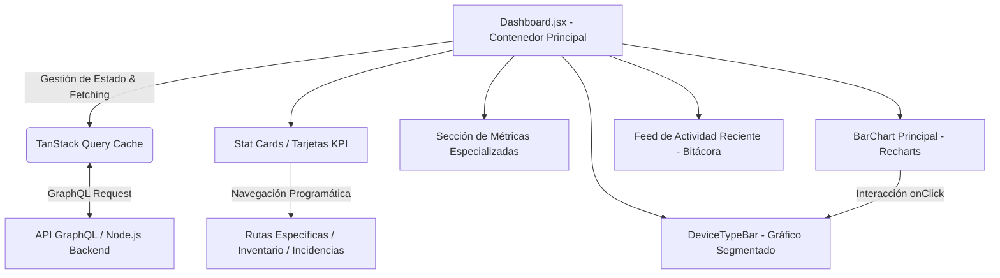
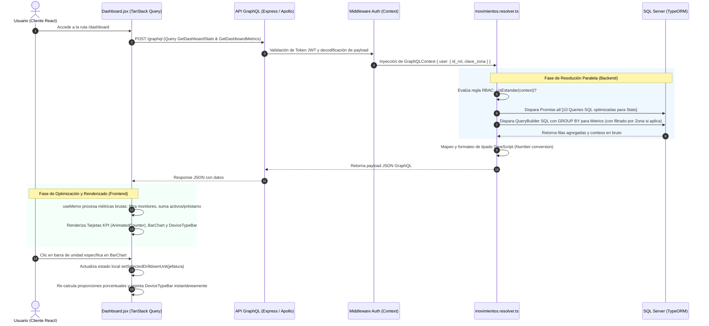

# Manual Técnico Oficial: Módulo de Panel Principal (Dashboard)

## 1. Descripción General

El módulo **Panel Principal (Dashboard)** representa la capa de visualización analítica, monitoreo operativo y toma de decisiones estratégicas dentro del **Ecosistema de Gestión de Activos Institucionales** de la Delegación Nayarit – IMSS. Su objetivo funcional es consolidar, en una interfaz panorámica de alta fidelidad, el estado en tiempo real del parque tecnológico institucional, transformando volúmenes masivos de registros transaccionales en Indicadores Clave de Rendimiento (KPIs) procesables.

Dentro de la arquitectura global del sistema, el Dashboard actúa como el orquestador visual principal al cumplir con las siguientes funciones críticas:
- **Visibilidad Centralizada y Aislamiento Territorial:** Proporciona un resumen ejecutivo que se adapta de manera dinámica al nivel de acceso del usuario (Global para Administradores/Maestros o delimitado territorialmente por Zona para Usuarios Estándar).
- **Monitoreo de Salud Operativa:** Identifica de forma proactiva riesgos en la continuidad del servicio, tales como equipos inactivos o en reparación, incidencias técnicas pendientes de resolución y contratos de garantía próximos a vencer.
- **Trazabilidad y Auditoría Continua:** Integra un canal de observabilidad en tiempo real sobre la bitácora transaccional del sistema, permitiendo a los roles directivos auditar creaciones, ediciones, eliminaciones y traspasos de activos en el exacto instante en que suceden.
- **Navegación Intuitiva de Profundidad (Drill-Down):** Permite descomponer agregaciones macroscópicas hasta el nivel de granularidad de unidad organizacional y categoría específica de hardware, facilitando auditorías rápidas y redistribución eficiente de recursos.

---

## 2. Arquitectura del Frontend

La capa de presentación está implementada en **React 19** utilizando un enfoque de componentes modulares, diseño responsivo impulsado por **Vanilla CSS / Tailwind CSS tokens** y visualización de datos vectoriales altamente optimizada mediante **Recharts**.



### Componentes Principales

1. **`Dashboard.jsx` (Contenedor Principal de Vista):**
   Actúa como el *Smart Component* orquestador. Gestiona las suscripciones de fetching de datos, evalúa las reglas de renderizado condicional basadas en el rol del usuario autenticado (`useAuthStore`) y distribuye el estado a los sub-componentes visuales.
2. **Tarjetas de Indicadores Clave (Stat Cards Condicionales):**
   Grilla superior de 4 tarjetas interactivas dotadas del sub-componente `AnimatedCounter` para transiciones numéricas fluidas. Su contenido muta arquitectónicamente según los privilegios del usuario:
   - *Usuarios Privilegiados (Roles Maestro/Admin):* Visualizan "Total de Bienes Activos", "Incidencias Activas", "Garantías por Vencer" y "Equipos Inactivos" (con cálculo algorítmico de Tasa de Disponibilidad). Al hacer clic, despachan navegación programática con filtros preinyectados en el estado de la ruta hacia los módulos correspondientes.
   - *Usuarios Estándar:* Visualizan atajos de alta frecuencia operativa: "Total de Bienes Activos", "Generar Salida de Bienes", "Escáner QR de Lectura Rápida" y "Catálogo General de Unidades".
3. **Sección de Métricas Detalladas por Equipo:**
   Panel de filtrado avanzado compuesto por un menú desplegable con búsqueda integrada (`metricsSearchInput`) y 4 tarjetas analíticas especializadas que segmentan el inventario en categorías críticas: *Cómputo (PC/Laptop)*, *Impresoras*, *Redes (Switches)* y *Telefonía (Subdividida en IP y Normal)*. Muestra el desglose tridimensional: Activos, Préstamos e Inactivos.
4. **Gráfico Principal de Barras (`BarChart` + Sidebar de Selección):**
   Composición que integra un panel lateral interactivo con input de búsqueda (`configSearch`) que permite seleccionar dinámicamente de 3 a 10 unidades médicas/administrativas para graficar. El área central renderiza un gráfico de barras auto-ajustable (`ResponsiveContainer`) dotado de física de amortiguación visual basada en la velocidad de scroll web (`scrollYVelocity`).
5. **`DeviceTypeBar` (Barra de Proporcionalidad Segmentada):**
   Sub-componente que implementa una barra horizontal de apilamiento porcentual al estilo *treemap lineal*. Al hacer clic en una unidad del gráfico de barras o en la selección general, este componente desglosa el 100% de los equipos de dicha unidad por tipo de hardware, codificando visualmente con colores contrastantes y patrones de sombreado los tres estados operativos del inventario: **Activo** regular, **Préstamo** (diferenciado con un patrón de sombreado diagonal y aclarado hexadecimal calculado por la utilidad `lightenHex`) e **Inactivo** (sombreado en gris neutro para conciliar sumatorias con las tarjetas analíticas superiores).
6. **Feed de Actividad Reciente (`Bitacora`):**
   Lista transaccional reservada para el rol Maestro (`id_rol === 1`). Muestra los últimos eventos de auditoría registrados, enriquecidos con iconos contextuales (`LOG_ICONS`) y transformación de descripciones técnicas a lenguaje natural (`getNaturalTitle`).

### Manejo de Estado y Hooks

El módulo combina estado local de interfaz, estado global de autenticación y gestión avanzada de caché de servidor:

- **Hooks Nativos de React:**
  - `useState`: Administra selecciones de interfaz, tales como `selectedUnits` (arreglo de claves de unidades visibles en la gráfica), `selectedDrilldownUnit` (unidad enfocada para el análisis de desglose), estados de apertura de dropdowns (`metricsDropdownOpen`) y variables de amortiguación visual (`scrollYVelocity`).
  - `useMemo`: Esencial para el rendimiento (*Performance Optimization*). Se utiliza extensivamente para procesar `metricsRawData` en el cliente sin re-renderizados costosos: agrupa y totaliza por jefatura para el gráfico de barras, filtra y clasifica con expresiones regulares las 4 categorías especializadas (`metricComp`, `metricImpresoras`, `metricSwitches`, `metricTelIP`, `metricTelNorm`) y calcula la distribución porcentual en `DeviceTypeBar`.
  - `useEffect`: Controla el ciclo de vida inicializando la selección de las primeras 6 unidades con mayor volumen tan pronto como los datos del backend se resuelven. Asimismo, adjunta un event listener `passive: true` al objeto `window` para rastrear la velocidad de desplazamiento (`scrollY`) y generar un efecto de estiramiento elástico en las gráficas, limpiando meticulosamente los temporizadores mediante `clearTimeout` para prevenir fugas de memoria.
- **Hooks de Enrutamiento (`react-router-dom`):**
  - `useNavigate`: Facilita el enrutamiento declarativo e imperativo, inyectando context objects en las transiciones (ej. `navigate('/garantias', { state: { filterPorVencer: true } })`).
- **Estado Global y Caché Remota (`@tanstack/react-query` & `Zustand`):**
  - `useAuthStore`: Hook de estado global persistente (Zustand) que provee la sesión y metadatos del usuario (`usuario.id_rol`).
  - `useQuery`: Orquesta la sincronización en tiempo real con el backend aplicando estrategias de **Polling / Refetching Progresivo de Baja Latencia**:
    - `dashboard_stats`: Refresco automático cada **10 segundos** (`refetchInterval: 10000`).
    - `dashboard_metrics`: Refresco automático cada **60 segundos** (`refetchInterval: 60000`).
    - `dashboard_garantias`: Refresco cada **15 segundos**, condicionado a roles de mando (`enabled: isPrivileged`).
    - `dashboard_bitacora`: Refresco de alta frecuencia cada **5 segundos**, estrictamente condicionado a la auditoría del Maestro (`enabled: isMaestro`).

### Integración GraphQL

Las peticiones se estructuran de forma modular en archivos de consultas (`src/api/*.queries.js`) y se disparan de forma agnóstica mediante un cliente ligero (`gqlClient.request`). Las firmas exactas utilizadas en el Dashboard son:

- **`GET_DASHBOARD_STATS_QUERY`:**
  ```graphql
  query GetDashboardStats {
    dashboardStats {
      totalBienes
      bienesActivos
      bienesInactivos
      bienesEnReparacion
      incidenciasPendientes
      incidenciasEnProceso
      garantiasVigentes
      garantiasPorVencer
      movimientosHoy
      totalUsuarios
    }
  }
  ```
- **`GET_DASHBOARD_METRICS_QUERY`:**
  ```graphql
  query GetDashboardMetrics {
    dashboardMetrics {
      clave_unidad
      jefatura
      tipo_disp
      nombre_tipo
      estatus_operativo
      count
    }
  }
  ```
- **`GET_GARANTIAS`:** Extrae la relación de coberturas para construir las alertas preventivas de vencimiento.
- **`GET_BITACORA`:** Consulta parametrizada con `first: 10` que recupera nodos y punteros de paginación de la tabla de auditoría, incluyendo datos anidados de la entidad `Usuario`.

---

## 3. Arquitectura del Backend

El backend está construido sobre **Node.js con TypeScript**, exponiendo una API GraphQL orquestada por **Apollo Server / Express** y persistencia relacional gestionada mediante el ORM **TypeORM** sobre una base de datos **SQL Server**.

### Resolvers

Los resolvers encargados de alimentar el Dashboard se encuentran en `src/graphql/resolvers/movimientos.resolver.ts` bajo la exportación `dashboardResolvers`.

- **`Query.dashboardStats`:**
  Implementa un patrón de **Paralelización de Consultas I/O Intensivas**. Tras verificar la sesión mediante la guarda de seguridad `requireAuth(context)`, determina si el usuario opera bajo el rol estándar (`isEstandar(context)`) para extraer su atributo de delimitación territorial (`clave_zona`). A continuación, dispara un arreglo de 10 promesas simultáneas (`Promise.all`) utilizando `createQueryBuilder` de TypeORM para ejecutar conteos exactos (`getCount()`) en paralelo sobre las tablas de inventario, incidencias, garantías, movimientos del día actual (`CAST(GETDATE() AS DATE)`) y usuarios activos. Aplica de manera imperativa filtros de purificación institucional en todos los conteos de activos (`bienQB`, `incQB`, `garQB`): adscripción obligatoria a claves oficiales (`clave_unidad_ref LIKE '19%'`), exclusión de ubicaciones de resguardo/almacén (`LOWER(ub.nombre_ubicacion) NOT LIKE '%bodega%' OR ub.nombre_ubicacion IS NULL`) y validación de números de inventario puramente numéricos (`num_inv LIKE '%[0-9]%' AND num_inv NOT LIKE '%[^0-9]%'`). El conteo principal de **Bienes Activos** (`bienesActivos`) consolida los estatus operativos `'ACTIVO'` y `'PRESTAMO'` (`PRÉSTAMO`) mediante `UPPER(b.estatus_operativo) IN ('ACTIVO', 'PRESTAMO', 'PRÉSTAMO')`.
- **`Query.dashboardMetrics`:**
  Resuelve la agregación analítica de carga pesada. En lugar de transferir el catálogo entero de activos a la capa Node.js, construye una consulta SQL analítica con agrupaciones (`GROUP BY`). Selecciona la clave y nombre de la unidad (`COALESCE(u.desc_corta, u.descripcion, 'Sin Unidad') AS jefatura`), el tipo de dispositivo y el estatus operativo, calculando el conteo de ocurrencias mediante `COUNT(b.id_bien) AS count`. Aplica un filtrado estricto para retornar únicamente bienes que cumplan con los filtros de purificación institucional (`clave_unidad_ref LIKE '19%'`, exclusión de bodegas y `num_inv` numérico) en estados operativos relevantes (`'ACTIVO'`, `'PRESTAMO'`, `'PRÉSTAMO'`, `'INACTIVO'`).

### Entidades de Base de Datos

Las operaciones relacionales del Dashboard involucran el mapeo de las siguientes entidades de TypeORM (`src/entities/*.ts`):

1. **`Bien` (Tabla: `Bienes`):** Entidad núcleo. Almacena `id_bien`, `estatus_operativo`, `clave_unidad_ref` (FK hacia `Unidad`) e `id_modelo` (FK hacia `CatModelo`).
2. **`Unidad` (Tabla: `unidades`):** Catálogo de unidades de adscripción. Almacena `clave`, `desc_corta`, `descripcion` y la columna clave de multitenancy `clave_zona`.
3. **`CatModelo` & `TipoDispositivo` (Tablas: `cat_modelos` y `tipos_dispositivo`):** Clasificación del hardware. `TipoDispositivo` define identificadores numéricos y descriptivos (`tipo_disp`: '1' Impresoras, '9' Switches, '12' Monitores, '25' Tel. IP, '26' Tel. Normal).
4. **`Incidencia` (Tabla: `Incidencias`):** Registros de fallos operativos vinculados por `id_bien`, rastreados por su `estatus_reparacion` ('Pendiente', 'En proceso').
5. **`Garantia` (Tabla: `Garantias`):** Contratos de soporte que vinculan un bien con una `fecha_fin` y un `estado_garantia`.
6. **`MovimientoInventario` (Tabla: `Movimientos_Inventario`):** Histórico de transacciones físicas.
7. **`Usuario` (Tabla: `Usuarios`):** Cuentas del personal institucional, vinculadas a unidades y roles.
8. **`Bitacora` (Tabla: `Bitacora`):** Tabla de auditoría inmutable que almacena `accion`, `tabla_afectada`, `registro_afectado`, `detalles_movimiento` y `fecha_movimiento`.

### Reglas de Negocio y Validación

1. **Aislamiento Territorial, Seguridad Multi-tenant y Filtros Institucionales de Limpieza:**
   Es la regla de seguridad y calidad primordial del backend. Para todo conteo o agregación analítica (`dashboardStats` y `dashboardMetrics`), el sistema impone un `INNER JOIN` hacia el catálogo de `unidades` asegurando que los bienes pertenezcan a claves presupuestales institucionales oficiales (`b.clave_unidad_ref LIKE '19%'`). Si `isEstandar(context)` es verdadero, el resolver acopla además la cláusula `u.clave_zona = :_dm_zona`, impidiendo que un administrador de una zona consulte o infiera métricas fuera de su demarcación. Asimismo, se integran filtros transversales que excluyen ubicaciones en almacén o resguardo temporal (`LEFT JOIN Ubicaciones` donde `nombre_ubicacion NOT LIKE '%bodega%'`) y exigen que el número de inventario sea puramente numérico (`num_inv LIKE '%[0-9]%' AND num_inv NOT LIKE '%[^0-9]%'`).
2. **Normalización y Consolidación Operativa de Estatus:**
   El backend normaliza las discrepancias ortográficas legacy en la base de datos (como la coexistencia de `'PRESTAMO'` y `'PRÉSTAMO'`) mediante transformaciones `UPPER()` en SQL. Para asegurar el alineamiento exacto con las consultas directivas de SQL Server, el total de **Bienes Activos** en las estadísticas generales agrupa simultáneamente `ACTIVO` y `PRESTAMO`, mientras que los desgloses analíticos (`dashboardMetrics`) mantienen accesibles en paralelo los estatus `ACTIVO`, `PRESTAMO` e `INACTIVO`.
3. **Inclusión Integral de Hardware y Segmentación Proporcional de Inactivos:**
   Para garantizar que las sumatorias de volumen por unidad (`allUnits`) y los gráficos de desglose horizontal por tipo de hardware (`DeviceTypeBar`) coincidan con precisión matemática con las consultas SQL institucionales (`GROUP BY u.clave`), el frontend no realiza exclusiones algorítmicas de accesorios o monitores, mostrando el 100% de las categorías existentes. Paralelamente, `DeviceTypeBar` segmenta dinámicamente cada tipo de dispositivo en tres sub-barras (`Activos`, `Préstamo` e `Inactivos`), logrando que las sumatorias categóricas concuerden milimétricamente con las tarjetas analíticas de especialidad.
4. **Ventana Crítica de Vencimiento de Garantías:**
   Se define como "Garantía por Vencer" exclusivamente a aquellos contratos cuyo estado sea `'VIGENTE'` y cuya `fecha_fin` se encuentre dentro de una ventana de **30 días naturales futuros** contados a partir del segundo exacto de la ejecución (`DATEADD(day, 30, GETDATE())`).

---

## 4. Flujo de Ejecución (Data Flow)

A continuación, se detalla el ciclo de vida completo transaccional desde la interacción interactiva en el navegador del cliente hasta la resolución en el cluster de base de datos SQL Server:



---

## 5. Fragmentos de Código Clave (Snippets)

### Snippet 1: Agregación en Cliente y Filtrado de Negocio (`Dashboard.jsx`)
Este fragmento demuestra cómo el frontend procesa eficientemente los cubos de datos devueltos por el backend utilizando `useMemo`. Filtra periféricos no contabilizables (monitores), consolida homónimos ortográficos en los estatus y genera la estructura clasificada en tiempo real sin saturar el hilo principal.

```javascript
// c:\...\Sistema-Gestion-Activos-Institucionales-Front\src\pages\Dashboard.jsx
const drilldownData = React.useMemo(() => {
  if (!metricsRawData || !selectedDrilldownUnit) return [];
  const typeMap = {};
  
  metricsRawData.forEach(row => {
    // 1. Filtrado por aislamiento de unidad enfocada por el usuario
    if (row.jefatura !== selectedDrilldownUnit) return;

    // 2. Regla de Negocio: Exclusión estricta de monitores del conteo terminal
    const isMonitor = String(row.tipo_disp) === '12' || 
                      (row.nombre_tipo || '').toUpperCase().includes('MONITOR');
    if (isMonitor) return;

    const t = row.nombre_tipo || 'Otro';
    const st = (row.estatus_operativo || '').toUpperCase();
    const isActive = st === 'ACTIVO' || st === 'PRESTAMO' || st === 'PRÉSTAMO';

    if (!isActive) return;

    // 3. Inicialización e indexación en estructura de mapa
    if (!typeMap[t]) typeMap[t] = { activo: 0, prestamo: 0 };
    
    // 4. Consolidación de estatus de préstamo normalizando tildes
    if (st === 'PRÉSTAMO' || st === 'PRESTAMO') {
      typeMap[t].prestamo += row.count;
    } else {
      typeMap[t].activo += row.count;
    }
  });

  // 5. Mapeo final a arreglo ordenado de mayor a menor volumen operativo
  return Object.entries(typeMap)
    .map(([tipo, { activo, prestamo }]) => ({
      tipo,
      activo,
      prestamo,
      count: activo + prestamo,
    }))
    .sort((a, b) => b.count - a.count);
}, [metricsRawData, selectedDrilldownUnit]);
```

---

### Snippet 2: Consulta Agregada Multi-tenant con TypeORM (`movimientos.resolver.ts`)
Ilustra la construcción dinámica de la consulta analítica en el servidor. Demuestra la inyección condicional de cláusulas `INNER JOIN` vs `LEFT JOIN` en función de las políticas de seguridad multitenancy de la zona institucional (`clave_zona`).

```typescript
// c:\...\Sistema-Gestion-Activos-Institucionales-Back\src\graphql\resolvers\movimientos.resolver.ts
dashboardMetrics: async (_: unknown, __: unknown, context: GraphQLContext) => {
  requireAuth(context);

  // Determinar zona territorial si el usuario tiene rol estándar
  const clave_zona_dm = isEstandar(context) ? context.user?.clave_zona ?? null : null;

  const qb = AppDataSource.getRepository(Bien)
    .createQueryBuilder('b')
    .select([
      "u.clave AS clave_unidad",
      "COALESCE(u.desc_corta, u.descripcion, 'Sin Unidad') AS jefatura",
      "td.tipo_disp AS tipo_disp",
      "td.nombre_tipo AS nombre_tipo",
      "UPPER(b.estatus_operativo) AS estatus_operativo"
    ])
    .addSelect("COUNT(b.id_bien)", "count")
    .leftJoin("b.modelo", "m")
    .leftJoin("m.tipoDispositivo", "td")
    .where("b.estatus_operativo IN ('ACTIVO', 'PRESTAMO', 'PRÉSTAMO', 'INACTIVO')");

  // Inyección de seguridad territorial RBAC en el motor SQL
  if (clave_zona_dm) {
    qb.innerJoin("unidades", "u", "u.clave = b.clave_unidad_ref AND u.clave_zona = :_dm_zona", { _dm_zona: clave_zona_dm });
  } else if (isEstandar(context)) {
    return []; // Abortar consulta si el usuario estándar carece de zona
  } else {
    qb.leftJoin("b.unidad", "u"); // Roles directivos observan todo el ecosistema
  }

  const metrics = await qb
    .groupBy("u.clave")
    .addGroupBy("COALESCE(u.desc_corta, u.descripcion, 'Sin Unidad')")
    .addGroupBy("td.tipo_disp")
    .addGroupBy("td.nombre_tipo")
    .addGroupBy("UPPER(b.estatus_operativo)")
    .getRawMany();

  return metrics.map(m => ({
    ...m,
    count: Number(m.count) || 0 // Saneamiento del tipo BigInt/String retornado por SQL Server
  }));
}
```

---

### Snippet 3: Paralelización de Consultas Globales con I/O No Bloqueante (`movimientos.resolver.ts`)
Muestra el patrón de concurrencia utilizado en el backend para obtener las estadísticas rápidas del Dashboard. Al utilizar `Promise.all` e inyectar constructores de consultas (QueryBuilders) independientes, el servidor resuelve 10 consultas de conteo en una única ronda de eventos de I/O de red hacia la base de datos.

```typescript
// c:\...\Sistema-Gestion-Activos-Institucionales-Back\src\graphql\resolvers\movimientos.resolver.ts
const bienQB = (where?: string) => {
  const q = bienRepo.createQueryBuilder('b');
  // Aislamiento por zona si el contexto lo demanda
  if (clave_zona) q.innerJoin('unidades', '_uz', `_uz.clave = b.clave_unidad_ref AND _uz.clave_zona = :_dz`, { _dz: clave_zona });
  if (where) q.andWhere(where);
  return q.getCount();
};

const garQB = (where: string, extraWhere?: string) => {
  const q = garRepo.createQueryBuilder('g');
  if (clave_zona) {
    q.innerJoin('Bienes', '_bz', '_bz.id_bien = g.id_bien')
     .innerJoin('unidades', '_uz', `_uz.clave = _bz.clave_unidad_ref AND _uz.clave_zona = :_dz`, { _dz: clave_zona });
  }
  q.andWhere(where);
  if (extraWhere) q.andWhere(extraWhere);
  return q.getCount();
};

// Ejecución altamente paralela para maximizar el throughput del servidor
const [
  totalBienes,
  bienesActivos,
  bienesInactivos,
  bienesEnReparacion,
  incidenciasPendientes,
  incidenciasEnProceso,
  garantiasVigentes,
  garantiasPorVencer,
  movimientosHoy,
  totalUsuarios,
] = await Promise.all([
  bienQB(),
  bienQB(`b.estatus_operativo = 'ACTIVO'`),
  bienQB(`b.estatus_operativo = 'INACTIVO'`),
  bienQB(`b.estatus_operativo = 'EN REPARACIÓN'`),
  incQB('i.estatus_reparacion = :val', 'Pendiente'),
  incQB('i.estatus_reparacion = :val', 'En proceso'),
  garQB(`g.estado_garantia = 'VIGENTE'`),
  garQB(`g.estado_garantia = 'VIGENTE'`, `g.fecha_fin <= DATEADD(day, 30, GETDATE()) AND g.fecha_fin >= GETDATE()`),
  (() => {
    const q = movRepo.createQueryBuilder('m');
    if (clave_zona) {
      q.innerJoin('Bienes', '_bz', '_bz.id_bien = m.id_bien')
       .innerJoin('unidades', '_uz', `_uz.clave = _bz.clave_unidad_ref AND _uz.clave_zona = :_dz`, { _dz: clave_zona });
    }
    q.andWhere(`CAST(m.fecha_movimiento AS DATE) = CAST(GETDATE() AS DATE)`);
    return q.getCount();
  })(),
  clave_zona
    ? AppDataSource.getRepository(Usuario)
        .createQueryBuilder('u')
        .where('u.estatus = 1')
        .andWhere(`u.clave_unidad IN (SELECT clave FROM unidades WHERE clave_zona = :_dz)`, { _dz: clave_zona })
        .getCount()
    : AppDataSource.getRepository(Usuario).count({ where: { estatus: true } }),
]);
```

---
*Manual generado y documentado por la Arquitectura Técnica Central del Sistema de Gestión de Activos Institucionales.*
