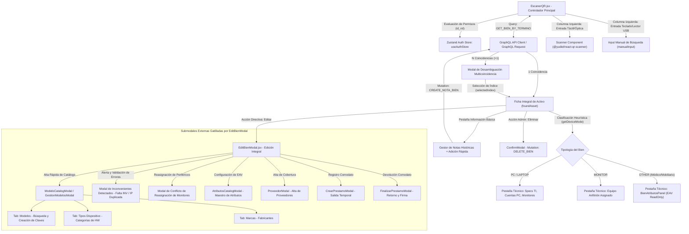
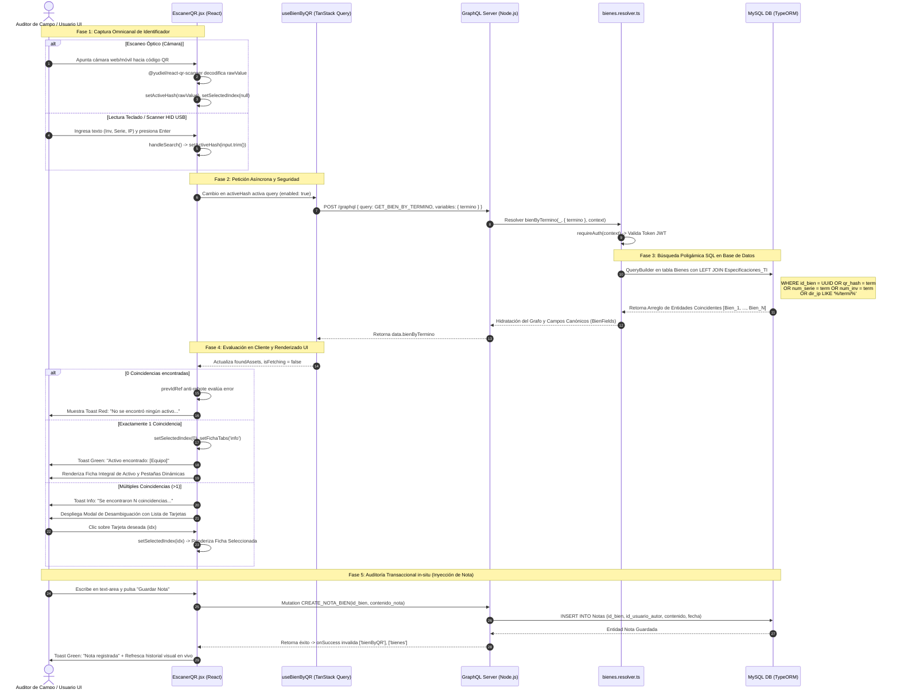

# Manual Técnico Oficial: Módulo de Escáner QR y Auditoría de Campo

## 1. Descripción General

El módulo de **Escáner QR (`EscanerQR.jsx`)** constituye la interfaz táctica y de auditoría de campo multi-vectorial dentro del **Ecosistema de Gestión de Activos Institucionales** de la Delegación Nayarit – IMSS. Su objetivo funcional prioritario es descentralizar la consulta, verificación patrimonial, diagnóstico de infraestructura informática y registro transaccional in-situ de los activos físicos, eliminando la latencia y fricción asociadas a la búsqueda manual en catálogos tabulares masivos.

En la arquitectura del ecosistema institucional, el **Escáner QR** opera bajo un paradigma de **Identificación Agnóstica Omnicanal**: actúa como un punto convergente de introspección que enlaza el plano físico (etiquetas de inventario adheridas al hardware en hospitales, clínicas y oficinas) con el plano digital y relacional de la base de datos. Su relevancia dentro del sistema radica en tres capacidades transversales clave:

1. **Introspección Integral de 360 Grados por Nodo:** Al capturar un identificador, el módulo no se limita a mostrar un registro plano; reconstruye en tiempo real el grafo completo del activo, correlacionando datos patrimoniales y contables (número de inventario, clave presupuestal, usuario resguardante ISO/IMSS), topología de red informática (dirección IPv4, MAC address, host name, puerto y switch de red), cuentas logicas de usuario Windows asociadas (`CuentasPC`), inventario de software instalado y auditado (`ProgramasPC`), periféricos acoplados (`BienMonitor`), vigencia de pólizas de aseguramiento (`Garantias`) y atributos dinámicos EAV (`BienAtributo`).
2. **Auditoría Transaccional y Bitácora de Campo:** Funciona como terminal móvil transaccional que permite a inspectores y personal de soporte TI inyectar observaciones de auditoría (`Notas`) con sellado de tiempo y firmadas criptográficamente por el JWT del operador en sesión, así como puentear directamente a la edición patrimonial profunda (`EditBienModal`) o a la baja operativa del activo sin abandonar el flujo del escáner.
3. **Desambiguación Topológica y Resolución Multicoincidencia:** En entornos clínicos complejos donde históricamente pueden coexistir colisiones de direccionamiento IP o números de serie heredados, el módulo incorpora un sub-motor de desambiguación visual que permite al operador seleccionar con precisión quirúrgica el nodo físico correcto entre un conjunto de resultados coincidentes.

---

## 2. Arquitectura del Frontend

La capa de presentación del módulo está desarrollada en **React 19** bajo un patrón de diseño responsivo de doble columna optimizado tanto para resoluciones de escritorio del personal de mesa de ayuda como para terminales móviles y tabletas de auditores en campo. Utiliza **Tailwind CSS** con animaciones por hardware (`keyframes scanGlow`) y gestión de estado asíncrono propulsada por **TanStack Query (v5)**.



### Componentes Principales

1. **`EscanerQR.jsx` (Orquestador de Escaneo y Contenedor de Vista):**
   Estructura el layout principal en una cuadrícula CSS Grid (`grid-cols-12`).
   - **Columna de Entrada Óptica y Manual (`xl:col-span-4`):** Integra el motor de escaneo de cámara móvil `@yudiel/react-qr-scanner`. Implementa manejo de permisos por hardware capturando excepciones (`NotAllowedError`) y controlando el ciclo de vida de la cámara mediante el estado `isCamEnabled`. Superpone un marco visual de puntería con bordes acentuados en verde institucional (`#00ff88`) y un láser de escaneo animado mediante CSS `linear-gradient` transaccional. En la parte inferior, ofrece un input de texto plano acoplado a eventos de teclado (`onKeyDown={e => e.key === 'Enter'}`) compatible con lectores de código de barras por emulación USB/HID.
   - **Columna de Visualización y Análisis (`xl:col-span-8`):** Renderiza dinámicamente los estados de la interfaz: estado de espera (`Esperando escaneo`), spinner de carga (`isFetching`), panel de error por inexistencia o el modal interactivo de desambiguación cuando el arreglo devuelto excede 1 elemento.
2. **Modal de Desambiguación (`Modal` nativo con Selector de Índice):**
   Cuando el resolutor GraphQL retorna múltiples registros para una misma cadena de consulta (por ejemplo, cuando se busca una dirección IP que corresponde a una PC anfitriona y a una impresora de red adyacente, o series genéricas duplicadas), el sistema bloquea el renderizado de la ficha única y despliega una lista navegable de tarjetas comparativas. Cada tarjeta resume el nombre del equipo, categoría, número de serie, inventario y badge de IP (`Wifi`). Al hacer clic en una opción, se actualiza el estado `setSelectedIndex(idx)` y se hidrata la ficha técnica.
3. **Ficha Integral con Clasificación Heurística de Dispositivo (`getDeviceMode`):**
   Para optimizar la densidad de información mostrada en pantalla según la naturaleza física del activo escaneado, la vista ejecuta la heurística pura `getDeviceMode(nombreCategoria, hasSpecs)`:
   - Evaluando subcadenas en la categoría (`monitor`, `laptop`, `cómputo`) y la existencia del objeto `especificacionTI`, bifurca el comportamiento del componente modular en pestañas (`fichaTabs`):
     - **Pestaña de Información Básica (`info`):** Despliega la rejilla de campos de control de inventario (`numSerie`, `numInv`, `clavePresupuestal`, `resguardo`, `fechaAdquisicion`). Incluye de forma nativa la consola de auditoría de campo (`Notas de Observación`), renderizando el historial de anotaciones cronológicas y un formulario de inyección inmediata (`createNotaBien`).
     - **Pestaña Técnico / Atributos (`tecnico`):** En equipos de cómputo (`PC` / `LAPTOP`), renderiza los paneles satelitales de **Especificaciones TI** (`Monitor`, `Cpu`, `HardDrive`, `Wifi`, direcciones MAC ethernet e inalámbricas), **Cuentas de Usuario Windows** (`cuentasPC`), **Monitores Asignados** (`monitores`) y **Póliza de Garantía** (`garantias`). Si el activo corresponde a equipamiento médico, industrial o de oficina (`OTHER`), instancia de forma transparente el componente subyacente `BienAtributosPanel` en modo `readOnly={true}`, visualizando los atributos dinámicos EAV.
     - **Pestaña Software Instalado (`software`):** Cuando la auditoría en red ha reportado paquetería instalada en el equipo (`programasPC.length > 0`), se habilita una tabla virtualizada equipada con el sub-motor de filtrado instantáneo en memoria (`SoftwareTable`).
4. **Núcleo de Edición Transaccional y Submodales Externas (`EditBienModal.jsx`):**
   Al ejecutarse una inspección en campo mediante el escáner, el personal con permisos directivos (`puedeEditar`) puede pulsar el botón **Editar** en el pie de página para abrir una instancia del orquestador compartido `EditBienModal.jsx`. Este componente actúa como un concentrador arquitectónico que preserva la integridad referencial de múltiples tablas jerárquicas y es capaz de gatillar dinámicamente un sub-ecosistema de modales transaccionales externas sin perder el contexto de la sesión de escaneo:
   - **`ModeloCatalogModal` / `GestionModelosModal` (`showCatalogModal`):** Mini-CRUD transaccional en Portal para administrar la taxonomía de hardware. Está dividida internamente en tres pestañas operativas: *Modelos* (búsqueda y alta de descripciones patrimoniales), *Tipos Dispositivo* (registro al vuelo de categorías de hardware) y *Marcas* (gestión de fabricantes con detección inteligente de duplicados case-insensitive).
   - **`AtributosCatalogModal` (`showAtributosModal`):** Interfaz de configuración del esquema EAV (Entity-Attribute-Value), permitiendo definir y adaptar plantillas de atributos técnicos en vivo para la categoría del bien auditado.
   - **`ProveedorModal` (`showAddProveedorModal`):** Formulario rápido en ventana flotante para dar de alta una nueva empresa proveedora al vincular o renovar una póliza de garantía in-situ.
   - **`CrearPrestamoModal` & `FinalizarPrestamoModal`:** Gestión del ciclo de comodatos o salidas temporales. Permiten transicionar el estatus operativo del activo a `'PRESTAMO'` o finalizarlo, registrando la unidad médica receptora, responsable de firma, fecha compromiso de retorno y actualizando la bitácora inmutable.
   - **`Modal de Inconvenientes Detectados` (`inconveniencesWarning` vía Portal):** Barrera de resiliencia de datos renderizada con `ReactDOM.createPortal`. Se interpone antes de persistir la edición si detecta que un equipo capitalizable carece de número de inventario o incurre en colisión de direcciones IP. Ofrece al auditor resolver el conflicto ejecutando la mutación de limpieza (`CLEAR_IP_FROM_OTHER_BIENES_MUTATION`) para arrebatar la IP a equipos duplicados, o guardar marcando una bandera de advertencia en base de datos.
   - **`Modal de Conflicto de Reasignación de Monitores`:** Interfaz de resolución que se activa al intentar asignar un monitor que ya se encuentra acoplado a otra estación de trabajo en el inventario.

### Manejo de Estado y Hooks

El módulo entrelaza un modelo de estado en capas que separa la reactividad visual local de la sincronización remota en caché:

- **Hooks de Estado Local (`useState`, `useRef`, `useMemo`):**
  - `activeHash`: Cadena reactiva que representa el identificador activo en el sistema. Al modificarse mediante el escáner de cámara o búsqueda manual, dispara de forma declarativa el ciclo de fetch de TanStack Query.
  - `selectedIndex`: Puntero entero nullable (`null | number`) que rige la selección actual dentro del arreglo de coincidencias encontradas.
  - `prevIdRef`: Referencia mutable (`useRef`) concebida como mecanismo de control anti-rebote para las notificaciones del sistema (`showToast`). Al persistir en memoria el último ID procesado, evita que re-renderizados causados por transiciones visuales o el foco de ventana envíen alertas duplicadas de éxito o error al usuario.
  - `SoftwareTable` emplea `useMemo` para recalcular el subconjunto de programas filtrados únicamente cuando la cadena de búsqueda interna (`query`) o la prop `programas` varían, evitando cálculos intensivos en tablas de cientos de paquetes.
- **Estado Global de Autorización (`useAuthStore`):**
  Consume la tienda global de Zustand para verificar la jerarquía de roles del usuario en sesión (`usuario?.id_rol`). Deriva banderas boleanas estrictas que condicionan la renderización de botones de acción en el pie de página: `puedeEditar` (Roles 1: Admin, 2: Maestro) y `puedeEliminar` (Rol 1: Admin global).
- **Hooks de Gestión Transaccional (`useEscaner.js` - TanStack Query v5):**
  - **`useBienByQR(termino)`:** Hook encapsulador de `useQuery`. Se ejecuta con el key `['bienByQR', termino]` y se condiciona estrictamente con `enabled: !!termino`. Deshabilita reintentos automáticos (`retry: false`) para brindar un feedback de error instantáneo ante escaneos fallidos. Intercepta excepciones en capa de red; si el código devuelto es `UNAUTHENTICATED`, invoca `clearAuth()` purgado la sesión local.
  - **`useCreateNotaBien()`, `useDeleteBien()`, `useEditBien()`:** Hooks de mutación transaccional. Implementan una estrategia de invalidación cruzada atómica tras cada operación exitosa (`onSuccess`): purgan simultáneamente las llaves `['bienByQR']`, `['bienes']` y `['bienDetail']`, garantizando consistencia absoluta en todo el frontend.

### Integración GraphQL

El módulo interactúa con la API de servidor mediante consultas y mutaciones altamente estructuradas:

- **Query `GET_BIEN_BY_TERMINO` (alias `GET_BIEN_BY_QR`):**
  ```graphql
  query GetBienByTermino($termino: String!) {
    bienByTermino(termino: $termino) {
      ...BienFields
    }
  }
  ```
  Al consumir el fragmento canónico `BienFields`, la solicitud recupera en un único viaje de red la totalidad del árbol de dependencias del bien: relaciones geográficas (`ubicacion`, `segmento`), administrativas (`usuarioResguardo`), técnicas (`especificacionTI`, `monitores`, `equipoAsignado`, `cuentasPC`, `programasPC`), contractuales (`garantias`, `proveedorObj`), EAV (`atributos`) y bitácora de auditoría (`notas`).
- **Mutations Específicas de la Vista:**
  - `CREATE_NOTA_BIEN`: Inyecta la cadena de texto de observación en el backend pasándole `$id_bien: ID!` y `$contenido_nota: String!`.
  - `DELETE_BIEN`: Elimina lógica o físicamente el activo patrimonial pasándole `$id_bien: ID!`.

---

## 3. Arquitectura del Backend

El motor backend atiende las peticiones del módulo a través de resolutores GraphQL construidos en **Node.js / TypeScript**, apoyados por un ORM **TypeORM** sobre una base de datos relacional **MySQL**.

### Resolvers

1. **`bienByTermino` (`src/graphql/resolvers/bienes.resolver.ts`):**
   Es el núcleo lógico de búsqueda del escáner. Tras validar el token JWT y los permisos con `requireAuth(context)`, instancia el `QueryBuilder` de TypeORM sobre la entidad cabecera `Bien`. En lugar de ejecutar una búsqueda simple por llave primaria, implementa un **Emparejamiento Poligámico Multi-Vectorial (Polymorphic Match)**, acoplando un `leftJoinAndSelect('b.especificacionTI', 'e')` para posibilitar búsquedas simultáneas sobre hardware y patrimonio:
   - **Vector 1 (UUID Primary Key):** Comprueba si el término ingresado tiene estructura de identificador único compatible con la base de datos mediante la función SQL de casteo seguro: `TRY_CONVERT(uniqueidentifier, :termino) IS NOT NULL AND b.id_bien = TRY_CONVERT(uniqueidentifier, :termino)`.
   - **Vector 2 (Hash QR Criptográfico):** Evalúa coincidencia exacta contra la columna indexada del código de barras/QR generado por el sistema: `b.qr_hash = :termino`.
   - **Vector 3 (Número de Serie del Fabricante):** Evalúa coincidencia exacta en el número de serie de hardware: `b.num_serie = :termino`.
   - **Vector 4 (Número de Inventario Institucional):** Evalúa coincidencia exacta en el marbete o etiqueta patrimonial: `b.num_inv = :termino`.
   - **Vector 5 (Direccionamiento de Red IPv4):** Evalúa coincidencia en la tabla relacionada `Especificaciones_TI`. Para soportar configuraciones de adaptadores con múltiples direcciones IP (ej. `10.14.1.50/192.168.1.10`), el resolutor aplica búsquedas combinadas con comodines SQL `LIKE`:
     ```sql
     (e.dir_ip = :termino OR e.dir_ip LIKE :termino_start OR e.dir_ip LIKE :termino_end OR e.dir_ip LIKE :termino_mid)
     ```
     Donde `:termino_start = termino + '/%'`, `:termino_end = '%/' + termino`, y `:termino_mid = '%/' + termino + '/%'`.
2. **`createNotaBien` (`src/graphql/resolvers/transaccionales.resolver.ts`):**
   Gestiona la bitácora de auditoría de campo. Verifica la existencia previa de la entidad `Bien` (`if (!bien) throw new NotFoundError('Bien')`). Extrae de manera inyectada la identidad del usuario logueado en el contexto GraphQL (`context.user!.id_usuario`) y construye la entidad `Nota`, persistiendo de manera atómica la fecha, el autor y el cuerpo del mensaje en la tabla satélite `Notas`.

### Entidades de Base de Datos

Las operaciones relacionales del Escáner QR involucran el modelado relacional de las siguientes clases TypeORM en `src/entities/`:

- **`Bien` (Tabla `Bienes`):** Entidad central de inventario. Define las llaves primarias e índices de búsqueda rápida (`id_bien`, `qr_hash`, `num_serie`, `num_inv`). Establece un mapeo relacional de llaves foráneas (`id_categoria`, `id_segmento`, `id_ubicacion`, `id_usuario_resguardo`).
- **`EspecificacionTI` (Tabla `Especificaciones_TI`):** Entidad relacional 1:1 con `Bien`. Almacena los atributos informáticos críticos (`dir_ip`, `mac_address`, `dir_mac`, `cpu_info`, `ram_gb`, `almacenamiento_gb`, `nombre_host`, `puerto_red`, `switch_red`, `last_scan`).
- **`Nota` (Tabla `Notas`):** Entidad relacional 1:N que registra la trazabilidad histórica de observaciones técnicas o de resguardo. Almacena `id_nota`, `id_bien`, `id_usuario_autor`, `contenido_nota`, y `fecha_creacion`.
- **Tablas Satélites de Inspección:** El árbol devuelto incluye cargas vinculadas a `CuentaPC` (cuentas locales y de dominio en sistemas operativos), `ProgramasPC` (catálogo recolectado por el agente de inventario informático) y `BienMonitor` (relación N:M que enlaza pantallas periféricas con CPUs y portátiles).

### Reglas de Negocio

1. **Agnosticismo y Polimorfismo en la Entrada de Datos:** El backend impone como regla arquitectónica que la capa cliente no requiera pre-seleccionar el tipo de identificador escaneado. El motor absorbe cualquier cadena y resuelve su correspondencia patrimonial o de red en una sola ejecución transaccional.
2. **Bloqueo Inmutable en Activos con Estatus de Baja o Inactividad:** En las operaciones de actualización o escaneo automatizado que disparan `upsertEspecificacionTI`, el backend valida el estatus operativo en la tabla de bienes. Si el activo exhibe estatus de `'INACTIVO'`, `'BAJA'` o `'P_BAJA'`, el servidor cancela la mutación sobre `Especificaciones_TI` y retorna el registro previo intacto, protegiendo la inmutabilidad forense del hardware al momento de su retiro o dictamen de siniestro.
3. **Cálculo Topológico y Enlace Automático IP-Segmento Bit a Bit:** Al actualizarse o detectarse una dirección IPv4 válida en las especificaciones del bien, el resolutor ejecuta una rutina de cálculo algebraico a nivel de bits:
   - Convierte el primer octeto IPv4 detectado por expresión regular en un entero de 32 bits sin signo (`ipToInt`).
   - Recorre el catálogo de la tabla `Segmentos` (`Segmento`) aplicando la máscara de red CIDR:
     ```typescript
     const mask = (~((1 << (32 - s.bits)) - 1)) >>> 0;
     const isMatch = (pcIpInt & mask) === (networkInt & mask);
     ```
   - Si detecta coincidencia matemática con una subred institucional, sobrescribe automáticamente el campo `id_segmento` de la entidad `Bien`, vinculando al equipo con su inmueble y VLAN correspondientes de forma totalmente desatendida.
4. **Detección Visual de Anomalías Patrimoniales (Conflictos IP / Falta de Etiquetado):** Si en el grafo devuelto el arreglo calculable `foundAsset.inconvenientes` contiene alertas generadas por validaciones transversales de base de datos (por ejemplo, subcadenas que inician con `"IP Repetida"` o `"Sin número de inventario"`), la capa de presentación inyecta dinámicamente insignias visuales de advertencia (`AlertTriangle` en color rojo pulsante) dentro de las tarjetas informativas.

---

## 4. Flujo de Ejecución (Data Flow)

El siguiente diagrama secuencial detalla el ciclo de vida completo del procesamiento transaccional, desde la captura óptica o física en la terminal del usuario hasta la visualización y actualización del inventario en base de datos:



---

## 5. Fragmentos de Código Clave (Snippets)

### Fragmento 1: Búsqueda Poligámica Multi-Vectorial en el Backend (`bienes.resolver.ts`)
Este bloque ilustra la construcción de la consulta de TypeORM que otorga al escáner su capacidad omnicanal al evaluar 5 vectores de identificación en una sola instrucción SQL optimizada:

```typescript
// src/graphql/resolvers/bienes.resolver.ts
bienByTermino: async (_: unknown, { termino }: { termino: string }, context: GraphQLContext) => {
  // 1. Barrera de seguridad: Verificación de sesión activa
  requireAuth(context);
  
  return AppDataSource.getRepository(Bien)
    .createQueryBuilder('b')
    // 2. Acoplamiento de tabla técnica para escaneo de IPs y MACs
    .leftJoinAndSelect('b.especificacionTI', 'e')
    // 3. Evaluación de casteo seguro a UUID (evita excepciones SQL en SQL Server/MySQL)
    .where('(TRY_CONVERT(uniqueidentifier, :termino) IS NOT NULL AND b.id_bien = TRY_CONVERT(uniqueidentifier, :termino))', { termino })
    // 4. Búsqueda exacta por hash criptográfico QR, serie o inventario
    .orWhere('b.qr_hash = :termino', { termino })
    .orWhere('b.num_serie = :termino', { termino })
    .orWhere('b.num_inv = :termino', { termino })
    // 5. Búsqueda de IP tolerante a adaptadores múltiples separados por '/'
    .orWhere('(e.dir_ip = :termino OR e.dir_ip LIKE :termino_start OR e.dir_ip LIKE :termino_end OR e.dir_ip LIKE :termino_mid)', {
      termino: termino,
      termino_start: termino + '/%',
      termino_end: '%/' + termino,
      termino_mid: '%/' + termino + '/%'
    })
    .getMany();
},
```

### Fragmento 2: Clasificación Heurística de Dispositivos en Frontend (`EscanerQR.jsx`)
Función utilitaria pura que permite al frontend deducir la tipología del activo para estructurar y adaptar la densidad visual de pestañas (`PC`, `LAPTOP`, `MONITOR`, `OTHER`) de forma reactiva y sin depender de banderas arbitrarias de base de datos:

```javascript
// src/pages/EscanerQR.jsx
const CATEGORIAS_TI = [1, 3];

function getDeviceMode(nombreCategoria = null, hasSpecs = false) {
  const c = (nombreCategoria || '').toLowerCase();
  // 1. Detección heurística por subcadenas en la descripción del catálogo
  if (c.includes('monitor')) return 'MONITOR';
  if (c.includes('laptop') || c.includes('port') || c.includes('notebook')) return 'LAPTOP';
  // 2. Si es equipo de escritorio o posee entidad EspecificacionTI adjunta, se clasifica como PC
  if (c.includes('cómputo') || c.includes('computo') || hasSpecs) return 'PC';
  // 3. Mobiliario, equipo médico u oficina recaen en modo EAV general
  return 'OTHER';
}
```

### Fragmento 3: Orquestación Visual e Hidratación Condicional tras Escaneo (`EscanerQR.jsx`)
Bloque que demuestra cómo la capa de presentación procesa la respuesta asíncrona en el `useEffect`, aplicando control anti-rebote (`prevIdRef`) y manejando de forma elegante la bifurcación entre resultado único y desambiguación multicoincidencia:

```javascript
// src/pages/EscanerQR.jsx
useEffect(() => {
  if (activeHash && !isFetching) {
    if (foundAssets && foundAssets.length > 0) {
      // 1. Control anti-rebote para evitar duplicidad de alertas flotantes en re-renders
      if (prevIdRef.current !== activeHash) {
        prevIdRef.current = activeHash;
        if (foundAssets.length === 1) {
          // 2. Coincidencia única: Selección automática e hidratación de ficha básica
          setSelectedIndex(0);
          showToast(`Activo encontrado: ${foundAssets[0].equipo}`, 'success');
          setFichaTabs('info');
        } else {
          // 3. Multicoincidencia: Reseteo de selección para obligar al usuario a desambiguar en el Modal
          setSelectedIndex(null);
          showToast(`Se encontraron ${foundAssets.length} coincidencias. Selecciona una.`, 'info');
        }
      }
    } else if (isError || !foundAssets || foundAssets.length === 0) {
      if (prevIdRef.current !== 'error-' + activeHash) {
        showToast('No se encontró ningún activo con ese identificador.', 'error');
        prevIdRef.current = 'error-' + activeHash;
      }
    }
  }
}, [activeHash, isFetching, foundAssets, isError]);
```

---
*Manual técnico oficial generado y documentado por la Arquitectura Técnica Central del Sistema de Gestión de Activos Institucionales de la Delegación Nayarit – IMSS.*
