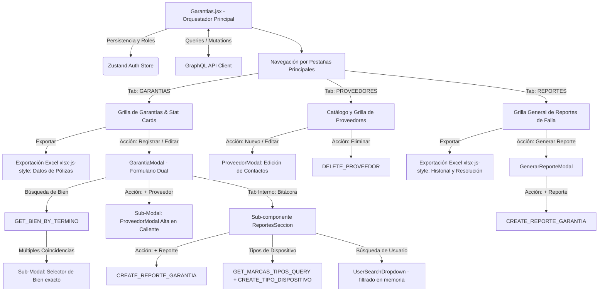
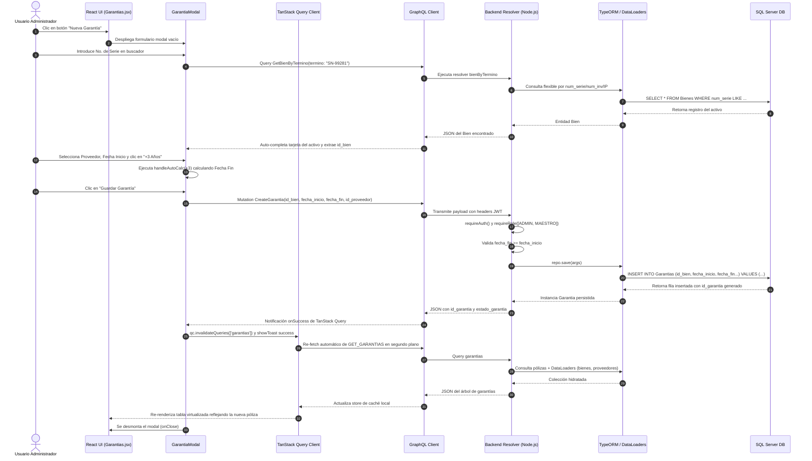

# Manual Técnico Oficial: Módulo de Gestión y Seguimiento de Garantías

## 1. Descripción General

El módulo de **Gestión y Seguimiento de Garantías** constituye una pieza de infraestructura analítica y de control patrimonial crítica dentro del **Ecosistema de Gestión de Activos Institucionales** de la Delegación Nayarit – IMSS. Su objetivo funcional primario es gobernar el ciclo de vida de las coberturas contractuales, pólizas de soporte y garantías de fabricante de todo el parque tecnológico (equipos de cómputo, servidores, infraestructura de red, telefonía e impresoras), vinculando cada activo del inventario con sus respectivos proveedores y condiciones contractuales.

En el contexto global del ecosistema institucional, este módulo actúa como un escudo de salvaguarda operativa y presupuestal. Al mantener una trazabilidad rigurosa sobre las fechas de vigencia y permitir una comunicación bidireccional continua con el catálogo de **Inventario de Bienes**, el sistema previene gastos indebidos derivados de la contratación de servicios externos de mantenimiento para activos que aún cuentan con respaldo directo del proveedor. Asimismo, proporciona un canal de observabilidad especializado (**Bitácora de Reportes de Garantía**) que permite documentar, dar seguimiento formal y auditar la reparación o sustitución de hardware con fallas originadas bajo condiciones de cobertura.

---

## 2. Arquitectura del Frontend

La capa de presentación está desarrollada en **React (v18+)**, implementando un patrón de diseño modular basado en componentes orientados a eventos, estilización responsiva con utilidades **Tailwind CSS**, y sincronización de datos asíncrona altamente optimizada mediante **TanStack Query**.



### Componentes Principales

1. **`Garantias.jsx` (Contenedor Principal Orquestador):**
   Actúa como el *Smart Component* centralizado del módulo. Administra la navegación interna mediante un sistema de tres pestañas operativas (`activeTab`: `'GARANTIAS'`, `'PROVEEDORES'`, `'REPORTES'`), evalúa de forma reactiva los privilegios de acceso basados en la sesión del usuario (`id_rol`), y coordina la renderización condicional de estadísticas, barras de filtrado multidimensional y tablas transaccionales. La pestaña de **Bitácora de Reportes** muestra en las cabeceras de columna el sufijo `(Ult.)` (ej. *No. Reporte (Ult.)*, *Fecha Reporte (Ult.)*, *Falla Reportada (Ult.)*) para indicar explícitamente que los datos corresponden al reporte más reciente de cada garantía.
2. **Panel de Estadísticas Rápidas (`Stat Cards`):**
   Sección colapsable que calcula en tiempo real métricas agregadas a partir de la caché de datos en memoria: Total de Pólizas Registradas, Garantías Vigentes, Garantías Vencidas y Pólizas Críticas próximas a vencer en un margen inferior a 30 días. Proporciona una vista ejecutiva para la toma de decisiones inmediata.
3. **Barra de Filtrado Multidimensional (`Filters & Search`):**
   Interconexión de controles que combinan filtrado por término de búsqueda (con sombreado visual dinámico mediante `highlightText`), segmentación por estado operativo (`VIGENTE`, `VENCIDA`), filtrado por rangos cronológicos (`dateFilterType`: por Fecha de Inicio o Fecha de Vencimiento) y selectores multiselección (`MultiSelect`) para acotar por Proveedor o Tipo de Dispositivo tecnológico. Específicamente al encontrarse en la pestaña de **Bitácora de Reportes (`activeTab === 'REPORTES'`)**, se renderiza un control condicional para filtrar por **Último Estatus** (`ultimoEstatusFilters`), evaluando dinámicamente el estatus más reciente del historial (`g.reportes[0]?.estatus`). Además, es capaz de auto-activar filtros especializados al recibir payloads en la navegación programática (`useLocation().state?.filterPorVencer`).
4. **Modales Transaccionales y Flujos Anidados:**
   - **`GarantiaModal` (Formulario de Creación / Edición con Flujos Anidados):** Interfaz modal dual dotada de un buscador auto-completado de alta precisión (`GET_BIEN_BY_TERMINO`). Si la búsqueda devuelve **múltiples coincidencias** (`multipleMatches.length > 0`), el sistema despliega de forma reactiva una sub-modal de desambiguación para que el usuario seleccione el equipo exacto por su IP, modelo o número de serie. Asimismo, dentro de este mismo registro, el usuario puede disparar la apertura en caliente de una segunda modal (`ProveedorModal` via `showAddProveedorModal`) para dar de alta un nuevo proveedor y asociarlo instantáneamente sin perder el progreso del formulario. Incorpora también aceleradores algorítmicos para vigencias (+1, +3 o +5 años via `handleAutoCalc`) y un sub-enrutador de pestañas internas (`DATOS` vs `REPORTES`) que incrusta el componente `ReportesSeccion`, permitiendo registrar reportes de falla de hardware directamente desde la edición de la póliza.
   - **Pestaña de Gestión de Proveedores (`activeTab === 'PROVEEDORES'`):** Vista dedicada a la administración del catálogo de proveedores. Desde aquí se pueden disparar modales de alta, edición completa de datos institucionales y contactos multicanal (`modalEditarProveedor`), o eliminación física del registro (`modalEliminarProveedor`), revalidando automáticamente la caché en memoria tras cada operación.
   - **Pestaña de Bitácora de Reportes (`activeTab === 'REPORTES'`):** Vista panorámica que consolida todos los incidentes enviados a garantía en la institución, permitiendo segmentarlos mediante el filtro dinámico de **Último Estatus**. Dispone de un botón de acción global para abrir el `GenerarReporteModal` y registrar una nueva incidencia vinculada a cualquier póliza activa.
   - **`GarantiaDetalleModal` (Inspector Panorámico):** Vista de solo lectura de alta fidelidad que desglosa la ficha técnica del activo conectado, los metadatos de contacto del proveedor asignado y el historial cronológico transaccional.
5. **`ReportesSeccion.jsx` (Sub-componente de Bitácora Centralizado):**
   Componente reutilizable responsable de toda la interfaz de la bitácora de seguimiento. Se incrusta en todas las modales que requieran gestión de reportes, garantizando coherencia funcional. Implementa las siguientes capacidades añadidas:
   - **Bitácora Colapsable por Número de Reporte:** Las notas se agrupan en secciones colapsables identificadas por el `numero_reporte`. Cada cabecera muestra el folio en badge verde, los tipos de dispositivo únicos del grupo (ej. `GAR-521 — Teclado, Mouse`) y un contador de notas. Por defecto todas las secciones están **colapsadas** hasta que el usuario las expande explícitamente. Las notas sin número de reporte se agrupan al final bajo *"Sin número de reporte"*.
   - **Selector Inteligente de Número de Reporte:** El campo de captura detecta si el bien ya tiene números de reporte registrados (cruzando la garantía actual con el historial en caché). En caso afirmativo, muestra un `<select>` con las opciones existentes más la alternativa de registrar uno nuevo. Si no hay historial previo, muestra un campo de texto directo.
   - **Campo `serie_pieza_nueva` Condicional:** El campo de número de serie del componente de reemplazo solo se renderiza y persiste cuando el estatus es `'Listo para recoger'` o `'Resuelto / Entregado'`, reflejando que el dato no es conocido en etapas anteriores del proceso.
   - **Selector Buscable de Tipo de Dispositivo (`SearchableSelect`):** El campo `tipo_dispositivo` es un selector con búsqueda normalizada que permite encontrar rápidamente el tipo por nombre (insensible a acentos y mayúsculas). Incluye un botón de alta rápida que valida duplicados por normalización Unicode antes de crear un nuevo tipo.
   - **Buscador de Usuario que Reporta (`UserSearchDropdown`):** Selector especializado con filtrado en memoria sobre el catálogo completo de usuarios activos, evitando llamadas de red adicionales ante catálogos de gran tamaño (20,000+ registros).
   - **Gestión de Fecha de Resolución:** Al seleccionar el estatus `'Resuelto / Entregado'`, el formulario muestra un campo `date` opcional para la **Fecha de Resolución**. Si se deja en blanco, el servidor asigna automáticamente la fecha del sistema como valor por defecto.
   - **Campo `fecha_atencion` como Fecha Simple:** El campo Fecha de Atención utiliza `type="date"` (sin hora) con parseo seguro de zona horaria para evitar el desface de un día en zonas UTC−.

6. **`UserSearchDropdown.jsx` (Buscador de Usuarios):**
   Componente especializado de selección con búsqueda dinámica en memoria sobre el catálogo de usuarios activos (`useUsuariosActivos`). Filtra por nombre o matrícula sin peticiones de red adicionales, resolviendo la limitación de rendimiento ante catálogos de más de 20,000 registros.
7. **`SearchableSelect.jsx` (Selector con Búsqueda Normalizada):**
   Componente genérico de selección con búsqueda insensible a acentos y mayúsculas (normalización Unicode `NFD`). Utilizado en el campo **Tipo de Dispositivo** de todos los formularios de nota de garantía.

### Motor de Exportación a Excel (`xlsx-js-style`)

El módulo integra una capacidad avanzada de exportación que genera hojas de cálculo corporativas pre-formateadas y estilizadas dinámicamente según la pestaña activa y los filtros aplicados en la interfaz:

- **Librería y Maquetación Visual:** Utiliza `xlsx-js-style` para construir un libro de trabajo (`workbook`) dotado de cabeceras institucionales en negrita (Filas 1 a 4 con el nombre del sistema, filtros aplicados, fecha de generación y conteo total), ajuste automático de salto de línea (`wrapText: true`), anchos de columna estrictamente calibrados (`wch`) y activación algorítmica de auto-filtros nativos de Excel a partir de la fila 6 (`worksheet['!autofilter'] = { ref: 'A6:...' }`).
- **Nombramiento Dinámico del Archivo:** Genera identificadores semánticos que reflejan el contexto del reporte, por ejemplo: `Garantias_Filtradas_2026-06-29.xlsx` o `Reportes_Garantias_Completas_2026-06-29.xlsx`.
- **Datos Exportados por Pestaña y Agrupación por Bitácoras:** Ambas pestañas generan filas independientes por cada bitácora o número de reporte (`No. Reporte`), separando las incidencias en filas individuales cuando una garantía tiene múltiples folios de reporte.
  - *En la pestaña `GARANTIAS` (Control de Garantías):* Exporta una matriz con las columnas: `No. Reporte`, `Tipo de dispositivo(s)`, `Unidad`, `Usuario(s) que Reporta(n)`, `Descripción Equipo` (Marca y Modelo), `Número de Serie`, `Proveedor`, `Estado Garantía` (Vigente/Vencida), `Inicio Garantía` y `Fin Garantía`.
  - *En la pestaña `REPORTES` (Reportes de Garantía):* Toma las garantías que cuentan con incidencias (`garantiasConReportes`) y genera una exportación profunda que incluye todas las columnas de identificación del equipo, póliza y unidad, incorporando de forma explícita las columnas **`Último Estatus`**, **`No. de Serie de Última Pieza Nueva`** y una nueva columna especializada para **`Fecha de Atención`**. Adicionalmente, suma la columna de historial **`Reportes / Bitácora`**. En esta columna, compila y formatea un historial secuencial detallado y limpio de cada ticket asociado sin separadores verticales (`|`) ni corchetes redundantes. Al contar ya con columnas propias para el número de reporte y la fecha de atención, estos datos se omiten del texto y cada nota se plasma en una maquetación ordenada de viñetas indentadas (`•`) para: fecha y estatus en cabecera, usuario que registró, usuario que reportó, equipo involucrado, pieza nueva, falla y resolución. Adicionalmente, si el usuario aplicó un filtro por último estatus en esta pestaña, el encabezado institucional en la fila 2 del Excel declara expresamente dicho filtro como `Estatus: [estatus seleccionados]`, manteniéndose consistente con los filtros aplicados en las demás vistas.
- **Resolución Inteligente de Catálogos y Formateo en Viñetas (`formatLista`):** El motor se conecta dinámicamente al catálogo de tipos de dispositivo (`GET_MARCAS_TIPOS_QUERY`) y al catálogo de usuarios activos (`useUsuariosActivos`) para evitar que se exporten identificadores numéricos o matrículas aisladas. Mediante las funciones auxiliares `getNombreTipo` y `getNombreUsuarioReporta`, el sistema resuelve el nombre textual de cada dispositivo (ej. *Access Point, Micrófono*) y formatea a los usuarios reportantes incluyendo su matrícula entre paréntesis (ej. `ACOSTA RUBIO METZLI NAYELLI (98191375)`). Cuando una bitácora agrupa múltiples dispositivos o múltiples usuarios, la función `formatLista` los dispone como una lista vertical dentro de la celda de Excel usando viñetas (`•`) y saltos de línea (`\n`), aprovechando el auto-ajuste de texto (`wrapText: true`).

### Manejo de Estado y Hooks

El módulo entrelaza estados locales de UI, enrutamiento declarativo y estado remoto sincronizado:

- **Hooks Nativos de React:**
  - `useState`: Controla los estados de las modales operativas (`modalCrear`, `modalEditar`, `modalDetalles`, `modalProveedor`, `modalGenerarReporte`, `showAddProveedorModal`, `multipleMatches`), valores de formularios, pestañas activas, términos de búsqueda, rangos de fechas (`startDate`, `endDate`), selectores de filtro (`proveedorFilters`, `tipoDispositivoFilters`, `ultimoEstatusFilters`) y paginación en memoria (`currentPage`, `PAGE_SIZE = 15`). En `ReportesSeccion.jsx`, gestiona adicionalmente: `collapsedGroups` (estado de colapso de cada grupo de notas por número de reporte), `isNewReportNum` (modo de ingreso libre de nuevo número de reporte) e `isAddingTipo` (visibilidad del formulario de alta rápida de tipo de dispositivo).
  - `useMemo`: Esencial para el rendimiento computacional. Se emplea para derivar y filtrar en el navegador los arreglos de garantías (`filteredGarantias`), reportes y garantías con reportes (`garantiasConReportes`) y proveedores (`filteredProveedores`) aplicando complejas expresiones de filtrado cruzado sin gatillar re-renderizados ni peticiones de red redundantes. En `ReportesSeccion.jsx`, se usa adicionalmente para calcular `existingReportNumbers` (números de reporte únicos ya registrados para el bien, extrayendo datos de la garantía actual y del historial de garantías del bien en la caché) y `groupedReportes` (estructura de grupos `{ key, reportes[] }` para el renderizado de la bitácora colapsable).
  - `useEffect`: Intercepta el estado de enrutamiento entrante (`location.state`) para aplicar de forma transparente el filtro de garantías por vencer cuando el usuario aterriza desde la tarjeta de alerta del Dashboard principal, limpiando posteriormente el historial de navegación via `window.history.replaceState`.
- **Estado Global y Gestión de Caché (`Zustand` & `@tanstack/react-query`):**
  - `useAuthStore`: Provee de forma persistente el perfil del usuario activo (`usuario`), delimitando la renderización de mutaciones críticas (crear, editar, eliminar) exclusivamente a los roles directivos (`isMaestro = id_rol === 1`, `isAdministrador = id_rol === 2`).
  - `useQuery`: Mantiene sincronizadas las colecciones principales (`['garantias']`, `['proveedores']`) con políticas de revalidación en segundo plano. En `ReportesSeccion.jsx` se utiliza también para `['reportesGarantia', id_garantia]` y `['marcas-tipos']` (catálogo de tipos de dispositivo).
  - `useMutation` & `useQueryClient`: Orquestan la ejecución asíncrona de mutaciones GraphQL. Al completarse con éxito (ej. `deleteProveedorMut`), actualizan de forma inmutable la memoria caché local (`qc.setQueryData`) brindando retroalimentación visual instantánea al usuario mediante notificaciones de sistema (`showToast`).

### Integración GraphQL

La capa de red se desacopla en contratos limpios definidos en `src/api/garantias.queries.js`, ejecutados por el cliente HTTP `gqlClient.request`. Las operaciones exactas consumidas son:

- **Consultas de Colección y Búsqueda:**
  - `GET_GARANTIAS`: Extrae el árbol completo de garantías con sus relaciones anidadas (`proveedorObj`, `bien` con modelo, marca y tipo, y `reportes` con usuario registrador y `tipoDispositivoObj`).
  - `GET_PROVEEDORES`: Recupera el catálogo de entidades proveedoras y su matriz de contactos.
  - `GET_BIEN_BY_TERMINO`: Consulta de resolución rápida por coincidencia flexible para vincular activos en el formulario.
  - `GET_REPORTES_GARANTIA`: Obtiene la bitácora específica de un contrato de póliza particular, incluyendo los objetos anidados `tipoDispositivoObj { tipo_disp nombre_tipo }` y `usuarioReportaObj { id_usuario matricula nombre_completo }`.
- **Mutaciones Transaccionales:**
  - `CREATE_GARANTIA` / `UPDATE_GARANTIA` / `DELETE_GARANTIA`: Gestión del registro de la póliza en la entidad principal.
  - `CREATE_PROVEEDOR` / `UPDATE_PROVEEDOR` / `DELETE_PROVEEDOR`: Persistencia sobre el catálogo de proveedores e inyección de sus contactos.
  - `CREATE_REPORTE_GARANTIA` / `UPDATE_REPORTE_GARANTIA` / `DELETE_REPORTE_GARANTIA`: Control transaccional sobre las incidencias de hardware reportadas bajo póliza. Ambas mutaciones aceptan los parámetros extendidos:

| Parámetro GraphQL | Tipo | Propósito |
|---|---|---|
| `numero_reporte` | `String` | Folio o número de ticket del proveedor |
| `tipo_dispositivo` | `Int` | FK a `tipo_dispositivos.tipo_disp` |
| `usuario_reporta` | `Int` | FK a `Usuarios.id_usuario` (quien reportó) |
| `serie_pieza_nueva` | `String` | S/N del componente de reemplazo instalado |
| `fecha_atencion` | `DateTime` | Fecha en que el proveedor atendió el equipo |
| `fecha_resolucion` | `DateTime` | Fecha de cierre (opcional; fallback: fecha del sistema) |

---

## 3. Arquitectura del Backend

El backend se estructura como un servidor **Node.js / Express** tipado en **TypeScript**, exponiendo una API **GraphQL** sobre el motor ORM **TypeORM** conectado a una base de datos **Microsoft SQL Server**.

### Resolvers

Implementados en `src/graphql/resolvers/transaccionales.resolver.ts`, se dividen en Queries transaccionales y resolutores de campo (Field Resolvers):

- **Query Resolvers:**
  - `garantias`: Atiende la petición general de pólizas permitiendo filtrar dinámicamente por `id_bien` o `estado_garantia`. Implementa de forma imperativa la seguridad por multitenancy territorial.
  - `garantia`: Busca por ID unitario lanzando una excepción `NotFoundError` si la póliza ha sido depurada.
  - `garantiasPorVencer`: Evalúa las pólizas cuyo estado sea `'VIGENTE'` y cuya `fecha_fin` se encuentre dentro de un umbral paramétrico (`diasAlerta = 30`).
  - `reportesPorGarantia`: Retorna el historial de fallas asociadas a una póliza ordenadas cronológicamente (`fecha_reporte DESC`).
- **Field Resolvers & Optimización por DataLoaders:**
  Para prevenir el cuello de botella de rendimiento conocido como problema N+1 al hidratar sub-entidades, los tipos `Garantia` y `ReporteGarantia` delegan su resolución a un clúster de **DataLoaders** en memoria (`context.loaders`):
  - `Garantia.bien` → `bienLoader.load(parent.id_bien)`
  - `Garantia.proveedorObj` → `proveedorLoader.load(parent.id_proveedor)`
  - `Garantia.reportes` → `reportesByGarantiaLoader.load(parent.id_garantia)`
  - `ReporteGarantia.usuarioRegistra` → `usuarioLoader.load(parent.id_usuario_registra)`
  - `ReporteGarantia.usuarioReportaObj` → `usuarioLoader.load(parent.usuario_reporta)`
  - `ReporteGarantia.tipoDispositivoObj` → `tipoDispositivoLoader.load(parent.tipo_dispositivo)`

### Entidades de Base de Datos

Las operaciones relacionales del módulo de garantías interactúan con un ecosistema multi-tabla normalizado (`src/entities/*.ts`):

1. **`Garantia` (Tabla: `Garantias`):** Entidad 1:N que administra la cobertura de soporte contractual de un equipo (`id_bien`). Almacena las fechas de vigencia (`fecha_inicio`, `fecha_fin`), estado normativo (`estado_garantia` = 'VIGENTE', 'VENCIDA') y vinculación con la empresa proveedora del servicio (`id_proveedor`).
2. **`ReporteGarantia` (Tabla: `Reportes_Garantia`):** Bitácora histórica 1:N vinculada a `Garantia` y `Bien`. Registra los incidentes, fallas y trámites de reparación enviados al proveedor bajo póliza. Almacena los siguientes campos:

| Campo | Tipo SQL | Nullable | Descripción |
|---|---|---|---|
| `id_reporte_garantia` | `int` (PK) | No | Identificador autoincremental |
| `id_garantia` | `int` (FK) | No | Póliza a la que pertenece el reporte |
| `id_bien` | `uniqueidentifier` (FK) | No | Equipo involucrado en el incidente |
| `num_serie` | `varchar(50)` | Sí | Número de serie del activo al momento del reporte |
| `estatus` | `varchar(50)` | No | Estado del ticket (ver valores posibles abajo) |
| `descripcion_falla` | `nvarchar(MAX)` | No | Descripción de la falla (campo obligatorio) |
| `resolucion` | `nvarchar(MAX)` | Sí | Diagnóstico o resolución técnica del proveedor |
| `fecha_reporte` | `datetime` | Sí | Marca temporal de creación del reporte |
| `fecha_resolucion` | `datetime` | Sí | Fecha de cierre/resolución. Gestionada automáticamente |
| `id_usuario_registra` | `int` (FK) | Sí | Usuario de la sesión que crea/edita la nota |
| `numero_reporte` | `varchar(100)` | Sí | Folio o número de ticket del proveedor |
| `tipo_dispositivo` | `int` (FK) | Sí | FK a `tipo_dispositivos.tipo_disp` |
| `usuario_reporta` | `int` (FK) | Sí | FK a `Usuarios.id_usuario` (quien reportó la falla) |
| `serie_pieza_nueva` | `varchar(200)` | Sí | S/N del componente de reemplazo instalado |
| `fecha_atencion` | `datetime` | Sí | Fecha en que el proveedor atendió físicamente el equipo |

**Valores posibles de `estatus`:** `'Enviado a proveedor'`, `'En revisión'`, `'En reparación'`, `'Esperando piezas'`, `'Listo para recoger'`, `'Resuelto / Entregado'`, `'Rechazado'`.

3. **`Proveedor` & `Contacto` (Tablas: `Proveedores` y `Contactos`):** Catálogo maestro de fabricantes o empresas prestadoras de servicio (`Proveedor`), almacenando `id_proveedor` y `nombre_proveedor`. Se relaciona 1:N con `Contacto` para administrar los puntos de contacto multicanal (`contacto`, `tipo_contacto`).
4. **`Usuario` (Tabla: `Usuarios`):** Entidad maestra que gestiona la identidad y autenticación del personal (`Usuario`). Almacena la matrícula IMSS (`matricula`), nombre completo (`nombre_completo`), rol institucional (`id_rol` = 1: Maestro, 2: Admin, 3: Estándar) y la delimitación territorial (`clave_zona` / `clave_unidad`) para el aislamiento multitenancy y auditoría transaccional de reportes.
5. **`Bien` (Tabla: `Bienes`):** Entidad patrimonial troncal (`Bien`). Almacena `id_bien` (PK UUID), `num_serie`, `num_inv` y llaves foráneas hacia la ubicación y topología de red, siendo el objeto físico resguardado por las pólizas de garantía.
6. **`CatModelo` (Tabla: `Cat_Modelos`):** Catálogo normalizado de especificaciones de hardware (`CatModelo`). Almacena `clave_modelo`, descripción comercial del equipo (`descrip_disp`), marca (`clave_marca`) y tipo de dispositivo (`tipo_disp`).
7. **`TipoDispositivo` (Tabla: `tipo_dispositivos`):** Clasificador macrosistémico del hardware institucional (`TipoDispositivo`), almacenando `tipo_disp` y `nombre_tipo` (ej. Computadora de Escritorio, Servidor, Switch, Impresora). Los reportes de garantía se vinculan directamente a este catálogo mediante la FK `tipo_dispositivo` (int). Los formularios de nota permiten seleccionar el tipo desde un selector buscable y agregar nuevos tipos en caliente validando duplicados por normalización Unicode.

### Reglas de Negocio

El backend impone barreras de validación de datos e invariantes de negocio antes de tocar la capa de persistencia:

1. **Aislamiento Territorial Estricto (Multitenancy):**
   En los resolutores de consulta (`garantias`, `garantiasPorVencer`), se ejecuta una verificación del rol mediante `isEstandar(context)`. Si el usuario tiene un rol estándar territorial (asociado a una `clave_zona`), el ORM inyecta dinámicamente un `innerJoin` hacia las tablas `Bienes` y `unidades`, forzando en el SQL que `_ugz.clave_zona = :_gz`. Si un usuario estándar carece de zona, se inyecta la cláusula defensiva `1 = 0`, bloqueando cualquier exfiltración de información institucional de otras jurisdicciones.
2. **Jerarquía de Autorización de Escritura:**
   Toda mutación ejecuta `requireAuth(context)`. La creación y actualización de garantías o reportes exige pertenecer al clúster directivo (`requireRole(context, [ROLES.ADMIN, ROLES.MAESTRO])`), mientras que la eliminación física (`deleteGarantia`, `deleteReporteGarantia`) está estrictamente acordonada para el rol supremo (`ROLES.MAESTRO`).
3. **Integridad Cronológica:**
   Tanto en `createGarantia` como en `updateGarantia`, el sistema compara los objetos temporales. Si se proveen ambas fechas y se detecta que `new Date(fecha_fin) < new Date(fecha_inicio)`, se aborta la transacción arrojando una `ValidationError` explicativa.
4. **Sellado Temporal Inteligente de Resolución:**
   En el ciclo de vida de los reportes de garantía (`createReporteGarantia` / `updateReporteGarantia`), existe un disparador de lógica de negocio en código con la siguiente jerarquía de precedencia:
   - Si el estatus es `'Resuelto / Entregado'` **y** el cliente envía una `fecha_resolucion` explícita → se utiliza esa fecha (para registrar resoluciones históricas o de días anteriores).
   - Si el estatus es `'Resuelto / Entregado'` **y** no se envía `fecha_resolucion` → el servidor estampa automáticamente la marca temporal del sistema (`new Date()`).
   - En `updateReporteGarantia`: si el estatus ya era `'Resuelto / Entregado'` y se mantiene, se conserva la `fecha_resolucion` existente a menos que el cliente la sobrescriba explícitamente.
   - Si un reporte resuelto es reabierto hacia otro estatus diferente → el servidor resetea `fecha_resolucion` a `null`.
5. **Visibilidad Condicional de Serie de Pieza Nueva:**
   El campo `serie_pieza_nueva` únicamente se persiste y envía cuando el estatus del reporte es `'Listo para recoger'` o `'Resuelto / Entregado'`. En estados anteriores del flujo, el frontend envía `null` y el campo permanece oculto del formulario, reflejando que el número de serie del componente de reemplazo no se conoce hasta que el proveedor entrega o lista el equipo.

---

## 4. Flujo de Ejecución (Data Flow)

A continuación, se detalla el recorrido secuencial e interaccional desde que un administrador registra una nueva póliza de garantía para una computadora de escritorio hasta su reflejo final en el sistema:



---

## 5. Fragmentos de Código Clave (Snippets)

### Snippet 1 (Frontend): Cálculo Algorítmico de Vigencia y Búsqueda de Activos
Este bloque muestra cómo el modal de creación de garantías en la capa de presentación orquesta la búsqueda asíncrona de un bien mediante un término de coincidencia flexible y cómo calcula automáticamente la fecha de vencimiento sumando años cronológicos sin requerir mutación en el servidor.

```javascript
// Búsqueda en tiempo real de bienes por término (Serie, Inventario o IP)
const handleSearchBien = async () => {
  if (!searchValue) return;
  setIsSearching(true);
  setMultipleMatches([]);
  try {
    const res = await gqlClient.request(GET_BIEN_BY_TERMINO, { termino: searchValue.trim() });
    const foundBienes = res.bienByTermino || [];
    if (foundBienes.length === 1) {
      handleSelectBien(foundBienes[0]); // Auto-vinculación si es resultado único
    } else if (foundBienes.length > 1) {
      setMultipleMatches(foundBienes);  // Muestra selector de desambiguación
    } else {
      showToast('No se encontró ningún bien con ese criterio', 'error');
      setSelectedBien(null);
    }
  } catch (err) {
    showToast('Error técnico al buscar el bien', 'error');
  } finally {
    setIsSearching(false);
  }
};

// Acelerador operativo: Autocalculado de proyección de término de garantía
const handleAutoCalc = (years) => {
  if (!form.fecha_inicio) {
    showToast('Selecciona primero la Fecha de Inicio', 'warning');
    return;
  }
  const d = new Date(form.fecha_inicio);
  d.setFullYear(d.getFullYear() + years); // Suma exacta de años bisiestos/regulares

  // Formateo ISO a YYYY-MM-DD para inyección en el input type="date"
  const isoString = d.toISOString().split('T')[0];
  setForm(prev => ({ ...prev, fecha_fin: isoString }));
};
```

### Snippet 2 (Backend Resolver): Consulta Aislada por Zona y Seguridad Multitenancy
Ilustra cómo el resolutor de garantías implementa las barreras de seguridad de la arquitectura. Aplica validación de token JWT, construye un *QueryBuilder* dinámico y acopla un filtrado de aislamiento de datos si el solicitante es un usuario de zona estándar.

```typescript
garantias: async (_: unknown, { id_bien, estado_garantia }: any, context: GraphQLContext) => {
  // 1. Barrera de Seguridad: Validación obligatoria de sesión autenticada
  requireAuth(context);

  const qb = AppDataSource.getRepository(Garantia).createQueryBuilder('g');

  // 2. Aplicación de filtros opcionales de la petición GraphQL
  if (id_bien) qb.andWhere('g.id_bien = :id_bien', { id_bien });
  if (estado_garantia) qb.andWhere('g.estado_garantia = :e', { e: estado_garantia });

  // 3. Regla de Negocio: Aislamiento Territorial (Multitenancy por Zona)
  if (isEstandar(context) && context.user?.clave_zona) {
    qb.innerJoin('Bienes', '_bgz', '_bgz.id_bien = g.id_bien')
      .innerJoin('unidades', '_ugz', `_ugz.clave = _bgz.clave_unidad_ref AND _ugz.clave_zona = :_gz`, {
        _gz: context.user.clave_zona
      });
  } else if (isEstandar(context)) {
    qb.andWhere('1 = 0');
  }

  return qb.orderBy('g.fecha_fin', 'ASC').getMany();
},
```

### Snippet 3 (Backend Resolver): Sellado Temporal Inteligente de Resolución
Demuestra la lógica de gestión del campo `fecha_resolucion` en `createReporteGarantia` y `updateReporteGarantia`. El servidor acepta una fecha explícita del cliente para registrar resoluciones históricas; si no se provee, estampa la marca temporal del sistema.

```typescript
createReporteGarantia: async (_: unknown, args: any, context: GraphQLContext) => {
  requireAuth(context);
  requireRole(context, [ROLES.ADMIN, ROLES.MAESTRO]);

  if (!args.descripcion_falla || args.descripcion_falla.trim() === '') {
    throw new ValidationError('Por favor, indica la descripción de la falla.');
  }

  const repo = AppDataSource.getRepository(ReporteGarantia);
  const nuevoReporte = repo.create({
    id_garantia: parseInt(args.id_garantia),
    id_bien: args.id_bien,
    num_serie: args.num_serie,
    estatus: args.estatus,
    descripcion_falla: args.descripcion_falla,
    resolucion: args.resolucion,
    id_usuario_registra: context.user!.id_usuario,
    numero_reporte: args.numero_reporte,
    tipo_dispositivo: args.tipo_dispositivo != null ? parseInt(args.tipo_dispositivo) : null,
    usuario_reporta: args.usuario_reporta != null ? parseInt(args.usuario_reporta) : null,
    serie_pieza_nueva: args.serie_pieza_nueva,
    fecha_atencion: args.fecha_atencion ? new Date(args.fecha_atencion) : null,
  } as any);

  // Sellado temporal inteligente:
  // - Si el cliente provee fecha_resolucion, se usa esa (soporte para resoluciones históricas)
  // - Si no, se estampa new Date() como fecha del sistema
  if (args.estatus === 'Resuelto / Entregado') {
    (nuevoReporte as any).fecha_resolucion = args.fecha_resolucion
      ? new Date(args.fecha_resolucion) : new Date();
  } else if (args.fecha_resolucion) {
    (nuevoReporte as any).fecha_resolucion = new Date(args.fecha_resolucion);
  }

  return repo.save(nuevoReporte);
},

updateReporteGarantia: async (_: unknown, { id_reporte_garantia, ...updates }: any, context: GraphQLContext) => {
  requireAuth(context);
  requireRole(context, [ROLES.ADMIN, ROLES.MAESTRO]);
  const repo = AppDataSource.getRepository(ReporteGarantia);
  const item = await repo.findOne({ where: { id_reporte_garantia: parseInt(id_reporte_garantia) } });
  if (!item) throw new NotFoundError('ReporteGarantia');

  if (updates.descripcion_falla !== undefined && updates.descripcion_falla.trim() === '') {
    throw new ValidationError('La descripción de la falla no puede estar vacía.');
  }

  // Procesar fecha explícita del cliente
  if (updates.fecha_resolucion !== undefined) {
    updates.fecha_resolucion = updates.fecha_resolucion ? new Date(updates.fecha_resolucion) : null;
  }

  // Determinar estatus final y aplicar lógica de sellado
  const finalEstatus = updates.estatus !== undefined ? updates.estatus : item.estatus;
  if (finalEstatus === 'Resuelto / Entregado') {
    const finalFecha = updates.fecha_resolucion !== undefined ? updates.fecha_resolucion : item.fecha_resolucion;
    if (!finalFecha) updates.fecha_resolucion = new Date(); // Fallback: fecha actual
  } else if (updates.estatus !== undefined && updates.estatus !== 'Resuelto / Entregado') {
    updates.fecha_resolucion = null; // Reapertura: limpiar fecha de resolución
  }

  repo.merge(item, updates);
  return repo.save(item);
},
```

### Snippet 4 (Frontend): Agrupación Colapsable de la Bitácora por Número de Reporte
Muestra cómo `ReportesSeccion.jsx` agrupa dinámicamente las notas de seguimiento usando `useMemo` y las renderiza como secciones colapsables identificadas por el número de reporte.

```javascript
// Cálculo de grupos: notas con número de reporte por grupo, sin número al final
const groupedReportes = useMemo(() => {
  const groupMap = new Map();
  const sinReporte = [];

  reportes.forEach(rep => {
    const key = rep.numero_reporte?.trim();
    if (!key) {
      sinReporte.push(rep);
    } else {
      if (!groupMap.has(key)) groupMap.set(key, { key, reportes: [] });
      groupMap.get(key).reportes.push(rep);
    }
  });

  return [
    ...Array.from(groupMap.values()),
    ...(sinReporte.length > 0 ? [{ key: '__SIN_NUMERO__', reportes: sinReporte }] : [])
  ];
}, [reportes]);

// Estado de colapso: por defecto todos los grupos están colapsados.
// collapsedGroups[key] === false → expandido; undefined/true → colapsado
const [collapsedGroups, setCollapsedGroups] = useState({});

// En el renderizado, la cabecera de cada grupo muestra:
// - Ícono ChevronRight/ChevronDown según estado
// - Badge verde con el número de reporte (o cursiva "Sin número de reporte")
// - Tipos de dispositivo únicos del grupo (ej. "— Teclado, Mouse")
// - Contador de notas en badge gris
const isCollapsed = collapsedGroups[group.key] !== false;
const tiposDelGrupo = [...new Set(
  group.reportes
    .map(r => r.tipoDispositivoObj?.nombre_tipo || null)
    .filter(Boolean)
)];
```

### Snippet 5 (Frontend): Selector Inteligente de Número de Reporte por Bien
Ilustra cómo `ReportesSeccion.jsx` construye dinámicamente un `<select>` con los números de reporte ya registrados para el mismo bien, dando al usuario la opción de asociar la nueva nota a un reporte existente o registrar uno nuevo.

```javascript
// Calcular números de reporte únicos ya registrados para este bien (garantía actual + caché global)
const existingReportNumbers = useMemo(() => {
  const nums = new Set();
  const idBien = garantia.bien?.id_bien || garantia.id_bien;

  // Notas cargadas en la garantía actual
  reportes.forEach(r => { if (r.numero_reporte?.trim()) nums.add(r.numero_reporte.trim()); });

  // Garantías históricas del mismo bien en caché
  const todasGarantias = qc.getQueryData(['garantias']);
  if (todasGarantias?.garantias) {
    todasGarantias.garantias.forEach(g => {
      if (String(g.bien?.id_bien || g.id_bien) === String(idBien) && g.reportes) {
        g.reportes.forEach(r => { if (r.numero_reporte?.trim()) nums.add(r.numero_reporte.trim()); });
      }
    });
  }
  return Array.from(nums).sort();
}, [reportes, garantia, qc]);

// Si hay números previos → select adaptativo; si no → campo de texto directo
{existingReportNumbers.length > 0 ? (
  <div className="space-y-2">
    <select
      value={isNewReportNum ? '__NEW__' : (form.numero_reporte || '')}
      onChange={e => {
        const val = e.target.value;
        if (val === '__NEW__') {
          setIsNewReportNum(true);
          setForm(p => ({ ...p, numero_reporte: '' }));
        } else {
          setIsNewReportNum(false);
          setForm(p => ({ ...p, numero_reporte: val }));
        }
      }}
    >
      <option value="">-- Seleccionar número de reporte existente --</option>
      {existingReportNumbers.map(num => (
        <option key={num} value={num}>Reporte Existente: {num}</option>
      ))}
      <option value="__NEW__">+ Registrar número de reporte nuevo...</option>
    </select>
    {isNewReportNum && (
      <input type="text" value={form.numero_reporte}
        onChange={e => setForm(p => ({ ...p, numero_reporte: e.target.value }))}
        placeholder="Escribe el nuevo número de reporte o ticket..."
        autoFocus />
    )}
  </div>
) : (
  <input type="text" value={form.numero_reporte}
    onChange={e => setForm(p => ({ ...p, numero_reporte: e.target.value }))}
    placeholder="Ej. FOL-2026-001 o Ticket de Proveedor" />
)}
```

### Snippet 6 (Frontend): Formateo de Listas en Excel, Mapeo de Catálogos y Maquetación Limpia de Bitácora
Muestra cómo la función de exportación a Excel en `Garantias.jsx` implementa resolutores de nombres para catálogos y usuarios (asegurando matrículas entre paréntesis), organiza múltiples elementos en viñetas verticales dentro de las celdas y estructura el texto de historial en la columna `Reportes / Bitácora` sin delimitadores redundantes.

```javascript
// Resolutor de nombre de equipo (evita exportar IDs numéricos)
const getNombreTipo = (r) => {
  if (r.tipoDispositivoObj?.nombre_tipo) return r.tipoDispositivoObj.nombre_tipo;
  if (r.tipo_dispositivo) {
    const match = tiposDispositivo.find(t => String(t.tipo_disp) === String(r.tipo_dispositivo) || t.nombre_tipo?.toLowerCase() === String(r.tipo_dispositivo).toLowerCase());
    if (match?.nombre_tipo) return match.nombre_tipo;
  }
  return r.tipo_dispositivo || '';
};

// Resolutor de usuario que reporta con matrícula entre paréntesis
const getNombreUsuarioReporta = (r) => {
  if (r.usuarioReportaObj) {
    const nom = r.usuarioReportaObj.nombre_completo || 'Usuario';
    const mat = r.usuarioReportaObj.matricula || 'Sin matrícula';
    return `${nom} (${mat})`;
  }
  if (r.usuario_reporta) {
    const match = usuarios.find(u => String(u.id_usuario) === String(r.usuario_reporta) || String(u.matricula) === String(r.usuario_reporta) || u.nombre_completo?.toLowerCase() === String(r.usuario_reporta).toLowerCase());
    if (match) {
      const nom = match.nombre_completo || 'Usuario';
      const mat = match.matricula || 'Sin matrícula';
      return `${nom} (${mat})`;
    }
    return `${r.usuario_reporta} (Sin matrícula)`;
  }
  return '';
};

// Formateador de listas verticales para celdas Excel (saltos de línea y viñetas)
const formatLista = (arr) => {
  if (!arr || arr.length === 0) return 'N/A';
  if (arr.length === 1) return arr[0];
  return arr.map(item => `• ${item}`).join('\n');
};

// Maquetación limpia en viñetas para la columna 'Reportes / Bitácora'
const reportesFormateados = group.reportes.length > 0
  ? group.reportes.map((r, i) => {
      let autor = 'Usuario desconocido';
      if (r.usuarioRegistra) {
        autor = `${r.usuarioRegistra.nombre_completo} (${r.usuarioRegistra.matricula || 'Sin matrícula'})`;
      }
      const tipoStr = getNombreTipo(r);
      const reportoStr = getNombreUsuarioReporta(r);
      
      let lineas = [
        `${i + 1}. [${r.fecha_reporte ? formatDate(r.fecha_reporte) : 'S/F'}] — Estatus: ${r.estatus || 'Sin Estatus'}`,
        `   • Registró: ${autor}`
      ];
      if (reportoStr) lineas.push(`   • Reportó: ${reportoStr}`);
      if (tipoStr) lineas.push(`   • Equipo: ${tipoStr}`);
      if (r.serie_pieza_nueva) lineas.push(`   • Pieza Nueva: ${r.serie_pieza_nueva}`);
      lineas.push(`   • Falla: ${r.descripcion_falla || 'Sin descripción'}`);
      if (r.resolucion) lineas.push(`   • Resolución: ${r.resolucion}`);
      
      return lineas.join('\n');
    }).join('\n\n')
  : 'Sin Reportes';
```


