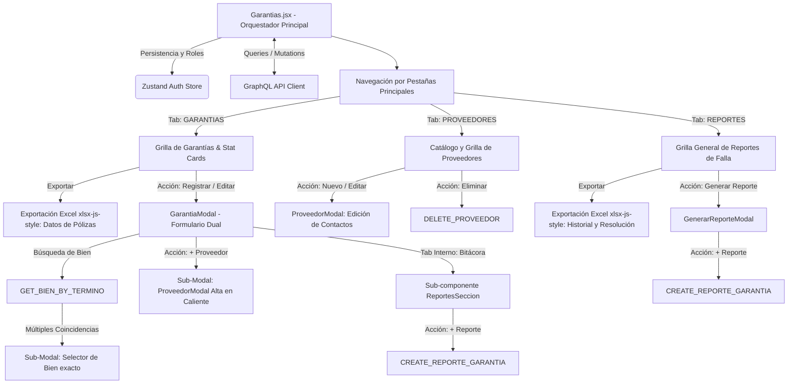
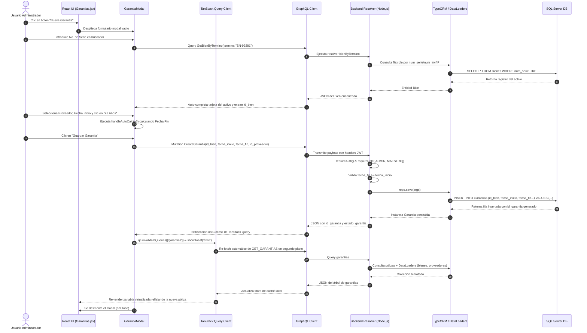

# Manual Técnico Oficial: Módulo de Gestión y Seguimiento de Garantías

## 1. Descripción General

El módulo de **Gestión y Seguimiento de Garantías** constituye una pieza de infraestructura analítica y de control patrimonial crítica dentro del **Ecosistema de Gestión de Activos Institucionales** de la Delegación Nayarit – IMSS. Su objetivo funcional primario es gobernar el ciclo de vida de las coberturas contractuales, pólizas de soporte y garantías de fabricante de todo el parque tecnológico (equipos de cómputo, servidores, infraestructura de red, telefonía e impresoras), vinculando cada activo del inventario con sus respectivos proveedores y condiciones contractuales.

En el contexto global del ecosistema institucional, este módulo actúa como un escudo de salvaguarda operativa y presupuestal. Al mantener una trazabilidad rigurosa sobre las fechas de vigencia y permitir una comunicación bidireccional continua con el catálogo de **Inventario de Bienes**, el sistema previene gastos indebidos derivados de la contratación de servicios externos de mantenimiento para activos que aún cuentan con respaldo directo del proveedor. Asimismo, proporciona un canal de observabilidad especializado (**Bitácora de Reportes de Garantía**) que permite documentar, dar seguimiento formal y auditar la reparación o sustitución de hardware con fallas originadas bajo condiciones de cobertura.

---

## 2. Arquitectura del Frontend

La capa de presentación está desarrollada en **React (v18+)**, implementando un patrón de diseño modular basado en componentes orientados a eventos, estilización responsiva con utilidades **Tailwind CSS**, y sincronización de datos asíncrona altamente optimizada mediante **TanStack Query**.



### Componentes Principales

1. **`Garantias.jsx` (Contenedor Principal Orquestador):**
   Actúa como el *Smart Component* centralizado del módulo. Administra la navegación interna mediante un sistema de tres pestañas operativas (`activeTab`: `'GARANTIAS'`, `'PROVEEDORES'`, `'REPORTES'`), evalúa de forma reactiva los privilegios de acceso basados en la sesión del usuario (`id_rol`), y coordina la renderización condicional de estadísticas, barras de filtrado multidimensional y tablas transaccionales.
2. **Panel de Estadísticas Rápidas (`Stat Cards`):**
   Sección colapsable que calcula en tiempo real métricas agregadas a partir de la caché de datos en memoria: Total de Pólizas Registradas, Garantías Vigentes, Garantías Vencidas y Pólizas Críticas próximas a vencer en un margen inferior a 30 días. Proporciona una vista ejecutiva para la toma de decisiones inmediata.
3. **Barra de Filtrado Multidimensional (`Filters & Search`):**
   Interconexión de controles que combinan filtrado por término de búsqueda (con sombreado visual dinámico mediante `highlightText`), segmentación por estado operativo (`VIGENTE`, `VENCIDA`), filtrado por rangos cronológicos (`dateFilterType`: por Fecha de Inicio o Fecha de Vencimiento) y selectores multiselección (`MultiSelect`) para acotar por Proveedor o Tipo de Dispositivo tecnológico. Específicamente al encontrarse en la pestaña de **Bitácora de Reportes (`activeTab === 'REPORTES'`)**, se renderiza un control condicional para filtrar por **Último Estatus** (`ultimoEstatusFilters`), evaluando dinámicamente el estatus más reciente del historial (`g.reportes[0]?.estatus`). Además, es capaz de auto-activar filtros especializados al recibir payloads en la navegación programática (`useLocation().state?.filterPorVencer`).
4. **Modales Transaccionales y Flujos Anidados:**
   - **`GarantiaModal` (Formulario de Creación / Edición con Flujos Anidados):** Interfaz modal dual dotada de un buscador auto-completado de alta precisión (`GET_BIEN_BY_TERMINO`). Si la búsqueda devuelve **múltiples coincidencias** (`multipleMatches.length > 0`), el sistema despliega de forma reactiva una sub-modal de desambiguación para que el usuario seleccione el equipo exacto por su IP, modelo o número de serie. Asimismo, dentro de este mismo registro, el usuario puede disparar la apertura en caliente de una segunda modal (`ProveedorModal` via `showAddProveedorModal`) para dar de alta un nuevo proveedor y asociarlo instantáneamente sin perder el progreso del formulario. Incorpora también aceleradores algorítmicos para vigencias (+1, +3 o +5 años via `handleAutoCalc`) y un sub-enrutador de pestañas internas (`DATOS` vs `REPORTES`) que incrusta el componente `ReportesSeccion`, permitiendo registrar reportes de falla de hardware directamente desde la edición de la póliza.
   - **Pestaña de Gestión de Proveedores (`activeTab === 'PROVEEDORES'`):** Vista dedicada a la administración del catálogo de proveedores. Desde aquí se pueden disparar modales de alta, edición completa de datos institucionales y contactos multicanal (`modalEditarProveedor`), o eliminación física del registro (`modalEliminarProveedor`), revalidando automáticamente la caché en memoria tras cada operación.
   - **Pestaña de Bitácora de Reportes (`activeTab === 'REPORTES'`):** Vista panorámica que consolida todos los incidentes enviados a garantía en la institución, permitiendo segmentarlos mediante el filtro dinámico de **Último Estatus**. Dispone de un botón de acción global para abrir el `GenerarReporteModal` y registrar una nueva incidencia vinculada a cualquier póliza activa.
   - **`GarantiaDetalleModal` (Inspector Panorámico):** Vista de solo lectura de alta fidelidad que desglosa la ficha técnica del activo conectado, los metadatos de contacto del proveedor asignado y el historial cronológico transaccional.

### Motor de Exportación a Excel (`xlsx-js-style`)

El módulo integra una capacidad avanzada de exportación que genera hojas de cálculo corporativas pre-formateadas y estilizadas dinámicamente según la pestaña activa y los filtros aplicados en la interfaz:

- **Librería y Maquetación Visual:** Utiliza `xlsx-js-style` para construir un libro de trabajo (`workbook`) dotado de cabeceras institucionales en negrita (Filas 1 a 4 con el nombre del sistema, filtros aplicados, fecha de generación y conteo total), ajuste automático de salto de línea (`wrapText: true`), anchos de columna estrictamente calibrados (`wch`) y activación algorítmica de auto-filtros nativos de Excel a partir de la fila 6 (`worksheet['!autofilter'] = { ref: 'A6:...' }`).
- **Nombramiento Dinámico del Archivo:** Genera identificadores semánticos que reflejan el contexto del reporte, por ejemplo: `Garantias_Filtradas_2026-06-29.xlsx` o `Reportes_Garantias_Completas_2026-06-29.xlsx`.
- **Datos Exportados por Pestaña:**
  - *En la pestaña `GARANTIAS`:* Exporta una matriz plana con las columnas: `ID Garantía`, `Equipo (Tipo)`, `Descripción Equipo` (Marca y Modelo), `Número de Serie`, `Proveedor`, `Estado Garantía` (Vigente/Vencida), `Inicio Garantía` y `Fin Garantía` (formateadas DD/MM/YYYY).
  - *En la pestaña `REPORTES`:* Toma las garantías que cuentan con incidencias (`garantiasConReportes`) y genera una exportación profunda que incluye todas las columnas de identificación del equipo y póliza, incorporando de forma explícita la columna **`Último Estatus`** (`g.reportes[0].estatus`) y sumando la columna especializada **`Reportes / Bitácora`**. En esta columna, compila y formatea un historial secuencial detallado de cada ticket asociado, imprimiendo: número de reporte, fecha del suceso, autor del registro con matrícula, estatus operativo, descripción completa de la falla y resolución técnica alcanzada. Adicionalmente, si el usuario aplicó un filtro por último estatus en esta pestaña, el encabezado institucional en la fila 2 del Excel declara expresamente dicho filtro como `Estatus: [estatus seleccionados]`, manteniéndose consistente con los filtros aplicados en las demás vistas.

### Manejo de Estado y Hooks

El módulo entrelaza estados locales de UI, enrutamiento declarativo y estado remoto sincronizado:

- **Hooks Nativos de React:**
  - `useState`: Controla los estados de las modales operativas (`modalCrear`, `modalEditar`, `modalDetalles`, `modalProveedor`, `modalGenerarReporte`, `showAddProveedorModal`, `multipleMatches`), valores de formularios, pestañas activas, términos de búsqueda, rangos de fechas (`startDate`, `endDate`), selectores de filtro (`proveedorFilters`, `tipoDispositivoFilters`, `ultimoEstatusFilters`) y paginación en memoria (`currentPage`, `PAGE_SIZE = 15`).
  - `useMemo`: Esencial para el rendimiento computacional. Se emplea para derivar y filtrar en el navegador los arreglos de garantías (`filteredGarantias`), reportes y garantías con reportes (`garantiasConReportes`) y proveedores (`filteredProveedores`) aplicando complejas expresiones de filtrado cruzado sin gatillar re-renderizados ni peticiones de red redundantes.
  - `useEffect`: Intercepta el estado de enrutamiento entrante (`location.state`) para aplicar de forma transparente el filtro de garantías por vencer cuando el usuario aterriza desde la tarjeta de alerta del Dashboard principal, limpiando posteriormente el historial de navegación via `window.history.replaceState`.
- **Estado Global y Gestión de Caché (`Zustand` & `@tanstack/react-query`):**
  - `useAuthStore`: Provee de forma persistente el perfil del usuario activo (`usuario`), delimitando la renderización de mutaciones críticas (crear, editar, eliminar) exclusivamente a los roles directivos (`isMaestro = id_rol === 1`, `isAdministrador = id_rol === 2`).
  - `useQuery`: Mantiene sincronizadas las colecciones principales (`['garantias']`, `['proveedores']`) con políticas de revalidación en segundo plano.
  - `useMutation` & `useQueryClient`: Orquestan la ejecución asíncrona de mutaciones GraphQL. Al completarse con éxito (ej. `deleteProveedorMut`), actualizan de forma inmutable la memoria caché local (`qc.setQueryData`) brindando retroalimentación visual instantánea al usuario mediante notificaciones de sistema (`showToast`).

### Integración GraphQL

La capa de red se desacopla en contratos limpios definidos en `src/api/garantias.queries.js`, ejecutados por el cliente HTTP `gqlClient.request`. Las operaciones exactas consumidas son:

- **Consultas de Colección y Búsqueda:**
  - `GET_GARANTIAS`: Extrae el árbol completo de garantías con sus relaciones anidadas (`proveedorObj`, `bien` con modelo, marca y tipo, y `reportes` con usuario registrador).
  - `GET_PROVEEDORES`: Recupera el catálogo de entidades proveedoras y su matriz de contactos.
  - `GET_BIEN_BY_TERMINO`: Consulta de resolución rápida por coincidencia flexible para vincular activos en el formulario.
  - `GET_REPORTES_GARANTIA`: Obtiene la bitácora específica de un contrato de póliza particular.
- **Mutaciones Transaccionales:**
  - `CREATE_GARANTIA` / `UPDATE_GARANTIA` / `DELETE_GARANTIA`: Gestión del registro de la póliza en la entidad principal.
  - `CREATE_PROVEEDOR` / `UPDATE_PROVEEDOR` / `DELETE_PROVEEDOR`: Persistencia sobre el catálogo de proveedores e inyección de sus contactos.
  - `CREATE_REPORTE_GARANTIA` / `UPDATE_REPORTE_GARANTIA` / `DELETE_REPORTE_GARANTIA`: Control transaccional sobre las incidencias de hardware reportadas bajo póliza.

---

## 3. Arquitectura del Backend

El backend se estructura como un servidor **Node.js / Express** tipado en **TypeScript**, exponiendo una API **GraphQL** sobre el motor ORM **TypeORM** conectado a una base de datos **Microsoft SQL Server**.

### Resolvers

Implementados en `src/graphql/resolvers/transaccionales.resolver.ts`, se dividen en Queries transaccionales y resolutores de campo (Field Resolvers):

- **Query Resolvers:**
  - `garantias`: Atiende la petición general de pólizas permitiendo filtrar dinámicamente por `id_bien` o `estado_garantia`. Implementa de forma imperativa la seguridad por multitenancy territorial.
  - `garantia`: Busca por ID unitario lanzando una excepción `NotFoundError` si la póliza ha sido depurada.
  - `garantiasPorVencer`: Evalúa las pólizas cuyo estado sea `'VIGENTE'` y cuya `fecha_fin` se encuentre dentro de un umbral paramétrico (`diasAlerta = 30`).
  - `reportesPorGarantia`: Retorna el historial de fallas asociadas a una póliza ordenadas cronológicamente (`fecha_reporte DESC`).
- **Field Resolvers & Optimización por DataLoaders:**
  Para prevenir el cuello de botella de rendimiento conocido como problema N+1 al hidratar sub-entidades, los tipos `Garantia` y `ReporteGarantia` delegan su resolución a un clúster de **DataLoaders** en memoria (`context.loaders`):
  - `Garantia.bien` $\rightarrow$ `bienLoader.load(parent.id_bien)`
  - `Garantia.proveedorObj` $\rightarrow$ `proveedorLoader.load(parent.id_proveedor)`
  - `Garantia.reportes` $\rightarrow$ `reportesByGarantiaLoader.load(parent.id_garantia)`
  - `ReporteGarantia.usuarioRegistra` $\rightarrow$ `usuarioLoader.load(parent.id_usuario_registra)`

### Entidades de Base de Datos

Las operaciones relacionales del módulo de garantías interactúan con un ecosistema multi-tabla normalizado (`src/entities/*.ts`):

1. **`Garantia` (Tabla: `Garantias`):** Entidad 1:N que administra la cobertura de soporte contractual de un equipo (`id_bien`). Almacena las fechas de vigencia (`fecha_inicio`, `fecha_fin`), estado normativo (`estado_garantia` = 'VIGENTE', 'VENCIDA') y vinculación con la empresa proveedora del servicio (`id_proveedor`).
2. **`ReporteGarantia` (Tabla: `Reportes_Garantia`):** Bitácora histórica 1:N vinculada a `Garantia` y `Bien`. Registra los incidentes, fallas y trámites de reparación enviados al proveedor bajo póliza. Almacena `num_serie`, flujo transaccional (`estatus`), diagnóstico y resolución (`descripcion_falla`, `resolucion`), marcas temporales (`fecha_reporte`, `fecha_resolucion`) y autoría (`id_usuario_registra`).
3. **`Proveedor` & `Contacto` (Tablas: `Proveedores` y `Contactos`):** Catálogo maestro de fabricantes o empresas prestadoras de servicio (`Proveedor`), almacenando `id_proveedor` y `nombre_proveedor`. Se relaciona 1:N con `Contacto` para administrar los puntos de contacto multicanal (`contacto`, `tipo_contacto`).
4. **`Usuario` (Tabla: `Usuarios`):** Entidad maestra que gestiona la identidad y autenticación del personal (`Usuario`). Almacena la matrícula IMSS (`matricula`), nombre completo (`nombre_completo`), rol institucional (`id_rol` = 1: Maestro, 2: Admin, 3: Estándar) y la delimitación territorial (`clave_zona` / `clave_unidad`) para el aislamiento multitenancy y auditoría transaccional de reportes.
5. **`Bien` (Tabla: `Bienes`):** Entidad patrimonial troncal (`Bien`). Almacena `id_bien` (PK UUID), `num_serie`, `num_inv` y llaves foráneas hacia la ubicación y topología de red, siendo el objeto físico resguardado por las pólizas de garantía.
6. **`CatModelo` (Tabla: `Cat_Modelos`):** Catálogo normalizado de especificaciones de hardware (`CatModelo`). Almacena `clave_modelo`, descripción comercial del equipo (`descrip_disp`), marca (`clave_marca`) y tipo de dispositivo (`tipo_disp`).
7. **`TipoDispositivo` (Tabla: `tipo_dispositivos`):** Clasificador macrosistémico del hardware institucional (`TipoDispositivo`), almacenando `tipo_disp` y `nombre_tipo` (ej. Computadora de Escritorio, Servidor, Switch, Impresora) para permitir la segmentación multidimensional en la interfaz.

### Reglas de Negocio

El backend impone barreras de validación de datos e invariantes de negocio antes de tocar la capa de persistencia:

1. **Aislamiento Territorial Estricto (Multitenancy):**
   En los resolutores de consulta (`garantias`, `garantiasPorVencer`), se ejecuta una verificación del rol mediante `isEstandar(context)`. Si el usuario tiene un rol estándar territorial (asociado a una `clave_zona`), el ORM inyecta dinámicamente un `innerJoin` hacia las tablas `Bienes` y `unidades`, forzando en el SQL que `_ugz.clave_zona = :_gz`. Si un usuario estándar carece de zona, se inyecta la cláusula defensiva `1 = 0`, bloqueando cualquier exfiltración de información institucional de otras jurisdicciones.
2. **Jerarquía de Autorización de Escritura:**
   Toda mutación ejecuta `requireAuth(context)`. La creación y actualización de garantías o reportes exige pertenecer al clúster directivo (`requireRole(context, [ROLES.ADMIN, ROLES.MAESTRO])`), mientras que la eliminación física (`deleteGarantia`, `deleteReporteGarantia`) está estrictamente acordonada para el rol supremo (`ROLES.MAESTRO`).
3. **Integridad Cronológica:**
   Tanto en `createGarantia` como en `updateGarantia`, el sistema compara los objetos temporales. Si se proveen ambas fechas y se detecta que `new Date(fecha_fin) < new Date(fecha_inicio)`, se aborta la transacción arrojando una `ValidationError` explicativa.
4. **Automatización Transaccional de Cierre (Sellado Temporal):**
   En el ciclo de vida de los reportes de garantía (`createReporteGarantia` / `updateReporteGarantia`), existe un disparador de lógica de negocio en código: si el parámetro `estatus` transiciona o se declara como `'Resuelto / Entregado'`, el servidor sobreescribe y estampa de manera irreversible en `fecha_resolucion` el timestamp actual (`new Date()`). A la inversa, si un reporte resuelto es reabierto en una edición hacia otro estatus, la fecha de resolución es reseteada a `null`.

---

## 4. Flujo de Ejecución (Data Flow)

A continuación, se detalla el recorrido secuencial e interaccional desde que un administrador registra una nueva póliza de garantía para una computadora de escritorio hasta su reflejo final en el sistema:



---

## 5. Fragmentos de Código Clave (Snippets)

### Snippet 1 (Frontend): Cálculo Algorítmico de Vigencia y Búsqueda de Activos
Este bloque muestra cómo el modal de creación de garantías en la capa de presentación orquesta la búsqueda asíncrona de un bien mediante un término de coincidencia flexible y cómo calcula automáticamente la fecha de vencimiento sumando años cronológicos sin requerir mutación en el servidor.

```javascript
// Búsqueda en tiempo real de bienes por término (Serie, Inventario o IP)
const handleSearchBien = async () => {
  if (!searchValue) return;
  setIsSearching(true);
  setMultipleMatches([]);
  try {
    const res = await gqlClient.request(GET_BIEN_BY_TERMINO, { termino: searchValue.trim() });
    const foundBienes = res.bienByTermino || [];

    if (foundBienes.length === 1) {
      handleSelectBien(foundBienes[0]); // Auto-vinculación si es resultado único
    } else if (foundBienes.length > 1) {
      setMultipleMatches(foundBienes);  // Muestra selector de desambiguación
    } else {
      showToast('No se encontró ningún bien con ese criterio', 'error');
      setSelectedBien(null);
    }
  } catch (err) {
    showToast('Error técnico al buscar el bien', 'error');
  } finally {
    setIsSearching(false);
  }
};

// Acelerador operativo: Autocalculado de proyección de término de garantía
const handleAutoCalc = (years) => {
  if (!form.fecha_inicio) {
    showToast('Selecciona primero la Fecha de Inicio', 'warning');
    return;
  }
  const d = new Date(form.fecha_inicio);
  d.setFullYear(d.getFullYear() + years); // Suma exacta de años bisiestos/regulares
  
  // Formateo ISO a YYYY-MM-DD para inyección en el input type="date"
  const isoString = d.toISOString().split('T')[0];
  setForm(prev => ({ ...prev, fecha_fin: isoString }));
};
```

### Snippet 2 (Backend Resolver): Consulta Aislada por Zona y Seguridad Multitenancy
Ilustra cómo el resolutor de garantías implementa las barreras de seguridad de la arquitectura. Aplica validación de token JWT, construye un *QueryBuilder* dinámico y acopla un filtrado de aislamiento de datos si el solicitante es un usuario de zona estándar.

```typescript
garantias: async (_: unknown, { id_bien, estado_garantia }: any, context: GraphQLContext) => {
  // 1. Barrera de Seguridad: Validación obligatoria de sesión autenticada
  requireAuth(context);
  
  const qb = AppDataSource.getRepository(Garantia).createQueryBuilder('g');
  
  // 2. Aplicación de filtros opcionales de la petición GraphQL
  if (id_bien) qb.andWhere('g.id_bien = :id_bien', { id_bien });
  if (estado_garantia) qb.andWhere('g.estado_garantia = :e', { e: estado_garantia });
  
  // 3. Regla de Negocio: Aislamiento Territorial (Multitenancy por Zona)
  // Si el usuario no es global (Maestro/Admin), se fuerza un JOIN hacia la tabla de unidades
  // para verificar que la clave_zona del bien coincida estrictamente con la zona del JWT.
  if (isEstandar(context) && context.user?.clave_zona) {
    qb.innerJoin('Bienes', '_bgz', '_bgz.id_bien = g.id_bien')
      .innerJoin('unidades', '_ugz', `_ugz.clave = _bgz.clave_unidad_ref AND _ugz.clave_zona = :_gz`, { 
        _gz: context.user.clave_zona 
      });
  } else if (isEstandar(context)) {
    // Si es un usuario estándar sin zona asignada en su perfil, se deniega el acceso
    // devolviendo un conjunto vacío mediante una condición falsa inmutable.
    qb.andWhere('1 = 0');
  }
  
  return qb.orderBy('g.fecha_fin', 'ASC').getMany();
},
```

### Snippet 3 (Backend Resolver): Mutación transaccional y sellado temporal de reportes
Demuestra cómo se protege la integridad de la bitácora transaccional al crear un reporte de garantía, validando el rol directivo y aplicando un disparador en memoria para estampar la fecha de resolución si el reporte nace con estatus de cerrado.

```typescript
createReporteGarantia: async (_: unknown, args: any, context: GraphQLContext) => {
  requireAuth(context);
  // Restricción jerárquica: Solo Admin y Maestro pueden gestionar tickets de garantía
  requireRole(context, [ROLES.ADMIN, ROLES.MAESTRO]);

  if (!args.descripcion_falla || args.descripcion_falla.trim() === '') {
    throw new ValidationError('Por favor, indica la descripción de la falla.');
  }

  const repo = AppDataSource.getRepository(ReporteGarantia);
  const nuevoReporte = repo.create({
    id_garantia: parseInt(args.id_garantia),
    id_bien: args.id_bien,
    num_serie: args.num_serie,
    estatus: args.estatus,
    descripcion_falla: args.descripcion_falla,
    resolucion: args.resolucion,
    id_usuario_registra: context.user!.id_usuario, // Sellado de autoría de la sesión
  } as any);

  // Regla de Negocio: Sellado autómata de resolución
  // Si el reporte se da de alta directamente como resuelto o entregado por el proveedor,
  // el servidor adjunta automáticamente la marca temporal exacta del sistema.
  if (args.estatus === 'Resuelto / Entregado') {
    (nuevoReporte as any).fecha_resolucion = new Date();
  }

  return repo.save(nuevoReporte);
},
```
