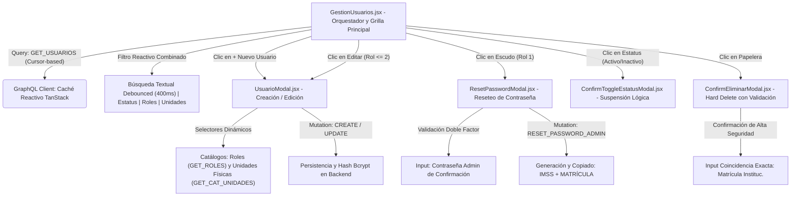
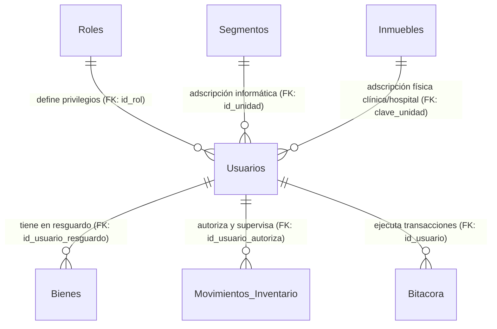
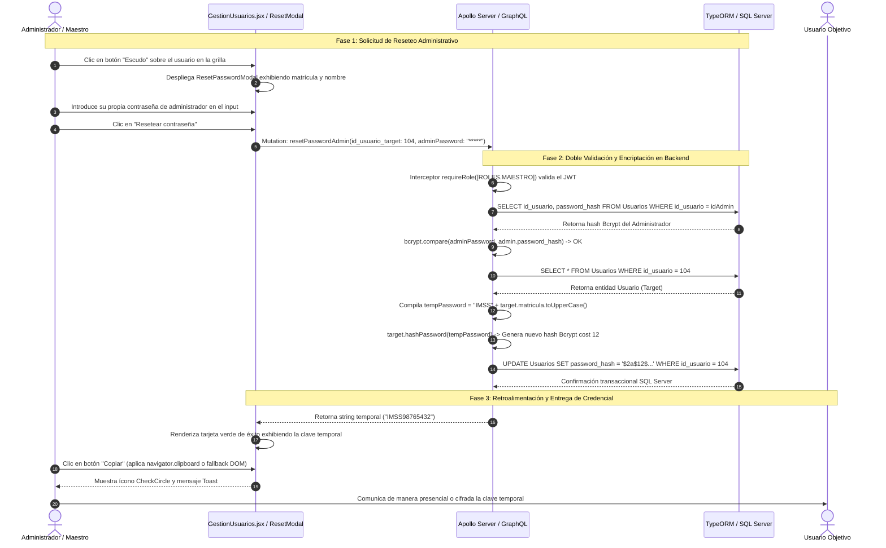

# Manual Técnico Oficial: Módulo de Gestión de Usuarios, Roles y Seguridad Institucional (`Usuario` / `Rol`)

## 1. Descripción General

El módulo de **Gestión de Usuarios y Seguridad Institucional** representa la columna vertebral de control de acceso, gobernanza de identidades, segregación jerárquica de privilegios y multitenancia territorial dentro del **Ecosistema de Gestión de Activos Institucionales** de la Delegación Nayarit – IMSS. Su objetivo funcional no se limita a la administración de credenciales para el inicio de sesión (`login`), sino que actúa como el directorio rector que vincula a cada servidor público con su resguardo patrimonial (`bienesResguardados`), su adscripción a unidades médicas o administrativas (`clave_unidad`) y su segmento de red de adscripción informática (`id_unidad`).

En una infraestructura que gestiona miles de activos tecnológicos hospitalarios y administrativos críticos, el módulo implementa una arquitectura de seguridad por capas que resuelve tres problemáticas fundamentales:
1. **Segregación Jerárquica por Roles:** Clasificación estricta de las capacidades transaccionales mediante un esquema RBAC (*Role-Based Access Control*) de 4 niveles canónicos:
   - **`Maestro (1)`:** Autoridad máxima del sistema en la delegación. Cuenta con privilegios universales para la alta de nuevas identidades (`createUsuario`), ejecución de auditorías globales y el reseteo administrativo de contraseñas sin requerir la clave anterior del usuario (`resetPasswordAdmin`).
   - **`Administrador (2)`:** Personal de mando en Coordinación de Informática. Autorizado para modificar datos maestros y adscripciones (`updateUsuario`), activar o suspender el acceso de cuentas operativas (`estatus`) y ejecutar depuraciones permanentes.
   - **`Estándar (3)`:** Personal técnico u operativo de soporte en clínicas y hospitales. Su acceso transaccional y visibilidad de catálogos e inventarios están confinados geográficamente a su zona médica/administrativa asignada.
   - **`Sin Acceso (4)`:** Servidores públicos institucionales registrados en el directorio informático exclusivamente con fines de trazabilidad de resguardo patrimonial (ej. médicos, administrativos o jefes de piso que tienen bienes o PC asignadas bajo su firma), careciendo total y criptográficamente de credenciales para iniciar sesión en el portal.
2. **Confinamiento Territorial Geográfico (Multitenancy / Zonas):** Integración profunda con el middleware de seguridad delegacional (`applyZonaFilterUsuarios`). Cuando un usuario con rol Estándar consulta el directorio de personal o el resguardo de equipos, el motor backend inyecta dinámicamente predicados SQL relacionales que filtran las identidades y activos para mostrar únicamente aquellos adscritos a inmuebles que comparten la misma `clave_zona` que el operador.
3. **Integridad Relacional e Histórica Protegida:** Mecanismo defensivo ante intentos de eliminación de usuarios con historial operativo. El sistema intercepta las violaciones de integridad referencial de SQL Server (código de error SQL `547`), impidiendo el borrado físico de empleados que posean bitácoras de auditoría, incidencias abiertas, solicitudes de cambio o activos en resguardo, preservando la cadena de custodia institucional.

---

## 2. Arquitectura del Frontend

La capa de presentación del módulo está construida en **React 19** con **Tailwind CSS**, orquestando la interactividad y caché reactivo del cliente mediante **TanStack Query (v5)** y comunicándose vía contrato tipado con **GraphQL Request**.



### Componentes Principales

1. **`GestionUsuarios.jsx` (Panel Orquestador y Grilla Paginada de Alto Rendimiento):**
   Actúa como el controlador maestro de la ruta `/usuarios`. Está diseñado para soportar más de 17,000 registros institucionales sin degradación de rendimiento visual, dividiendo su presentación en dos layouts responsivos (Tabla de alta densidad para escritorio y Tarjetas modulares para dispositivos móviles):
   - **Sistema de Paginación Cursor-Based en Memoria:** Para evitar las penalizaciones de rendimiento asociadas a offsets profundos en bases de datos relacionales masivas, implementa paginación por cursores (`first: 10`, `after`). Para brindar al operador una experiencia de navegación tradicional (números de página anterior/siguiente y salto por input numérico `handleJumpToPage`), el componente mantiene un historial de cursores visitados (`cursors`), permitiendo transiciones instantáneas O(1).
   - **Filtro Combinatorio Multidimensional y Temporizado:** Orquesta cuatro dimensiones de filtrado concurrentes: un input de búsqueda con retardo (*debounce* de 400ms gestionado vía temporizador en ventana para evitar saturación de red en tipeos rápidos), un control deslizante de 3 estados para estatus operacional (`Activos`, `Inactivos` o `Todos`), botones selectores de rol de selección múltiple con distintivos cromáticos (`filterRoles`), y un selector de búsqueda avanzada de unidades físicas (`MultiSelect` sobre las claves de inmueble).
   - **Utilería Visual de Resaltado Dinámico (`highlightText`):** Función de renderizado en caliente que compila una expresión regular (`RegExp`) escapando caracteres especiales para envolver las coincidencias de la cadena de búsqueda dentro de una etiqueta `<mark bg-yellow-300>` con tipografía en negrita, permitiendo identificar instantáneamente qué parte del nombre, matrícula o correo gatilló el resultado.

2. **`UsuarioModal.jsx` (Formulario Modal de Creación y Edición):**
   Encargado del alta y modificación de cuentas. Adapta dinámicamente su interfaz según la tipología del usuario:
   - En modo creación (`!isEdit`), expone el campo de contraseña con interruptor de visibilidad (`showPass`). Si el operador deja la contraseña vacía, el sistema registra al usuario asumiendo que su rol u objetivo es puramente de asignación patrimonial sin acceso web.
   - Integra componentes especializados de selección como `SearchableSelect` para vincular la cuenta a un inmueble hospitalario o delegacional (`clave_unidad`), formateando la etiqueta con la descripción corta institucional (ej. `[HGZ 1] Hospital General de Zona No. 1`).

3. **`ResetPasswordModal.jsx` (Modal de Reseteo Seguro de Acceso):**
   Herramienta crítica reservada para la coordinación administrativa. Para proteger al sistema contra reseteos no autorizados si un operador deja su terminal abierta, exige una **validación de doble factor local**: el administrador que ejecuta la acción debe introducir su propia clave secreta actual (`adminPass`). Al procesarse con éxito, presenta una tarjeta visual de éxito exhibiendo la contraseña temporal autogenerada por el servidor (`IMSS + MATRICULA`) y adjunta una acción utilitaria (`handleCopy`) que intenta copiar al portapapeles moderno (`navigator.clipboard`) o recurre a un *fallback* transaccional mediante DOM para compatibilidad en entornos hospitalarios restringidos.

4. **`ConfirmEliminarModal.jsx` (Prevención de Borrados Accidentales):**
   Modal de confirmación destructiva (*Hard Delete*). Conlleva un mecanismo de seguridad de **Confirmación Escrita**: el botón de eliminación se mantiene deshabilitado (`disabled`) hasta que el usuario teclee explícitamente y con exactitud la cadena correspondiente a la `matrícula` del servidor público dentro de una caja de texto validada en tiempo real.

### Manejo de Estado y Hooks

- **Sincronización Reactiva con TanStack Query (`useQuery`):**
  - La consulta principal `['usuarios', filterEstatus, filterRoles, filterUnidadesFisicas, debouncedSearch, currentPage]` recalcula automáticamente las dependencias. Al cambiar cualquier parámetro del filtro, el hook dispara la petición GraphQL tipada optimizando el re-renderizado.
  - Los catálogos de apoyo (`GET_ROLES`, `GET_CAT_UNIDADES_FISICAS`) operan en background con estrategias de invalidación controlada.
- **Estabilidad de De-bouncing (`useCallback` / `useRef` o `window._searchTimer`):**
  - La función `handleSearch` encapsula el temporizador para aislar la escritura en el input del re-consumo innecesario del cliente GraphQL, reseteando a la página 1 cada vez que el término de búsqueda se estabiliza.

### Integración GraphQL

La capa de servicios (`src/api/usuarios.queries.js`) define los contratos consumidos por `gqlClient`:

- **Consultas (`Queries`):**
  - `GET_USUARIOS`: Solicita el listado paginado recibiendo un sub-árbol enriquecido que incluye la relación con su `rol { id_rol nombre_rol }`, el `segmento` de red informático y la `unidadFisica` adscrita (clínica u hospital con clave y descripción corta).
  - `GET_ROLES` y `GET_CAT_UNIDADES_FISICAS`: Descargan los catálogos relacionales de apoyo.
- **Mutaciones (`Mutations`):**
  - `CREATE_USUARIO` / `UPDATE_USUARIO`: Persisten el perfil biográfico y la vinculación a inmuebles.
  - `TOGGLE_ESTATUS_USUARIO`: Invoca `updateUsuario(id_usuario, estatus: boolean)` para la suspensión transaccional instantánea sin pérdida de historial.
  - `RESET_PASSWORD_ADMIN`: Ejecuta `resetPasswordAdmin(id_usuario_target, adminPassword)`, devolviendo un string simple con la contraseña temporal.
  - `HARD_DELETE_USUARIO`: Ejecuta `deleteUsuario(id_usuario)` para purgar físicamente el registro.

---

## 3. Arquitectura del Backend

El backend está construido sobre **Node.js / TypeScript** utilizando **TypeORM** como ORM transaccional sobre **SQL Server / MySQL**, exponiendo su API a través de **Apollo Server**.

### Resolvers (`src/graphql/resolvers/usuarios.resolver.ts` & `auth.resolver.ts`)

Los resolvers concentran las reglas de negocio, validaciones criptográficas y lógica de gobierno informático:

1. **Resolver de Consulta `Query.usuarios`:**
   - Exige autenticación (`requireAuth`). Permite que cualquier usuario autenticado ejecute búsquedas en el catálogo de personal (condición indispensable para que técnicos de soporte puedan asignar resguardos de equipos informáticos a médicos o enfermeros en el módulo de Inventario).
   - Construye un `QueryBuilder` dinámico sobre la entidad `Usuario`. Evalúa los arreglos entrantes (`roles`, `claves_unidades`) aplicando cláusulas `IN (:...array)`.
   - **Aplicación de Seguridad Territorial (`applyZonaFilterUsuarios`):** Intercepta la consulta y verifica si el rol del peticionario es Estándar (`3`). De ser así, inyecta un subquery SQL estricto: `u.clave_unidad IN (SELECT clave FROM unidades WHERE clave_zona = :_zona_usr)`, acotando los resultados devueltos a la zona del operador.

2. **Resolver de Creación `Mutation.createUsuario`:**
   - Protegido por una barrera de autorización de rol suprema (`requireRole(context, [ROLES.MAESTRO])`).
   - Verifica la inexistencia de colisiones verificando si la `matrícula` institucional ya está ocupada (`exists`). En caso afirmativo, emite un `ConflictError (HTTP 409)`.
   - Si el payload adjunta una cadena en el campo `password`, invoca de manera asíncrona el método de instancia `usuario.hashPassword(password)`, aplicando el algoritmo **Bcrypt** con factor de trabajo 12 antes de invocar `repo.save()`. Si se omite, el campo `password_hash` queda en `null` (cuenta sin acceso web).

3. **Resolver de Actualización y Eliminación (`Mutation.updateUsuario` / `deleteUsuario`):**
   - Accesible para los roles `ADMIN (2)` y `MAESTRO (1)`.
   - En `deleteUsuario`, intenta ejecutar la remoción física (`repo.remove`). Si el usuario lidera resguardos de activos (`bienesResguardados`), ha autorizado movimientos o tiene bitácoras, el motor relacional de SQL Server dispara una excepción de restricción de llave foránea (`FK constraint violation`). El resolver captura el error (`error.number === 547 || error.code === 'EREQUEST'`) y lo traduce en un mensaje legible y transaccional: *"No se puede eliminar el usuario porque tiene activos, incidencias o bitácoras asociadas"*.

4. **Resolver de Reseteo Seguro `Mutation.resetPasswordAdmin`:**
   - Orquesta un flujo transaccional de 4 etapas:
     1. Obtiene de la base de datos el registro completo del administrador que ejecuta la petición incluyendo la columna oculta (`select: ['id_usuario', 'password_hash']`).
     2. Valida la clave proporcionada en `adminPassword` comparándola con el hash en BD usando `bcrypt.compare`. Si falla, arroja un `AuthenticationError`.
     3. Localiza al usuario objetivo (`target`), compila la nueva contraseña temporal estandarizada (`IMSS` + `target.matricula.toUpperCase()`) y procede a encriptarla mediante `target.hashPassword()`.
     4. Guarda la mutación y retorna el texto en claro al cliente GraphQL para comunicación presencial o telefónica con el servidor público.

5. **Field Resolvers Optimizados mediante DataLoaders:**
   - Para erradicar consultas redundantes N+1 al procesar grillas con decenas de usuarios, los campos relacionales (`rol`, `segmento`, `unidadFisica`) interceptan la resolución de GraphQL e invocan a los lotes en memoria del contexto: `context.loaders.rolLoader.load(parent.id_rol)` y `context.loaders.unidadLoader.load(parent.clave_unidad)`.

### Entidades de Base de Datos

Las operaciones operan sobre un modelo relacional normalizado y tipado en TypeORM (`src/entities/*.ts`):



1. **`Usuario` (Tabla: `Usuarios`):**
   Entidad central del directorio de personal y seguridad. Almacena la llave primaria autoincremental (`id_usuario` int), el número identificador institucional (`matricula` varchar(20) unique), el nombre completo (`nombre_completo` varchar(100)), cargo o puesto técnico (`tipo_usuario` varchar(15) nullable), correo institucional (`correo_electronico` varchar(70) nullable), el resumen criptográfico de la clave (`password_hash` varchar(255) nullable con propiedad `select: false` en el ORM para prevenir fugas accidentales en consultas `find()`), la llave foránea de privilegio (`id_rol` int not null default 3 FK a `Roles.id_rol`), el ID numérico del segmento de red (`id_unidad` int nullable FK a `Segmentos.id_segmento`), la clave del inmueble físico delegacional (`clave_unidad` varchar(50) nullable FK a `Inmuebles.clave`) y el estatus operativo (`estatus` bit not null default 1). Expone métodos asíncronos propios para compaginación Bcrypt (`hashPassword` y `validatePassword`).
2. **`Rol` (Tabla: `Roles`):**
   Catálogo maestro de perfiles de acceso. Almacena la llave primaria (`id_rol` int autoincremental) y la denominación canónica del rol (`nombre_rol` varchar(50) unique, e.g., `'Maestro'`, `'Administrador'`, `'Estándar'`, `'Sin Acceso'`).
3. **`UnidadACargo` (Tabla: `Unidad_A_Cargo`):**
   Entidad relacional asociativa compuesta orientada a la supervisión directiva e informática delegacional. Almacena llaves primarias compuestas (`id_unidad_cargo` varchar(50) FK a `Inmuebles.clave`, `id_rol_empleado` int y `id_usuario` int FK a `Usuarios.id_usuario`), estableciendo explícitamente qué coordinadores informáticos o directores son responsables administrativos de cada centro asistencial.

---

## 4. Flujo de Ejecución (Data Flow)

El siguiente diagrama y secuencia lógica ilustran el recorrido transaccional de extremo a extremo durante el reseteo administrativo de una contraseña por parte de un directivo, evidenciando las capas de seguridad y la respuesta reactiva de la interfaz:



---

## 5. Fragmentos de Código Clave (Snippets)

### Snippet 1 (Frontend): Motor Combinatorio de Resaltado Textual y Filtrado de Roles (`GestionUsuarios.jsx`)

El siguiente bloque evidencia cómo el frontend optimiza la experiencia visual del administrador: filtra y ordena los botones selectores de rol según la jerarquía institucional, y aplica la función utilitaria `highlightText` para resaltar instantáneamente con etiquetas `<mark>` el texto que coincida con el patrón de búsqueda del usuario en el árbol DOM.

```jsx
// src/pages/GestionUsuarios.jsx (Líneas 684-713)
{sortedRoles.map(r => {
  const isSelected = filterRoles.includes(r.id_rol);
  let badge = { bg: 'bg-gray-100 dark:bg-gray-800/50', color: 'text-gray-600 dark:text-gray-400', border: 'border-gray-200 dark:border-gray-700' };
  if (String(r.id_rol) === '1') badge = ROLE_BADGE[1]; // Maestro (Púrpura)
  if (String(r.id_rol) === '2') badge = ROLE_BADGE[2]; // Administrador (Verde)
  if (String(r.id_rol) === '3') badge = ROLE_BADGE[3]; // Estándar (Azul)
  if (String(r.id_rol) === '4') badge = ROLE_BADGE[4]; // Sin Acceso (Ámbar)

  return (
    <button
      key={r.id_rol}
      onClick={() => {
        setFilterRoles(prev => prev.includes(r.id_rol) ? prev.filter(id => id !== r.id_rol) : [...prev, r.id_rol]);
        resetPage();
      }}
      className={`flex flex-col items-center justify-center py-2 px-3 rounded-2xl border transition-all duration-200 flex-1 min-w-[110px] flex-shrink-0 ${
        isSelected ? `shadow-sm border-2 ${badge.bg} ${badge.border}` : 'bg-white dark:bg-gray-800 border-gray-100 dark:border-gray-700/50 hover:bg-gray-50'
      }`}
    >
      <div className={isSelected ? badge.color : 'text-gray-400 dark:text-gray-500'}>
        {String(r.id_rol) <= '2' ? <Shield size={16} className="mb-1" /> : <Users size={16} className="mb-1" />}
      </div>
      <span className={`text-[10px] sm:text-xs font-bold leading-tight text-center uppercase tracking-wide ${isSelected ? badge.color : 'text-gray-500'}`}>
        {highlightText(r.nombre_rol, debouncedSearch)}
      </span>
    </button>
  );
})}
```

---

### Snippet 2 (Backend): Validación de Doble Factor en Reseteo y Manejo de Excepciones FK (`usuarios.resolver.ts`)

Este fragmento demuestra la rigurosidad técnica de los resolvers del backend: primero, en la mutación de eliminación física, intercepta errores de restricción SQL (`errno 547`) para proteger la historia patrimonial; segundo, en la mutación de reseteo administrativo, re-autentica al directivo comparando su clave secreta contra el hash en base de datos antes de mutar la clave del objetivo.

```typescript
// src/graphql/resolvers/usuarios.resolver.ts (Líneas 176-225)
try {
  await repo.remove(usuario);
  return true;
} catch (error: any) {
  // Código 547 en SQL Server corresponde a violación de llave foránea (FK constraint)
  if (error?.number === 547 || error?.code === 'EREQUEST') {
    throw new ConflictError('No se puede eliminar el usuario porque tiene activos, incidencias o bitácoras asociadas.');
  }
  throw error;
}

// ── Reseteo de contraseña por parte del Maestro ─────────────────────────────────
resetPasswordAdmin: async (
  _: unknown,
  { id_usuario_target, adminPassword }: { id_usuario_target: string; adminPassword: string },
  context: GraphQLContext
) => {
  requireAuth(context);
  requireRole(context, [ROLES.MAESTRO]);

  const repo = AppDataSource.getRepository(Usuario);

  // 1. Obtener al admin con su hash oculto para validar su propia identidad
  const admin = await repo.findOne({
    where: { id_usuario: context.user!.id_usuario },
    select: ['id_usuario', 'password_hash'],
  });
  if (!admin || !admin.password_hash) {
    throw new AuthenticationError('No se pudo validar al administrador');
  }
  const isValid = await admin.validatePassword(adminPassword);
  if (!isValid) {
    throw new AuthenticationError('Contraseña del administrador incorrecta');
  }

  // 2. Obtener al usuario destino y compilar clave estandarizada temporal
  const target = await repo.findOne({ where: { id_usuario: parseInt(id_usuario_target) } });
  if (!target) throw new NotFoundError('Usuario');

  const tempPassword = `IMSS${target.matricula.toUpperCase()}`;
  await target.hashPassword(tempPassword);
  await repo.save(target);

  return tempPassword;
},
```

---

### Snippet 3 (Backend): Interceptor de Segregación Geográfica y Multitenancia (`auth.middleware.ts`)

Este middleware ilustra cómo el sistema confina de forma invisible y transparente las consultas de personal al territorio del operador. Si un usuario con rol Estándar (`3`) ejecuta un *Query* sobre la tabla `Usuarios`, la subrutina inyecta un predicado `EXISTS/IN` correlacionado por la `clave_zona`.

```typescript
// src/middleware/auth.middleware.ts (Líneas 83-100)
/**
 * Versión para tablas sin clave_unidad_ref directa (ej. Usuarios).
 * Filtra por subconsulta: clave_unidad IN (SELECT clave FROM unidades WHERE clave_zona = ?)
 */
export function applyZonaFilterUsuarios<T extends ObjectLiteral>(
  qb: SelectQueryBuilder<T>,
  alias: string,
  context: GraphQLContext
): void {
  if (!isEstandar(context)) return;

  const clave_zona = context.user?.clave_zona;

  if (!clave_zona) {
    // Si es rol Estándar pero no tiene zona territorial asignada, negar acceso total (1=0)
    qb.andWhere('1 = 0');
    return;
  }

  // Subquery SQL optimizado que limita la visibilidad a clínicas/hospitales de su zona
  qb.andWhere(
    `${alias}.clave_unidad IN (SELECT clave FROM unidades WHERE clave_zona = :_zona_usr)`,
    { _zona_usr: clave_zona }
  );
}
```
