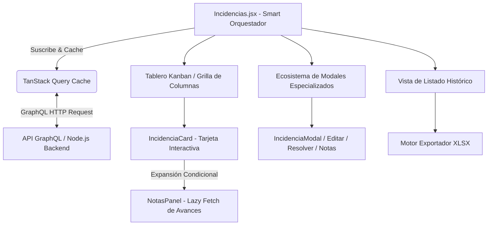
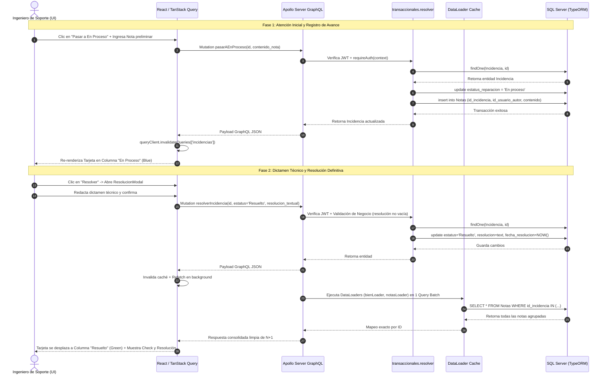

# Manual Técnico Oficial: Módulo de Gestión de Incidencias

## 1. Descripción General

El módulo de **Gestión de Incidencias** constituye el núcleo operativo para el reporte, seguimiento técnico y resolución de anomalías en la infraestructura tecnológica y el parque informático del **Ecosistema de Gestión de Activos Institucionales** de la Delegación Nayarit – IMSS. Su objetivo funcional primario es proporcionar un canal estandarizado, auditable y en tiempo real para que usuarios e ingenieros de soporte administren el ciclo de vida completo de las fallas de hardware, software y requerimientos técnicos en las diversas unidades médicas y administrativas.

Dentro de la arquitectura global del ecosistema, este módulo desempeña funciones de integración y trazabilidad críticas:
- **Interoperabilidad con Inventario Patrimonial:** Permite vincular reportes de falla directamente con activos registrados en el catálogo patrimonial (`Bienes`) mediante su número de serie, número de inventario o clave presupuestal, impactando su historial clínico de mantenimiento.
- **Retroalimentación Analítica hacia el Dashboard:** La telemetría de estatus generada en este módulo (`Pendiente`, `En proceso`, `Resuelto`) alimenta en tiempo real las métricas y los Indicadores Clave de Rendimiento (KPIs) del Panel Principal, calculando la tasa de disponibilidad del equipamiento institucional.
- **Bitácora Evolutiva Multiusuario (Notas):** Establece un sub-ecosistema transaccional de seguimiento colaborativo donde los técnicos responsables pueden registrar bitácoras de avance fechadas y firmadas criptográficamente por su sesión JWT antes de emitir un dictamen de resolución final.
- **Aislamiento Territorial Estricto:** Aplica un control de acceso basado en roles (RBAC) que segmenta la visibilidad de las incidencias en función de la delimitación geográfica (`clave_zona`) del operador, garantizando la confidencia y el enfoque operativo por zona delegacional.

---

## 2. Arquitectura del Frontend

La capa de presentación está implementada en **React (v18+)** bajo una arquitectura orientada a componentes funcionales puros, optimizada para alta densidad de datos mediante visualización tipo **Kanban** y **Lista Histórica**, gestionada globalmente con **TanStack Query (v5)** y estilizada en **Vanilla CSS / Tailwind CSS tokens**.



### Componentes Principales

1. **`Incidencias.jsx` (Contenedor Principal de Vista):**
   Actúa como el *Smart Component* orquestador. Evalúa los privilegios del usuario autenticado (`useAuthStore`), gestiona la conmutación de pestañas entre la vista operativa **Kanban** y el **Histórico Completo**, controla el estado del filtrado global de búsqueda rápida (`kanbanSearch`) y administra la visibilidad del ecosistema de modales transaccionales.
2. **Tablero Kanban Interactivo (`COLUMNS`):**
   Estructura visual dividida en tres columnas de flujo continuo: *Pendiente* (tonalidad ámbar), *En Proceso* (tonalidad azul) y *Resuelto* (tonalidad verde). Incorpora lógica algorítmica memorizada (`useMemo`) para segmentar el arreglo global de incidencias. En la columna de *Resuelto*, aplica un filtro automático que restringe la visualización a las incidencias cerradas durante la semana calendario en curso (domingo a sábado), previniendo la saturación visual del tablero operativo.
3. **Tarjetas Interactivas con Acordeón Lazy (`IncidenciaCard` & `NotasPanel`):**
   Sub-componente memoizado (`React.memo`) que representa cada unidad de trabajo. Integra un motor de resaltado sintáctico de búsqueda (`highlightText`) que envuelve en etiquetas `<mark>` las coincidencias del texto en tiempo real. Al hacer clic, ejecuta una transición de expansión que monta el componente `NotasPanel`; este último dispara una consulta bajo demanda (`useNotasIncidencia`) para recuperar el historial de avances técnicos solo cuando el usuario lo requiere, optimizando el consumo de ancho de banda.
4. **Ecosistema de Modales Especializados:**
   - **`IncidenciaModal`:** Formulario de creación con búsqueda predictiva y autocompletado de activos (`GET_BIEN_BY_TERMINO_QUERY`), permitiendo relacionar un equipo físico o registrar un requerimiento general por unidad médica/administrativa.
   - **`EditarIncidenciaModal`:** Permite a roles directivos reasignar la unidad, modificar la descripción técnica de la falla o actualizar el alias del reporte.
   - **`ResolucionModal`:** Interfaz crítica de cierre. Fuerza al técnico a seleccionar un estatus de finalización (`Resuelto` o `Cerrado`) y exige obligatoriamente la redacción exhaustiva del dictamen técnico de resolución (`resolucion_textual`).
   - **`NotasModal`:** Modal ágil para inyectar actualizaciones de progreso al expediente de la incidencia.
   - **`DetalleIncidenciaModal` / `DetalleBienVisualModal`:** Vistas de inspección 360° que exponen la metadata completa de auditoría y la ficha técnica del bien mueble resguardado.
5. **Motor de Exportación (`xlsx-js-style`):**
   Módulo integrado que transforma las incidencias filtradas y las notas en un libro de cálculo Excel (.xlsx), aplicando estilos corporativos (encabezados en color institucional, bordes finos, tipografía normalizada y auto-ajuste de ancho de columnas).

### Manejo de Estado y Hooks

El módulo combina patrones de gestión de estado local, referencias de ciclo de vida y sincronización de estado del servidor de baja latencia:

- **Hooks Nativos de React:**
  - `useState`: Administra identificadores activos de modales (`isModalOpen`, `incidenciaParaEditar`, `incidenciaParaResolver`), identificadores en arrastre o mutación (`movingId`), pestaña activa (`tab`), términos de búsqueda (`kanbanSearch`) y mapa de tarjetas expandidas (`expandedCards`).
  - `useCallback`: Estabiliza la referencia de funciones controladoras críticas (`handleToggleCard`, `handleDeleteNota`) pasadas a sub-componentes memoizados para evitar re-renderizados en cascada innecesarios.
  - `useMemo`: Ejecuta el filtrado compuesto del Kanban de manera síncrona. Evalúa coincidencias por número de serie, descripción de equipo, falla, alias, requerimiento y usuario generador, agrupándolas en sus respectivas columnas y calculando la ventana temporal actual para los cierres semanales.
  - `useRef` & `useEffect`: Implementan el patrón *Outside Click Detector* en `IncidenciaCard` para cerrar menús contextuales flotantes al hacer clic fuera de la tarjeta, verificando escrupulosamente el DOM para ignorar clics originados en capas modales globales (`.z-50`).
- **Estado Global y RBAC (`useAuthStore`):**
  - Extracto del almacén global en Zustand que provee el nivel de acceso: **Maestro** (`id_rol === 1`: permisos totales de creación, edición y eliminación de registros/notas) y **Admin/Supervisor** (`id_rol === 2`: permisos de creación, edición y seguimiento técnico).
- **Caché y Sincronización Remota (`@tanstack/react-query` & `useIncidencias.js`):**
  - **`useIncidencias`:** Orquesta la petición de obtención general mediante `GET_INCIDENCIAS_QUERY`. Configurado con un `staleTime: 45_000` (45 segundos) y `refetchOnWindowFocus: false`, equilibrando la frescura de los datos operativos con el ahorro de recursos del servidor. Intercepta errores GraphQL; ante un código `UNAUTHENTICATED`, invoca automáticamente `clearAuth()` para purgar la sesión vencida.
  - **Hooks de Mutación Transaccional:** `useUpdateEstatusIncidencia`, `usePasarAEnProceso`, `useResolverIncidencia`, `useAgregarNota`, `useDeleteIncidencia` y `useDeleteNota`. Todos implementan invalidación programática de caché (`queryClient.invalidateQueries({ queryKey: ['incidencias'] })`), garantizando que la interfaz refleje transiciones de estado al instante sin recargar la página.

### Integración GraphQL

El frontend se comunica con el servidor invocando consultas tipificadas vía `graphql-request` en el cliente central (`gqlClient`). Las firmas y responsabilidades principales incluyen:

- **`GET_INCIDENCIAS_QUERY`:**
  Consulta principal con soporte para paginación por cursores (`first`, `after`, `page`) y filtrado multitabla:
  ```graphql
  query GetIncidencias($estatus_reparacion: String, $id_tipo_incidencia: Int, $id_unidad: String, $search: String, $first: Int, $after: String) {
    incidencias(estatus_reparacion: $estatus_reparacion, id_tipo_incidencia: $id_tipo_incidencia, id_unidad: $id_unidad, search: $search, pagination: { first: $first, after: $after }) {
      edges {
        node {
          id_incidencia id_bien id_tipo_incidencia descripcion_falla estatus_reparacion fecha_reporte resolucion_textual fecha_resolucion alias requerimiento id_unidad
          tipoIncidencia { id_tipo_incidencia nombre_tipo }
          unidad { clave descripcion }
          bien { num_serie num_inv clave_presupuestal modelo { descrip_disp } categoria { nombre_categoria } }
          usuarioGeneraReporte { id_usuario nombre_completo matricula }
          notas { contenido_nota fecha_creacion usuarioAutor { nombre_completo } }
        }
      }
      pageInfo { totalCount hasNextPage endCursor }
    }
  }
  ```
- **`GET_BIEN_BY_TERMINO_QUERY`:** Busca activos en tiempo real por cadena alfabética en serie o inventario durante la apertura de un ticket.
- **`PASAR_A_EN_PROCESO_MUTATION` & `RESOLVER_INCIDENCIA_MUTATION`:** Mutaciones especializadas que actualizan el estado operativo e inyectan payloads adicionales de resolución en una sola llamada atómica al servidor.

---

## 3. Arquitectura del Backend

El backend se structure sobre **Node.js con TypeScript**, sirviendo un servidor **Apollo Server GraphQL** acoplado al ORM **TypeORM** sobre un motor de base de datos **SQL Server**.

### Resolvers

Los resolvers encargados de atender el módulo se encuentran ubicados en `src/graphql/resolvers/transaccionales.resolver.ts` bajo la exportación `transaccionalesResolvers`.

- **`Query.incidencias`:**
  Construye dinámicamente un `QueryBuilder` de TypeORM (`createQueryBuilder('i')`). Integra la lógica de **Aislamiento Territorial**: si la guarda de seguridad `isEstandar(context)` detecta un usuario no directivo con asignación de zona (`clave_zona`), inyecta una condición SQL compleja que filtra las incidencias cuya unidad adscrita (`id_unidad`) pertenezca a la zona del usuario, o bien cuyo bien patrimonial vinculado (`id_bien`) esté asignado a una unidad de dicha zona delegacional mediante subconsultas `IN (SELECT ...)`. Implementa codificación de cursores en Base64 (`Buffer.from(id).toString('base64')`) para paginación infinita de alto rendimiento.
- **Eliminación del Problema N+1 mediante DataLoader Pattern:**
  En lugar de permitir que GraphQL resuelva las relaciones de cada incidencia realizando una consulta SQL independiente (lo que provocaría cientos de queries en un listado de 100 tarjetas), el objeto `Incidencia` declara *Field Resolvers* que delegan el fetching a la capa de **DataLoaders** (`context.loaders.*`):
  ```typescript
  Incidencia: {
    bien: (parent, _, context) => parent.id_bien ? context.loaders.bienLoader.load(parent.id_bien) : null,
    usuarioGeneraReporte: (parent, _, context) => context.loaders.usuarioLoader.load(parent.id_usuario_genera_reporte),
    unidad: (parent, _, context) => parent.id_unidad ? context.loaders.unidadLoader.load(parent.id_unidad) : null,
    tipoIncidencia: (parent, _, context) => context.loaders.tipoIncidenciaLoader.load(parent.id_tipo_incidencia),
    notas: (parent, _, context) => context.loaders.notasByIncidenciaLoader.load(parent.id_incidencia),
  }
  ```
  Esto agrupa y recolecta todas las claves primarias durante el tick del Event Loop de Node.js, resolviendo todas las relaciones con consultas SQL únicas (`WHERE id IN (...)`).
- **Mutaciones Transaccionales:**
  - `createIncidencia`: Valida la presencia de `descripcion_falla` y `id_tipo_incidencia`, instanciando el registro con estatus inmutable inicial de `'Pendiente'`.
  - `pasarAEnProceso`: Cambia el estatus a `'En proceso'`. Si el cliente envía un argumento `contenido_nota`, el resolver instancia automáticamente un registro en el repositorio de `Nota` vinculado a la incidencia y al ID del usuario en contexto (`context.user!.id_usuario`).
  - `resolverIncidencia`: Cambia el estatus a `'Resuelto'` o `'Cerrado'`, sella el timestamp exacto del servidor en `fecha_resolucion = new Date()` y almacena el dictamen técnico en `resolucion_textual`.
  - `updateIncidenciaEstatus`: Gestiona transiciones arbitrarias y re-aperturas.
  - `deleteIncidencia`: Protegido por `requireRole(context, [ROLES.MAESTRO])`. Implementa limpieza referencial en código: al carecer la restricción de llave foránea en base de datos de una cláusula `ON DELETE CASCADE`, el resolver consulta y elimina primero todas las entidades `Nota` hijas antes de eliminar la entidad `Incidencia` padre.

### Entidades de Base de Datos

Las operaciones transaccionales del módulo de incidencias interactúan con un ecosistema multi-tabla normalizado (`src/entities/*.ts`):

1. **`Incidencia` (Tabla: `Incidencias`):** Entidad troncal del módulo. Almacena `id_incidencia` (PK autoincremental), `descripcion_falla`, `estatus_reparacion` (por defecto 'Pendiente'), `resolucion_textual`, `fecha_reporte`, `fecha_resolucion`, `alias`, `requerimiento` y llaves foráneas hacia el catálogo institucional (`id_bien`, `id_usuario_genera_reporte`, `id_tipo_incidencia`, `id_unidad`).
2. **`TipoIncidencia` (Tabla: `Tipo_Incidencias`):** Catálogo de tipificación del reporte (ej. *Falla de Hardware*, *Software / SO*, *Redes / Conectividad*). Almacena `id_tipo_incidencia` (PK) y `nombre_tipo` (varchar único).
3. **`Nota` (Tabla: `Notas`):** Entidad transaccional de observabilidad que almacena el registro cronológico de anotaciones operativas y seguimientos técnicos vinculados a un reporte (`id_incidencia`) o directamente a un equipo (`id_bien`). Registra el texto completo (`contenido_nota`), la marca de tiempo de creación y la autoría institucional (`id_usuario_autor`).
4. **`Bien` (Tabla: `Bienes`):** Entidad patrimonial que representa el equipamiento físico reportado en fallas. Almacena `id_bien` (PK UUID), `num_serie`, `num_inv`, `estatus_operativo` ('ACTIVO', 'PRESTAMO', 'INACTIVO'), `clave_presupuestal` y llaves foráneas institucionales (`clave_unidad_ref`, `id_usuario_resguardo`, `id_categoria`). Dispone de una relación 1:N hacia las incidencias.
5. **`Usuario` (Tabla: `Usuarios`):** Entidad maestra que gestiona la identidad, autenticación JWT y control de acceso RBAC del personal. Almacena la matrícula IMSS (`matricula`), nombre completo (`nombre_completo`), correo y rol institucional (`id_rol` = 1: Maestro, 2: Admin, 3: Estándar). Actúa como creador del reporte (`id_usuario_genera_reporte`) y como autor de notas de avance (`id_usuario_autor`).
6. **`Unidades` (Tabla: `unidades`):** Entidad catálogo estructural que define las unidades médicas u operativas físicas (clínicas, hospitales, oficinas administrativas). Almacena la clave institucional (`clave`), descripción completa y corta, dirección física e identificador zonal (`clave_zona`), siendo el pilar fundamental para el aislamiento territorial multi-tenant (RBAC) en la visualización de reportes.

### Reglas de Negocio

El sistema impone un estricto conjunto de reglas de validación en la capa de resolutores antes de interactuar con el motor de base de datos:

1. **Obligatoriedad de Descripción Técnica:** Es imposible crear o editar una incidencia enviando una cadena vacía o compuesta únicamente por espacios en blanco (`descripcion_falla.trim() === ''`). Arroja una excepción `ValidationError`.
2. **Dictamen de Resolución Forzoso:** Para cambiar el estatus de un reporte a `'Resuelto'` o `'Cerrado'`, el sistema exige inexcusablemente que el campo `resolucion_textual` contenga una explicación detallada del trabajo realizado. No se permiten cierres en blanco o nulos.
3. **Purga de Resolución en Re-apertura:** Si una incidencia marcada previamente como `'Resuelto'` o `'Cerrado'` es transicionada de regreso a `'Pendiente'` o `'En proceso'` mediante `updateIncidenciaEstatus`, el backend purga de manera automática los campos `resolucion_textual` y `fecha_resolucion` (asignándolos a `null`), asegurando que métricas y tiempos de resolución se recalculen correctamente cuando se vuelva a solucionar.
4. **Delimitación Geográfica Infranqueable:** Un usuario con rol estándar asociado a una `clave_zona` jamás podrá consultar, visualizar ni interactuar con incidencias pertenecientes a unidades médicas o activos de otras zonas territoriales, garantizando el aislamiento criptográfico por diseño.
5. **Privilegio Exclusivo de Supresión:** La eliminación física de reportes y de bitácoras de avance está estrictamente reservada para el rol supremo (`ROLES.MAESTRO`). Ningún otro nivel jerárquico puede borrar evidencia de auditoría técnica.

---

## 4. Flujo de Ejecución (Data Flow)

A continuación se detalla la secuencia lógica transaccional desde que un Ingeniero de Soporte toma un reporte pendiente, registra un avance técnico y finalmente dictamina su resolución:



---

## 5. Fragmentos de Código Clave (Snippets)

### Snippet 1: Validación de Cierre y Purgado en Re-apertura (Backend)
Este fragmento en `transaccionales.resolver.ts` demuestra la aplicación inflexible de las reglas de negocio al resolver una incidencia y la limpieza automática de metadatos cuando un ticket es reabierto.

```typescript
// src/graphql/resolvers/transaccionales.resolver.ts

resolverIncidencia: async (
  _: unknown,
  { id_incidencia, estatus_cierre, resolucion_textual }: any,
  context: GraphQLContext
) => {
  requireAuth(context);

  // Regla de Negocio: Dictamen de resolución estrictamente obligatorio
  if ((estatus_cierre === 'Resuelto' || estatus_cierre === 'Cerrado') && (!resolucion_textual || resolucion_textual.trim() === '')) {
    throw new ValidationError('Por favor, detalla la resolución textual antes de marcar como ' + estatus_cierre + '.');
  }

  const repo = AppDataSource.getRepository(Incidencia);
  const item = await repo.findOne({ where: { id_incidencia: parseInt(id_incidencia) } });
  if (!item) throw new NotFoundError('Incidencia');

  item.estatus_reparacion = estatus_cierre;
  item.resolucion_textual = resolucion_textual;
  item.fecha_resolucion = new Date(); // Sello temporal exacto del servidor

  return repo.save(item);
},

updateIncidenciaEstatus: async (_: unknown, { id_incidencia, estatus_reparacion }: any, context: GraphQLContext) => {
  requireAuth(context);
  const repo = AppDataSource.getRepository(Incidencia);
  const item = await repo.findOne({ where: { id_incidencia: parseInt(id_incidencia) } });
  if (!item) throw new NotFoundError('Incidencia');

  // Regla de Negocio: Si se reabre desde Resuelto/Cerrado, purgar dictamen y timestamp anterior
  if ((item.estatus_reparacion === 'Resuelto' || item.estatus_reparacion === 'Cerrado') && 
      (estatus_reparacion !== 'Resuelto' && estatus_reparacion !== 'Cerrado')) {
    item.resolucion_textual = null as any;
    item.fecha_resolucion = null as any;
  }

  item.estatus_reparacion = estatus_reparacion;
  return repo.save(item);
},
```

### Snippet 2: Borrado Seguro sin Cascada en Base de Datos (Backend)
Muestra la estrategia del resolver para eliminar registros preservando la estabilidad del motor SQL Server ante la falta de llaves foráneas con borrado en cascada.

```typescript
// src/graphql/resolvers/transaccionales.resolver.ts

deleteIncidencia: async (_: unknown, { id_incidencia }: any, context: GraphQLContext) => {
  requireAuth(context);
  requireRole(context, [ROLES.MAESTRO]); // Privilegio exclusivo del Maestro (id_rol = 1)
  
  const notaRepo = AppDataSource.getRepository(Nota);
  const incidenciaRepo = AppDataSource.getRepository(Incidencia);

  // Intervención manual: Borrar notas hijas primero ya que la FK en SQL Server no tiene ON DELETE CASCADE
  const notas = await notaRepo.find({ where: { id_incidencia: parseInt(id_incidencia) } });
  if (notas.length > 0) {
    await notaRepo.remove(notas);
  }

  const incidencia = await incidenciaRepo.findOne({ where: { id_incidencia: parseInt(id_incidencia) } });
  if (incidencia) {
    await incidenciaRepo.remove(incidencia);
  }
  
  return true;
},
```

### Snippet 3: Segmentación y Filtrado Temporal del Tablero Kanban (Frontend)
Ilustra el uso de `useMemo` en `Incidencias.jsx` para distribuir eficientemente las tarjetas en columnas, aplicando resaltado de búsqueda y ocultando reportes resueltos antiguos para mantener un rendimiento óptimo de renderizado del DOM.

```javascript
// src/pages/Incidencias.jsx

// ── useMemo: agrupa incidencias por columna y filtra resueltas por semana corriente ──
const columnedCards = useMemo(() => {
  const map = { Pendiente: [], 'En proceso': [], Resuelto: [] };
  
  // Cálculo de la ventana temporal: Inicio de la semana actual (Domingo 00:00:00)
  const now = new Date();
  const day = now.getDay();
  const diff = now.getDate() - day + (day === 0 ? -6 : 1);
  const startOfWeek = new Date(now.setDate(diff));
  startOfWeek.setHours(0, 0, 0, 0);

  const term = kanbanSearch.trim().toLowerCase();

  incidencias.forEach((inc) => {
    // Filtrado interactivo en memoria por múltiples campos descriptivos
    if (term) {
      const matchSerie = inc.numSerie?.toLowerCase().includes(term);
      const matchEq = inc.equipo?.toLowerCase().includes(term);
      const matchFalla = inc.falla?.toLowerCase().includes(term);
      const matchAlias = inc.alias?.toLowerCase().includes(term);
      const matchReq = inc.requerimiento?.toLowerCase().includes(term);
      const matchGen = inc.generadoPor?.toLowerCase().includes(term);
      if (!matchSerie && !matchEq && !matchFalla && !matchAlias && !matchReq && !matchGen) return;
    }

    const est = inc.estatus || 'Pendiente';
    if (map[est]) {
      // Regla de Visualización: En 'Resuelto', solo incluir las finalizadas esta semana
      if (est === 'Resuelto') {
        const fechaRes = inc._raw?.fecha_resolucion ? new Date(inc._raw.fecha_resolucion) : null;
        if (fechaRes && fechaRes >= startOfWeek) {
          map[est].push(inc);
        }
      } else {
        map[est].push(inc);
      }
    }
  });

  return map;
}, [incidencias, kanbanSearch]);
```
