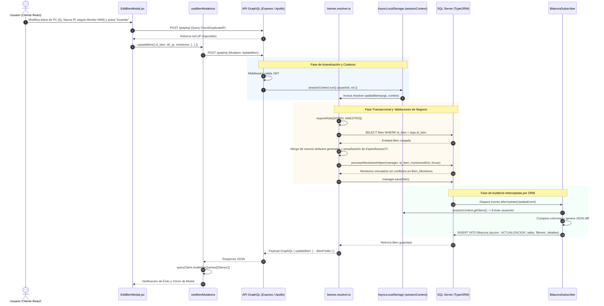

# Manual Técnico Oficial: Módulo de Inventario de Bienes

## 1. Descripción General

El módulo **Inventario de Bienes** constituye el núcleo operativo y transaccional del **Ecosistema de Gestión de Activos Institucionales** de la Delegación Nayarit – IMSS. Su objetivo funcional primario es administrar el ciclo de vida integral del parque tecnológico (computadoras de escritorio, laptops, servidores, monitores, switches de red, impresoras y terminales de telefonía IP/analógica), garantizando trazabilidad física, asignación contractual y control patrimonial en tiempo real.

Dentro de la arquitectura global del sistema, este módulo opera como la fuente de verdad (*Single Source of Truth*) para el activo fijo institucional, cumpliendo con las siguientes responsabilidades críticas:
- **Gestión Patrimonial y Multitenancy Territorial:** Permite el registro, edición, baja, reasignación y consulta sobre decenas de miles de activos informáticos, aplicando un estricto aislamiento territorial por zona (`clave_zona`) para usuarios operativos y visibilidad global para roles directivos.
- **Trazabilidad Física por Código de Barras y QR:** Genera dinámicamente identificadores criptográficos efímeros y cadenas de etiquetado estándar (Code 128 / QR SVG), habilitando la impresión por lotes en plantillas adhesivas estandarizadas para censos físicos y auditorías rápidas en sitio.
- **Modelado Dinámico EAV (Entity-Attribute-Value):** Resuelve la heterogeneidad del hardware tecnológico mediante un subsistema extensible de especificaciones técnicas fijas (`Especificaciones_TI`) complementado con atributos dinámicos (`Bien_Atributos`) configurables por tipo de dispositivo sin necesidad de migraciones estructurales de base de datos.
- **Descubrimiento y Conciliación Automatizada de Monitores (WMI):** Integra la capacidad de procesar reportes automatizados provenientes de agentes de barrido por Instrumental de Administración de Windows (WMI), resolviendo emparejamientos y conflictos seriales entre unidades centrales de procesamiento (PC/Laptops) y periféricos de visualización.
- **Control Transaccional de Préstamos e Resguardos:** Orquesta flujos de comodato y asignación temporal de hardware hacia unidades médicas o usuarios finales, registrando bitácoras de salida, fechas compromiso de retorno y firmas digitales de entrega/recepción.

---

## 2. Arquitectura del Frontend

La capa de presentación del módulo está desarrollada en **React (v18+)**, estructurada bajo un patrón arquitectónico de *Smart Components* y *Presenter Modals*, con diseño responsivo impulsado por tokens estilísticos de **Tailwind CSS** y optimización de renderizado intensivo para grandes volúmenes de datos tabulares.

### Diagrama de Jerarquía de Modales y Flujos de Control

El siguiente diagrama ilustra la arquitectura de navegación modal del módulo, detallando cómo la vista principal se ramifica en modales de gestión que a su vez orquestan submodales especializadas y pestañas funcionales:

```mermaid
graph TD
    A[Inventario.jsx - Smart Container] -->|Orquestación & Filtros| B(TanStack Query / Cache Client)
    B <-->|GraphQL Request| C[API GraphQL / Node.js Backend]
    
    A --> D[Barra de Filtros Avanzados & Búsqueda]
    A --> E[Tabla Principal de Inventario / Paginación Cursor]
    A --> F[Ecosistema de Modales de Gestión]

    %% Acciones Directas desde Tabla o Barra
    F --> M_Conf[ConfirmModal - Eliminación de Bienes / Sincronización Masiva]
    F --> M_Det[DetalleBienVisualModal - Ficha Visual Rápida]
    F --> M_Rep[ReportePanel - Cubos Analíticos Multidimensionales]
    F --> M_Exc[ExportExcelModal - Extracción Matricial 35 Columnas]
    F --> M_Mas[CargaMasivaPanel - Importación y Validación Excel]
    F --> M_Lbl[PrintLabelsTab / PrintStickerSheet - Emisión QR & Barras]

    %% Orquestación Central de Edición
    F --> M_Edit[EditBienModal - Núcleo Transaccional]

    %% Pestañas Internas de EditBienModal
    subgraph Pestañas y Secciones de EditBienModal
        M_Edit --> T_Gen[Tab: Datos Generales]
        M_Edit --> T_Tec[Tab: Técnico / Garantía / Specs TI]
        M_Edit --> T_His[Tab: Historial / Bitácora Préstamos]
        T_Tec --> S_Sw[Sección: Software Instalado - Programas_PC]
        T_Tec --> S_Cta[Sección: Cuentas de Windows - Cuentas_PC]
        T_Tec --> S_Not[Sección: Notas de Observación Operativa]
        T_Tec --> S_WMI[Acción: Botón Forzar Escaneo WMI]
    end

    %% Submodales abiertas desde EditBienModal
    subgraph Submodales Gatilladas por EditBienModal
        M_Edit -->|Alta Rápida de Catálogo| SM_Cat[ModeloCatalogModal / GestionModelosModal]
        SM_Cat --> Cat_Mod[Tab: Modelos - Búsqueda y Creación de Claves]
        SM_Cat --> Cat_Tip[Tab: Tipos Dispositivo - Categorías de HW]
        SM_Cat --> Cat_Mar[Tab: Marcas - Fabricantes]
        
        M_Edit -->|Alerta y Validación de Errores| SM_Inc[Modal de Inconvenientes Detectados - Falta INV / IP Duplicada]
        M_Edit -->|Reasignación de Periféricos| SM_Cnf[Modal de Conflicto de Reasignación de Monitores]
        M_Edit -->|Configuración de EAV| SM_EAV[AtributosCatalogModal - Maestro de Atributos]
        M_Edit -->|Alta de Cobertura| SM_Prov[ProveedorModal - Alta de Proveedores]
        M_Edit -->|Registro Comodato| SM_CPr[CrearPrestamoModal - Salida Temporal]
        M_Edit -->|Devolución Comodato| SM_FPr[FinalizarPrestamoModal - Retorno y Firma]
    end
```



---

### Análisis Profundo de Componentes Clave

#### 1. Núcleo de Edición Transaccional (`EditBienModal.jsx`)
`EditBienModal` representa el controlador de mutación más complejo del frontend. No es un simple formulario plano, sino un orquestador que gestiona la integridad referencial de múltiples tablas jerárquicas y abre dinámicamente un sub-ecosistema de modales transaccionales.

* **Submodales que es capaz de gatillar:**
  1. **`ModeloCatalogModal` / `GestionModelosModal` (`showCatalogModal`):** Mini-CRUD transaccional en Portal para gestionar la taxonomía de hardware sin interrumpir el registro del bien. Está estructurada internamente en tres pestañas operativas:
     - *Pestaña Modelos:* Permite filtrar y buscar por palabra clave en el catálogo patrimonial o desplegar un formulario ágil para dar de alta un nuevo modelo vinculando su clave, descripción, marca y tipo de dispositivo.
     - *Pestaña Tipos Dispositivo:* Lista las categorías taxonómicas existentes (PC, Laptop, Switch, Impresora, etc.) y permite registrar nuevos tipos al vuelo.
     - *Pestaña Marcas:* Administra el catálogo de fabricantes, detectando duplicados de forma inteligente (case-insensitive) y auto-seleccionando la marca existente o creando una nueva.
  2. **`AtributosCatalogModal` (`showAtributosModal`):** Invoca la interfaz de configuración del esquema EAV, permitiendo modificar las plantillas de atributos asociados al tipo de hardware en edición.
  3. **`ProveedorModal` (`showAddProveedorModal`):** Despliega un formulario ligero para registrar una nueva empresa proveedora al momento de vincular un contrato de garantía.
  4. **`CrearPrestamoModal` & `FinalizarPrestamoModal`:** Controlan el ciclo de comodatos. Permiten cambiar el estatus del bien a `'PRESTAMO'`, registrando unidad médica receptora, usuario responsable, fecha compromiso de retorno y generando entradas inmutables en el historial.
  5. **`Modal de Inconvenientes Detectados` (`inconveniencesWarning`):** Interfaz de validación y resiliencia de datos renderizada mediante `ReactDOM.createPortal`. Se dispara antes de guardar si el sistema detecta que un equipo capitalizable (PC/Laptop) carece de número de inventario. En el caso de **IP duplicada**, el flujo es diferente: en lugar de bloquear, el sistema presenta un diálogo de confirmación *"¿Deseas asignarla a este equipo y dejar al otro sin IP?"*. Si se confirma, la función `liberarIpEquipo` elimina esa IP del campo `dir_ip` del bien conflictivo (via `upsertEspecificacionTI`) y el guardado continúa normalmente. Si se cancela, el formulario queda editable para corregir la IP y muestra una alerta: *"Operación cancelada. No se guardaron los cambios."*.
  6. **`Modal de Conflicto de Reasignación de Monitores` (`conflictInfo`):** Alerta emergente en Portal que se activa si se intenta vincular un monitor que ya está asignado a otra computadora o laptop. Muestra el nombre del equipo dueño actual y permite ejecutar la mutación con la bandera `forzar: true` para realizar una reasignación atómica. Si se cancela, el proceso de vinculación de periféricos se detiene y muestra una alerta informativa.

* **Gestión de Permisos y Vistas por Rol de Usuario (`id_rol`):**
  La interfaz muta arquitectónicamente en tiempo de ejecución evaluando el rol del usuario autenticado (`useAuthStore`):
  - **Usuario Estándar (`id_rol === 3`):** Carece de privilegios para alterar el activo fijo patrimonial. El componente filtra la pestaña "General" de su navegación y bloquea los campos de identificación (`<fieldset disabled>`). El usuario estándar ingresa directamente a la pestaña *"Técnico / Garantía"*, donde se le permite gestionar únicamente aspectos operativos: modificar o asignar el usuario de resguardo (`id_usuario_resguardo`), actualizar ubicación física interior, agregar notas de observación para reportar fallas e imprimir acuses o historial de préstamos.
  - **Administrador Zonal (`id_rol === 2`) y Maestro (`id_rol === 1`):** Poseen control total sobre todas las pestañas (*"General"*, *"Técnico / Garantía"*, *"Historial / Bitácora"*). Pueden modificar números de serie, números de inventario, claves presupuestales, reasignar resguardos patrimoniales, asignar monitores periféricos y disparar órdenes remotas de barrido de red.

* **Pestañas y Secciones Funcionales Internas:**
  - **Datos Generales:** Concentra la identidad patrimonial: Categoría (Capitalizable vs No Capitalizable), Unidad de Medida (restringida automáticamente a "Pieza" para hardware), Estatus Operativo normalizado (`ACTIVO`, `INACTIVO`, `BAJA`, `DAÑADO`, `PRESTAMO`, `DEVOLUCIÓN`, `P_BAJA`, `SINIESTRADO`, etc.), Clave de Modelo, Número de Serie, Número de Inventario, Clave Presupuestal, Cantidad, Unidad Adscrita, Ubicación Física, Segmento de Red y Usuario Resguardante. **Nota:** El selector de Segmento de Red es completamente independiente de la Unidad seleccionada — un equipo ubicado físicamente en la Unidad X puede estar conectado al segmento de red de la Unidad Y. El dropdown muestra todos los segmentos disponibles con el formato `[IP/Nombre] (Propiedad de: [Unidad])` para identificar su unidad de origen sin restringir la selección.
  - **Especificaciones Técnicas y Garantía (`showTI`):** Renderizado condicional activado para dispositivos computacionales (`PC`, `LAPTOP`, `OTHER`). Administra procesador (CPU), memoria RAM, almacenamiento SSD/HDD, dirección IP (con validación asíncrona anti-duplicidad `CHECK_DUPLICATE_IP_QUERY`), dirección MAC, Hostname, versión de Windows OS y paquete Office. Integra el control de contratos de cobertura, vinculando fechas de vigencia y proveedor.
  - **Cuentas de Windows (`Cuentas_PC`):** Sub-tabla interactiva 1:N que administra perfiles de usuario locales o de dominio que inician sesión en el equipo, registrando cuenta de Windows, correo institucional y nivel de privilegios (`Administrador` vs `Estándar`).
  - **Software Instalado (`Programas_PC`):** Sección de auditoría de software que lista las aplicaciones detectadas en el equipo junto con sus versiones, editor y fechas de instalación.
  - **Notas de Observación Operativa:** Módulo transaccional de observabilidad donde los técnicos registran anomalías físicas, reparaciones pendientes o reemplazos de piezas. Cada nota estampa la marca de tiempo exacta y el nombre completo del autor (`usuarioAutor`).
  - **Historial de Préstamos y Bitácora:** Trazabilidad inmutable de comodatos pasados y activos, mostrando descripciones de estado físico inicial/final y usuarios partícipes en la entrega y recepción.
  - **Botón de Acción "Forzar Escaneo" WMI (`SET_SYNC_PENDING_MUTATION`):** Botón de mando operativo (visible únicamente si el software *Sistema de Gestión de Hardware IMSS (SGHI)* está detectado en `Programas_PC`). Al ser pulsado, despacha una señal de sincronización prioritaria hacia el backend, instruyendo al agente local de Windows del usuario final que ejecute un barrido WMI inmediato y transmita sus especificaciones actualizadas al servidor.

---

#### 2. Motor de Impresión de Etiquetas (`PrintLabelsTab.jsx` & `PrintStickerSheet.jsx`)
El subsistema de etiquetado está diseñado para interoperar con plantillas comerciales adhesivas estándar (formato tipo **Avery 5160 / 8160** en papel US Letter de `8.5in x 11in`), transformando el inventario digital en activos físicamente identificables.

* **Estructura Geométrica y Matricial de Impresión:**
  `PrintStickerSheet` crea un DOM virtual aislado mediante `ReactDOM.createPortal`, estilizado con reglas `@media print`. Divide la hoja física en una matriz geométrica estricta de **3 columnas por 10 filas** (30 etiquetas por hoja), otorgando a cada celda adhesiva una dimensión exacta de **2.625 pulgadas de ancho por 1 pulgada de alto** (`2.625in x 1in`) con márgenes perimetrales calibrados (`0.5in` superior/inferior, `0.1875in` laterales).
* **Gestión de Cola y Flexibilidad de Selección:**
  El operador puede alimentar la cola de impresión mediante tres modalidades:
  1. Selección unitaria mediante casillas de verificación en las tablas de inventario.
  2. Adición en bloque de la página activa visible (`handleAddAllPage`).
  3. Extracción masiva de la totalidad de bienes que cumplen con el filtro actual en el servidor (`handleAddAll` invocando `onFetchAll`), permitiendo mandar a imprimir miles de etiquetas en lotes paginados de 30 celdas.
* **Control Operativo de Desperdicio (Desplazamiento Inicial - `startOffset`):**
  Para evitar el desperdicio de planillas adhesivas parcialmente utilizadas en impresiones anteriores, el sistema incorpora un deslizador numérico de configuración (`startOffset`). Este parámetro inyecta celdas vacías nulas (`Array(startOffset).fill(null)`) al inicio del arreglo visual, desplazando la primera etiqueta impresa exactamente hasta la posición física desprendible que aún se encuentra intacta en la hoja del usuario.
* **Reordenamiento Táctil (*Drag & Drop*):**
  Los elementos en la cola de impresión pueden ser reordenados interactivamente arrastrando y soltando (`handleDragStart`), permitiendo agrupar etiquetas por área o jefatura antes de emitir el documento impreso. Renderiza códigos QR vectoriales de alta densidad (`QRCodeSVG`) con el hash criptográfico del bien e incrusta la ubicación física interior, número de serie y número de inventario en tipografía legible por humanos. Además, incorpora lógica condicional de adscripción institucional: si el activo no pertenece a la unidad de la delegación (clave de unidad diferente a `'199001'`), la etiqueta imprime en su encabezado superior el nombre o descripción de la unidad médica o administrativa correspondiente, facilitando su identificación exterior.

---

#### 3. Subsistema de Atributos Dinámicos EAV (`AtributosCatalogModal.jsx` & `BienAtributosPanel.jsx`)
El modelo EAV (*Entity-Attribute-Value*) previene la obsolescencia del esquema de base de datos ante la constante llegada de tecnologías informáticas con características técnicas heterogéneas. Su gestión opera en un ciclo de dos etapas interconectadas:

1. **Gestión del Catálogo Maestro (`AtributosCatalogModal` - Pestaña Catálogo):**
   Los roles directivos definen conceptualmente los atributos técnicos globales mediante `useCreateAtributo`. Cada atributo es fuertemente tipado en el cliente y servidor bajo 4 modalidades (`TIPO_OPCIONES`):
   - `TEXT`: Texto libre (ej. *Tipo de Tóner*, *Tecnología de Impresión*).
   - `NUMERO`: Valores decimales o enteros (ej. *Puertos PoE*, *Cantidad de Bahías*).
   - `BOOLEANO`: Casillas de verificación binarias Sí/No (ej. *Soporta VLAN*, *Tiene Módulo de Fax*).
   - `FECHA`: Timestamps calendáricos (ej. *Fecha de Reemplazo de Batería UPS*).
2. **Asignación Taxonómica por Familia (`AtributosCatalogModal` - Pestaña Asignación):**
   Un atributo maestro no aparece indiscriminadamente en todos los bienes. En esta pestaña, los administradores vinculan o desvinculan atributos maestros hacia tipos de dispositivos específicos mediante `useSetAtributoTipoDispositivo` y `useRemoveAtributoTipoDispositivo`. Por ejemplo, el atributo *“Voltaje de Salida”* se asigna exclusivamente a No-Breaks, mientras que *“Resolución Óptica”* se asigna a Escáneres.
3. **Renderizado Adaptativo y Persistencia (`BienAtributosPanel`):**
   Cuando el usuario abre `EditBienModal` para modificar un activo, el sub-componente `BienAtributosPanel` consulta la API (`GET_ATRIBUTOS_POR_TIPO_DISPOSITIVO`) enviando el `tipo_disp` del modelo actual. Construye dinámicamente el formulario renderizando inputs de texto, selectores numéricos, *switches* booleanos o *pickers* de fecha según el tipado configurado, empaquetando los valores modificados en la tabla de rompimiento `Bien_Atributos` mediante la mutación `UPSERT_BIEN_ATRIBUTOS`.

---

#### 4. Motor de Filtros Avanzados y su Impacto Analítico (`Inventario.jsx`, `ReportePanel.jsx` & `ExportExcelModal.jsx`)
El módulo incorpora un motor de búsqueda multi-criterio en tiempo real que actúa como el pre-procesador universal para todas las vistas analíticas y de exportación del sistema.

* **Matriz Integral de Filtros Disponibles:**
  El objeto de estado `filterState` procesa simultáneamente hasta 16 dimensiones de filtrado combinables:
  - *Identificación Patrimonial:* Estatus Operativo (multiselección), Estado de Capitalización (Capitalizable vs No Capitalizable), Filtro rápido de "Sin Inventario" (`num_inv IS NULL`) e "Inconvenientes / Conflictos".
  - *Búsqueda Omnicanal (`search`):* Algoritmo de coincidencia difusa que busca simultáneamente en campos patrimoniales (`num_serie`, `num_inv`, `clave_presupuestal`), descripciones de modelo, hostnames de red (`nombre_host`), direcciones IP de hardware (`dir_ip`) e incluso en los nombres de cuenta de usuario Windows o correos institucionales registrados en `Cuentas_PC`.
  - *Segmentación Organizacional y Red:* Arreglos multiselect para Categorías de Activo, Segmentos de Red (`catSegmentos`), Ubicaciones Físicas Interiores, Unidades Médicas/Administrativas de Adscripción (`clave_unidad_ref`) y Personal Resguardante.
  - *Taxonomía de Hardware:* Marcas del fabricante y Tipos de Dispositivo (`tipo_disp`).
  - *Especificaciones TI Numéricas:* Rangos delimitados de memoria RAM (`ram_min`, `ram_max`) y capacidad de disco duro SSD/HDD (`almacenamiento_min`, `almacenamiento_max`), junto con filtrado de cadenas para Sistema Operativo Windows y arquitectura CPU.
  - *Cobertura Contrato-Garantía:* Banderas binarias para equipos con garantía vigente vs vencida, e intervalos de fechas de vencimiento contractual.
  - *Auditoría y Monitoreo:* Filtros para equipos "Con notas de observation recientes" (últimos 30 días) y "Con Agente WMI Instalado".

* **Impacto en el Reporte Analítico Modal (`ReportePanel.jsx`):**
  Al pulsar el botón "Reporte" en la barra superior, no se abre un informe estático genérico. `ReportePanel` se monta en un portal modal e inyecta directamente el objeto `serverFilter` actual hacia la consulta `GET_REPORTE_UNIDADES_QUERY`. El backend recalcula en tiempo real los cubos multidimensionales devolviendo la volumetría agrupada exactamente para el subconjunto filtrado. El usuario puede alternar entre una vista general de unidades y una vista de desglose (*Drill-down*) que clasifica las métricas por estatus operativo, porcentaje de garantías vigentes y familias de hardware (PCs, Laptops, Switches, Impresoras y Telefonía IP/Analógica).

* **Extracción Matricial y Paginada a Excel (`ExportExcelModal.jsx`):**
  Cuando el usuario solicita exportar a hoja de cálculo, el sistema no descarga la página HTML visible. El componente invoca la función asíncrona `fetchAllBienes(serverFilter)`, la cual realiza peticiones GraphQL iterativas consumiendo cursores de paginación (`endCursor`) hasta extraer la totalidad de miles de registros filtrados en la memoria del navegador.
  
  Transforma los nodos relacionales en una matriz estructurada de **35 columnas** exportadas utilizando la librería `xlsx`, agrupadas jerárquicamente bajo una fila de super-cabeceras visuales por secciones temáticas:
  1. *DATOS PRINCIPALES (1..9):* No., TIPO DE DISPOSITIVO, MARCA, MODELO, SERIE, NNI (N° de Inventario), UNIDAD, UBICACIÓN, ESTATUS (con formato condicional de celda según el estado operativo), DESCRIPCIÓN DISPOSITIVO.
  2. *DATOS GENERALES (10..12):* CLAVE PRESUPUESTAL, SEGMENTO, RESGUARDO.
  3. *ESPECIFICACIONES TI (13..26):* CPU, RAM, ALMACENAMIENTO, DIR IP, DIR MAC, MAC ADDRESS, NOMBRE HOST, S.O., OFFICE, PUERTO RED, SWITCH, NO. SERIE WINDOWS, CUENTAS REGISTRADAS (Usuario | Correo | Tipo), ULTIMO ESCANEO.
  4. *GARANTÍA (27..29):* GARANTIA, GARANTIA VENCE, PROVEEDOR GARANTIA.
  5. *DATOS ADMINISTRATIVOS (30..34):* FECHA ADQUISICIÓN, CATEGORIA, UNIDAD DE MEDIDA, CAPITALIZABLE, CANTIDAD.

---

### Manejo de Estado y Hooks

El módulo entrelaza tres niveles de gestión de estado: estado UI local, estado de enrutamiento contextual y sincronización de caché remota de alta eficiencia:

- **Hooks Nativos de React:**
  - `useState`: Controla los estados de los modales activos (`isCreateOpen`, `selectedBienForEdit`), arreglos de selección en tabla (`selectedIds`), criterios de filtrado complejos (`filterState`) y cursores de paginación.
  - `useMemo`: Fundamental para evitar cuellos de botella durante el renderizado. Se utiliza para procesar y enriquecer los nodos crudos provenientes del backend, construir mapas de búsqueda rápida, aplicar el resaltado de coincidencias (`highlightText`) y consolidar estadísticas visuales inmediatas sobre el conjunto filtrado.
  - `useCallback`: Memoriza manejadores de eventos (cambios de filtro, disparadores de exportación y callbacks de modales) para evitar re-renderizados innecesarios en la jerarquía de sub-componentes.
- **Hooks de Enrutamiento (`react-router-dom`):**
  - `useLocation`: Intercepta el estado de navegación entrante (`location.state`). Si el usuario navega desde un gráfico del Dashboard haciendo clic en una métrica específica (ej. "Equipos en Préstamo" o una Jefatura médica), el hook precarga de forma transparente el estado del filtro en `Inventario.jsx`, aislando la vista instantáneamente al contexto deseado.
- **Caché Remota y Gestión de Servidor (`@tanstack/react-query` & Custom Hooks):**
  - `useBienes(filter, pagination)`: Hook personalizado encapsulado que consume `GET_BIENES_QUERY`. Configurado con un tiempo de caducidad (`staleTime`) de 30 segundos e invalidación inteligente. Si el backend responde con un error de autenticación (`UNAUTHENTICATED`), el hook gatilla la purga de sesión del store global (`clearAuth()`).
  - `mapBienNode(node)`: Utilidad de capa de transformación (*Layer of Abstraction*) ejecutada dentro de los selectores de TanStack Query. Normaliza las estructuras anidadas de GraphQL en un objeto plano y predecible para el consumo del UI, calculando dinámicamente banderas computadas como `esCapitalizable` o `tipo`.
  - Mutaciones personalizadas (`useCreateBien`, `useUpdateBien`, `useDeleteBien`): Hooks que envuelven `useMutation`, orquestando la invalidación instantánea de las claves de caché `['bienes']` y `['dashboard_stats']` tras cada escritura exitosa.

---

## 3. Arquitectura del Backend

El backend se estructura sobre un motor **Node.js con TypeScript**, exponiendo una API GraphQL orquestada por **Apollo Server / Express** y persistencia relacional administrada mediante **TypeORM** conectados a una base de datos **SQL Server**.

### Resolvers

Los resolvers encargados de atender el módulo residen en `src/graphql/resolvers/bienes.resolver.ts`, exponiendo un contrato robusto para consultas y mutaciones transaccionales.

- **`Query.bienes`:**
  Resolver central de lectura. Implementa un motor de búsqueda dinámico que construye un `QueryBuilder` de TypeORM altamente optimizado. En lugar de procesar filtros en memoria de Node.js, traduce los argumentos GraphQL del objeto `filter` en cláusulas SQL `INNER JOIN`, `LEFT JOIN` y `AND WHERE` nativas. Integra paginación por cursores codificados en Base64 (`decodeCursor`) y un conteo global (`getCount()`) desacoplado de la extraction de filas.
- **`Mutation.createBien` & `Mutation.updateBien`:**
  Ejecutan validaciones de integridad referencial y formativa antes de persistir. Generan de manera determinista un UUIDv4 para el activo y calculan el hash criptográfico para el código QR como una cadena Base64 prefijada (`IMSS-${id_bien}`).
- **`Mutation.createBienesBulk` (Procesamiento Masivo Transaccional):**
  Diseñado para absorber cargas intensivas desde Excel. Inicia un `QueryRunner` dedicado y encapsula toda la iteración en una **transacción ACID** (`queryRunner.startTransaction()`). Si cualquier fila de la hoja de cálculo falla en validación (ej. falta de categoría, estatus obligatorio vacío o monitor asignado inexistente), el resolver ejecuta un `rollbackTransaction()` completo, garantizando que no existan escrituras parciales o huérfanas en la base de datos.

### Entidades de Base de Datos

Las operaciones relacionales de inventario interactúan con un ecosistema multi-tabla normalizado (`src/entities/*.ts`):

1. **`Bien` (Tabla: `Bienes`):** Entidad troncal. Almacena `id_bien` (PK UUID), `num_serie`, `num_inv`, `qr_hash`, `cantidad`, `estatus_operativo`, `fecha_adquisicion` y llaves foráneas hacia el catálogo institucional (`id_categoria`, `id_unidad_medida`, `id_segmento`, `id_ubicacion`, `id_usuario_resguardo`, `clave_unidad_ref`, `clave_modelo`).
2. **`EspecificacionTI` (Tabla: `Especificaciones_TI`):** Entidad de extensión 1:1 vinculada por `id_bien`. Almacena datos técnicos de hardware y red: `cpu_info`, `ram_gb`, `almacenamiento_gb`, `dir_ip`, `dir_mac`, `modelo_so`, `nombre_host`, `puerto_red`, `switch_red` y `last_scan`.
3. **`ProgramasPC` (Tabla: `programas_pc`):** Entidad relacional 1:N que registra el inventario de software y licencias instaladas en cada equipo de cómputo (`id_bien`). Almacena el nombre del aplicativo (`programa`), versión activa (`version_act`) y fecha de actualización o escaneo (`fecha_actualizacion`). Es fundamental para auditar la presencia del agente *Sistema de Gestión de Hardware IMSS (SGHI)*.
4. **`CuentaPC` (Tabla: `Cuentas_PC`):** Entidad 1:N que administra los perfiles de usuario que inician sesión en los equipos Windows (`id_bien`), registrando identificador de cuenta (`cuenta_windows`), correo electrónico institucional (`correo`) y nivel de privilegios locales o de dominio (`tipo_user`).
5. **`CatModelo` & `TipoDispositivo` (Tablas: `cat_modelos` y `tipos_dispositivo`):** Catálogos que definen la taxonomía del activo. `CatModelo` relaciona una marca y descripción con un `tipo_disp` numérico (ej. 1: Impresora, 9: Switch, 12: Monitor, 14: Laptop, 15: PC de Escritorio).
6. **`BienMonitor` (Tabla: `Bien_Monitores`):** Tabla de rompimiento N:M (generalmente operada como 1:N) que vincula un bien principal (PC/Laptop, `id_bien`) con un bien periférico (Monitor, `id_monitor`).
7. **`BienAtributo` (Tabla: `Bien_Atributos`):** Tabla EAV que almacena pares clave-valor dinámicos (`id_bien`, `id_atributo`, `valor`), donde `id_atributo` apunta al catálogo `Cat_AtributosTecnicos`.
8. **`PrestamoBien` (Tabla: `Prestamos_Bienes`):** Histórico transaccional de comodatos. Almacena fechas de inicio, término pactado, entrega real y descriptivos de estado físico inicial/final.
9. **`Nota` (Tabla: `Notas`):** Entidad transaccional de observabilidad que almacena el registro cronológico de anotaciones operativas, fallas físicas y seguimientos técnicos vinculados a un equipo (`id_bien`) o incidencia. Registra el texto completo (`contenido_nota`), la marca de tiempo de creación y la autoría institucional (`id_usuario_autor`).
10. **`Usuario` (Tabla: `Usuarios`):** Entidad maestra que gestiona la identidad y autenticación del personal. Almacena la matrícula IMSS (`matricula`), nombre completo (`nombre_completo`), correo, rol institucional (`id_rol` = 1: Maestro, 2: Admin, 3: Estándar) y la delimitación territorial (`clave_zona`). Se vincula directamente a los bienes para determinar el responsable del resguardo patrimonial (`id_usuario_resguardo`) y al registro de notas y auditorías.
11. **`Garantia` (Tabla: `Garantias`):** Entidad 1:N que administra la cobertura de soporte contractual de un equipo (`id_bien`). Almacena las fechas de vigencia (`fecha_inicio`, `fecha_fin`), estado normativo (`estado_garantia` = 'VIGENTE', 'VENCIDA') y vinculación con la empresa proveedora del servicio (`id_proveedor`).
12. **`Unidades` (Tabla: `unidades`):** Entidad catálogo estructural que define las unidades médicas u operativas físicas (clínicas, hospitales, oficinas administrativas). Almacena la clave institucional (`clave`), descripción completa y corta, dirección física e identificador zonal (`clave_zona`), siendo el pilar fundamental para el aislamiento territorial multi-tenant (RBAC).
13. **`Segmento` (Tabla: `segmentos`):** Entidad catálogo que define la topología de red de la institución. Almacena el número de referencia (`No_Ref`), nombre descriptivo, dirección IP base (`Ip`), máscara o bits (`Bits`), VLAN y vinculación con la unidad operativa (`clave`). Permite validar rangos de red y emparejar la ubicación lógica de los dispositivos de cómputo. **Regla de negocio:** `id_segmento` y `clave_unidad_ref` son llaves foráneas independientes en `Bienes`; un equipo puede pertenecer físicamente a una unidad y estar conectado al segmento de red de otra unidad diferente. El frontend no impone ningún filtro de cascada entre ambos campos.
14. **`Bitacora` (Tabla: `Bitacora`):** Registro de auditoría inmutable de solo inserción que captura cada alteración estructural del sistema.

### Reglas de Negocio y Validación

1. **Aislamiento Territorial Multi-tenant (RBAC):**
   Antes de evaluar cualquier filtro de usuario en `Query.bienes` o `Query.reportePorUnidades`, el resolver invoca el middleware `applyZonaFilter(qb, 'b', context)`. Si el usuario autenticado posee un rol estándar (`isEstandar(context)`), se inyecta de forma innegociable un `INNER JOIN` con la tabla `unidades` filtrando estrictamente por `u.clave_zona = :_auth_zona`. Los administradores zonales no pueden recuperar, modificar ni inferir la existencia de hardware asignado a otras delegaciones territoriales.
2. **Auditoría Inmutable Desacoplada vía AsyncLocalStorage:**
   El backend no ensucia la lógica de sus resolvers con inserciones manuales de logs. En su lugar, utiliza el patrón *Entity Subscriber* de TypeORM (`BitacoraSubscriber.ts`). Durante cualquier mutación HTTP, el middleware de autenticación deposita el ID del usuario en un contexto de almacenamiento local asíncrono (`sessionContext.getStore()`). El suscriptor intercepta los eventos del motor ORM (`afterInsert`, `afterUpdate`, `afterRemove`), extrae el usuario del contexto global y serializa la entidad en JSON, insertando automáticamente el registro en la tabla `Bitacora` bajo la acción transaccional correspondiente (`CREACION`, `ACTUALIZACION`, `ELIMINACION`).
3. **Conciliación y Resolución de Conflictos WMI (`procesarMonitoresHelper`):**
   Cuando un agente de barrido automático o una carga masiva reporta monitores conectados a una PC, el backend ejecuta una regla de negocio especializada:
   - Sanea la marca y modelo para autogenerar o emparejar la clave de catálogo estandarizada `MON-{MARCA}-{MODELO}`.
   - Si el monitor (identificado por su `num_serie`) no existe como bien independiente, lo da de alta automáticamente con estatus `'ACTIVO'` y hereda la ubicación, segmento y resguardo de la PC padre.
   - Si el monitor ya existía pero estaba vinculado a un `id_bien` diferente, el sistema detecta un **Conflicto de Reasignación**. Si la petición no incluye la bandera explícita de `forzar: true`, la transacción aborta devolviendo el arreglo de conflictos para que la interfaz alerte al usuario sobre un posible cambio físico no autorizado o un robo de periférico.
4. **Normalización Numérica para Ordenamiento de Redes (IPv4):**
   Al ordenar el inventario por dirección IP (`sort_by === 'ip'`), un ordenamiento alfanumérico estándar en SQL fallaría (colocando `10.0.0.100` antes que `10.0.0.2`). El backend resuelve esto aplicando una transformación matemática SQL nativa: descompone la cadena IP mediante `PARSENAME(ip, N)` y realiza un `TRY_CAST(... AS INT)` sobre cada uno de los 4 octetos, ordenando jerárquicamente (`ip_1`, luego `ip_2`, `ip_3` e `ip_4`).

---

## 4. Flujo de Ejecución (Data Flow)

El siguiente diagrama de secuencia ilustra el flujo de datos transaccional end-to-end durante la actualización de un activo informático desde la modal `EditBienModal`, incluyendo validación de IP, reasignación de monitores WMI y registro de auditoría invisible:



---

## 5. Fragmentos de Código Clave (Snippets)

### Snippet 1: Capa de Transformación y Normalización en el Cliente (`useBienes.js`)
Este fragmento demuestra la implementación de un patrón adaptador (*Adapter Pattern*) en el frontend. La función `mapBienNode` aísla a los componentes de la interfaz de la complejidad de los nodos relacionales anidados devueltos por GraphQL, procesando banderas lógicas de negocio en memoria (como `esCapitalizable`) y asegurando valores de respaldo uniformes.

```javascript
// c:\...\Sistema-Gestion-Activos-Institucionales-Front\src\hooks\useBienes.js
export function mapBienNode(node) {
  // 1. Detección algorítmica de capitalización basada en reglas patrimoniales IMSS
  const esCap = !!(
    node.categoria?.es_capitalizable && 
    node.num_inv && 
    !String(node.num_inv).toUpperCase().includes('COMODATO')
  );

  return {
    id: node.id_bien,
    id_bien: node.id_bien,
    numSerie: node.num_serie || 'N/D',
    numInv: node.num_inv || 'N/D',
    qrHash: node.qr_hash,
    estatusOperativo: node.estatus_operativo || 'ACTIVO',
    // 2. Aplanamiento jerárquico con resoluciones de respaldo (Fallback strategy)
    equipo: node.modelo?.descrip_disp || node.categoria?.nombre_categoria || 'Sin modelo',
    resguardo: node.usuarioResguardo?.nombre_completo || 'Sin resguardo',
    ubicacion: node.ubicacion?.nombre_ubicacion || node.inmueble?.nombre_ubicacion || 'Sin ubicación',
    unidadFisica: node.unidad?.desc_corta || node.unidad?.descripcion || 'Sin Unidad',
    esCapitalizable: esCap,
    tipo: esCap ? 'Capitalizable' : 'No Capitalizable',
    // 3. Conservación de sub-estructuras especializadas para consumo modal
    especificacionTI: node.especificacionTI || null,
    monitores: node.monitores || [],
    prestamoActivo: node.prestamoActivo || null,
    originalNode: node,
  };
}
```

---

### Snippet 2: Ordenamiento Numérico de Direcciones IPv4 en Motor SQL (`bienes.resolver.ts`)
Muestra la astucia técnica aplicada en el backend para resolver la clasificación de direcciones IP dentro del motor de base de datos SQL Server. Evita la descarga masiva de registros para ordenar en Node.js, transformando las cadenas de octetos en columnas computadas enteras al vuelo mediante la función `PARSENAME`.

```typescript
// c:\...\Sistema-Gestion-Activos-Institucionales-Back\src\graphql\resolvers\bienes.resolver.ts
} else if (filter?.sort_by === 'ip') {
  // Saneamiento de cadenas IP que puedan contener puertos o máscaras adjuntas (ej. 10.0.0.1/24)
  const getIpExpr = (alias: string) => 
    `(CASE WHEN CHARINDEX('/', ${alias}.dir_ip) > 0 ` +
    `THEN LTRIM(RTRIM(LEFT(${alias}.dir_ip, CHARINDEX('/', ${alias}.dir_ip) - 1))) ` +
    `ELSE LTRIM(RTRIM(${alias}.dir_ip)) END)`;

  const aliasTI = needsTI ? 'ti' : 'ti_sort';
  if (!needsTI) {
    qb.leftJoin('Especificaciones_TI', 'ti_sort', 'ti_sort.id_bien = b.id_bien');
  }

  const ipExpr = getIpExpr(aliasTI);
  
  // PARSENAME interpreta puntos como separadores de nombres de objetos SQL (retornando de derecha a izquierda)
  // PARSENAME('10.20.30.40', 4) -> '10' (Octeto 1)
  qb.addSelect(`TRY_CAST(PARSENAME(${ipExpr}, 4) AS INT)`, 'ip_1');
  qb.addSelect(`TRY_CAST(PARSENAME(${ipExpr}, 3) AS INT)`, 'ip_2');
  qb.addSelect(`TRY_CAST(PARSENAME(${ipExpr}, 2) AS INT)`, 'ip_3');
  qb.addSelect(`TRY_CAST(PARSENAME(${ipExpr}, 1) AS INT)`, 'ip_4');
  
  // Encadenamiento de ordenamiento jerárquico por octeto numérico
  qb.orderBy('ip_1', sortDir)
    .addOrderBy('ip_2', sortDir)
    .addOrderBy('ip_3', sortDir)
    .addOrderBy('ip_4', sortDir);
}
```

---

### Snippet 3: Interceptor ORM para Auditoría Desacoplada (`BitacoraSubscriber.ts`)
Ilustra el patrón arquitectónico de interceptor de persistencia que garantiza la inmutabilidad y transparencia de la auditoría transaccional. Utiliza `AsyncLocalStorage` para recuperar el contexto de autenticación en un hilo de ejecución independiente, registrando la creación del bien sin requerir código invasivo en los controladores o resolvers.

```typescript
// c:\...\Sistema-Gestion-Activos-Institucionales-Back\src\subscribers\BitacoraSubscriber.ts
@EventSubscriber()
export class BitacoraSubscriber implements EntitySubscriberInterface {
  async afterInsert(event: InsertEvent<any>) {
    // 1. Prevención de recursión infinita: ignorar inserciones en la propia bitácora
    if (event.metadata.targetName === 'Bitacora' || !event.entity) return;

    // 2. Extracción no invasiva del ID de usuario desde el contexto asíncrono de Node.js
    const store = sessionContext.getStore();
    const usuarioId = store?.usuarioId || event.queryRunner?.data?.usuarioId;
    
    if (!usuarioId) return; // Omitir operaciones del sistema interno (ej. seeds automáticos)

    // 3. Serialización completa del snapshot del registro recién persistido
    const detalles = JSON.stringify(event.entity);

    // 4. Persistencia transaccional en tabla de observabilidad institucional
    await this.guardarEnBitacora(
      event,
      usuarioId,
      'CREACION',
      event.metadata.tableName,
      this.obtenerIdEntidad(event),
      detalles
    );
  }
}
```
