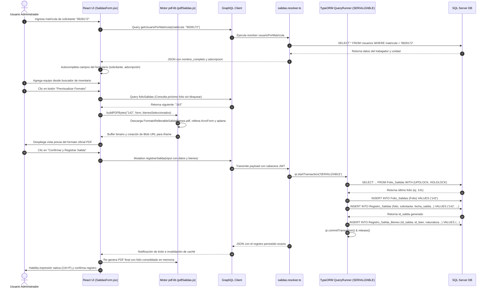

# Manual Técnico Oficial: Módulo de Gestión y Control de Salidas de Bienes

## 1. Descripción General

El módulo de **Gestión y Control de Salidas de Bienes** representa un pilar operativo fundamental en el **Ecosistema de Gestión de Activos Institucionales** de la Delegación Nayarit – IMSS. Su objetivo funcional es normalizar, fiscalizar y documentar el traslado físico temporal o definitivo de activos tecnológicos (computadoras, servidores, monitores, periféricos y equipos de red) fuera de las instalaciones de resguardo o entre diferentes áreas de adscripción institucional.

En el contexto arquitectónico y de normatividad del ecosistema, este módulo resuelve el problema crítico de la trazabilidad física patrimonial. Al actuar como puente entre el **Inventario de Bienes**, el directorio de **Usuarios Institucionales** y la generación formal de documentos jurídicos-administrativos (formatos oficiales de pase de salida), garantiza que ningún equipo abandone las instalaciones sin una autorización explícita, un responsable formalmente designado, y un registro inmutable dotado de foliado seriado. Asimismo, incorpora mecanismos para clasificar las salidas según la naturaleza de los bienes (Bienes Muebles Capitalizables vs. No Capitalizables) y gestionar compromisos de devolución en comodatos o reparaciones externas.

---

## 2. Arquitectura del Frontend

La capa de presentación del módulo está construida sobre **React (v18+)**, implementando una interfaz orientada a flujos transaccionales por etapas (`Formulario` $\rightarrow$ `Previsualización PDF` $\rightarrow$ `Confirmación Atómica`), estilización responsiva con **Tailwind CSS**, y una sincronización de datos con el servidor altamente optimizada mediante **TanStack Query (v5)**.

```mermaid
graph TD
    A[Movimientos.jsx - Orquestador Contenedor] -->|Verificación Rol| B(Zustand Auth Store)
    A <-->|Queries / Mutations| C[GraphQL API Client]
    A --> D[Navegación por Pestañas Operativas]

    %% Pestaña 1: Generación de Salida
    D -->|Tab: GENERAR SALIDA| E[SalidasForm.jsx - Motor Transaccional]
    E -->|Autocompletado Rápido| MAT[GET_USUARIO_POR_MATRICULA]
    E -->|Búsqueda de Equipos| BUS_BIEN[GET_BIENES_QUERY / GET_BIEN_BY_SERIE]
    E -->|Importación Masiva| XLS[Importación Excel xlsx: Lectura de Series]
    E -->|Previsualización en Caliente| PDF[pdfSalidas.js: pdf-lib Form Filling]
    E -->|Confirmación Atómica| MUT_REG[REGISTRAR_SALIDA / CONFIRMAR_FOLIO]
    E -->|Gestión Exclusiva Maestro| MOD_FOLIO[SET_FOLIO_MANUAL]

    %% Pestaña 2: Historial de Salidas
    D -->|Tab: HISTORIAL SALIDAS| F[HistorialSalidas.jsx - Grilla y Auditoría]
    F -->|Filtrado Multidimensional y Fechas| GET_HIST[GET_REGISTRO_SALIDAS]
    F -->|Hover Interactiva Scrollable| POP_BIENES[BienesTableCell - Popover en Portal]
    F -->|Resaltado Coincidencias| H_TEXT[HighlightText - Marcatextos Continuo]
    F -->|Acción: Regenerar PDF| REG_PDF[Re-renderizado pdf-lib en el Navegador]
    F -->|Acción: Editar Salida| ED_MODAL[Modal Edición con SalidasForm embebido]
    ED_MODAL -->|Mutación| MUT_ACT[ACTUALIZAR_SALIDA]

    %% Pestaña 3: Salidas Antiguas (Consulta)
    D -->|Tab: SALIDAS ANTIGUAS| G[HistorialSalidasAntiguas.jsx - Consulta Histórica]
    G -->|Búsqueda y Filtros Cronológicos| GET_ANT[GET_SALIDAS_ANTIGUAS]
    G -->|Paginación Suave Sin Parpadeos| KEEP_DATA[placeholderData: keepPreviousData]
    G -->|Inspección Detallada por Clic| MODAL_ANT[Modal Completo con Artículos y Responsables]
```



### Componentes Principales

1. **`Movimientos.jsx` (Contenedor Principal Orquestador):**
   Constituye el punto de entrada de la ruta `/movimientos`. Evalúa de manera reactiva la identidad del operador consultando `useAuthStore`. Si el usuario posee un rol estrictamente restringido (o se aplican políticas de solo lectura), renderiza un panel informativo de bloqueo institucional. En condiciones operativas normales, administra un enrutador de pestañas de **Radix UI** (`<Tabs.Root>`) que alterna de forma fluida entre tres módulos operativos: el motor de creación (`SalidasForm`), la bitácora activa (`HistorialSalidas`) y el repositorio de consulta histórica (`HistorialSalidasAntiguas`).
2. **`SalidasForm.jsx` (Motor Transaccional de Creación y Edición):**
   Es el componente más complejo del módulo. Opera de manera dual: como formulario de alta de nuevas salidas (`isEditMode = false`) y como sub-vista de modificación en caliente (`isEditMode = true`). Integra un sistema de tres etapas secuenciales:
   - *Etapa 1 (`formulario`):* Captura de metadatos institucionales (solicitante, matrícula, adscripción, empresa, identificación, motivo, origen, responsable, compromisos de devolución) y armado del carrito de bienes.
   - *Etapa 2 (`preview`):* Consulta el próximo folio a emitir (`GET_FOLIO_SALIDAS`) y renderiza en un `iframe` o visor nativo del navegador un archivo PDF oficial rellenado y sellado temporalmente en memoria del cliente.
   - *Etapa 3 (`confirmado`):* Tras la aprobación del usuario, ejecuta la mutación que consolida el folio atómicamente en el backend, habilita la impresión mediante combinaciones de teclas (`Ctrl+P` / `Cmd+P`) y bloquea la edición para evitar duplicidades transaccionales.
3. **`HistorialSalidas.jsx` (Grilla de Auditoría, Inspección Interactiva y Control):**
   Proporciona una vista de tabla paginada del histórico de pases de salida emitidos con funcionalidades avanzadas de inspección y búsqueda:
   - **Búsqueda Multidimensional y Resaltado Visual (`HighlightText`):** Incorpora una barra de filtrado combinada (`search` con debounce de 400 ms) que busca coincidencias en folios, solicitantes, motivos, responsables, así como dentro de las descripciones, números de serie, números de inventario (`num_inv`) o cantidades de los bienes amparados. El componente helper `HighlightText` aplica un efecto de marcatextos amarillo brillante continuado sobre las coincidencias exactas en toda la pantalla sin alterar el flujo ni separar los caracteres de las palabras.
   - **Columna Enriquecida de Bienes (`BienesTableCell`):** En lugar de ocultar los datos de los activos, muestra en la celda un resumen visual con una insignia del conteo total (`<Package /> X bienes`) y viñetas con las dos primeras descripciones e identificadores directos del pase.
   - **Tablita Flotante Interactiva con Scroll en Hover:** Al posicionar el cursor sobre la celda o el botón de "+X más", se despliega en un portal flotante del DOM una mini-tabla interactiva (`pointer-events-auto`) con scroll interno. Cuenta con un sistema de temporizadores de gracia (`hoverTimer` y `closeTimer` de 250ms/350ms) que permite al usuario desplazar el mouse hacia dentro de la ventana emergente y hacer scroll tranquilamente sobre decenas de bienes sin que la tabla desaparezca o parpadee.
   - **Modal de Inspección Detallada:** Un clic sobre la celda abre un modal dedicado con la tabla completa de activos de esa salida, incorporando su propio buscador instantáneo con resaltado en tiempo real.
   - **Alineación Cronológica Estricta:** Implementa sincronización exacta de parámetros de fecha (`fecha_desde` y `fecha_hasta`) con las especificaciones del esquema GraphQL en el servidor.
4. **`HistorialSalidasAntiguas.jsx` (Repositorio y Grilla de Consulta Histórica de Salidas Antiguas):**
   Módulo de consulta dedicado a preservar y presentar la trazabilidad de los registros de salidas emitidos con anterioridad a la arquitectura actual. Opera bajo estrictas políticas de solo lectura (sin edición ni regeneración de PDF):
   - **Interactividad Total en Fila (`cursor-pointer`):** Cualquier clic sobre la celda o el renglón despliega automáticamente un modal exhaustivo con todos los metadatos históricos registrados (`Solicitante`, `Responsable`, matrículas/puestos asociados `p_solicitante`, `m_solicitante`, `p_responsable`, `m_responsable`, compromiso de `Devolución`, `Fecha de devolución` y `Área`), acompañado de la tabla paginable y filtrable de artículos vinculados.
   - **Estabilidad de Paginación Anti-Saturación (`keepPreviousData`):** Utiliza la propiedad `placeholderData: keepPreviousData` de TanStack Query v5 para retener en pantalla los datos de la página anterior y el conteo maestro de páginas mientras se efectúa la transición a una nueva página. Además, incorpora un bloqueo de gracia en los controles de navegación (`disabled={isLoading || isFetching}`) durante peticiones en curso, eliminando condiciones de carrera (race conditions) o pantallas vacías al hacer clic velozmente.
5. **Herramientas de Captura Ágil (`SearchableSelect` & Importadores Excel):**
   El formulario incluye selectores auto-completados que consultan catálogos dinámicos (`useCatalogosBienes`). Para salidas masivas (ej. traslados de laboratorios completos), incorpora un importador y analizador sintáctico de archivos `.xlsx` (`handleImportExcel`) que extrae listas de números de serie, consulta su existencia en el inventario de la base de datos de forma paralela via `GET_BIEN_BY_SERIE_QUERY`, e inyecta los registros tipificados al listado de la salida. Además, incluye inteligencia topológica para acoplar opcionalmente los monitores vinculados a las CPU seleccionadas (`incluirMonitores`).

### Motor de Exportación e Impresión PDF (`pdfSalidas.js`)

A diferencia de las exportaciones tabulares estándar, el módulo de salidas genera documentos PDF legales prellenados sobre la plantilla oficial institucional (`/Formatos/FormatoRellenableSalidaBienes.pdf`) utilizando la librería de manipulación binaria **`pdf-lib`**:

- **Carga de Plantilla AcroForm:** El motor descarga el archivo PDF base (formato oficial de salida de bienes) y extrae su capa de formulario (`doc.getForm()`), embebiendo fuentes estándares (`StandardFonts.Helvetica` y `HelveticaBold`).
- **Mapeo Geométrico y Campos Dinámicos:** Asigna los valores capturados a los campos exactos del formulario PDF (`Folio`, `Elc`, `NombreSolicitante`, `AdscritoA`, `Identificacion`, `TrabajadorDe`, `Matricula`, `Telefono`, `RazonSalida`, `ObservacionesBienes`, `FechaSalida`, `NombreResponsable`). Si el texto del campo `OrigenBienes` excede la capacidad visual del renglón (55 caracteres), el algoritmo calcula un salto de línea semántico en el último espacio disponible e inyecta el remanente en el campo complementario `OrigenBienes2`.
- **Control Lógico de Casillas (Checkboxes):** Evalúa si los bienes están sujetos a devolución (`sujeto_devolucion`). Calcula las coordenadas geográficas del widget del checkbox (`DevolucionCheck1` o `DevolucionCheck2`), dibuja tipográficamente una marca de verificación `'X'` en negrita en la posición exacta (`rect.x + 3`, `rect.y + 2`) y elimina el campo AcroForm interactivo para blindar el documento contra ediciones posteriores.
- **Paginación Dinámica del Matriz de Bienes:** El formato oficial permite listar hasta 10 ítems por página (`ROWS_PER_PAGE = 10`). Si una salida ampara más de 10 equipos, la función `buildPDFBytes` segmenta el arreglo de bienes en sub-grupos, instancía clones completos de la plantilla oficial por cada grupo de 10 ítems, rellena la matriz del renglón 1 al 10 (`f{row}c1`, `f{row}c2`, `f{row}c3`, incluyendo la corrección tipográfica histórica para la fila 5 columna 1: `f451`), y consolida todas las páginas en un único documento maestro mutipaginado.
- **Aplanado Legal (`flatten`):** Antes de retornar el buffer de bytes (`Uint8Array`), se invoca `pdfForm.flatten()`, convirtiendo los campos interactivos en trazados de vectores inmutables incrustados en la página.

### Manejo de Estado y Hooks

El sistema entrelaza una arquitectura de hooks nativos, estado local y gestión de caché distribuida:

- **Hooks Nativos (`useState`, `useEffect`, `useRef`):**
  - Controlan la máquina de estados de la interfaz (`etapa`: `'formulario'`, `'preview'`, `'confirmado'`), visibilidad de modales de administración de folio maestro (`showGestionFolio`), listas mutables en memoria (`bienesSeleccionados`), términos de búsqueda y paginación (`currentPage`, `PAGE_SIZE = 20`).
  - Un `useEffect` acoplado a un temporizador `useRef` intercepta la escritura en el campo de matrícula (`matriculaTimer`). Al detectar una longitud $\ge 3$ caracteres y pausas de 600 ms, gatilla de forma silenciosa la consulta del directorio institucional, auto-rellenando el nombre y adscripción sin intervención manual (`nombreAutoFilled`).
  - Otro `useEffect` intercepta eventos globales de teclado (`keydown`) en el objeto `window`. Si el operador presiona `Ctrl+P` o `Cmd+P` estando en la etapa `'confirmado'`, previene el diálogo genérico de impresión de la página web y abre directamente la URL en blob del formato oficial en PDF.
- **Estado Global y Caché (`Zustand` & `@tanstack/react-query`):**
  - `useAuthStore` provee el contexto de seguridad en el cliente para verificar privilegios directivos (`id_rol === 1` para el botón de *Ajuste Manual de Folio*).
  - `useQuery` sincroniza y almacena en caché el estado de foliado actual (`GET_FOLIO_SALIDAS`), el historial paginado (`GET_REGISTRO_SALIDAS`) y la resolución del catálogo de bienes.
  - `useMutation` orquesta el registro (`REGISTRAR_SALIDA`), edición (`ACTUALIZAR_SALIDA`) y sobreescritura de folios (`SET_FOLIO_MANUAL`), disparando invalidaciones atómicas (`qc.invalidateQueries`) y retroalimentación mediante notificaciones globales (`showToast`).

### Integración GraphQL

La capa de red se estructura de forma declarativa en `src/api/salidas.queries.js`, consumiendo los siguientes contratos:

- **Consultas (Queries):**
  - `GET_FOLIO_SALIDAS`: Obtiene el par de valores `{ folio_actual, siguiente }` proyectados desde la tabla de control de numeración.
  - `GET_USUARIO_POR_MATRICULA($matricula: String!)`: Resuelve la identidad, nombre y adscripción física de un trabajador IMSS.
  - `GET_REGISTRO_SALIDAS($filter, $pagination)`: Recupera la colección histórica de salidas con paginación basada en cursores/offsets, incluyendo la información anidada del usuario registrador y el detalle de cada bien amparado.
  - `GET_REGISTRO_SALIDA($id_salida: Int!)`: Consulta unitaria profunda para hidratar el inspector de detalles o el motor de edición.
  - `GET_SALIDAS_ANTIGUAS($filter: SalidaAntiguaFilterInput, $pagination: PaginationInput)`: Consulta del repositorio histórico de salidas antiguas con búsqueda multi-columna, filtrado por rango de fechas y paginación optimizada.
- **Mutaciones (Mutations):**
  - `REGISTRAR_SALIDA($input: RegistroSalidaInput!)`: Persiste la cabecera transaccional y la matriz de bienes en un solo bloque, consumiendo o autogenerando el folio oficial.
  - `ACTUALIZAR_SALIDA($id_salida: Int!, $input: RegistroSalidaInput!)`: Sobreescribe los metadatos de un pase existente y reemplaza transaccionalmente sus ítems asociados.
  - `CONFIRMAR_FOLIO`: Mutación atómica de incremento del contador en la tabla base.
  - `SET_FOLIO_MANUAL($folio: String!)`: Operación privilegiada de nivel Maestro para re-alinear o calibrar la secuencia numérica institucional.

---

## 3. Arquitectura del Backend

El servidor se ejecuta sobre un entorno **Node.js / Express** con tipado estático en **TypeScript**, exponiendo una API **GraphQL** sobre el motor ORM **TypeORM** conectado a un clúster **Microsoft SQL Server**.

### Resolvers

Implementados en `src/graphql/resolvers/salidas.resolver.ts` y `src/graphql/resolvers/salidasAntiguas.resolver.ts`, gestionan la lógica de control, numeración, auditoría y consultas territoriales:

- **Query Resolvers:**
  - `folioSalidas`: Consulta la función de agregación máxima sobre la tabla de folios (`SELECT ISNULL(MAX(TRY_CAST(Folio AS INT)), 0)`) para proyectar de forma segura el folio actual y el entero inmediato siguiente sin generar bloqueos en lecturas preliminares.
  - `usuarioPorMatricula`: Consulta el repositorio de `Usuario` mediante coincidencia exacta de matrícula cargando la relación de `unidadFisica`.
  - `registroSalidas`: Orquesta un `QueryBuilder` dinámico sobre `Registro_Salidas`. Implementa el motor de seguridad por multitenancy territorial: si el usuario es de nivel territorial estándar (`isEstandar(context)`), inyecta una subconsulta (`EXISTS` / `IN`) contra las tablas de `Registro_Salida_Bienes`, `Bienes` y `unidades` para garantizar que solo se retornen salidas donde al menos un bien pertenezca a la jurisdicción territorial del usuario (`clave_zona`), excepciones explícitas de serie (`'U003'`, `'T003'`), o donde el pase haya sido registrado directamente por el operador o por un miembro de su misma zona.
  - `registroSalida`: Retorna el registro transaccional unitario y todo su árbol de relaciones patrimoniales.
  - `salidasAntiguas`: Resolver dedicado para la consulta paginada del archivo patrimonial (`SalidaBienAntiguo`). Ejecuta un `QueryBuilder` con `leftJoinAndSelect` hacia la tabla de artículos asociados, aplicando búsqueda con agrupaciones lógicas de `Brackets` en SQL Server sobre ID, solicitante, responsable, adscripción, procedencia y descripciones de los artículos amparados.
  - `salidaAntigua`: Consulta individual por ID para obtener el detalle íntegro y la colección de ítems de una salida antigua específica.
- **Mutation Resolvers:**
  - `registrarSalida`: Implementa un patrón transaccional ACID con nivel de aislamiento estricto (`SERIALIZABLE`) y bloqueos pesados a nivel de motor de base de datos para garantizar la unicidad e inmutabilidad del foliado institucional en ambientes de alta concurrencia.
  - `actualizarSalida`: Abre una transacción para modificar los metadatos de la cabecera y realizar una sustitución atómica de los detalles patrimoniales (`DELETE FROM Registro_Salida_Bienes` seguido de la inserción de los nuevos ítems).
  - `setFolioManual`: Validado exclusivamente para el rol supremo (`ROLES.MAESTRO`). Verifica rigurosamente que el folio numérico solicitado sea entero positivo, que no exista previamente en la tabla de secuencias (`Folio_Salidas`), y que no esté ocupado por una cabecera histórica en `Registro_Salidas`, previniendo colisiones de integridad relacional.

### Entidades de Base de Datos

Las operaciones de salida operan sobre un modelo relacional normalizado y altamente cohesionado (`src/entities/*.ts`):

1. **`RegistroSalida` (Tabla: `Registro_Salidas`):**
   Entidad cabecera que representa el pase de salida legal. Almacena la clave primaria (`id_salida` int autoincremental), el identificador oficial corporativo (`folio` varchar(50)), marcadores cronológicos (`fecha_salida` date, `fecha_registro` datetime), datos del solicitante (`id_usuario_solicitante`, `matricula`, `solicitante`, `adscripcion`, `empresa`, `identificacion`, `telefono`), justificación operativa (`motivo`, `origen_bienes`, `responsable`, `observaciones`), variables jurídicas de retorno (`sujeto_devolucion` bit, `fecha_devolucion` date), y la auditoría de autoría (`id_usuario_registra` referenciando a `Usuarios`).
2. **`RegistroSalidaBien` (Tabla: `Registro_Salida_Bienes`):**
   Entidad de detalle 1:N que vincula un pase de salida con los activos patrimoniales transportados. Almacena la llave primaria (`id_salida_bien`), la llave foránea padre (`id_salida` con cascada en eliminación), el identificador UUID opcional del activo en catálogo (`id_bien` referenciando a `Bienes`), la cardinalidad o identificador literal (`cantidad_o_id`), la clasificación contable (`naturaleza`: `'BMC'` para Bienes Muebles Capitalizables con número de inventario o `'BMNC'` para No Capitalizables), y la descripción literaria compuesta (`descripcion`).
3. **`Folio_Salidas` (Tabla de Secuencia de Foliado):**
   Tabla transaccional atómica administrada directamente a nivel de sentencias SQL crudas en el QueryRunner. Almacena el historial secuencial de folios emitidos (`Folio` varchar), funcionando como un contador seguro a prueba de condiciones de carrera (Race Conditions).
4. **`SalidaBienAntiguo` (Tabla: `SalidaBienesAntiguo`):**
   Entidad cabecera del archivo histórico de salidas. Almacena metadatos patrimoniales heredados (`ID`, `Responsable`, `M_Responsable`, `P_Responsable`, `Solicitante`, `M_Solicitante`, `P_Solicitante`, `Adscripcion`, `Procedencia`, `Para_Su`, `Unidad_Bien`, `Identificacion`, `Telefono`, `Estado_Fisico`, `Devolucion`, `Fecha_Devolucion`, `Area`, `Fecha`). Mantiene una relación 1:N de solo lectura con `ArticuloSalidaBienAntiguo`.
5. **`ArticuloSalidaBienAntiguo` (Tabla: `ArticuloSalidaBienesAntiguo`):**
   Entidad de detalle histórica asociada a las salidas antiguas mediante la llave foránea `IDArticulo`. Almacena las características de los activos trasladados en el sistema anterior (`Cantidad`, `Naturaleza`, `Descripcion`).
6. **Entidades Relacionadas (`Bien`, `Usuario`, `Unidad`):**
   Entidades satélites que aportan la topología técnica del hardware (`modelo`, `num_serie`, `num_inv`), la ubicación geográfica e institucional territorial (`clave_zona`), y la autenticación institucional del personal que autoriza el movimiento.

### Reglas de Negocio

Antes de impactar la capa de persistencia, el backend ejecuta un estricto conjunto de invariantes de negocio:

1. **Foliado Concurrente Atómico Libre de Colisiones:**
   Para prevenir que dos administradores presionen "Registrar" simultáneamente y obtengan el mismo número de folio, el resolver `registrarSalida` inicia un `QueryRunner` con aislamiento `SERIALIZABLE`. Si el payload entrante carece de un folio pre-asignado, ejecuta una consulta de lectura con bloqueo de actualización y retención de candado:
   `SELECT ISNULL(MAX(TRY_CAST(Folio AS INT)), 0) AS fa FROM Folio_Salidas WITH (UPDLOCK, HOLDLOCK)`.
   Inmediatamente incrementa el entero, inserta la nueva fila en `Folio_Salidas` y asigna el identificador a la entidad de salida en una operación indivisible.
2. **Clasificación Patrimonial de Bienes (`BMC` vs `BMNC`):**
   El sistema distingue estrictamente la naturaleza patrimonial del hardware. Si un bien seleccionado desde el catálogo del inventario posee un número de inventario formal (`num_inv`), su naturaleza se fija canónicamente como `'BMC'` (Bien Mueble Capitalizable). Si carece de número de inventario (ej. periféricos menores o activos externos), se clasifica como `'BMNC'` (Bien Mueble No Capitalizable). Asimismo, el sistema admite ítems manuales libres de referencia (`manual_...`), almacenando un `id_bien` nulo en la base de datos para amparar equipos temporales o de terceros sin romper la integridad referencial.
3. **Coherencia Normativa en Devoluciones:**
   Si una salida se marca con compromiso de retorno (`sujeto_devolucion = true`), el sistema procesa y almacena obligatoriamente la `fecha_devolucion`. En caso de ser definitiva (`sujeto_devolucion = false`), la capa de negocio fuerza que la fecha de devolución persista como un valor nulo (`null`), evitando incongruencias de alertas en el seguimiento patrimonial.

---

## 4. Flujo de Ejecución (Data Flow)

A continuación, se detalla el recorrido transaccional completo cuando un administrador genera un nuevo pase de salida para un equipo de cómputo, validando su matrícula e imprimiendo el formato oficial:



---

## 5. Fragmentos de Código Clave (Snippets)

### Snippet 1 (Frontend): Segmentación Paginada y Rellenado Binario del Formato Oficial (`pdfSalidas.js`)

Este bloque demuestra cómo la capa de frontend manipula binariamente plantillas PDF legales mediante `pdf-lib`, dividiendo dinámicamente colecciones extensas de bienes en páginas normalizadas de 10 renglones y aplicando el aplanado de campos interactivos:

```javascript
// src/utils/pdfSalidas.js
export const buildPDFBytes = async (folioStr, form, bienesSeleccionados) => {
  // 1. Carga en memoria del archivo binario PDF base institucional
  const templateBytes = await fetch('/Formatos/FormatoRellenableSalidaBienes.pdf').then((r) => r.arrayBuffer());

  // 2. Algoritmo de segmentación en bloques de 10 ítems (límite físico de filas en la plantilla)
  const pageGroups = [];
  for (let i = 0; i < bienesSeleccionados.length; i += ROWS_PER_PAGE) {
    pageGroups.push(bienesSeleccionados.slice(i, i + ROWS_PER_PAGE));
  }
  if (pageGroups.length === 0) pageGroups.push([]);

  // 3. Función interna para rellenar una página individual
  const fillDoc = async (pageItems, pageNum, isFirstPage) => {
    const doc = await PDFDocument.load(templateBytes);
    const pdfForm = doc.getForm();
    
    // Inyección de campos de cabecera en la primera o sucesivas páginas
    const setTextField = (name, value) => {
      try { pdfForm.getTextField(name)?.setText(value || ''); } catch {}
    };
    setTextField('Folio', folioStr);
    setTextField('NombreSolicitante', form.solicitante);
    setTextField('AdscritoA', form.adscripcion);
    setTextField('RazonSalida', form.motivo);

    // Mapeo iterativo de los bienes en la grilla del PDF (Filas 1 a 10)
    pageItems.forEach((bien, i) => {
      const row = i + 1;
      // Manejo de corrección histórica del nombre del campo en fila 5, col 1 ('f451' en vez de 'f5c1')
      const col1Field = (row === 5) ? 'f451' : `f${row}c1`;
      setTextField(col1Field, String(bien.cantidad || '1'));
      setTextField(`f${row}c2`, bien.naturaleza || '');
      setTextField(`f${row}c3`, bien.descripcion || '');
    });

    // Aplanado vectorial del formulario para impedir modificaciones ilegítimas
    pdfForm.flatten();
    return doc.save();
  };

  // 4. Consolidación multipágina en un único documento de salida
  const finalDoc = await PDFDocument.create();
  for (let i = 0; i < pageGroups.length; i++) {
    const bytes = await fillDoc(pageGroups[i], i + 1, i === 0);
    const tempDoc = await PDFDocument.load(bytes);
    const [copiedPage] = await finalDoc.copyPages(tempDoc, [0]);
    finalDoc.addPage(copiedPage);
  }
  return finalDoc.save();
};
```

### Snippet 2 (Backend): Control Transaccional ACID con Bloqueo Exclusivo de Foliado (`salidas.resolver.ts`)

Este fragmento ilustra la implementación rigurosa en el servidor para evitar condiciones de carrera en el cálculo del folio institucional, adquiriendo candados exclusivos a nivel de tabla en SQL Server bajo una transacción serializable:

```typescript
// src/graphql/resolvers/salidas.resolver.ts
registrarSalida: async (_: unknown, { input }: any, context: GraphQLContext) => {
  requireAuth(context);
  const userId = context.user!.id_usuario;

  // 1. Apertura de QueryRunner con nivel de aislamiento máximo (SERIALIZABLE)
  const qr = AppDataSource.createQueryRunner();
  await qr.connect();
  await qr.startTransaction('SERIALIZABLE');

  try {
    let assignedFolio = input.folio;

    if (!assignedFolio) {
      // 2. Consulta con candados UPDLOCK y HOLDLOCK para bloquear lecturas concurrentes en Folio_Salidas
      const result = await qr.query(
        `SELECT ISNULL(MAX(TRY_CAST(Folio AS INT)), 0) AS fa FROM Folio_Salidas WITH (UPDLOCK, HOLDLOCK)`
      );
      const folioActual = Number(result[0]?.fa ?? 0);
      assignedFolio = String(folioActual + 1);
      
      // 3. Persistencia inmediata del nuevo folio antes de escribir la cabecera
      await qr.query(`INSERT INTO Folio_Salidas (Folio) VALUES (@0)`, [assignedFolio]);
    }

    // 4. Construcción y guardado transaccional de la cabecera del pase de salida
    const registro = new RegistroSalida();
    registro.folio = assignedFolio;
    registro.fecha_salida = input.fecha_salida;
    registro.solicitante = input.solicitante;
    registro.motivo = input.motivo;
    registro.id_usuario_registra = userId;
    const savedRegistro = await qr.manager.save(RegistroSalida, registro);

    // 5. Mapeo e inserción masiva en lote de la matriz relacional de bienes amparados
    if (input.bienes && input.bienes.length > 0) {
      const bienesEntities = input.bienes.map((b: any) => {
        const rb = new RegistroSalidaBien();
        rb.id_salida = savedRegistro.id_salida;
        rb.id_bien = b.id_bien;
        rb.cantidad_o_id = b.cantidad_o_id;
        rb.naturaleza = b.naturaleza;
        rb.descripcion = b.descripcion;
        return rb;
      });
      await qr.manager.save(RegistroSalidaBien, bienesEntities);
    }

    // 6. Confirmación definitiva de la transacción
    await qr.commitTransaction();

    return await qr.manager.findOne(RegistroSalida, {
      where: { id_salida: savedRegistro.id_salida },
      relations: ['usuarioRegistra', 'bienes', 'bienes.bienRef'],
    });
  } catch (e) {
    // Reversión inmediata en caso de violación de restricción o interrupción de red
    await qr.rollbackTransaction();
    throw e;
  } finally {
    await qr.release();
  }
}
```

### Snippet 3 (Backend): Filtrado de Seguridad Multitenancy por Jurisdicción Territorial (`salidas.resolver.ts`)

Muestra la inyección algorítmica de cláusulas SQL y subconsultas en el `QueryBuilder` de TypeORM para garantizar el aislamiento estricto de información patrimonial entre zonas geográficas del IMSS cuando consulta un usuario de rol estándar:

```typescript
// src/graphql/resolvers/salidas.resolver.ts (dentro de registroSalidas)
const repo = AppDataSource.getRepository(RegistroSalida);
const qb = repo.createQueryBuilder('rs')
  .leftJoinAndSelect('rs.usuarioRegistra', 'u')
  .leftJoinAndSelect('rs.bienes', 'b')
  .leftJoinAndSelect('b.bienRef', 'bienRef')
  .leftJoinAndSelect('bienRef.modelo', 'modelo')
  .orderBy('rs.id_salida', 'DESC');

// Evaluación del perímetro territorial institucional
if (isEstandar(context) && context.user?.clave_zona) {
  qb.andWhere(
    `(rs.id_salida IN (
      SELECT DISTINCT rsb2.id_salida
      FROM Registro_Salida_Bienes rsb2
      INNER JOIN Bienes bz ON bz.id_bien = rsb2.id_bien
      LEFT JOIN unidades uz ON uz.clave = bz.clave_unidad_ref
      WHERE uz.clave_zona = :_sal_zona OR bz.num_serie IN ('U003', 'T003')
    ) 
    OR rs.id_usuario_registra = :_userId
    OR rs.id_usuario_registra IN (
      SELECT usr.id_usuario
      FROM Usuarios usr
      INNER JOIN unidades u_usr ON u_usr.clave = usr.clave_unidad
      WHERE u_usr.clave_zona = :_sal_zona
    ))`,
    { _sal_zona: context.user.clave_zona, _userId: context.user.id_usuario }
  );
}
```

### Snippet 4 (Frontend & Backend): Consulta del Archivo Histórico de Salidas Antiguas y Paginación Anti-Saturación

Muestra la integración entre el resolver de consulta histórica en TypeORM y la técnica de retención de datos en React Query v5 para evitar parpadeos o pantallas en blanco en transiciones rápidas de página:

```typescript
// Backend: src/graphql/resolvers/salidasAntiguas.resolver.ts
salidasAntiguas: async (_: unknown, { filter, pagination }: any, context: GraphQLContext) => {
  requireAuth(context);
  const repo = AppDataSource.getRepository(SalidaBienAntiguo);
  const qb = repo.createQueryBuilder('sa')
    .leftJoinAndSelect('sa.articulos', 'art')
    .orderBy('sa.id', 'DESC');

  if (filter?.search) {
    qb.andWhere(new Brackets(b => {
      b.where('CAST(sa.id AS VARCHAR(50)) LIKE :search', { search: `%${filter.search}%` })
       .orWhere('sa.solicitante LIKE :search', { search: `%${filter.search}%` })
       .orWhere('sa.responsable LIKE :search', { search: `%${filter.search}%` })
       .orWhere('art.descripcion LIKE :search', { search: `%${filter.search}%` });
    }));
  }

  const first = pagination?.first ?? 20;
  const offset = pagination?.page && pagination.page > 0 ? (pagination.page - 1) * first : 0;
  qb.skip(offset).take(first);

  const [salidas, totalCount] = await qb.getManyAndCount();
  return {
    edges: salidas.map((s) => ({ node: s, cursor: String(s.id) })),
    pageInfo: { hasNextPage: offset + first < totalCount, totalCount },
  };
}
```

```javascript
// Frontend: src/components/HistorialSalidasAntiguas.jsx
import { useQuery, keepPreviousData } from '@tanstack/react-query';

const { data, isLoading, isFetching } = useQuery({
  queryKey: ['salidasAntiguas', debouncedSearch, currentPage, startDate, endDate],
  queryFn: () => gqlClient.request(GET_SALIDAS_ANTIGUAS, {
    filter,
    pagination: { first: PAGE_SIZE, page: currentPage }
  }),
  placeholderData: keepPreviousData, // Retiene la página anterior mientras carga la nueva
});

// En el renderizado de botones de paginación se bloquea el spam durante peticiones en vuelo:
<button 
  onClick={() => setCurrentPage(Math.min(totalPages, currentPage + 1))} 
  disabled={currentPage === totalPages || isLoading || isFetching}
>
  Siguiente
</button>
```
