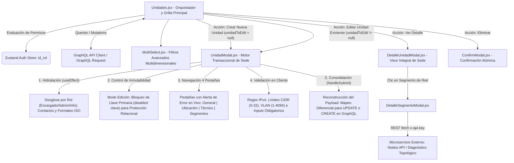
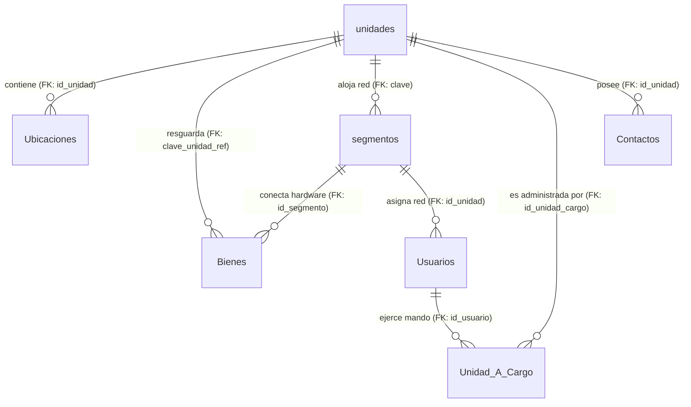
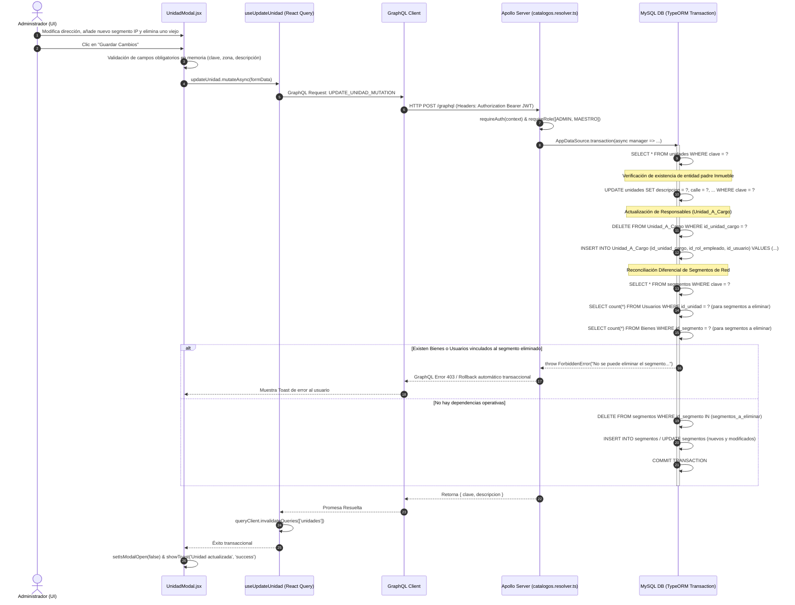

# Manual Técnico Oficial: Módulo de Gestión y Catálogo de Unidades Físicas y Operativas

## 1. Descripción General

El módulo de **Catálogo de Unidades** conforma el eje topológico, geográfico y administrativo fundamental dentro del **Ecosistema de Gestión de Activos Institucionales** de la Delegación Nayarit – IMSS. Su objetivo funcional prioritario es censar, georreferenciar, jerarquizar y administrar todas las sedes institucionales (clínicas de medicina familiar, hospitales generales, subdelegaciones, oficinas administrativas y centros de seguridad social), consolidando en una única fuente de verdad su ubicación física, su infraestructura de conectividad de telecomunicaciones y su estructura jerárquica de mando operativo.

En la arquitectura general del sistema, la **Unidad Física** funciona como la entidad raíz o nodo contenedor primario sobre la cual gravitan tres dimensiones críticas de control patrimonial:

1. **Trazabilidad Patrimonial e Inventario Física (`Inmuebles` / `Bienes`):** Constituye la agrupación de nivel superior para todas las áreas o departamentos internos (`Ubicaciones`) y determina el adscripción geográfica última del inventario de hardware informático y médico (`Bienes`). Ningún activo ni sub-ubicación puede existir en el vacío relacional fuera de una Unidad.
2. **Infraestructura Tecnológica y Topología de Red (`Segmentos` / `Nodos API`):** Asocia y administra de manera declarativa los enlaces de telecomunicaciones, subredes IP, configuraciones VLAN, anchos de banda, proveedores de servicios de internet e interruptores de monitoreo activo (`monitorear`), permitiendo no solo la auditoría lógica de red, sino también la integración con microservicios externos de diagnóstico topológico y visualización de nodos.
3. **Gobierno Institucional y Responsabilidades (`UnidadesACargo` / `Contactos`):** Establece formalmente los tramos de control operativo al vincular de forma estricta a personal institucional del catálogo de usuarios en tres roles jerárquicos clave: **Encargado de la Unidad** (`Rol Empleado 1`), **Administrador** (`Rol Empleado 2`) y **Responsable de Informática** (`Rol Empleado 3`), así como centralizar el directorio oficial de teléfonos y correos electrónicos del recinto.

---

## 2. Arquitectura del Frontend

La capa de presentación del módulo está desarrollada en **React (v18+)** bajo una arquitectura modular y transaccional orientada a vistas altamente interactivas, estilización responsiva con **Tailwind CSS**, y gestión de estado asíncrono y caché en memoria propulsada por **TanStack Query (v5)**.



### Componentes Principales

1. **`Unidades.jsx` (Contenedor Principal y Grilla de Navegación):**
   Actúa como el controlador de la ruta `/unidades`. Gestiona la barra de búsqueda combinada provista de resaltado de coincidencias en tiempo real (mediante la función utilitaria `highlightText`, que envuelve los fragmentos coincidentes en etiquetas `<mark>`), la paginación virtualizada por offsets y cursores combinados (`currentPage`, `PAGE_SIZE = 30`), y el ordenamiento dinámico por columnas (`SortIcon`). Asimismo, evalúa de manera reactiva el nivel de privilegios del operador vía `useAuthStore`: habilita la creación y edición para directivos e ingenieros (`id_rol === 1 || id_rol === 2`) y reserva el borrado exclusivamente para administradores globales (`id_rol === 1`).
2. **`UnidadModal.jsx` (Motor Transaccional de Alta y Edición de Unidades):**
   Constituye el componente de mayor complejidad arquitectónica en la capa de presentación (1,127 líneas de código), diseñado para gestionar de forma dual la creación (`unidadToEdit === null`) y la edición en caliente (`unidadToEdit !== null`) de sedes institucionales. Su operación técnica se desglosa en cinco fases críticas:

   - **A) Flujo Diferenciado de Edición y Bloqueo de Llave Primaria (`disabled={!!unidadToEdit}`):**
     Al abrirse la interfaz modal, el componente evalúa la presencia de la propiedad `unidadToEdit`. Si el registro ya existe, altera dinámicamente el título y subtítulo hacia *"Editar Unidad"* e impone un candado de inmutabilidad estricto sobre el input de la columna `clave` (`<input name="clave" disabled={!!unidadToEdit} />`). Esta protección es un requisito arquitectónico innegociable: dado que la `clave` actúa como llave primaria relacional (`Inmueble.clave`) en el backend MySQL, impedir su edición en la UI elimina riesgos de corrupción referencial, huérfanos o fallos en las llaves foráneas que apuntan desde las tablas de `Bienes`, `Ubicaciones`, `Segmentos` y `Contactos`.
   
   - **B) Ciclo de Hidratación Asíncrona (`useEffect` reactivo):**
     Cuando el modal se abre en modo edición, un `useEffect` acoplado a `unidadToEdit` desintegra el árbol anidado retornado por GraphQL y lo mapea al estado plano local del formulario (`formData`):
     - Mapea de 1 a 1 los atributos físicos e institucionales (`clave`, `descripcion`, `desc_corta`, `calle`, `colonia`, `ciudad`, `municipio`, `cp`, `ubicacion_coordenada`, `clave_zona`, `regimen`, `nivel`, `no_inmueble`, `tipo_unidad`).
     - Deshace la relación 1:N de `unidadesACargo` para hidratar 3 variables escalares/vectoriales independientes: busca la asignación con `id_rol_empleado === 1` para poblar `encargado_usuario`, `id_rol_empleado === 2` para `administrador_usuario`, y extrae un arreglo de identificadores para `id_rol_empleado === 3` (`informatica_usuario`).
     - Separa el arreglo de `contactos` filtrando por `tipo_contacto === 'telefonico'` hacia una lista mutable `contacto_telefonico` y por `tipo_contacto === 'correo electronico'` hacia `contacto_correo`.
     - Parsea el arreglo de subredes `segmentos`, transformando la fecha ISO 8601 UTC de `fecha_migracion` al formato `YYYY-MM-DD` (`new Date(s.fecha_migracion).toISOString().split('T')[0]`) exigido por los controles web `<input type="date">`.

   - **C) Navegación Multimodal en 4 Pestañas (`activeTab` con Alertas Visuales):**
     Para evitar sobrecarga cognitiva y agrupar lógicamente la alta densidad de campos, el modal implementa un enrutador interno de pestañas (`'general'`, `'ubicacion'`, `'tecnico'`, `'segmentos'`). Cada pestaña evalúa dinámicamente si alguno de sus inputs presenta errores de validación (`errors`), disparando un indicador luminoso rojo en tiempo real (`animate-pulse`) sobre el icono de la pestaña para guiar la corrección del operador:
     - *Pestaña `'general'`:* Administra identificadores únicos, descripciones, adscripción delegacional (`clave_zona`), zona de reporte y clasificación arquitectónica (`regimen`, `nivel`, `no_inmueble`, `tipo_unidad`).
     - *Pestaña `'ubicacion'`:* Concreta la dirección física exhaustiva y las coordenadas geográficas (`ubicacion_coordenada`).
     - *Pestaña `'tecnico'`:* Orquesta la asignación de personal directivo e ingeniería empleando el componente autocompletado `SearchableSelect` conectado al catálogo general de usuarios (`GET_USUARIOS`), administrando en paralelo las listas dinámicas autogestionadas para agregar/eliminar teléfonos y correos.
     - *Pestaña `'segmentos'`:* Renderiza una interfaz matricial acoplada a un sistema de acordeón (`expandedSegmentIndex`) para agregar, editar o remover subredes IP, VLANs, anchos de banda (`velocidad`), enlaces y banderas de monitoreo (`monitorear`).

   - **D) Motor de Validación Exhaustiva en Cliente (`validate()`):**
     Antes de invocar la red, el modal ejecuta una suite de validación rigurosa: verifica la presencia de campos obligatorios (`clave`, `descripcion`, `clave_zona`, `tipo_unidad`), inspecciona que las longitudes no excedan la capacidad de los tipos `VARCHAR` de MySQL, valida mediante expresiones regulares (`ipRegex`) que cada dirección IP de los segmentos siga el formato de octetos IPv4 válido (`10.0.0.1`), y comprueba que las máscaras CIDR (`bits` de 0 a 32), identificadores VLAN (1 a 4094) y octetos iniciales (`ip_init` de 0 a 255) se mantengan estrictamente dentro de sus límites matemáticos de red.

   - **E) Reconstrucción Transaccional y Consolidación de Payload (`handleSubmit`):**
     Una vez superada la validación, el modal empaquetado por `handleSubmit` transforma el estado plano visual de vuelta a la especificación estricta de GraphQL: castea cadenas numéricas a enteros con `parseInt()`, reemplaza cadenas vacías por `null`, empaqueta las asignaciones operativas en un arreglo de objetos `UnidadACargoInput`, formatea los contactos en `ContactoInput`, y serializa las fechas de migración de red a timestamps ISO completos. Si el segmento modificado ya poseía un `id_segmento`, lo preserva intacto para que el servidor ejecute un `UPDATE`; si el segmento es nuevo en la edición, omite el identificador para que el backend dispare un `INSERT`. Finalmente, invoca el callback transaccional `onSubmit(submissionData)`.
3. **`DetalleUnidadModal.jsx` (Visor de Especificaciones e Infraestructura):**
   Proyecta una interfaz modal de solo lectura que organiza visualmente las fichas de datos operativos mediante tarjetas con iconografía diferenciada por color (`colorMap`). Desglosa al personal directivo asignado, consolida los canales de contacto e ilustra la infraestructura de red asignada en forma de tarjetas seleccionables.
4. **`DetalleSegmentoModal.jsx` (Puente de Integración Topológica REST):**
   Al hacer clic sobre cualquiera de las tarjetas de segmento de red dentro de una unidad, este componente abre un visor de diagnóstico. Su característica técnica más destacada es que ejecuta de forma asíncrona una petición HTTP REST (`fetch`) hacia un microservicio auxiliar especializado en topología de red (`VITE_NODOS_API_URL/api/integracion/nodos?ip_segment={ip}`), adjuntando credenciales de seguridad en cabecera (`x-api-key: VITE_NODOS_API_KEY`). Si la respuesta es exitosa, decodifica el diagrama del nodo, fotogramas del rack de comunicaciones (`selectedImage`) y métricas en vivo del hardware de red desplegado en la unidad física.
5. **`MultiSelect.jsx` (Barra de Filtrado Multidimensional):**
   Proporciona controles de selección múltiple acoplados al estado del contenedor para realizar filtrado cruzado por zona delegacional, tipo de unidad, régimen, nivel de atención, ciudad, municipio, velocidad de enlace y proveedor de internet simultáneamente.

### Manejo de Estado y Hooks

- **Sincronización Asíncrona con TanStack Query (`useUnidades.js`):**
  - El hook customizado `useUnidades` envuelve `useQuery` con la clave reactiva `['unidades', { search, clave_zona, tipo_unidad, regimen, nivel, ciudad, municipio, ... }]`. Al cambiar cualquier variable de estado o filtro en la UI, dispara la revalidación automática preservando una experiencia fluida sin recargas de página.
  - Los hooks transaccionales `useCreateUnidad`, `useUpdateUnidad` y `useDeleteUnidad` empaquetan las mutaciones hacia GraphQL e invocan la invalidación atómica del caché general (`queryClient.invalidateQueries({ queryKey: ['unidades'] })`) al confirmarse el éxito en el backend.
- **Optimización de Renderizado en Memoria Local (`useMemo` en `UnidadModal.jsx`):**
  - Para evitar ciclos innecesarios y garantizar coherencia en la edición, `UnidadModal` implementa un `useMemo` especializado para generar la lista de opciones de selección de personal (`usuariosOptions`). El algoritmo fusiona en un `Map` por `id_usuario` todos los usuarios activos traídos del catálogo general (`GET_USUARIOS`) con los usuarios previamente vinculados en `unidadToEdit.unidadesACargo`, asegurando que si un funcionario asignado históricamente pasó a estar inactivo en el sistema, su etiqueta y nombre sigan renderizándose correctamente sin causar errores de referencia nula en el selector.

### Integración GraphQL

El cliente de red (`gqlClient`) se comunica mediante las consultas y mutaciones definidas en `src/api/unidades.queries.js`:

- **Consultas Principales:**
  - `GET_UNIDADES_FISICAS_QUERY`: Ejecuta la consulta GraphQL paginada `unidades(...)` solicitando en el árbol de respuesta no solo los datos primarios de la unidad, sino también la hidratación completa de sus relaciones directas: `tipoUnidadInfo`, `unidadesACargo { id_rol_empleado, usuario { id_usuario, nombre_completo } }`, `contactos` y `segmentos`.
  - `GET_UNIDAD_BY_CLAVE_QUERY`: Carga individual e instantánea por clave primaria para inicializar estados de edición.
  - `GET_DISTINCT_FILTROS_QUERY`: Obtiene colecciones deduplicadas (`catDistinctFiltros`) de zonas, ciudades, municipios, regímenes y velocidades disponibles en la base de datos para poblar los menús desplegables de filtrado.
- **Mutaciones:**
  - `CREATE_UNIDAD_MUTATION` / `UPDATE_UNIDAD_MUTATION`: Reciben la estructura plana del inmueble y los arreglos anidados `unidadesACargo: [UnidadACargoInput!]`, `contactos: [ContactoInput!]` y `segmentos: [SegmentoInput!]`.
  - `DELETE_UNIDAD_MUTATION`: Recibe el identificador primario `$clave: ID!` para disparar la purga en cascada en el servidor.

---

## 3. Arquitectura del Backend

La lógica de servidor se encuentra distribuida dentro del ecosistema Node.js / TypeScript, utilizando el ORM **TypeORM** sobre una base de datos relacional (MySQL/MariaDB), y exponiendo su contrato operativo mediante **Apollo Server / GraphQL Request**.

### Resolvers (`src/graphql/resolvers/catalogos.resolver.ts`)

Los resolvers responsables de procesar las peticiones del módulo se concentran en `catalogosResolvers`:

1. **Resolver de Consulta `Query.unidades`:**
   - **Aislamiento Perimetral Multi-Tenant:** Evalúa en el contexto de seguridad si el usuario autenticado posee un rol estándar (`isEstandar(context)`). En tal caso, impone un candado irrompible sobre el constructor de consultas (`qb.andWhere('i.clave_zona = :_uz_zona', { _uz_zona: context.user.clave_zona })`), restringiendo la visibilidad estrictamente a las unidades de su zona delegacional. Si un usuario estándar carece de zona asignada, fuerza una consulta vacía (`qb.andWhere('1 = 0')`).
   - **Búsqueda Relacional Profunda con Subconsultas `EXISTS`:** Cuando se recibe una cadena de búsqueda (`search`), el resolver no se limita a un `LIKE` sobre columnas escalares de la tabla física. Inyecta condiciones SQL combinadas que inspeccionan de forma paralela si el término coincide con la IP o referencia de los enlaces de red, o con el nombre del personal operativo a cargo:
     ```sql
     OR EXISTS (SELECT 1 FROM segmentos s WHERE s.clave = i.clave AND (s.Ip LIKE :search OR s.No_Ref LIKE :search))
     OR EXISTS (SELECT 1 FROM Unidad_A_Cargo uac INNER JOIN Usuarios u ON u.id_usuario = uac.id_usuario WHERE uac.id_unidad_cargo = i.clave AND u.nombre_completo LIKE :search)
     ```
   - **Paginación Híbrida (Offset + Base64 Cursor):** Combina el salto de páginas numérico convencional (`skip((page - 1) * first)`) con la decodificación de cursores en Base64 para compatibilidad total con clientes GraphQL modernos.
2. **Resolver de Alta `Mutation.createUnidad`:**
   Abre una transacción de base de datos (`AppDataSource.transaction`). Verifica la no preexistencia de la clave (`ConflictError`). Tras guardar la entidad raíz `Inmueble`, itera e inserta en la misma transacción los registros asociados en las tablas `Unidad_A_Cargo`, `Contactos` y `Segmentos`, inyectando automáticamente la llave foránea `clave` hacia el nuevo registro padre.
3. **Resolver de Actualización `Mutation.updateUnidad`:**
   Ejecuta una sincronización transaccional inteligente. Para la sub-entidad de `UnidadACargo` y `Contactos`, realiza un reemplazo integral dentro de la transacción (`delete` de registros previos e inserción de los nuevos). Para los **Segmentos de Red**, aplica una lógica diferencial de reconciliación:
   - Detecta qué segmentos preexistentes en la base de datos ya no están presentes en el payload enviado por el cliente (`toDelete`).
   - *Regla de Protección de Integridad:* Antes de permitir que un segmento desaparezca, consulta de forma explícita si existen cuentas de usuario (`Usuario`) o activos tecnológicos (`Bien`) vinculados al `id_segmento`. Si detecta dependencias, aborta la transacción arrojando un `ForbiddenError` descriptivo.
   - Actualiza (`merge` + `save`) los segmentos existentes modificados y crea los nuevos incorporados.
4. **Resolver de Eliminación `Mutation.deleteUnidad`:**
   Implementa el protocolo de desvinculación y borrado transaccional más exhaustivo del backend para prevenir huérfanos relacionales y violaciones de llaves foráneas.

### Entidades de Base de Datos

Las operaciones del catálogo de unidades operan sobre un modelo relacional normalizado, jerárquico y altamente cohesionado (`src/entities/*.ts`), el cual incorpora una refactorización semántica clave en el mapeo de TypeORM:



1. **`Unidad` (Tabla: `unidades`):**
   Entidad cabecera o raíz que representa la sede física institucional (clínica, hospital, subdelegación u oficina). Almacena la llave primaria alfanumérica (`clave` varchar(50)), descriptores oficiales (`descripcion` varchar(100), `desc_corta` varchar(15)), el nombre del titular administrativo (`encargado` varchar(200)), datos catastrales de georreferenciación (`direccion`, `calle`, `numero`, `colonia`, `ciudad`, `municipio`, `cp` varchar(50), y coordenadas cartográficas `Ubicación_coordenada` varchar(max)), así como la adscripción y clasificación institucional jerárquica (`clave_zona` varchar(5), `clave_A` int, `zonaReporte` varchar(50), `Nivel` int, `NOInmueble` int, `Regimen` int, `TipoUnidad` int). *(Nota técnica: históricamente la tabla se llamaba `inmuebles`; en la arquitectura consolidada, la clase TypeORM `Inmueble` mapea directamente a la tabla `unidades`).*
2. **`Segmento` (Tabla: `segmentos`):**
   Entidad de infraestructura de red 1:N que vincula una unidad física con sus enlaces de telecomunicaciones y rangos IP operativos. Almacena la clave primaria (`id_segmento` int autoincremental), el número de referencia del circuito o contrato de enlace (`No_Ref` varchar(50)), nombre identificador del segmento (`Nombre` varchar(200)), dirección IP base de red (`Ip` varchar(15)), máscara de subred (`Bits` int), identificador VLAN (`VLAN` int), octeto inicial para asignación de host (`IPInit` int), proveedor de telecomunicaciones (`Proveedor` varchar(500)), velocidad o ancho de banda (`Velocidad` varchar(50)), tipo de enlace (`TipoEnlace` int), estatus operativo (`Estatus` int), fecha de migración tecnológica (`FechaMigración` datetime) y el interruptor lógico para el motor de monitoreo proactivo (`Monitorear` int). Su llave foránea `clave` apoya en cascada relacional hacia `Inmueble.clave`. *(Nota técnica: el archivo `src/entities/Unidad.ts` reexporta la clase `Segmento` por compatibilidad en módulos legacy).*
3. **`UnidadACargo` (Tabla: `Unidad_A_Cargo`):**
   Entidad asociativa transaccional que materializa el tramo de mando directivo y técnico operativo de cada sede. Se rige por una llave primaria compuesta tricondicional que previene duplicidades de cargo: la referencia física al inmueble (`id_unidad_cargo` varchar(50) FK a `unidades.clave`), el identificador paramétrico del rol jerárquico (`id_rol_empleado` int, donde 1=Encargado de Unidad, 2=Administrador, 3=Soporte Informática), y la llave foránea del servidor público asignado (`id_usuario` int FK a `Usuarios.id_usuario`).
4. **`Contacto` (Tabla: `Contactos`):**
   Entidad polimórfica de directorio institucional. Almacena la llave primaria (`id_contacto` int autoincremental), la cadena de contacto (`contacto` varchar(200)), la tipología de canal (`tipo_contacto` varchar(100), e.g., `'telefonico'` o `'correo electronico'`), y la llave foránea opcional (`id_unidad` varchar(50) FK a `unidades.clave`). Su exclusividad e integridad estructural está resguardada a nivel de motor de base de datos por la restricción `CHK_Contactos_Exclusividad`.
5. **Entidades Relacionadas (`Bien`, `Usuario`, `Ubicacion`):**
   Entidades satélites que orbitan en torno a la unidad. Aportan el inventario patrimonial resguardado en la sede (`Bien.clave_unidad_ref`), el personal informático o administrativo adscrito a sus subredes (`Usuario.clave_unidad` y `Usuario.id_unidad`), y el catálogo de divisiones o áreas internas de atención médica/administrativa (`Ubicacion.id_unidad`).

### Reglas de Negocio

1. **Inmutabilidad e Integridad de Segmentos Activos:** Ningún segmento de red en edición o purga general puede ser borrado si cuenta con al menos un equipo (`Bien`) o usuario informático (`Usuario`) atado a su `id_segmento`.
2. **Protección Catastral Jerárquica:** El borrado de una unidad física obliga a un barrido transaccional en cascada: desvincular los bienes activos (`clave_unidad_ref = null`), desvincular usuarios y mesas de correspondencia (`clave_unidad = null`), limpiar las ubicaciones físicas internas (`Ubicacion`), y eliminar las asignaciones de mando operativo (`UnidadACargo`).
3. **Exclusividad Geográfica Operativa:** Todo operador en el nivel estándar está perimetralmente encapsulado en su zona delegacional asignada, sin capacidad de auditar ni modificar el inventario de unidades adscritas a otras zonas del estado.

---

## 4. Flujo de Ejecución (Data Flow)

El siguiente diagrama y descripción secuencial ilustran el ciclo completo de ejecución cuando un administrador actualiza una unidad física y añade o remueve un segmento de red:



---

## 5. Fragmentos de Código Clave (Snippets)

### Snippet 1 (Frontend): Preservación de Integridad de Opciones en Edición (`UnidadModal.jsx`)

Este bloque demuestra la elegancia y robustez técnica con la que el frontend construye el menú de selección de personal responsable. Al editar una unidad cuyo encargado fue dado de baja o inactivado en el sistema recientemente, una consulta estándar de usuarios activos no lo incluiría en la lista de opciones, provocando que el menú desplegable perdiera su referencia visual. El uso de `useMemo` con un `Map` por identificador soluciona este problema fusionando la caché global con el snapshot relacional de la unidad.

```jsx
// src/components/UnidadModal.jsx (Líneas 57-88)
const usuariosOptions = React.useMemo(() => {
  const optionsMap = new Map();
  
  // 1. Agregar todos los usuarios activos traídos de la consulta general del servidor
  usuarios.forEach(u => {
    if (u && u.id_usuario) {
      optionsMap.set(String(u.id_usuario), {
        value: String(u.id_usuario),
        label: u.nombre_completo,
        searchKey: `${u.matricula || ''} ${u.nombre_completo || ''}`.toLowerCase()
      });
    }
  });

  // 2. Hidratar con los usuarios asignados actualmente a la unidad (incluso si están inactivos),
  // garantizando coherencia visual y evitando pérdida accidental de datos al guardar en modo edición.
  if (unidadToEdit?.unidadesACargo) {
    unidadToEdit.unidadesACargo.forEach(uac => {
      if (uac.usuario && uac.usuario.id_usuario) {
        const idStr = String(uac.usuario.id_usuario);
        if (!optionsMap.has(idStr)) {
          optionsMap.set(idStr, {
            value: idStr,
            label: uac.usuario.nombre_completo,
            searchKey: uac.usuario.nombre_completo.toLowerCase()
          });
        }
      }
    });
  }

  return Array.from(optionsMap.values());
}, [usuarios, unidadToEdit]);
```

---

### Snippet 2 (Backend): Motor de Búsqueda SQL Relacional Multi-Tabla (`catalogos.resolver.ts`)

Este fragmento ilustra la construcción dinámica de subconsultas `EXISTS` sobre el constructor de consultas de TypeORM en la query `unidades`. Permite que el cuadro de búsqueda del usuario encuentre un hospital o clínica buscando simplemente la dirección IP de un router allí instalado o el nombre de su ingeniero de soporte asignado.

```typescript
// src/graphql/resolvers/catalogos.resolver.ts (Líneas 194-210)
const qb = AppDataSource.getRepository(Inmueble).createQueryBuilder('i');

// Aislamiento perimetral multi-tenant para usuarios operativos estándares
if (isEstandar(context) && context.user?.clave_zona) {
  qb.andWhere('i.clave_zona = :_uz_zona', { _uz_zona: context.user.clave_zona });
} else if (isEstandar(context)) {
  qb.andWhere('1 = 0');
}

if (search) {
  qb.andWhere(
    '(i.descripcion LIKE :search OR i.desc_corta LIKE :search OR i.clave LIKE :search OR i.ciudad LIKE :search ' +
    // Subconsulta cruzada para rastrear coincidencias en la infraestructura de red asignada (IP o No. Ref)
    'OR EXISTS (SELECT 1 FROM segmentos s WHERE s.clave = i.clave AND (s.Ip LIKE :search OR s.No_Ref LIKE :search)) ' +
    // Subconsulta cruzada para rastrear por nombre del personal adscrito como responsable (Encargado/Admin/Informática)
    'OR EXISTS (SELECT 1 FROM Unidad_A_Cargo uac INNER JOIN Usuarios u ON u.id_usuario = uac.id_usuario WHERE uac.id_unidad_cargo = i.clave AND u.nombre_completo LIKE :search))',
    { search: `%${search}%` }
  );
}
```

---

### Snippet 3 (Backend): Barrido Transaccional en Cascada Segura (`catalogos.resolver.ts`)

Este bloque expone la lógica transaccional de purga en cascada dentro de la mutación `deleteUnidad`. Ante la imposibilidad de que una unidad física sea borrada dejando registros huérfanos o corrompiendo la integridad del inventario, el servidor ejecuta una desvinculación atómica secuencial dentro de `AppDataSource.transaction`.

```typescript
// src/graphql/resolvers/catalogos.resolver.ts (Líneas 715-745)
return AppDataSource.transaction(async (manager) => {
  const repo = manager.getRepository(Inmueble);
  const item = await repo.findOne({ where: { clave } });
  if (!item) throw new NotFoundError('Unidad');

  // 1. Desvincular de forma segura todos los activos patrimoniales adscritos directamente al inmueble
  await manager.getRepository(Bien).update({ clave_unidad_ref: clave }, { clave_unidad_ref: null as any });
  
  // 2. Eliminar contactos institucionales directos de la unidad (cumpliendo CHK_Contactos_Exclusividad)
  await manager.getRepository(Contacto).delete({ id_unidad: clave });
  
  // 3. Desvincular adscripción de cuentas de usuario informático y mesas de correspondencia
  const Usuario = require('../../entities/Usuario').Usuario;
  await manager.getRepository(Usuario).update({ clave_unidad: clave }, { clave_unidad: null as any });
  
  // 4. Identificar segmentos de red y limpiar sus dependencias antes de su eliminación física
  const segmentos = await manager.getRepository(Segmento).find({ where: { clave: clave } });
  const idsSeg = segmentos.map(s => s.id_segmento);
  if (idsSeg.length > 0) {
    await manager.getRepository(Bien).createQueryBuilder().update().set({ id_segmento: null as any }).where('id_segmento IN (:...ids)', { ids: idsSeg }).execute();
    await manager.getRepository(Usuario).createQueryBuilder().update().set({ id_unidad: null as any }).where('id_unidad IN (:...ids)', { ids: idsSeg }).execute();
    await manager.getRepository(Contacto).createQueryBuilder().delete().where('id_segmento IN (:...ids)', { ids: idsSeg }).execute();
  }
  
  // 5. Borrado físico definitivo de los segmentos de red adscritos
  await manager.getRepository(Segmento).delete({ clave: clave });
  
  // (El algoritmo prosigue limpiando Ubicaciones internas, Incidencias y registros de UnidadACargo antes de purgar el Inmueble)
```
